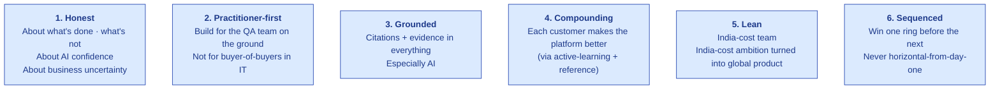

# Mission & Values

| Field | Value |
|---|---|
| Owner | Founders |
| Status | DRAFT v1.0 |
| Last updated | 2026-05-31 |

---

## 1. Mission

> 💡 **Make regulated-industry compliance reproducible, defensible, and affordable — so quality teams spend their day improving products, not chasing paper.**

## 2. Vision

> 💡 **A single industry-agnostic compliance engine that powers every regulated supply chain — pharma today, food and med-device tomorrow, every standards-governed industry in time — earned one vertical at a time.**

## 3. Values

### 1. Honest
We call out what's NOT yet validated, what's broken, what we don't know. Pre-customer means pre-customer; we don't pretend LOIs are revenue. AI confidence below 0.6 surfaces a skeleton fallback, not a fabricated answer. The pitch deck got revised from $3M to $1.5M because bottom-up planning produced a smaller number — we say so.

### 2. Practitioner-first
We build for the Quality Assurance Head running 30 supplier audits a year, not for the CIO buying a tier of GRC platform. Every feature decision is filtered by "would Asha (supplier QA) or Maria (auditor) actually use this in their next audit?"

### 3. Grounded
Every AI output cites its source. Every state change writes an audit trail. Every signature carries a reason for change. The platform is "Bloomberg Terminal for compliance" — dense, precise, evidence-rich.

### 4. Compounding
The active-learning loop captures user disposition (accepted / edited / rejected) on every AI draft. Each customer's anonymous data improves the model for the next customer (with consent). Each reference customer accelerates the sale of the next.

### 5. Lean
Built in India on an India-cost base. Founder draws below market. ESOP makes up the gap for senior hires. Founders' equity stake at Series A: ~47% combined (top quartile for two-founder SaaS).

### 6. Sequenced
We don't pitch "horizontal compliance platform" at angel. We win pharma SMB first. Then food. Then med-device. The industry-agnostic engine is the architecture; sequenced verticalization is the discipline.

## 4. What we WON'T do (even if it's tempting)

| Temptation | Why we resist |
|---|---|
| Pretend pre-customer LOIs are revenue | Honesty value |
| Build a horizontal "compliance platform" pitch at angel | Sequenced value; horizontal trap |
| Ship AI that looks confident but hallucinates | Grounded value |
| Hire ahead of revenue beyond what funding plan allows | Lean value |
| Build for IT instead of the practitioner | Practitioner-first |
| Take a customer that requires a code fork to serve | Sequenced + lean (config not fork) |

## 5. Operating principles

### How we make decisions
1. **Customer pain first** — start with a real problem someone has
2. **Then product** — what's the simplest solution that ships in <8 weeks
3. **Then evidence** — how will we know it worked
4. **Then write the doc** — capture the decision so it doesn't get re-litigated

### How we communicate
- Async-first (writing > meetings)
- Public-by-default (most channels open)
- Decisions in writing (Doc_V2 ADRs)
- Bad news fast, good news measured

### How we work
- Weekly sprint planning (engineering)
- Daily standup (15 min max)
- Monthly product review
- Quarterly company review

## 6. Culture in 5 sentences

> ✅ **The culture we're building.**
> 1. We tell the truth, especially when it's uncomfortable.
> 2. We move fast in small bets, not slow in big ones.
> 3. We use the product we build (dog-fooding the EQMS internally).
> 4. We respect the practitioner (every demo opens with their pain, not our features).
> 5. We compound: each customer, each release, each doc makes the company stronger.

## 7. Founder commitments

| Commitment | What it means |
|---|---|
| Below-market founder draw | ₹40L each (~30% below market for seniority); extends runway |
| Equal split (50/50) | Validated in founders' agreement before angel round |
| No personal financial conflicts | Will declare any side-engagements |
| Honesty discipline | Investor updates monthly; bad news in same email as good news |
| Long-term commitment | 4-year cliff + vesting on founder shares |
| Open to coaching | Founder-coach engagement post-Series A |

## 8. Diversity, equity, inclusion

> ⏳ **Pre-team-of-15: pre-mature for formal DEI metrics.** Commitments we make from day one:
> - Equal pay for equal work (publish bands internally)
> - Hire from broad sources (not just our networks)
> - Inclusive language in product + docs
> - Onboarding includes our values + behaviors expected
> - Anonymous concern channel (when team > 5)

## 9. Open philosophical questions

1. **How do we balance AI velocity with regulatory caution?** Default toward caution; user always reviews; never ship fabricating AI.
2. **When do customer feature requests override our architectural principles?** When customer pain is acute AND the request is configurable (not a code fork). Document the decision.
3. **At what point does "sequenced verticalization" become "stuck in one vertical"?** Trigger: first ring-1 vertical signed by M24 OR we explicitly accept "deeper in pharma" as the new plan.
4. **When do we hire a CEO above the founders?** Not in the foreseeable future. Founders run the show through Series A minimum.

---

## See also

- [VISION.md](../../01-strategy/vision-and-positioning/VISION.md) — strategic positioning
- [ORG-OVERVIEW.md](../org-chart/ORG-OVERVIEW.md) — org structure
- [BUSINESS-PLAN.md](../../02-fundraising/business-plan/BUSINESS-PLAN.md) — operationalizes mission into a plan
