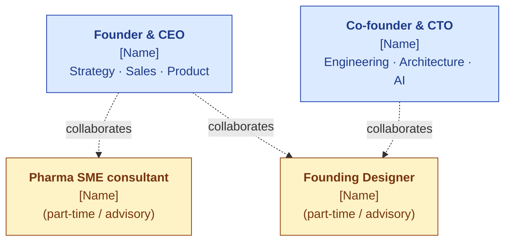
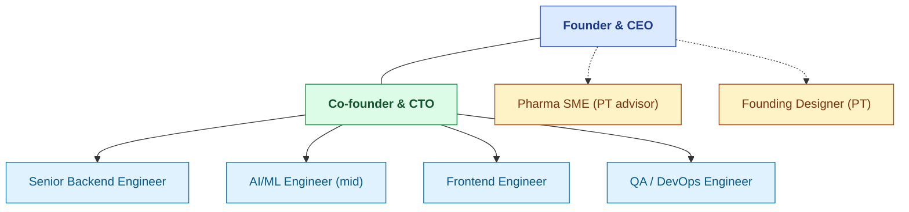
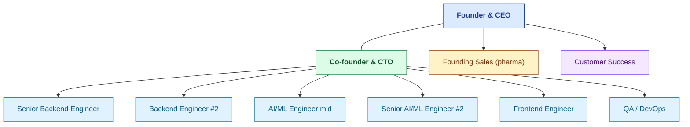

# Org Overview

| Field | Value |
|---|---|
| Owner | Founders |
| Status | DRAFT v1.0 |
| Last updated | 2026-05-31 |

---

## 1. Today (M0 — 2 founders + 2 advisors)

> ⏳ **Placeholders** — fill in actual names + bios when this doc moves out of DRAFT.

## 2. M6 (post-funding — 8 FTE + 2 advisors)

## 3. M12 (post-PoC — 12 FTE)

## 4. M18 (Series A trigger — 15 FTE)

| Functional area | Headcount | Roles |
|---|---|---|
| **Founders** | 2 | CEO, CTO |
| **Engineering** | 7 | Senior backend, AI/ML mid, AI/ML senior, Backend #2, Frontend, QA/DevOps, Growth eng |
| **Go-to-market** | 3 | Founding Sales, SDR, Customer Success |
| **Marketing / Content** | 1 | Marketing/content lead |
| **Operations + Finance** | 0.5 | Ops/finance (part-time/contracted) |
| **SME + Design** | 1.5 | Pharma SME (50%), Designer (50%) |
| **Total** | **15** | |

## 5. Functional ownership

| Function | DRI (Directly Responsible Individual) |
|---|---|
| Strategy + Fundraising | CEO |
| Product Vision + Roadmap | CEO + CTO (jointly) |
| Engineering + Architecture | CTO |
| Sales + GTM | CEO (founder-led) → Founding Sales hire (M9+) |
| Customer Success | CEO (founder-led) → CS hire (M12+) |
| Marketing + Content | CEO (founder-led) → Marketing hire (M15+) |
| Compliance + Regulatory | CTO + Pharma SME consultant |
| Design + UX | Founding Designer (advisory) → Designer hire (post-Series A) |
| Finance + Ops | CEO (founder-led) → CFO hire (post-Series A) |
| HR + People | CEO (founder-led) → People lead (post-Series A) |

## 6. Hiring philosophy

| Principle | Practice |
|---|---|
| **Quality over speed** | Better to leave a role open 3 months than hire wrong |
| **Domain + skill** | First 10 hires should bring both pharma/regulated-industry exposure AND technical skill |
| **Founders interview every hire** | Until M30 minimum |
| **References before offer** | Always 3+ references, ideally 1 backchannel |
| **Generous ESOP for senior hires** | Especially first 3 senior eng hires (above 10% pool if needed) |
| **Trial project for borderline candidates** | 1-2 week paid trial before full offer |
| **No-asshole rule** | Brilliant jerks are an existential threat to a 15-person startup |

## 7. Compensation framework

| Role | India-cost range (loaded, INR/yr) | ESOP range (4yr vest) |
|---|---|---|
| Founders | ₹40L (below-market for runway) | (Founder shares) |
| Senior eng | ₹28-55L | 0.25-0.5% |
| Mid eng | ₹20-35L | 0.1-0.25% |
| Junior eng | ₹12-22L | 0.05-0.15% |
| Founding Sales | ₹25-40L + variable | 0.25-0.5% |
| Customer Success | ₹18-25L | 0.05-0.15% |
| Pharma SME (PT) | ₹2-4L/mo retainer | 0.25-0.5% (advisor) |

## 8. Advisory board (planned)

| Profile | Engagement | Equity | Status |
|---|---|---|---|
| Ex-FDA inspector | Quarterly meeting + ad-hoc | 0.25-0.5% (4yr vest) | Target persona; not engaged |
| Pharma quality VP (active) | Quarterly meeting + customer intros | 0.25-0.5% | Target persona; not engaged |
| SaaS GTM advisor (B2B) | Monthly check-in | 0.25-0.5% | Target persona; not engaged |
| AI/ML academic | Quarterly | 0.1-0.25% | Optional |

## 9. Cap table snapshot (today)

| Stakeholder | % |
|---|---|
| Founder #1 | 50% |
| Founder #2 | 50% |
| ESOP | 0% (created at angel close) |
| External investors | 0% |

See [FINANCIAL-MODEL.md §7](../../02-fundraising/financial-model/FINANCIAL-MODEL.md#7-funding-rounds-in-numbers) for projected cap table through Series A.

## 10. Org evolution principles

> ✅ **The structural principles.**

1. **Founders stay close to engineering** — CTO leads eng; CEO embedded in product decisions
2. **Hire functional leaders before scale** — CS hire before CS team; Marketing hire before SEO push
3. **Player-coaches in early roles** — first sales hire is also Founding Sales; first eng leader is also IC
4. **Promotion from within where possible** — but pull external talent for net-new functions
5. **No more than 2 reporting layers** below founders until 30+ FTE

---

## See also

- [MISSION-AND-VALUES.md](../mission-and-vision/MISSION-AND-VALUES.md)
- [BUSINESS-PLAN.md §4](../../02-fundraising/business-plan/BUSINESS-PLAN.md#4-team-build) — team build timeline
- [FINANCIAL-MODEL.md §7](../../02-fundraising/financial-model/FINANCIAL-MODEL.md#7-funding-rounds-in-numbers) — cap-table projection
