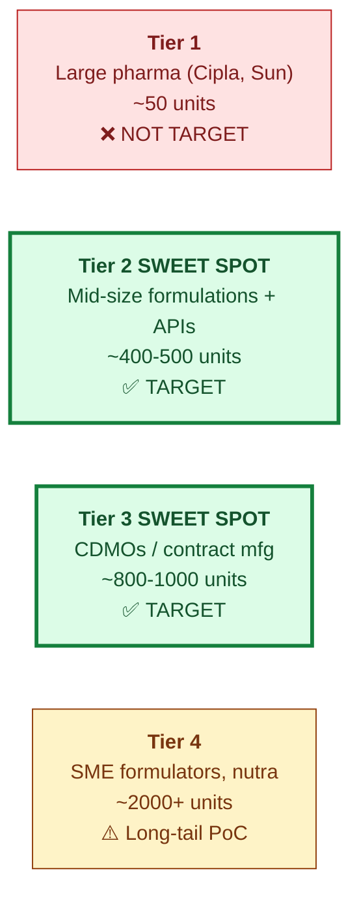
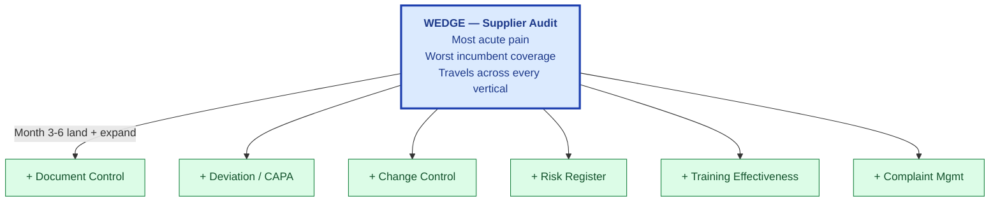
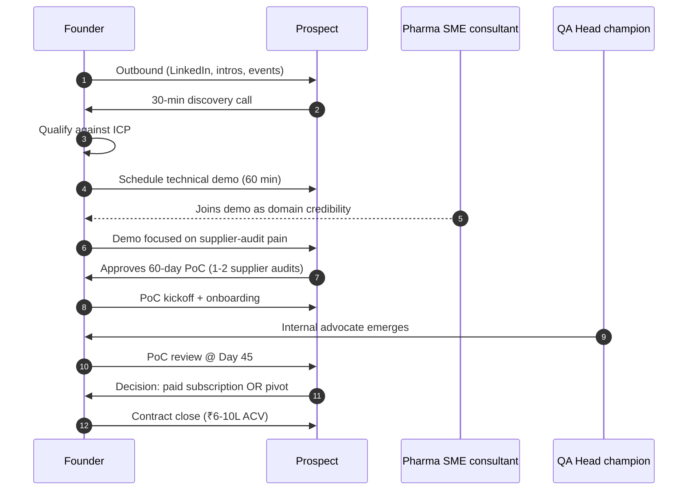
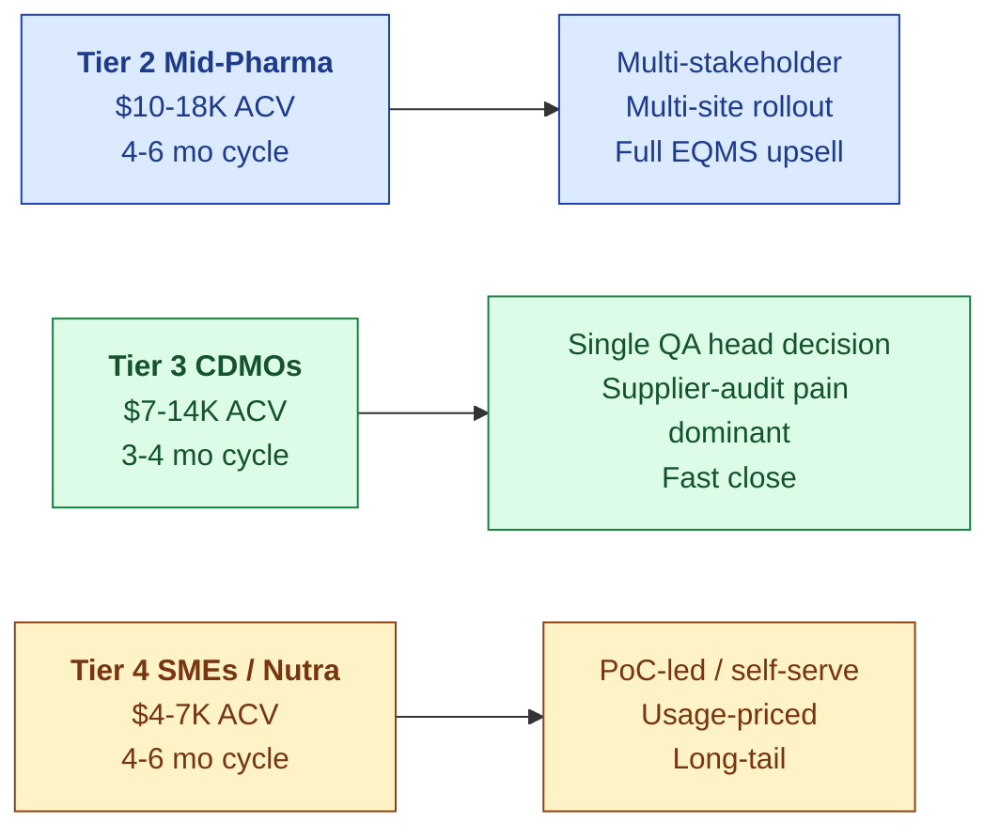
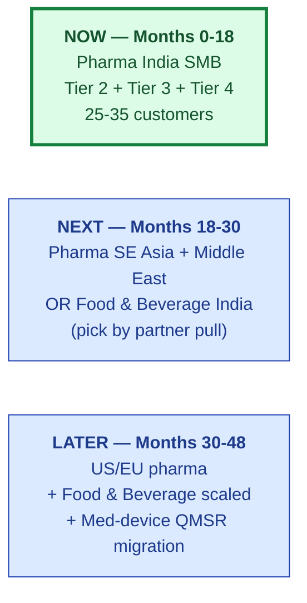
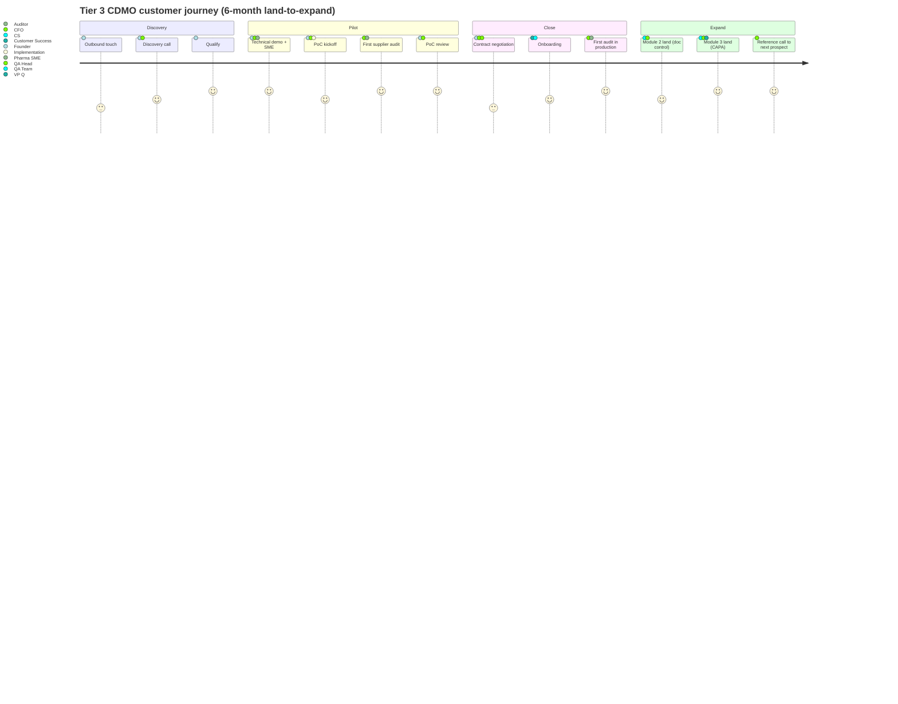

# Go-To-Market Plan

| Field | Value |
|---|---|
| Owner | Founders + Sales |
| Status | DRAFT (v1.0) |
| Version | 1.0 |
| Last updated | 2026-05-31 |
| Pairs with | [VISION.md](../vision-and-positioning/VISION.md), [MARKET-ANALYSIS.md](../market-analysis/MARKET-ANALYSIS.md), [PRICING.md](../pricing-and-packaging/PRICING.md) |

---

## 1. The GTM thesis in one paragraph

> 💡 **Win the SMB / emerging-market pharma wedge with founder-led selling and the supplier-audit wedge as our opening move. Convert 40-60 Tier-2 mid-pharma + 60-100 Tier-3 CDMO accounts in 36 months. Harvest references and a hardened standards pack. Then hop to Food & Beverage (Ring 1) — same supplier-audit motion, ~75% engine reuse, strong budget growth.** Never lead with "industry-agnostic" — lead with the pain we solve today.

## 2. Ideal Customer Profile (ICP) — Phase 1 (pharma India)

### ICP definition (sales qualification criteria)

| Attribute | Qualified |
|---|---|
| Revenue | ₹500–5,000Cr (Tier 2) or contract manufacturer of any size (Tier 3) |
| Certification | WHO-GMP certified for export (preferred) |
| Quality team size | 5+ QA staff |
| Audit frequency | 8+ audits/year hosted, OR 5+ audits conducted/year |
| Current EQMS state | Spreadsheets / email / fragmented point tools (NOT Veeva, NOT MasterControl in production) |
| Decision maker | Head of QA, VP Quality, or Plant Quality Manager |
| Buying authority | Can sign $5K–15K ACV without board approval |
| Compliance triggers | Recent FDA-483, EU GMP non-conformance, customer audit failure, or upcoming regulator visit |

## 3. The wedge: supplier audit (the entry point)

> 💡 **Why supplier audit, not "full EQMS".** The supplier-audit pain point is acute (30+ audits/year per CDMO, mostly redundant, mostly painful). It's a single-stakeholder buy (QA head, not board). It demonstrates the platform's grounded AI, e-sig, audit trail in one demo. After 60-90 days of audit-only success, expansion into the other EQMS modules becomes a no-friction upsell because the platform, validation, and trust are already in place.

## 4. Sales motion by stage

### Phase 1 — Founder-led selling (M0-M9)

| Stage | Founder activity | KPI / exit criteria |
|---|---|---|
| 1 · Prospect | 50 outbound touches/week (LinkedIn, warm intros, pharma events) | 8 discovery calls / month |
| 2 · Discover | 30-min call with QA head / VP Q | 4 demos / month qualified |
| 3 · Demo | 60-min technical demo (supplier-audit story + AI grounding) | 2 PoCs / month started |
| 4 · PoC | 60-day pilot with 1-2 real supplier audits | 35%+ PoC → paid conversion |
| 5 · Close | Contract + onboarding | 4-6 month sales cycle, $9-12K ACV |
| 6 · Land + Expand | Month 4-6 upsell into adjacent modules | NDR > 110% |

### Phase 2 — First sales hire (M9-M18)

Hire **Founding Sales / GTM** (pharma-domain background, ₹25-40L + variable). They own:
- Outbound pipeline (50% of leads)
- PoC management + conversion
- Reference cultivation (target: 10 named references by M18)
- Founder takes back >$20K ACV deals only

### Phase 3 — Scale (M18-M36)

Add SDR + second AE + Customer Success. Move to repeatable playbook:
- Outbound (SDR) → discovery (AE) → demo (AE + SME) → PoC (AE + CS) → close (AE)
- Average deal cycle compresses to 3-4 months
- Net Dollar Retention target: 110%+ via module expansion

## 5. Channels — where customers come from

| Channel | M0-M6 | M6-M18 | M18-M36 | Notes |
|---|---|---|---|---|
| **Outbound (LinkedIn + warm intros)** | 60% | 40% | 25% | Founder-led; targets ICP roles directly |
| **Pharma industry events / conferences** | 15% | 20% | 20% | IPA, CDMO summits, FDA visits |
| **Inbound (content + SEO)** | 5% | 15% | 25% | Industry research papers, regulatory guides as bait |
| **Customer referrals** | 5% | 15% | 20% | Targeted post-M6 once first 10 customers are reference-able |
| **Partner channels** | 5% | 5% | 10% | See [PARTNERSHIPS.md](../partnerships/PARTNERSHIPS.md) |
| **Inbound (industry analysts, awards)** | 10% | 5% | — | One-time during fundraise period |

## 6. Per-segment GTM motion

| Segment | Sales motion | Land use case | Expand modules | Cycle | NDR target |
|---|---|---|---|---|---|
| Tier 2 mid-pharma | Multi-stakeholder enterprise | Supplier audit + doc control | CAPA, deviation, change control | 4-6 mo | 115% |
| Tier 3 CDMOs | Single-decision-maker | Supplier audit (acute pain) | Deviation, CAPA, training | 3-4 mo | 105% |
| Tier 4 SMEs | PoC-led, self-serve onboarding | Audit response automation | Doc control add-on | 4-6 mo | 100% |

## 7. The expansion sequence (matches Market Analysis §9)

| Phase | Time | Target | Why now |
|---|---|---|---|
| **Now** | M0-M18 | Pharma India: Tier 2 + Tier 3 + Tier 4 | Highest pull; the wedge incumbents ignore; proves engine + reproducible AI + affordability |
| **Next** | M18-M30 | Pharma SE Asia + Middle East, OR Food & Beverage (whichever has stronger partner pull) | First geographic OR first vertical hop, depending on traction |
| **Later** | M30-M48 | US/EU pharma + Food & Beverage scaled + Med-device QMSR migration | Series A funded; ready for upmarket + first non-pharma vertical |
| **Horizon** | M48+ | Automotive supplier-audit wedge + Aerospace | Ring 2 with ISO 9001:2026 convergence tailwind |

## 8. Customer journey — from prospect to expansion

## 9. Demo script — the 30/45/60 minute cuts

The canonical demo lives at `00-strategy-and-pitch/demo-assets/07-pharma-demo-script.md`. Three cuts:

| Cut | Audience | Focus | Demo modules |
|---|---|---|---|
| **30-min** | QA Head intro / first call | Pain reduction in supplier audit only | Audit list → schedule audit → AI observation drafter → e-sig closure |
| **45-min** | QA team + Plant Head | Audit + deviation + CAPA cross-module wiring | Add: deviation → CAPA workflow with predictive AI |
| **60-min** | VP Quality + CFO | Full EQMS + reproducible AI traceability + ROI | Add: doc control, change, audit-trail browser, ROI calculator |

## 10. Pricing positioning

| Anchor | S.M.A.R.T. Hawk | Veeva / MasterControl |
|---|---|---|
| Annual contract value | $4K–18K (per-segment) | $30K floor → $300K+ at scale |
| Implementation cost | $0–5K | $50K-500K consultant-driven |
| Time-to-value | < 30 days (PoC live) | 6-12 months |
| Per-audit cost (delivered) | ~$300-500 | ~$3000-5000 (incl. consulting overhead) |

The conversation that closes the deal lives in [PRICING.md §4](../pricing-and-packaging/PRICING.md#4-the-conversation-that-closes-the-deal).

## 11. Reference customer plan

The first 10 customers are **reference customers** — sold at near-zero margin in exchange for:

| Reference asset | Required from each customer |
|---|---|
| Named logo + case study | Mid-PoC commitment |
| Time-on-task ROI calculation | 30 days post go-live |
| Co-presented webinar | Within 90 days post go-live |
| Reference call to 2 prospects | Within 6 months |
| Quote for pitch deck | Within 60 days |

Target: **10 reference customers by M18** (~50% of total customer base at that point).

## 12. Pre-Series-A milestone targets

| Milestone | M6 | M12 | M18 | M24 | M36 |
|---|---|---|---|---|---|
| Paying customers | 0-2 | 8-12 | 25-35 | 55-75 | 150-200 |
| ARR ($K) | 0 | 75 | 255 | 620 | 1,825 |
| Reference customers (named) | 0 | 3 | 8-10 | 15+ | 30+ |
| Named industry verticals | 1 (pharma) | 1 | 1 | 1-2 | 2-3 |
| Net Dollar Retention | n/a | 100% | 105% | 110% | 115% |
| Sales cycle (months) | 6+ | 5 | 4 | 3.5 | 3 |
| Demo→PoC conversion | 25% | 30% | 35% | 40% | 45% |
| PoC→Paid conversion | 25% | 30% | 35% | 40% | 45% |

> ⚠️ **The series-A trigger.** At M18, ARR run-rate ~$255K + 25-35 customers + strong NDR + 1-2 ring-1 customers = Series A territory. If those don't hit, founder-led extension round + tighter focus.

## 13. What we DON'T do (yet)

> 🚫 **Things we will NOT pursue in the first 18 months — even if asked.**
>
> - **Veeva or MasterControl displacement** in Tier 1 accounts (wrong fight, wrong timing)
> - **On-prem deployments** (until M18+ when sovereignty becomes a real ask)
> - **US/EU market expansion** (until M30+ post-Series-A; India + SE Asia first)
> - **Vertical packs beyond pharma + adjacent GxP** (food, cosmetics) — until pharma references hit 10+
> - **Marketplace network effects** (Qualifyze-style) — until we have 50+ buyers and 200+ suppliers as captive supply
> - **Enterprise sales** with 6+ month cycles — keep cycles short, prove velocity first
> - **Free / freemium tiers** — eroding the value-share narrative is not worth the lead-gen
> - **System integrator partnerships** at scale (Accenture, Deloitte) — wrong velocity for our stage; revisit at Series A

## 14. Risks & mitigations (GTM-specific)

| Risk | Likelihood | Mitigation |
|---|---|---|
| Founder-led sales doesn't scale past 10 customers | High (by design) | Hire pharma-domain Founding Sales at M9, after PMF signal |
| First sales hire underperforms (long ramp) | Medium-high | Founder co-sells first 5 deals with hire; hard 90-day ramp |
| PoC → paid conversion < 30% | Medium | Tighten qualification; require written success criteria; shorter PoCs |
| Sales cycle stretches past 6 months | Medium | Pivot positioning to single-wedge (supplier audit only); narrower problem = faster close |
| Competitor launches India-specific tier (Veeva SMB, etc.) | Low | Lock 10+ reference customers before they react; differentiate on AI + supplier coupling, not just price |
| Industry events / conference budget gets cut | Low | Outbound + content channels can absorb |
| Customer asks for on-prem before we're ready | Medium | Validation + roadmap commitment with deferred delivery; or partner with sovereignty-focused vendor |

## 15. Honest reckoning

> ⚠️ **What we don't yet know.** We are pre-customer. The 35% PoC-conversion rate is an assumption. The 4-6 month sales cycle is an assumption. The supplier-audit-wedge thesis is unvalidated commercially (only validated through customer discovery interviews). The first 6 months post-funding are about proving these assumptions or pivoting. The GTM plan above is the **base case**; the **pessimistic case** (M18 ARR ~$120-150K) still funds a smaller seed at lower valuation. Plan does not require optimistic execution.

---

## See also

- [VISION.md](../vision-and-positioning/VISION.md) — positioning + 5-pillar engine
- [MARKET-ANALYSIS.md](../market-analysis/MARKET-ANALYSIS.md) — sector rings + TAM
- [PRICING.md](../pricing-and-packaging/PRICING.md) — ACV math
- [PARTNERSHIPS.md](../partnerships/PARTNERSHIPS.md) — channel + tech partnerships
- `00-strategy-and-pitch/demo-assets/07-pharma-demo-script.md` (legacy) — canonical demo script
- `Doc_V2/09-sales-marketing/demo-scripts/` — eventual home of refreshed demo materials
