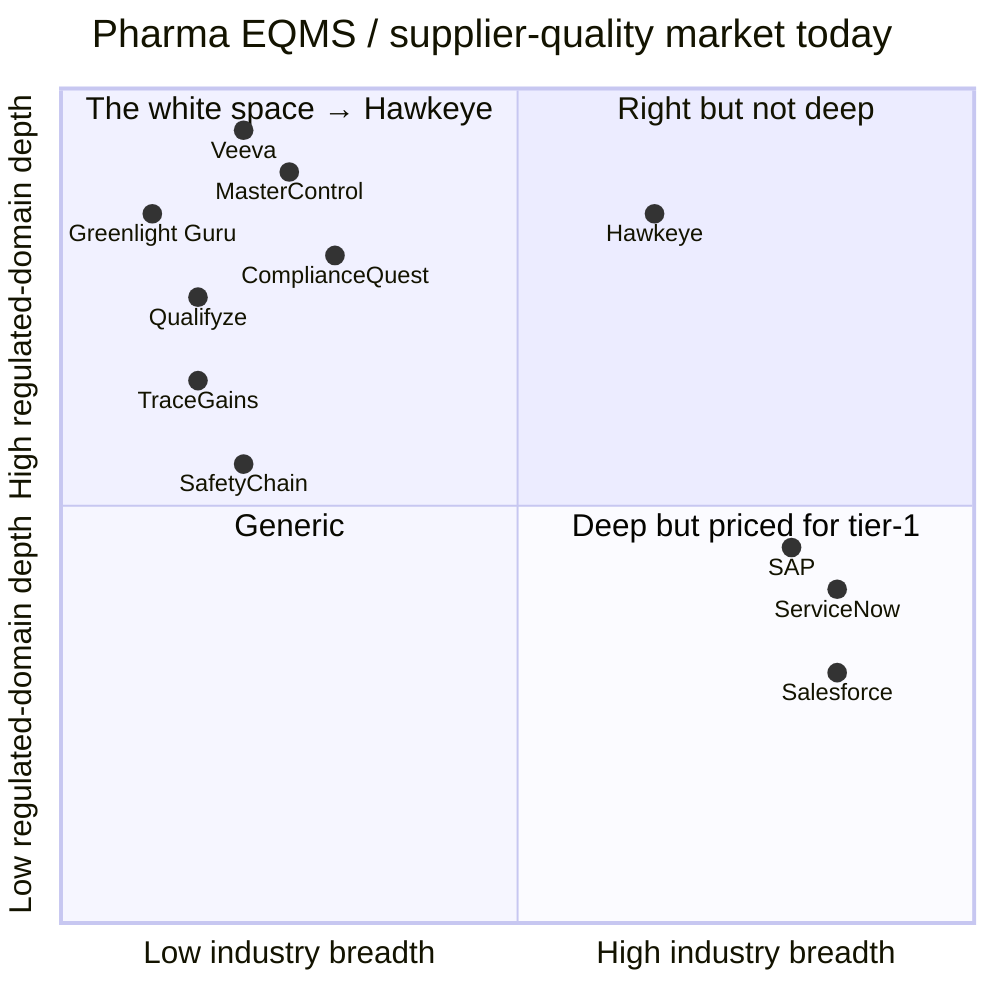
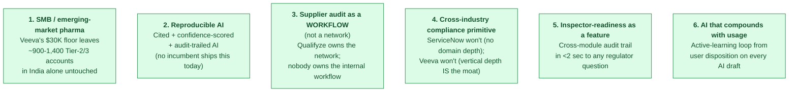
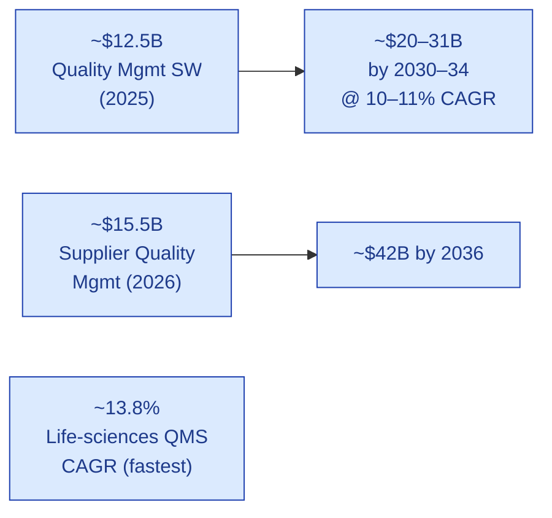
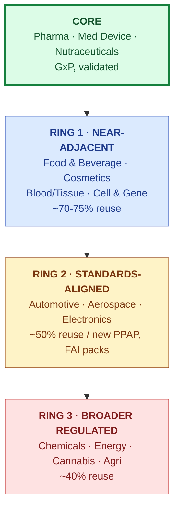
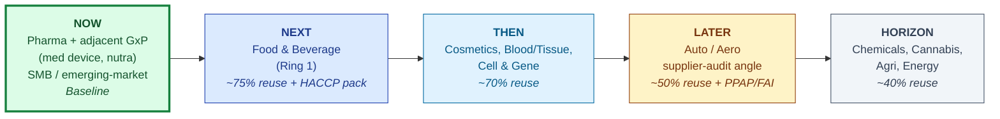
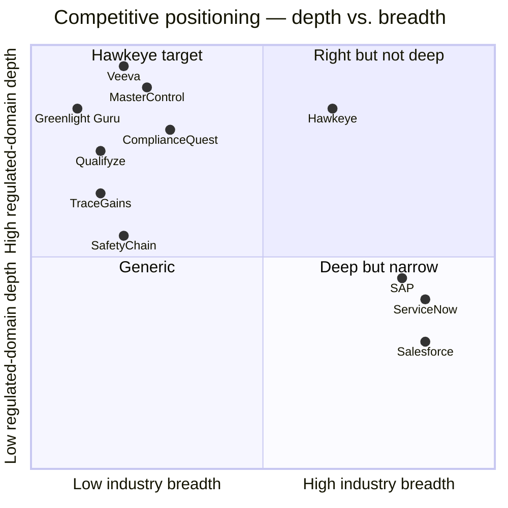

# Market Analysis

| Field | Value |
|---|---|
| Owner | Founders + Product |
| Status | v1.1 (restructured white-space-first 2026-05-31) |
| Version | 1.1 |
| Last updated | 2026-05-31 |
| Length | ~15 min read |
| Source | per-sector-market-analysis.pdf (April 2026) + BUSINESS-AND-FUNDING-PLAN.pdf Part 1 + industry research papers (Fortune Business Insights, Grand View, Mordor, Fact.MR, Verdantix, Emergen, 2025-26) |

---

> 💡 **What this is.** The market story — told white-space-first. **Where the unoccupied space is** (and why), **how big it can be** for us specifically (bottom-up, not headline), and **how we sequence into adjacent verticals** without falling into the horizontal-platform trap. Read [VISION.md](../vision-and-positioning/VISION.md) first for the strategic framing this document underpins.

---

## 1. The white space (where Hawkeye lives)

### 1a. The market today, in four boxes

*Hawkeye's target quadrant: pharma-grade depth at a price the SMB + emerging market can pay, with architectural breadth to expand into adjacent regulated industries.*

### 1b. The four incumbent types — and what each cedes

| Incumbent type | Examples | What they own | What they cede |
|---|---|---|---|
| **Pharma EQMS premium** | Veeva, MasterControl, ComplianceQuest | Tier-1 pharma; deep validation; enterprise refs | Anything under $30K/yr ACV; reproducible AI; cross-vertical buyers |
| **Vertical specialists** | Greenlight Guru (med-device), TraceGains (food), Plex (auto) | Industry-specific artifacts (FAI, FSSC, PPAP) | Cross-industry primitive; supplier-audit workflow |
| **Audit-network plays** | Qualifyze | Pharma supplier-audit network | Internal EQMS workflow; reproducible AI |
| **Horizontal platforms** | ServiceNow, SAP, Salesforce, IBM OpenPages | Distribution; ecosystem | Regulated-domain depth; GxP credibility; grounded AI |
| **AI-feature retrofits** | Vendors adding LLMs to legacy stacks | Existing customer base | Native AI architecture; Part-11-grade traceability; honesty about confidence |

### 1c. The six white spaces (the genuinely unoccupied ones)

### 1d. The horizontal-platform trap (named so we avoid it)

> 🚫 **"Horizontal platform" is the most dangerous phrase in enterprise software.** The graveyard is full of horizontal compliance platforms that lost to focused vertical specialists in every single vertical, because regulated buyers want depth, references, and validation specific to their industry. "We do everything" reads as "best at nothing," and a generalist loses the bake-off to the specialist nearly every time.

The only horizontal strategy that works is **sequenced verticalization** — win one vertical deeply (pharma SMB), harvest references + a hardened standards pack, then hop to the adjacent vertical that reuses the most architecture. **Never horizontal-from-day-one.**

This document maps the verticals; the strategy is to earn them one at a time.

---

## 2. How Big Can This Be — Bottom-Up

### 2a. Top-down (informs Series A/B ceiling; NOT the pitch)

| Metric | Value |
|---|---|
| Quality Mgmt Software (QMS) market today | **~$12.5B (2025)** → ~$20–31B by 2030–34 |
| QMS market CAGR | ~10–11% |
| Supplier Quality Mgmt (SQM) apps today | **~$15.5B (2026)** → ~$42B by 2036 |
| Life-sciences QMS CAGR | ~13.8% (fastest vertical) |

> ⚠️ **The honest read.** Headline numbers are the **total** markets. The addressable slice for a new entrant is far smaller, concentrated in the under-served edges (SMBs and emerging markets that incumbents price out; cross-vertical buyers no single specialist serves). **Do not pitch the $40B; pitch the specific, winnable wedge in each ring.** TAM justifies the ambition; SAM/SOM justify the plan.

### 2b. Bottom-up TAM — Pharma India (the beachhead)

India has roughly **10,500 registered pharmaceutical manufacturing units** (CDSCO data), of which **~3,000 are WHO-GMP certified** for export.

| Segment | Count (India) | Notes / our positioning |
|---|---|---|
| Tier 1 — Large pharma (Cipla, Sun, Dr. Reddy's) | ~50 | **Not our target.** They use Veeva/MasterControl. Too long sales cycles, won't switch. |
| Tier 2 — Mid-size formulations & APIs (₹500–5,000Cr revenue) | ~400–500 | **Sweet spot.** Big enough to have quality teams + audit pain; small enough to switch. |
| Tier 3 — CDMOs / contract manufacturers | ~800–1,000 | **Highest pain.** Hosting 30+ audits/year. Acute structural pain. |
| Tier 4 — SME formulators, nutraceuticals | ~2,000+ | Price-sensitive, lighter touch. Long-tail. |
| Export-quality, WHO-GMP certified (subset) | ~3,000 | Most quality-conscious, most willing to pay. |

### The realistic wedge (36-month SOM)

| Tier | Target ACV (USD/yr) | Realistic 36-mo capture | Justification |
|---|---|---|---|
| Tier 2 mid-pharma | $10K–18K | 40–60 accounts | Higher ACV; multiple sites; full EQMS. 4–6 mo sales cycle. |
| Tier 3 CDMOs | $7K–14K | 60–100 accounts | Audit pain is acute; faster close. The volume play. |
| Tier 4 SMEs / nutra | $4K–7K | 40–80 accounts | Long-tail PoC-led; usage-priced. Price-sensitive. |
| **India SOM (year 3)** | **Blended $9.5K** | **~150–240 paying customers** | **= ~$1.4–2.3M ARR from India pharma alone** |

WHO-GMP-export Tier 2/3 ceiling over 5 years: **~$8–12M ARR before any ring-1 expansion.**

## 4. The expansion map — sectors by architectural distance

**Sequence by architectural reuse, not by raw market size.** The nearest ring you can win with the least new configuration is the next move.

## 5. Sector deep-dive — CORE + RING 1

| Sector | Standard(s) | Core use case | Fit | Pull | Incumbents / whitespace |
|---|---|---|---|---|---|
| **Pharma / Biotech** (CORE) | GMP, 21 CFR 210/211, ICH Q7-Q10 | EQMS + supplier audit; batch release; deviation→CAPA; public-data risk | Very high | Very high | Veeva, MasterControl, ComplianceQuest, Qualifyze. **White:** SMB/emerging-market + reproducible AI + coupling. |
| **Medical Devices** (CORE) | ISO 13485, FDA QMSR (2026), MDR | Design-history + CAPA + complaint + supplier qual; QMSR harmonization | Very high | Very high | Greenlight Guru (specialist), MasterControl. **White:** QMSR-transition + AI + affordability. |
| **Nutraceuticals / Supplements** (CORE) | 21 CFR 111 cGMP | Same GxP motion, lighter; supplier & ingredient qualification | Very high | Med | Underserved by premium tools; price-sensitive. **White:** affordable GxP-grade. |
| **Food & Beverage** (RING 1) | HACCP, FDA FSMA, FSSC 22000, BRCGS | Critical-control-point monitoring, supplier audit, recall, lot traceability | High | High | Safefood / TraceGains / SafetyChain. **White:** AI + supplier-network + cross-site. Strong budget momentum. |
| **Cosmetics / Personal Care** (RING 1) | ISO 22716 GMP, EU 1223/2009 | GMP-lite batch + supplier + claim substantiation | High | Med | Few dedicated players; often on generic QMS. **White:** purpose-built + affordable. |
| **Blood / Tissue / Cell & Gene** (RING 1) | 21 CFR 1271, GTP, chain-of-custody | Chain-of-custody + donor/lot traceability + release | High | High | Niche, under-digitized. **White:** custody + immutable record is a native strength. |

> ✅ **Pattern in CORE + Ring 1.** All share the GxP "batch/lot, supplier audit, recall, validated record" shape — engine reuses 70-90% of pharma configuration. **Food & Beverage is the standout first hop**: high pull, strong budget growth, acute supplier-audit redundancy, architecturally near-identical to pharma supplier audit.

## 6. Sector deep-dive — RING 2 + RING 3 (the prize, not the start)

| Sector | Standard(s) | Core use case | Fit | Pull | Incumbents / whitespace |
|---|---|---|---|---|---|
| **Automotive** (RING 2) | IATF 16949, APQP, PPAP, FMEA | Supplier quality + PPAP/APQP evidence + audit + nonconformance | High* | Very high | Big specialists (Plex). **White:** AI + supplier-audit-network across captive tier-N base. |
| **Aerospace & Defense** (RING 2) | AS9100→IA9100, NADCAP, ITAR, CMMC | Supplier qual + FAI + traceability + cyber/export controls | High* | Very high | Net-Inspect, etc. **White:** AS9100↔ISO9001:2026↔CMMC convergence + on-prem/sovereignty. |
| **Electronics / Semiconductors** (RING 2) | IPC, RoHS, REACH, conflict minerals | Supplier + substance compliance + traceability | Med-high | Med-high | Assent / iPoint (substance). **White:** unify quality + substance + supplier audit. |
| **Chemicals** (RING 3) | REACH, GHS, ISO 9001, Responsible Care | SDS management + supplier + substance validation + record | Med | High | Specialist EHS/SDS tools. **White:** quality + SDS + audit in one. 83% expect budget growth. |
| **Energy / Oil & Gas** (RING 3) | API specs, ISO 14001/45001, safety case | Asset integrity + supplier + inspection records + audit | Med-low | Med | Heavy EAM/APM incumbents. **White:** thinner; more new config needed. |
| **Cannabis** (RING 3) | State seed-to-sale, GACP, GPP | Seed-to-sale custody + testing + compliance record | Med | High (where legal) | Metrc / seed-to-sale niche. **White:** GxP-grade quality + custody; fast-growing, under-tooled. |
| **Agriculture / Agri-food** (RING 3) | GACP, GlobalG.A.P., organic certs | Farm-to-processor certification + supplier + custody | Med | Med | Fragmented. **White:** certification + traceability engine. |

\* Fit "High*" for auto/aero: engine maps well, but these carry industry-specific evidence artifacts (PPAP, FAI, NADCAP) that need real configuration — more new work than Ring 1, hence Ring 2 placement despite high architectural similarity.

## 7. Spend concentration by vertical

| Vertical | Share / growth signal | Entry implication |
|---|---|---|
| Discrete manufacturing (auto, aero, industrial) | Largest single block — ~32% of US QMS spend | Biggest pool, but defended by IATF/AS9100 specialists; enter via supplier-audit angle. |
| Healthcare / life sciences | Fastest-growing — ~13.8% CAGR | **The beachhead**; highest regulatory pull, highest willingness to pay. |
| Chemicals + Food & Beverage | 83% expect bigger quality budgets (Verdantix 2025) | Strongest demand momentum; near-adjacent to the core. |
| Automotive (IATF 16949) | Compliance "nearly mandatory" for suppliers | Huge captive supplier base; audit redundancy is acute. |

## 8. Pricing-to-TAM sensitivity (India pharma only)

| Scenario | Blended ACV | Customers at 36 mo | Implied ARR |
|---|---|---|---|
| Conservative | $6,500 | 80 | $520K |
| **Plan (target)** | **$9,500** | **150** | **$1.4M** |
| Optimistic | $12,000 | 220 | $2.6M |
| Stretch (ring-1 starts) | $10,500 | 270 | $2.8M |

## 9. The expansion sequence (sequenced verticalization)

> ✅ **The rule that avoids the horizontal trap.** Never enter a ring on ambition alone. Enter only when (1) the engine reuses enough that new-config cost is small, (2) a real buyer or partner is pulling you in (not a spreadsheet TAM), and (3) you can win or partner past the resident specialist.

## 10. The wedge that travels across every ring: supplier audit

> 💡 **Notice the pattern.** Supplier qualification + audit is the **one use case present in every sector** — pharma, food, auto, aero, electronics, chemicals. It is the most industry-portable entry point AND the one with the worst incumbent coverage (audit-network players are pharma-only; EQMS players don't run networks). Leading each new vertical with the supplier-audit wedge — rather than the full EQMS — is the lowest-config, highest-pain way to enter, then expand into internal quality once inside.

## 11. Competitive landscape

### Competitor categorization

| Tier | Examples | Their strength | What they cede |
|---|---|---|---|
| **Pharma EQMS premium** | Veeva, MasterControl, ComplianceQuest | Vertical depth, validation packages, enterprise references | Anything under $30K/yr ACV; cross-vertical buyers; reproducible AI |
| **Vertical specialists** | Greenlight Guru (med-device), TraceGains/SafetyChain (food), Plex (auto), Net-Inspect (aero) | Industry-specific artifacts (PPAP, FAI, FSSC) | Cross-industry primitive; supplier-audit network |
| **Audit-network plays** | Qualifyze | Live supplier-audit network in pharma | Internal EQMS workflow; cross-industry; reproducible AI |
| **Horizontal platforms** | ServiceNow, SAP, Salesforce, IBM OpenPages | Distribution, ecosystem | Regulated-domain depth; GxP credibility; AI grounded in standards |
| **AI-feature additions** | Vendors retrofitting LLMs into legacy stacks | Existing customer base | Native AI architecture; Part-11-grade traceability; honesty about confidence |

## 12. Why Hawkeye wins each entry battle

| Competitor type | Why Hawkeye wins (in CORE + Ring 1 entry) |
|---|---|
| Pharma EQMS premium (Veeva et al.) | We are below their price floor; we offer AI grounded with citations they don't ship; we cover supplier-audit they don't own |
| Pharma audit-network (Qualifyze) | We cover internal EQMS, not just network audits; we ship AI-grounded observation drafting and reproducible audit-trail of AI decisions |
| Vertical specialists | When we enter their vertical, we lead with the supplier-audit wedge (which they cede) and expand inward |
| Horizontal platforms | We have regulated-domain depth + 21 CFR Part 11–grade audit trail + grounded AI they don't ship |

## 13. Risks — what could kill the market thesis

| Risk | Likelihood | Impact | Mitigation |
|---|---|---|---|
| **The horizontal trap** — generalist loses to every specialist | Medium | Critical | Sequence vertically; win + reference one ring before the next; keep per-vertical depth real, not cosmetic |
| **Config cost is higher than hoped** — each vertical secretly bespoke | Medium | High | Be ruthless that standards/vocab/rules are truly data, not code. If a new vertical needs core changes, the architecture is leaking. |
| **Horizontal platforms claim the same primitive** | Low-medium | High | They have distribution; we must have regulated-domain depth + reproducible AI they lack. Compete on GxP credibility, not platform breadth. |
| **Beachhead too small to fund expansion** | Medium | High | SMB/emerging-market wedge must generate enough revenue + references to fund Ring-1 entry. Watch closely. |
| **Two-sided audit-network liquidity (cold-start)** | High at start | Medium | Use SaaS base's captive suppliers as initial supply; don't depend on network for early value prop. |
| **Per-vertical validation + references don't transfer** | High | Medium | True — each regulated vertical needs its own proof. Budget for it; treat the standards pack + a reference customer as the real cost of a new ring. |

## 14. Honesty & sourcing

> ℹ️ Market figures are from third-party research firms (Fortune Business Insights, Grand View, Mordor, Fact.MR, Verdantix, Emergen — 2025-26) and vary by definition; ranges shown, not summed. **QMS and SQM overlap — do not simply add.** Sector fit/pull/density scores are analytical judgments from the standards landscape and competitive research, not surveyed data — validate each sector with real buyer discovery before committing GTM spend. Incumbent names are categorical, not ranked. The convergence of ISO 9001:2026 / IA9100 / IATF 16949:2027 is sourced to industry reporting and should be confirmed against the standards bodies. **This is a strategy analysis, not a forecast.**

## 15. Verdict

> ✅ **The verdict.** (1) Competing with pharma EQMS incumbents head-on is the wrong game — they own vertical depth and are closing their own white spaces; treat them as not-your-endgame. (2) The genuinely unoccupied space is the **industry-agnostic compliance engine**, and the standards world is converging toward exactly that architecture — the tailwind is real. (3) The discipline: "industry-agnostic" wins only as **sequenced verticalization** — beachhead deep, then ring by ring by architectural distance, led by the supplier-audit wedge that travels everywhere — never as a horizontal pitch from day one. The framework applies to a dozen industries; the strategy is to earn them one at a time.

---

## See also

- [VISION.md](../vision-and-positioning/VISION.md) — strategic positioning + five-pillar engine
- [GTM-PLAN.md](../gtm-strategy/GTM-PLAN.md) — how we approach each sector
- [PRICING.md](../pricing-and-packaging/PRICING.md) — ACV math, value-share model
- `00-strategy-and-pitch/market-and-strategy/per-sector-market-analysis.pdf` (legacy) — full source PDF
- `Doc_V2/11-research-domain/industry-research/` — research papers for additional market validation
