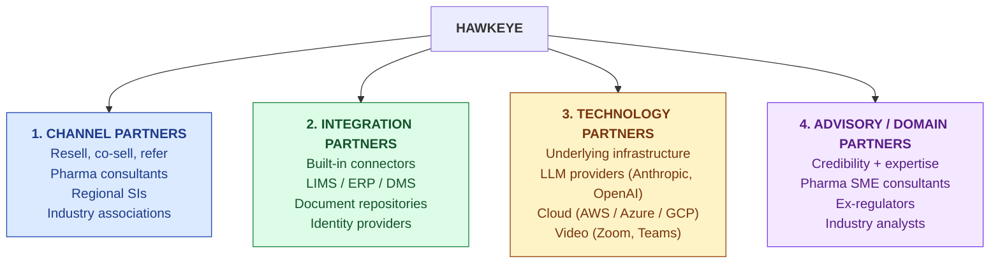
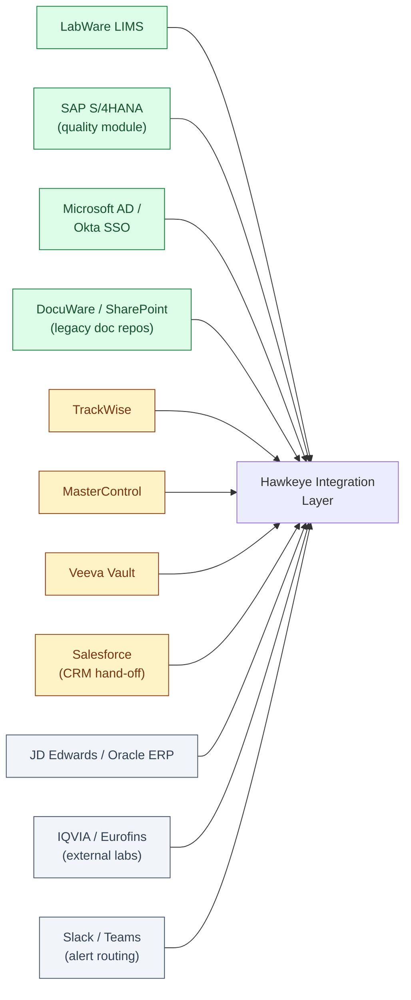
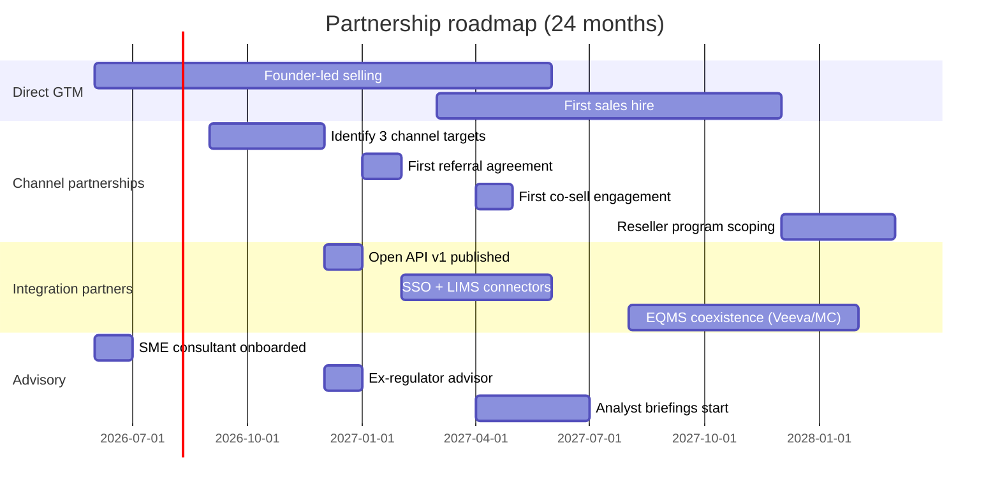

# Partnerships

| Field | Value |
|---|---|
| Owner | Founders + Sales |
| Status | DRAFT (v0.1 — scaffold; no signed partnerships yet) |
| Version | 0.1 |
| Last updated | 2026-05-31 |
| Source | Founder discovery + GTM-PLAN.md + MARKET-ANALYSIS.md |

---

## 1. Partnership thesis

> 💡 **At pre-seed, partnerships are a force-multiplier — not the GTM motion.** The base case is founder-led direct selling (see [GTM-PLAN.md §4](../gtm-strategy/GTM-PLAN.md#4-sales-motion-by-stage)). Partnerships supplement: they accelerate distribution, give us reach we don't have, and unlock segments (e.g., on-prem-required customers) we can't serve alone. **Don't depend on partnerships for survival.** Validate the direct motion first; build partnerships once references exist to anchor the partner's pitch.

## 2. Partnership categories

## 3. Channel partners (resell / co-sell / refer)

### Target partner profiles

| Type | Profile | Why it fits | Where to find |
|---|---|---|---|
| **Pharma quality consultancies** | Mid-size firms doing audit-prep + CSV validation for SMB pharma | They sell hours; we sell software. Bundle Hawkeye to scale their service. | India: Sandstone Bio, Q-Quality, mid-tier validation firms. US/EU: post-Series-A. |
| **Regional system integrators** | India SIs with pharma vertical practice | Have existing customer relationships in our ICP | Wipro Pharma, TCS Life Sciences (selective), boutique firms |
| **Industry associations / clusters** | IPA, IDMA, CDMO associations, pharma export councils | Reach into Tier 2/3 directly; member newsletters + events | Industry events; founder networking |
| **Audit-management consultancies** | Firms specializing in third-party audit programs | Refer customers who need software to manage their audit workload | LinkedIn + targeted outreach |

### Engagement model

| Stage | What partner gets | What we ask |
|---|---|---|
| **Referral** (lowest commitment) | 10% Y1 revenue share on closed deals | Warm intros to qualified prospects |
| **Co-sell** | 15% Y1 revenue share + co-marketing collateral | Joint sales meetings; partner team trained on demo |
| **Resell** (post-Series-A) | 25% Y1, 15% Y2 revenue share + reseller discount | Partner closes + supports customer; Hawkeye provides product + L2 support |

> ⚠️ **Not now: full reseller programs.** Reseller arrangements need product maturity, support depth, and partner enablement we don't have at pre-seed. Start with **referral + co-sell** only. Reseller programs are a Series A activity.

### Pre-seed pipeline (target by M12)

| Partner | Type | Status |
|---|---|---|
| TBD pharma consultancy (India, mid-size) | Referral → Co-sell | Identified profile; not engaged |
| TBD CDMO industry association | Referral via event sponsorship | Identified profile; not engaged |
| TBD audit-management consultancy | Referral | Identified profile; not engaged |

> ⏳ **Status as of 2026-05-31:** No signed partnership agreements. All targets are profile-level only. First partnership outreach planned post-Series-Seed (M6+).

## 4. Integration partners (technical / pre-built connectors)

### Integration priority (by customer ask + technical fit)

| Tier | System | Use case | Priority | Status |
|---|---|---|---|---|
| **Must (M12)** | LabWare LIMS | Test results auto-flow into audit evidence | High | Not started |
| **Must (M12)** | SAP S/4HANA Quality | Quality records sync; deviation triggers | High | Not started |
| **Must (M6)** | Okta / Azure AD SSO | Enterprise authentication | High | Partial (generic OIDC works) |
| **Must (M9)** | SharePoint / DocuWare | Legacy document repo bridge | Medium | Not started |
| **Should (M18)** | TrackWise / MasterControl / Veeva | Co-existence with incumbent EQMS during migration | Medium | Not started |
| **Should (M18)** | Salesforce | Lead/account sync for sales ops | Low (internal) | Not started |
| **Later (M24+)** | Oracle ERP, IQVIA, Eurofins, Slack/Teams | Customer-driven, prioritized when asked | Low | Not started |

### Integration partner program (proposed)

| Component | Description |
|---|---|
| **Open API + webhooks** | Public API at `api.hawkeye.io/v1/` covering audits, observations, CAPAs, audit-trail. Webhooks for event subscriptions. |
| **Partner portal** (M18+) | Sandbox tenant + API keys; partner-built integrations listed in marketplace |
| **Co-marketing** | Joint case studies; partner badges; tech-partner-of-quarter awards |
| **Revenue model** | Integrations are free for customers; partners may charge for their connector dev/support |

## 5. Technology partners (infrastructure)

These are vendor relationships rather than partnerships per se, but they need clear positioning:

| Vendor | Role | Status | Commercial structure |
|---|---|---|---|
| **Anthropic (Claude API)** | Primary LLM for grounded generation, observation drafter, AskHawk | Active customer | Pay-as-you-go API |
| **OpenAI (GPT-4 / o-series)** | Secondary LLM for backup + comparative evals | Active customer | Pay-as-you-go API |
| **Google (Gemini)** | Tertiary LLM for multi-provider abstraction | Active customer | Pay-as-you-go API |
| **AWS / GCP** | Cloud infrastructure | Active (Vercel-hosted today; cloud migration planned M12+) | Pay-as-you-go |
| **Vercel** | Frontend hosting + edge | Active customer | Pro plan |
| **MongoDB Atlas** | Primary database | Active customer | M10 cluster scaling to M30 |
| **Zoom + Microsoft Teams** | Remote-audit session integration | API integration; no formal partnership | Free (customer-side licensing) |
| **DigiStamp / FreeTSA / equivalent** | Cryptographic timestamp authority (for audit-trail anchoring) | Not yet integrated | TBD |
| **vLLM + HuggingFace** | Self-hosted fine-tuned model serving (M12+) | Not yet deployed | Open source |
| **Lambda Labs / RunPod** | GPU compute for fine-tuning | Not yet engaged | Pay-as-you-go |

### Strategic LLM partnership consideration

> 💡 **As of 2026, multi-LLM gateway is the right architecture.** Don't lock to a single provider. Build provider abstraction so we can route by task (Claude for complex reasoning, GPT-4o for speed, Llama-3 fine-tuned for high-volume low-stakes). Once we have meaningful AI volume (M12+), pursue **discounted enterprise agreements** with one or two providers based on our usage pattern.

## 6. Advisory / domain partners (credibility + expertise)

These provide regulatory + domain credibility we don't have internally:

| Role | Profile | Engagement | Status |
|---|---|---|---|
| **Pharma SME consultant** | Ex-quality VP from pharma, deep audit + CAPA experience | Part-time consultant (~50% allocation); joins customer demos for credibility | Identified candidate; engagement TBD |
| **Ex-regulator advisor** | Former FDA / CDSCO inspector | Advisory board (quarterly meetings; ~5% advisor equity) | Not yet engaged |
| **Industry analyst** | Verdantix, Forrester, Gartner — pharma quality coverage | Briefing + analyst-day engagement (post Series Seed) | Not yet engaged |
| **Founding designer** (advisory) | Senior product designer with B2B SaaS experience | Part-time; product polish for investor demos | Identified candidate |
| **Pharma quality compliance attorney** | Specializing in FDA Part 11 / EU GMP | Engaged for validation framework reviews; per-hour | Not yet engaged |

### Advisor compensation model

| Role | Cash | Equity | Time commitment |
|---|---|---|---|
| SME consultant (active) | ₹2-4L/month | 0.25-0.5% | 50% allocation |
| Ex-regulator advisor (advisory) | None | 0.25-0.5% (4yr vest) | 4-8 hrs/quarter |
| Designer (advisory + project) | Project-based + retainer | 0.1-0.25% | 20% allocation |
| Industry analyst | Standard analyst-relations fees ($5-15K/yr) | — | Briefings + reports |

## 7. Partnership criteria — what makes a "yes"

A potential partner is worth engaging IF:

| Criterion | Why |
|---|---|
| ✅ Reaches our ICP at high density | Direct access to Tier 2/3 pharma decision-makers |
| ✅ Has aligned incentive structure | They get paid when we close (referral $$, co-sell collateral) |
| ✅ Brings credibility we don't have | Regulatory reputation, industry tenure, named regulator relationships |
| ✅ Adds technical capability we'd otherwise build | Connector to legacy system, on-prem deployment expertise |
| ✅ Asks for time, not equity upfront | Reasonable equity asks (≤0.5%) for substantial value; equity for prestige alone is a "no" |

A potential partner is a **NO** if:

| Anti-criterion | Why |
|---|---|
| 🚫 Demands exclusivity in a market we want to control | We need our own direct motion in core segments |
| 🚫 Requires significant product customization | Strategy is configurable, not custom-built |
| 🚫 Will only co-sell with ≥30% margin | Not viable until we have 70%+ gross margins |
| 🚫 Wants us to white-label | Erodes brand and product evolution control |
| 🚫 Asks for board seat or significant equity for "partnership" | Equity is for capital, not commercial agreements |
| 🚫 Cannot bring at least 3 qualified leads in first 90 days | Real partnerships drive deals, not just slides |

## 8. Roadmap — when to invest in partnerships

| Phase | Time | Partnership investment |
|---|---|---|
| **Phase 1 — Validate direct motion** | M0-M6 | Engage SME consultant + designer (advisory only). Build customer evidence base. |
| **Phase 2 — Add credibility** | M6-M12 | Onboard ex-regulator advisor. Identify 3 channel-partner targets. Sign first referral agreement. |
| **Phase 3 — Force-multiply** | M12-M18 | First co-sell engagement live. Publish public API. SSO + LIMS integrations shipped. |
| **Phase 4 — Scale (post-Series A)** | M18-M36 | Reseller program scoping. Integration partner ecosystem. Industry analyst engagement at scale. |
| **Phase 5 — Network economics** | M36+ | Marketplace-style network (Qualifyze-adjacent); cross-tenant supplier intel surfacing; partner-developed vertical packs (food, med-device QMSR). |

## 9. Risks specific to partnerships

| Risk | Mitigation |
|---|---|
| **Partner over-commits, under-delivers** | 90-day evaluation period; no exclusivity until proven; clear KPIs (leads, demos, closed deals) |
| **Partner brand dilutes Hawkeye message** | Co-marketing materials require Hawkeye approval; partner-led demos co-presented with Hawkeye for first N customers |
| **Channel conflict** with direct sales | Define clear territory rules (segment, geography, account list); register-the-deal process from day one |
| **Integration partner sunsets product** (e.g., a LIMS vendor we depend on) | Build vendor-agnostic abstractions; integrations are nice-to-have, not lock-in |
| **Equity stake to advisor doesn't justify value** | Vest over 4 years; clear engagement deliverables; pause vesting if disengaged |
| **Partner pricing conflicts** (partner sells below our list) | Contractual MAP (minimum advertised price); partner co-sell collateral uses standard pricing |

## 10. Open partnership decisions

> ⚠️ **Pending decisions (to revisit by M9).**
>
> 1. Pursue an **enterprise discount from Anthropic** (or OpenAI) once monthly LLM spend exceeds $5K? Margin uplift is meaningful at scale.
> 2. Engage a **regional system integrator** (Wipro Pharma, TCS LS) at small scale, or wait until Series A? Risk: they bring slow enterprise sales cycles that distract from velocity.
> 3. Sponsor an **industry event** (IPA Annual Conference, CPHI India)? Cost $15-30K; needs founder + booth presence; revisit when we have 5+ reference customers to demo.
> 4. **White-label / OEM** approach for very specific verticals (e.g., a contract manufacturing association wants to offer audit-management to its 200 members)? Risk: brand dilution; reward: distribution.
> 5. **Marketplace strategy** (Qualifyze-adjacent) — do we pursue auditor marketplace as a feature post-Series-A, or as a separate brand? Implications for partnerships with existing audit networks.

## 11. Honest reckoning

> ⚠️ **As of today:** zero signed partnerships. All entries above are **targets and frameworks**, not commitments. The founder-led direct motion (see GTM-PLAN.md) is the only validated GTM channel today. Partnerships will be evaluated case-by-case as opportunities emerge, with this document as the decision framework. **Don't believe a partnership exists until it has driven a closed deal.**

---

## See also

- [GTM-PLAN.md](../gtm-strategy/GTM-PLAN.md) — direct sales motion partnerships supplement
- [VISION.md](../vision-and-positioning/VISION.md) — the strategic context for partnership thesis
- [PRICING.md](../pricing-and-packaging/PRICING.md) — revenue share math for channel partners
- `Doc_V2/04-engineering/03-api-contracts/` — eventual home of the public API spec
- `Doc_V2/09-sales-marketing/content/` — eventual home of co-marketing collateral
