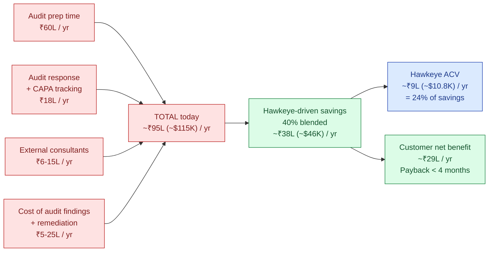
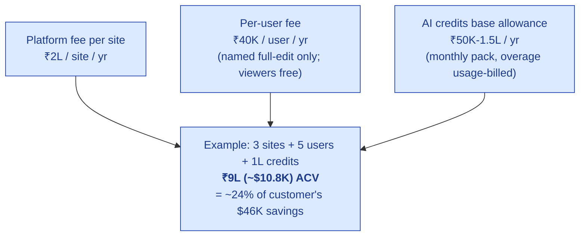
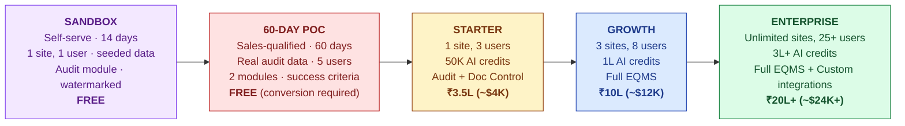
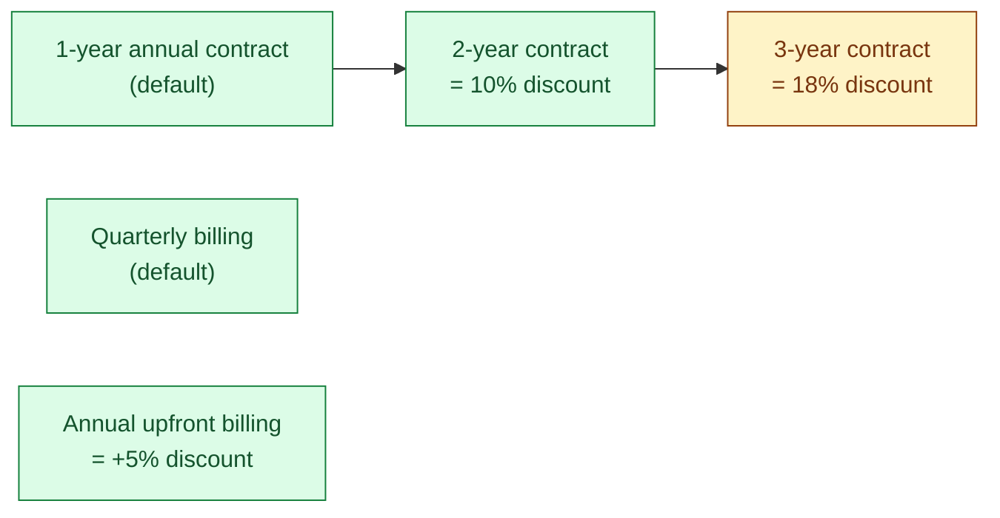

# Pricing & Packaging

| Field | Value |
|---|---|
| Owner | Founders + Sales |
| Status | DRAFT (v1.0) |
| Version | 1.0 |
| Last updated | 2026-05-31 |
| Source | BUSINESS-AND-FUNDING-PLAN.pdf Part 4 (ROI-based subscription pricing) |

---

## 1. The principle

> 💡 **Lead the conversation with customer savings (the value), close the contract on predictable price (the math).** The savings story justifies the price; the contract structure makes it easy to buy. Don't try to charge as a literal % of savings — that's hard to audit and harder to enforce. Use the value calc to anchor the price, then bill on a standard structure.

## 2. The customer-savings calculation (Tier 3 CDMO baseline)

A representative Tier 3 CDMO: **3 sites, 5 QA staff, 30 audits/year.**

### Cost breakdown — the customer's spend today (without Hawkeye)

| Cost line | Annual cost | How Hawkeye reduces it |
|---|---|---|
| Audit preparation time (5 QA × 30 audits × 4 days × ₹10K/day loaded cost) | ₹60L | 50–60% time reduction via AI prep, autofill, evidence reuse |
| Audit response & CAPA tracking (manual coordination) | ₹18L | 30–40% time reduction via cross-module wiring |
| External audit-prep consultants | ₹6–15L | Reduced reliance; not eliminated |
| Cost of audit findings & remediation (variable, ~1 critical/yr) | ₹5–25L | Reduced via earlier risk detection & public-data fusion |
| **Total addressable cost / year** | **~₹95L (~$115K)** | — |
| **Hawkeye-driven savings (conservative, 40% blended)** | **~₹38L (~$46K)** | |

## 3. The pricing structure — what they pay

| Component | Structure | Example (Tier 3 CDMO above) | Logic |
|---|---|---|---|
| Platform fee per site | ₹2L / site / yr | ₹6L (3 sites) | Infrastructure, validation posture, integrations |
| Per-user fee | ₹40K / user / yr | ₹2L (5 users) | Named full-edit users. Viewers free. |
| AI credits (base allowance) | ₹50K–1.5L / yr | ₹1L | Monthly credit pack, overage usage-billed |
| **Annual contract value** | — | **~₹9L (~$10.8K)** | **≈25% of customer savings — the value share** |

## 4. The conversation that closes the deal

> ℹ️ **The pitch language.** "You're spending ~₹95L/year today on audit prep, response, and findings. Our platform reduces that by ~40% — about ₹38L of savings. We charge ₹9L. **Your net annual benefit is ~₹29L from year one, and the platform pays for itself in under 4 months.**" That's the ROI pitch. The contract is per-site + per-user + credits, billed quarterly. The customer hears value-share; signs a clean SaaS contract.

## 5. Per-segment pricing summary

| Segment | Customer savings / yr | Hawkeye ACV | Payback | Notes |
|---|---|---|---|---|
| **Tier 2 mid-pharma** (3 sites) | ~₹40-60L | ₹10-15L ($12-18K) | 3-4 months | Multiple sites; full EQMS |
| **Tier 3 CDMO** (2-3 sites) | ~₹30-45L | ₹8-12L ($10-14K) | 3-4 months | Audit pain dominant |
| **Tier 4 SME** (1 site) | ~₹10-15L | ₹3-6L ($4-7K) | 4-6 months | Value pitch leaner |

## 6. Packaging tiers

| Tier | Sites | Users | AI credits | Modules | ACV | Target segment |
|---|---|---|---|---|---|---|
| **Sandbox** *(free)* | 1 demo tenant | 1 | 5K (~5 audits) | Audit only · watermarked output · synthetic data only | **FREE** | Top-of-funnel · self-serve discovery |
| **60-Day PoC** *(free, qualified)* | 1 (customer's real site) | up to 5 | 25K (PoC-scoped) | Audit + 1 chosen module | **FREE → convert** | Sales-qualified prospect (>15 audits/yr) |
| **Starter** | 1 | 3 | 50K (~50 audits/yr) | Audit + Doc Control | ₹3.5L ($4K) | Tier 4 SME / nutra |
| **Growth** | 3 | 8 | 1L (~150 audits/yr) | Full EQMS (audit, doc, CAPA, deviation, change, training, risk, complaint) | ₹10L ($12K) | Tier 3 CDMO / smaller Tier 2 |
| **Enterprise** | Unlimited | 25+ | 3L+ (custom) | Full EQMS + integrations + dedicated CSM + on-prem option | ₹20L+ ($24K+) | Tier 2 mid-pharma / multi-site |

> ℹ️ **Tier philosophy — the try-before-buy ladder.** Sandbox is **top-of-funnel discovery only** — synthetic data, watermarked exports, no real audits. It is NOT freemium: the customer cannot run their business on it. The 60-day PoC is the **sales-qualified trial** — real audit data, full module functionality, structured success criteria. Both lanes funnel into the three paid tiers (Starter / Growth / Enterprise). The value-share narrative remains intact because no tier with real-audit production use is free.

## 7. Add-ons and overage

| Add-on | Pricing |
|---|---|
| Extra site | ₹2L / site / yr |
| Extra user (named, full-edit) | ₹40K / user / yr |
| AI credit overage | ₹500 per 1,000 tokens output (rough; rate sheet) |
| Custom integration (one-off) | ₹2-5L scoped |
| On-prem / sovereignty deployment | +30% on base ACV |
| Validation summary report (CSV / IQ/OQ/PQ) | ₹1-3L one-time |
| Dedicated Customer Success Manager (Enterprise only) | Included in Enterprise; +₹3L/yr for Growth |

## 8. Contract terms

| Term | Default | Negotiable |
|---|---|---|
| Contract length | 1 year auto-renewal | 2yr (-10%), 3yr (-18%) |
| Billing cadence | Quarterly | Annual upfront (-5%) |
| Payment terms | Net 30 | Net 45 / Net 60 negotiable for enterprise |
| Termination | 60-day notice before renewal | Mid-term termination not allowed except material breach |
| Data export | Always free, 90-day window post-cancellation | n/a |
| Validation summary | Standard included | Customized = paid add-on |
| SLA | 99.5% uptime; standard support 12×5 | 99.9% + 24×7 = +20% (Enterprise only) |

## 9. Discount policy

| Scenario | Discount | Approval |
|---|---|---|
| Reference customer (first 10) | Up to 40% Year 1, list rate Year 2 | Founder approval |
| Multi-year commit (2 / 3 yr) | 10% / 18% | Sales + Founder approval if Y1 ACV >$15K |
| Multi-site rollout (4+ sites) | 5% per site beyond 3 | Sales approval |
| Annual upfront payment | 5% | Standard |
| Renewal upsell (Y2 expansion) | Up to 10% on net-new modules | Sales approval |
| Competitive displacement (Veeva / MasterControl) | Up to 30% Y1, 10% Y2 | Founder approval |

> 🚫 **Never discount on price alone for new logos** without one of the levers above. Erosion compounds across the customer base via reference checks and "what did X pay?" questions.

## 10. ROI calculator — for sales use

The sales team uses a per-prospect ROI calculator. Inputs:

| Input | Source |
|---|---|
| # of sites | Prospect declares |
| # of audits hosted / year | Prospect declares (avg 8-30) |
| # of audits conducted / year | Prospect declares |
| Avg QA loaded cost / day (₹) | Default ₹10K; prospect can override |
| Days per audit (prep + response) | Default 4; prospect can adjust |
| # of QA staff involved per audit | Default 5; prospect can adjust |
| Annual consulting spend on audit prep (₹) | Prospect declares |
| Estimated cost of last critical finding (₹) | Prospect declares |

Outputs:

| Output | Calculation |
|---|---|
| Total today annual cost | Sum of all line items |
| Hawkeye savings | 40% blended × total cost |
| Hawkeye ACV | Per packaging table (sites × ₹2L + users × ₹40K + AI credits tier) |
| Net annual benefit | Savings − ACV |
| Payback period | ACV / monthly savings = months |
| 3-year cumulative net benefit | (Savings × 3) − (ACV × 3, escalated 5%/yr) |

## 11. Sensitivity — what if savings are smaller than claimed?

| Savings realized | Net annual benefit | Payback | Still defensible? |
|---|---|---|---|
| 40% (plan) | ~₹29L | 3-4 mo | ✅ Strong |
| 25% | ~₹15L | 6-7 mo | ✅ Acceptable |
| 15% | ~₹5L | 12+ mo | ⚠️ Marginal — must include non-quantifiable benefits (audit-readiness peace of mind, regulator-facing artifact quality) |
| 10% | ~₹0 | Break-even | 🚫 Walk-away threshold — re-qualify |

> ⚠️ **Pre-seed reality.** The 40% savings is estimated from analogous-customer interviews, not validated through deployed customers. Pre-seed investors will discount. **Even at half (20%), the ROI math still works** (payback 6-8 months) and we still charge ~20% of savings, which is the standard value-based pricing range. Build the first 5-10 case studies and these become real, not estimated.

## 12. Comparison with incumbents

| Vendor | ACV (small/mid pharma) | Implementation | Time-to-value | Per-audit delivered cost |
|---|---|---|---|---|
| **Hawkeye** (Growth tier) | $10-12K | $0-5K | < 30 days | ~$400 |
| **Veeva Vault QMS** | $50-100K+ | $50-200K | 6-12 months | ~$3,000-5,000 |
| **MasterControl** | $40-80K+ | $40-150K | 6-12 months | ~$2,500-4,000 |
| **ComplianceQuest** | $25-60K | $15-50K | 3-6 months | ~$1,500-2,500 |
| **Qualifyze** (audit network only, not EQMS) | Per-audit pricing $2-5K | n/a | n/a | ~$2,000-5,000 |
| **TrackWise** (Sparta) | $40-90K | $30-100K | 4-9 months | ~$2,000-3,500 |
| **Spreadsheet status quo** | "Free" | "Free" | "Already there" | Indirect: ~₹95L (~$115K) total annual cost |

> 💡 **Positioning takeaway.** We're not "cheaper Veeva" — we're a **different price point for a different segment** (SMB/emerging-market). When we DO compete with Veeva (which is rare), the per-audit delivered cost (~$400 vs ~$3000-5000) is the destroyer.

## 13. Revenue model assumptions (for the financial plan)

| Assumption | Value | Source / rationale |
|---|---|---|
| Blended ACV (year 3) | $9,500 | Bottom-up from segment mix (50% Tier 3 @ $11K, 30% Tier 2 @ $14K, 20% Tier 4 @ $5K) |
| Net Dollar Retention | 110% (target) | Module expansion + extra sites + AI credit overage |
| Gross Revenue Retention | 92%+ | Sticky once deployed (validated EQMS hard to rip out) |
| Gross margin year 3 | 76-80% | After hosting + AI inference + support; benefits from fine-tuned models reducing per-token cost |
| Customer acquisition cost (CAC) | $4,500 blended | Founder-led + light SDR; matches 2yr payback @ $9.5K ACV |
| LTV / CAC | > 5× | Standard SaaS health metric; achieved by M24 |

## 14. Roadmap for pricing evolution

| Phase | When | Pricing change |
|---|---|---|
| **Today (M0-M12)** | Now | Three tiers (Starter / Growth / Enterprise). Reference-customer discounts. Founder-approved on case-by-case. |
| **M12-M18** | Post-PMF | Lock list pricing. Publish on website. Standardize discount tiers. Add module-level a-la-carte for upsells. |
| **M18-M24** | Post-seed | Add usage-based AI tier (per 1M tokens) for high-volume customers. Test 3-year commits. |
| **M24-M36** | Pre-Series-A | Geographic tiers (US/EU at +50%); enterprise add-ons (dedicated infra, SLA upgrades, on-prem). |
| **Post-Series-A** | M36+ | Vertical packs (Food, Med-Device QMSR) launch at premium to pharma base. Marketplace network economics. |

## 15. Honesty & open questions

> ⚠️ **What we still don't know.**
>
> 1. Will Tier 2 customers accept per-site pricing for 5+ sites, or will they push for site-unlimited at higher base?
> 2. Will the AI credit overage model feel "metered" in a bad way, or rationally usage-aligned?
> 3. How much discount erosion happens when customer #11 onward asks "what did the references pay?"
> 4. Does 1-year auto-renewal create churn risk vs 2-year locked? Need empirical data after first 6-8 renewals.
> 5. When competitive displacement of Veeva happens (rare), is 30% Y1 discount the right number, or should it be deeper to flip them?
> 6. Should the Enterprise tier include any per-API-call cost for integrations, or is it all included?

## 16. Pricing principles (the operating rules)

> ✅ **The principles we won't violate.**
>
> 1. **Lead with value, close with structure.** Always.
> 2. **Don't price by competitor.** Price by customer ROI; reference competitors only to confirm anchor.
> 3. **No production freemium.** The Sandbox tier exists for top-of-funnel discovery (synthetic data, watermarked, 14-day expiry) but is NOT a free production tier. The 60-day PoC is the qualified trial — structured, time-boxed, real audit data, exit-criteria-driven. No customer runs their real audit program on Hawkeye for free, ever.
> 4. **No price erosion without justification.** Every discount > 10% requires a lever (multi-year, multi-site, reference status, or competitive displacement).
> 5. **Transparency to existing customers.** When list prices change, give 90-day notice and grandfather one renewal cycle.
> 6. **No surprise overage.** AI credit overage notifications at 50% / 80% / 100% with auto-suspend option, not auto-charge.

---

## See also

- [VISION.md](../vision-and-positioning/VISION.md) — positioning + 5-pillar engine
- [MARKET-ANALYSIS.md](../market-analysis/MARKET-ANALYSIS.md) — segment counts + ACV ranges
- [GTM-PLAN.md](../gtm-strategy/GTM-PLAN.md) — sales motion + ICP
- `00-strategy-and-pitch/BUSINESS-AND-FUNDING-PLAN.pdf` (legacy) — Part 4 source
- `Doc_V2/02-fundraising/financial-model/` — eventual home of the revenue model spreadsheet
