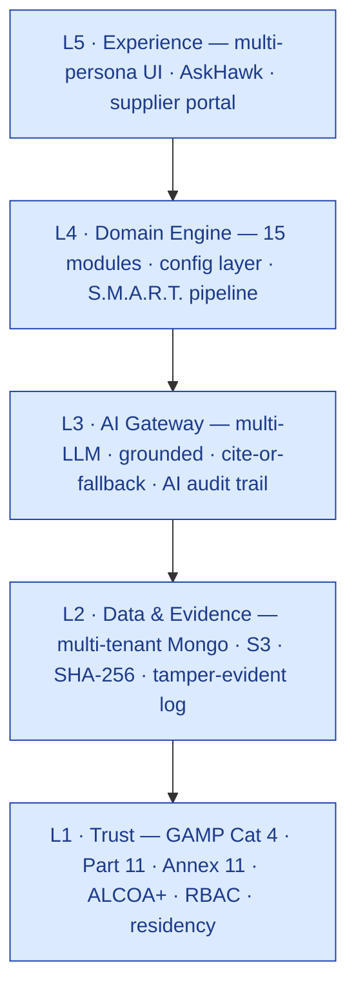

# Strategic Positioning & Market Study — S.M.A.R.T. Hawk

> **Advisory memo — authored from the perspective of a 30-year GxP practitioner** (former Head of QA; GMP/GxP audit consultant across pharma, medical-device and biotech; computerised-system supplier-qualification and CSV/CSA reviewer). This is an independent read of where S.M.A.R.T. Hawk stands, how the architecture is built, and the positioning and roadmap I would take to market.

| Field | Value |
|---|---|
| Owner | Strategy / Founder |
| Status | v1.0 — strategic advisory |
| Date | 2026-06-14 |
| Audience | Founder, Product, GTM, prospective investors |
| Companion docs | [VISION.md](VISION.md) · [MARKET-ANALYSIS.md](../market-analysis/MARKET-ANALYSIS.md) · [PLATFORM-OVERVIEW.md](../../04-engineering/00-overview/PLATFORM-OVERVIEW.md) · [GAMP-CAT-4-COMPLIANCE.md](../../08-compliance-regulatory/GAMP-CAT-4-COMPLIANCE.md) |

---

## 0. The positioning problem, stated plainly

You are struggling to explain the product because you are describing it as **four products at once** — an audit/compliance tool, a supplier-qualification tool, a supplier-management tool, and a full EQMS — while only actually delivering *the gaps and the common benefits* across those categories, not the complete feature surface of any one of them.

That instinct to hedge ("we touch these but don't cover all of it") is the source of the confusion. **The fix is not to claim more — it is to reframe the overlap itself as the product.** S.M.A.R.T. Hawk is not four tools poorly; it is **one thing well**: a single, AI-native **evidence spine** onto which supplier audit, supplier qualification, ongoing supplier oversight, and the connected EQMS workflows all attach. The overlap is not a weakness to apologise for — it is the only thing none of the incumbents have.

This memo makes that case with evidence, and gives you the exact words, the competitive battlecards, and the roadmap to back it.

---

## 1. Executive summary — the one-paragraph answer

> **S.M.A.R.T. Hawk is the AI-native system of record for supplier-centric quality — it starts where the pain is sharpest (the supplier audit) and grows along the same Part-11 evidence spine into qualification, ongoing supplier oversight, and the connected EQMS (deviation, CAPA, change, document control).** Unlike the enterprise EQMS suites (Veeva, MasterControl, TrackWise), it is priced for the underserved SMB/CDMO tier and ships *reproducible, cited AI* they don't. Unlike the supplier-audit networks (Qualifyze, Rephine), it owns the internal *workflow and evidence*, not just a shared report library. And unlike point supplier-qualification or ERP modules, every record it touches lands on one immutable, cross-module audit trail with electronic signature — the chain of evidence a regulator can traverse in seconds. **One spine. Many modules. Inspector-ready by design.**

Everything below substantiates that paragraph and tells you how to defend it.

---

## 2. Where we stand today (honest current state)

A positioning that oversells is worse than no positioning — a single failed PoC or vendor audit unravels it. Here is the unvarnished maturity picture, because the positioning must be *defensible against a CSV team*, not just a buyer.

### 2.1 Module maturity — what you can actually sell today

| Tier | Modules | What it means for positioning |
|---|---|---|
| **LIVE — sellable, demonstrable, validatable today** | Audit Management · Document Control (HawkVault) · CAPA · Change Control · Deviation & Event · Risk Management · Supplier Prequalification · Equipment Management · AskHawk (AI assistant) | Lead with these. A Tier-2/3 customer can validate and go live on this set now. |
| **PARTIAL — core works, advanced features thin** | Training · Management Review | Sell as "included, maturing"; don't headline. |
| **MODEL-ONLY / VISION — data model exists, workflow not deployed** | Batch Records · Complaint Management · Design Control | **Do not put on the front of a deck as "available."** Roadmap them. (PROJECT-STATE.md is explicit: these "don't exist in code" beyond models.) |
| **FRAMEWORK / VISION — scaffold only** | Marketplace / auditor network | This is a *future network play*, not a current feature. Overstating it is the single biggest credibility risk. |

**Commercial reality:** pre-revenue; **no paying pharma logo yet**; two design-partner LOIs in discovery. The honest narrative for investors and first customers is "**the hard 80% — the regulated workflow engine and the AI governance — is built and real; the remaining breadth and the network are funded roadmap.**"

### 2.2 Compliance control maturity (the part that earns trust)

Of the 15 platform controls (C1–C15), **13 are live**, 2 partial:

- **Live & strong:** immutable cross-module audit trail (C1), e-signature ceremony (C2), forward-only state machines (C3), RBAC + multi-tenant isolation (C4), document control (C5), risk/FMEA (C7), change control (C8), CAPA (C9), training (C11), supplier mgmt (C12), periodic review (C13), ALCOA+ data integrity (C14), **AI decision audit trail (C15)**.
- **Partial / honest gaps:** validation package per tenant (C6) and backup-restore test cadence (C10); plus **e-signature defaults to "soft mode"** (warn-and-allow) rather than hard-block, and **MFA/SSO not yet shipped** (Q3 2026). These are the items a sharp CSV reviewer *will* find — disclose them with the roadmap, don't let them be discovered.

> 🩺 **My professional read:** the compliance spine is genuinely differentiated and largely real. The exposure is (a) breadth modules sold ahead of code, and (b) two security/validation gaps (hard e-sig default, MFA, per-tenant validation kit). Positioning must be built on the spine and the wedge — never on the breadth or the marketplace — until those close.

---

## 3. The architecture — and why it *is* the positioning

The architecture is not a back-office detail here; it is the differentiator. The five layers and the S.M.A.R.T. pipeline are what let you make the "one spine, many modules" claim truthfully.

### 3.1 Five layers, trust-first



**Why it matters for positioning:** trust (Layer 1) is the *foundation, not a feature* — it cannot be configured away. That is exactly the language a regulated buyer and their CSV team want to hear, and it is the opposite of "we bolted an audit log onto a workflow app."

### 3.2 The S.M.A.R.T. pipeline — the same motion in every module

Every module — audit, CAPA, deviation, change, supplier qualification — walks the identical five-pillar runtime: **Sense → Monitor → Analyze → Record → Trace** (the brand *is* the architecture). This is *the* structural reason the overlap is a strength: because every module shares one pipeline and one audit trail, the product can legitimately claim a **cross-module chain of evidence** that siloed incumbent suites cannot. When an FDA-483 observation flows Audit → Deviation → CAPA → Change → Document → back to Audit closure, it is one queryable trail, sub-2-seconds — *that* is the demo that wins regulated buyers.

### 3.3 AI built for regulators, not demos

The AI governance is the second pillar of the positioning and is genuinely ahead of the market:
- **Cite-or-fallback** (non-configurable): every AI output cites a source or returns "insufficient evidence." This directly answers the #1 objection from quality buyers — *"my regulator will not accept 'the AI said so'."*
- **AI audit trail (C15):** every AI call logs model version, prompt hash, retrieval set, confidence, and the human's disposition — so an AI-drafted observation from six months ago is **reproducible**. No incumbent ships this.
- **Human always commits the record.** AI drafts, scores, suggests; a person signs. This is the line that makes AI *acceptable* in a GxP shop.

### 3.4 GAMP Category 4 — the validation-cost wedge

S.M.A.R.T. Hawk is a documented **GAMP 5 Category 4 configured product** with a Validation Accelerator Package (vendor SDLC evidence, FRS, IQ/OQ scripts, traceability, VAQ). For the buyer this means **~30–40% of the validation effort of a bespoke build** and *no source-code review obligation*. In an FDA-CSA world (finalised Sept 2025, updated Feb 2026, explicitly scoping AI/ML), this is a concrete, quantified buyer benefit — not a slogan.

---

## 4. Market study — the four categories you touch

Here is the competitive terrain, category by category, with the incumbents, the gap you exploit, and the honest boundary of what you replace. This is the map that ends the "which category are we?" confusion.

### 4.1 Market size & tailwinds

- **Pharma/medtech eQMS:** ~**$1.6B (2025) → ~$4.9B (2035), ~12% CAGR**; pharma QMS specifically ~**13% CAGR to ~$3B by 2030**. Life-sciences QMS is the fastest-growing vertical.
- **Regulatory wind at your back:** FDA **CSA** (final Sept 2025; Feb 2026 update) reframed around **QMSR/ISO 13485** and **explicitly scopes AI/ML** into the regulated QMS; **GAMP 5 2nd Ed.** and the **EU Annex 11 revision (+ draft Annex 22 on AI)** all push risk-based, AI-aware validation. Your GAMP Cat 4 + reproducible-AI thesis is *exactly* what these guidance documents now ask for.
- **The structural gap:** incumbents cluster at two poles — heavyweight enterprise suites and light SMB tools — leaving the **mid-market/CDMO supplier-quality workflow** genuinely underserved. That gap is your beachhead.

### 4.2 Category 1 — Audit Management & Compliance

| | |
|---|---|
| **What you do** | End-to-end supplier-audit lifecycle (8 phases), PAQ with section assignment, **AI observation drafting with citations + confidence**, auditor coach, e-sig gates (intimation, closure), compliance evaluation against selected standards. **Real and live.** |
| **Incumbents** | Veeva Vault Quality, MasterControl, TrackWise (internal audit modules); **Qualifyze / Rephine** (third-party *shared-audit networks* — Qualifyze 5,000+ audit library; Rephine 4,000+ APIs). |
| **The gap you exploit** | Enterprise suites price out SMB and don't ship a supplier-*first* portal or remote-audit cockpit; the networks sell *reports*, not your internal *workflow + evidence*. |
| **Boundary (be honest)** | You are **not** an audit *network/library* — you don't (yet) sell pre-existing third-party audit reports. Position *with* the networks, not as one. |

### 4.3 Category 2 — Supplier Qualification

| | |
|---|---|
| **What you do** | Gatekeeper module: 8-state lifecycle, PQQ, desk review, **risk-weighted scoring (transparent, not black-box)**, **`supplierIntelAgent` fusing FDA/EMA-EudraGMDP/WHO-PQ public data**, on-site-visit auto-trigger (hands off to Audit), e-sig approval, automated periodic requalification. **Real and live.** |
| **Incumbents** | ERP supplier modules (SAP/Oracle), spreadsheets+email, and the supplier-risk platforms (**Qualifyze**). |
| **The gap you exploit** | ERP modules have no compliance evaluation or risk scoring; spreadsheets have no audit trail; you automate the *qualification → requalification* cadence end-to-end on the evidence spine. |
| **Boundary** | You are not a procurement/PO system. Qualification, not purchasing. |

### 4.4 Category 3 — Supplier Management (ongoing)

| | |
|---|---|
| **What you do** | Risk-weighted **periodic requalification** automation, qualified-supplier-list gating of downstream actions, **supplier-visible CAPAs** (supplier sees CAPAs spawned from their audits), auditor availability/COI filtering. **Live.** A two-sided **marketplace** (auto-populated supplier directory + auditor network) is **scaffold/vision**. |
| **Incumbents** | Spreadsheet trackers; Qualifyze (continuous monitoring); fragments of ERP. |
| **The gap you exploit** | Nobody automates risk-weighted requalification cadence with downstream gating *and* gives the supplier real-time visibility into their own CAPAs. |
| **Boundary (critical)** | **Do not sell the marketplace/network as real.** It is the post-Series-A bet. Sell ongoing oversight; tease the network. |

### 4.5 Category 4 — Full EQMS

| | |
|---|---|
| **What you do** | Connected CAPA, Deviation (6-agent AI stack), Change Control, Document Control (HawkVault with AI classification + bulk-upload), Risk, Training, Management Review — all on one audit trail with e-sig gates and forward-only state machines. **Core modules live; Batch/Complaint/Design model-only.** |
| **Incumbents** | Veeva (300+ orgs, 13 of 20 largest pharma), MasterControl ($200M ARR), TrackWise/Honeywell, ETQ; SMB tier: **Qualio, SimplerQMS, Scilife, AmpleLogic, Greenlight Guru**. |
| **The gap you exploit** | Enterprise suites are siloed-by-module, expensive, AI-retrofitted; SMB tools lack the cross-module evidence spine and reproducible AI. |
| **Boundary** | **Do not position head-to-head as "EQMS completeness" vs Veeva** — you will lose a feature-checklist comparison on breadth (Batch/Complaint/Design not built). Position on *spine + AI + price + wedge*, and let breadth be the expansion story. |

### 4.6 The competitive map in one picture

```mermaid
quadrantChart
    title Where S.M.A.R.T. Hawk sits
    x-axis "Point tool" --> "Full platform"
    y-axis "Generic / legacy" --> "AI-native / evidence-first"
    quadrant-1 "Where we play"
    quadrant-2 "AI point tools"
    quadrant-3 "Legacy point tools"
    quadrant-4 "Enterprise suites"
    "Veeva Vault Quality": 0.82 0.45
    "MasterControl": 0.78 0.40
    "TrackWise": 0.75 0.25
    "ETQ": 0.70 0.38
    "Qualio (SMB)": 0.45 0.42
    "Qualifyze (audit network)": 0.30 0.62
    "Rephine (audit library)": 0.25 0.40
    "ERP supplier module": 0.40 0.20
    "S.M.A.R.T. Hawk": 0.62 0.80
```

---

## 5. The recommended positioning

### 5.1 Don't pick a category — design the frame

Fighting inside "EQMS" means competing on completeness against Veeva — a fight you lose today. Fighting inside "audit network" means competing on library size against Qualifyze — not your model. **Design a frame you own:**

> **Category: "AI-native Supplier-Quality & Compliance system of record."**
> Wedge: the supplier audit. Spine: one Part-11 chain of evidence. Expansion: the connected EQMS.

This frame is defensible because it is *true to what's built* (supplier audit + qualification + the live EQMS core on one spine) and it doesn't depend on the unbuilt breadth or the marketplace.

### 5.2 The positioning statement (use verbatim)

> **For** mid-market pharma manufacturers and CDMOs **who** are drowning in supplier audits, qualification paperwork, and disconnected quality records, **S.M.A.R.T. Hawk is** the AI-native supplier-quality and compliance system of record **that** runs your supplier audit end-to-end and connects it to qualification, CAPA, deviation, change and document control on one inspector-ready evidence spine — **unlike** enterprise EQMS suites that price out the mid-market and bolt AI on after the fact, or audit networks that hand you a report but not the workflow.

### 5.3 The three value pillars (everything ladders to these)

1. **Start where it hurts — the supplier audit.** 30+ audits/year per CDMO; ~40% audit-prep cost reduction; payback < 4 months; ~$400 delivered cost per audit vs ~$2.5–5K for the suites. *(This is the wedge — concrete, measured in PoC, single-decision-maker sale.)*
2. **One spine, inspector-ready.** Every record — audit, qualification, CAPA, deviation, change, document — on a single immutable, e-signed, cross-module audit trail; regulator traverses the chain of evidence in seconds. *(This is the moat — what the overlap actually buys you.)*
3. **AI a regulator will accept.** Cited, confidence-scored, fully reproducible (model version + prompt + retrieval logged); human commits every record. *(This is the wedge's accelerant and the future-proofing against CSA/Annex 22.)*

### 5.4 The "say / don't say" guide (this fixes the explaining problem)

| Say this | Not this |
|---|---|
| "We run your **supplier audit** end-to-end and connect it to the rest of your quality system on one evidence spine." | "We're a full EQMS." (invites Veeva feature-checklist) |
| "We're built for the **mid-market and CDMOs** the big suites price out." | "We're a cheaper Veeva." (anchors you as a discount, not a category) |
| "Our AI **cites every claim and is reproducible** — built for CSA and Annex 11." | "Our AI automates your quality decisions." (regulators recoil; you don't automate decisions, humans sign) |
| "Today: audit, qualification, CAPA, deviation, change, doc control — **live**. Batch records, complaints, design control, and the supplier marketplace are on the **roadmap**." | "We have 15 modules and a live marketplace." (a vendor audit will catch this and you lose all credibility) |
| "We **complement** your shared-audit network (Qualifyze/Rephine) by owning the internal workflow and evidence." | "We replace Qualifyze." (different model; needless fight) |

### 5.5 Competitive battlecards (one line each)

- **vs Veeva / MasterControl / TrackWise:** "They own Tier-1 enterprise; we own the mid-market they price out — with reproducible AI they don't ship and a supplier-audit wedge they don't lead with. We're not trying to replace Veeva at Pfizer; we're the system of record for the 1,000+ CDMOs Veeva will never serve."
- **vs Qualifyze / Rephine (audit networks):** "They sell you a *report*; we run your *workflow and evidence*. Use both — their library to source audits, our spine to manage them."
- **vs Qualio / SimplerQMS / Scilife (SMB EQMS):** "They're document-and-CAPA tools; we lead with the supplier-audit workflow and a cross-module evidence spine, with grounded AI and a GAMP Cat 4 validation package they don't provide."
- **vs ERP supplier modules / spreadsheets:** "No audit trail, no risk scoring, no compliance evaluation. We're purpose-built for GxP supplier quality, inspector-ready out of the box."

---

## 6. Roadmap — sequenced to make the positioning *true* over time

Each phase exists to convert a positioning *claim* into a *proof*. Sequence is driven by what most protects credibility.

| Horizon | Window | Theme | What it unlocks for positioning |
|---|---|---|---|
| **NOW (0–6 mo)** | Q2–Q3 2026 | **Prove the wedge & close the trust gaps** | First 3–5 reference customers live on Audit+CAPA+Deviation; **hard-mode e-sig default**, **MFA/SSO**, **per-tenant validation kit (C6)**, **restore-test cadence (C10)**, SOC 2 Type I. → Makes "inspector-ready" and "validatable today" *defensible against a CSV team*. |
| **NEXT (6–12 mo)** | Q4 2026–Q1 2027 | **AI defensibility & first references** | Fine-tuned model in prod for low-stakes tasks; active-learning loop wired; 10 paying customers + 3 named references. → Converts "AI a regulator accepts" and "40% audit-cost reduction" from claim to **case study**. |
| **LATER (12–18 mo)** | Q2–Q3 2027 | **Close EQMS breadth & differentiators** | Ship **Batch Records, Complaint, Design Control** to live; remote-audit cockpit; cross-tenant supplier intel (consented); predictive CAPA effectiveness. → Lets you *honestly* say "connected EQMS," removing today's breadth caveat. First non-pharma (Food/HACCP) reference. |
| **HORIZON (18 mo+)** | 2028+ | **Network & verticalization** | Supplier **marketplace** liquidity (the network bet); US/EU expansion; med-device QMSR pack; auto/aero on the engine-plus-config thesis. → Unlocks the "industry-agnostic compliance engine" and network-effects narrative — *only after* the wedge is proven. |

**Sequencing principle (my strong recommendation):** **do not** chase breadth (Batch/Complaint/Design) or the marketplace before the trust gaps (hard e-sig, MFA, validation kit, SOC 2) and the first references are done. The positioning lives or dies on the first three reference customers surviving a real vendor audit. Protect that.

---

## 7. Risks to the positioning (and how to neutralise them)

| Risk | Why it threatens positioning | Neutraliser |
|---|---|---|
| **Breadth sold ahead of code** (Batch/Complaint/Design model-only) | A vendor audit or PoC scoping call exposes it → credibility collapse | Roadmap them explicitly; sell only the live set; use the "say/don't say" guide |
| **Marketplace overstated** | "Live network" claim is the easiest thing to disprove | Call it roadmap; never demo as production |
| **Soft-mode e-sig / no MFA** | A CSV reviewer flags it as a Part-11 weakness | Close in the NOW phase; until then, disclose with date + compensating controls |
| **Pre-revenue / no logo** | "Who else uses this?" objection | Convert 3 design partners to named references fast; lead with the GAMP Cat 4 evidence package as proof of rigor |
| **"Jack of four trades"** perception | The exact problem this memo solves | Hold the line: *wedge + spine*, not "we do everything" |

---

## 8. Bottom line — what I'd tell the board

S.M.A.R.T. Hawk's confusion is self-inflicted by describing it as a four-category platform. The market doesn't need a fifth EQMS suite or a second audit network. It needs **the supplier-quality workflow the enterprise suites neglect and the SMB tools can't make inspector-ready** — delivered AI-native, on one evidence spine, at a mid-market price, exactly as CSA and Annex 11 turn toward risk-based, reproducible-AI validation.

**Lead with the supplier audit. Win on the evidence spine and reproducible AI. Let the EQMS breadth and the network be the expansion — not the headline.** Prove it with three references that survive a vendor audit, and the positioning explains itself.

---

## References

**Internal:** [PROJECT-STATE.md](../../PROJECT-STATE.md) · [PLATFORM-OVERVIEW.md](../../04-engineering/00-overview/PLATFORM-OVERVIEW.md) · [PLATFORM-CONTROLS.md](../../08-compliance-regulatory/platform-controls/PLATFORM-CONTROLS.md) · [GAMP-CAT-4-COMPLIANCE.md](../../08-compliance-regulatory/GAMP-CAT-4-COMPLIANCE.md) · [MARKET-ANALYSIS.md](../market-analysis/MARKET-ANALYSIS.md) · [VISION.md](VISION.md) · module URS/ARCHITECTURE under [06-modules/](../../06-modules/).

**External market sources (accessed June 2026):**
- InsightAce Analytic — *eQMS for Pharma & Medtech Market Size 2026–2035*
- MarketsandMarkets / Grand View Research — *Pharmaceutical QMS Software Market* (to 2030)
- IntuitionLabs — *Veeva vs TrackWise vs MasterControl*; *GAMP 5 & CSA Integration*; *CSV→CSA*
- Qualifyze — *Supplier Risk Management Platform for Pharma* (shared audit library)
- Rephine — *Third-Party GMP Audits / PharmAssess* (audit library; EMA third-party audit guidance)
- US FDA — *Computer Software Assurance for Production and Quality System Software* (final, 24 Sep 2025; update 3 Feb 2026)
- SimplerQMS / G2 / Complere — *SMB & CDMO eQMS comparisons* (Qualio, Scilife, AmpleLogic, Greenlight Guru)
- ISPE *Pharmaceutical Engineering* — *Generative/Agentic AI in deviation & CAPA management*
