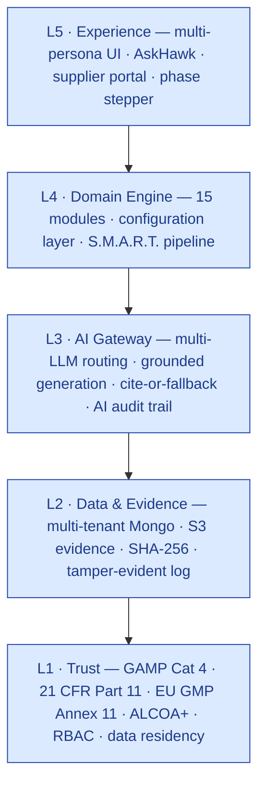
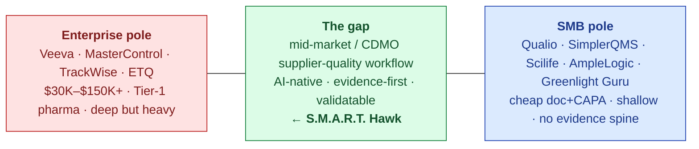
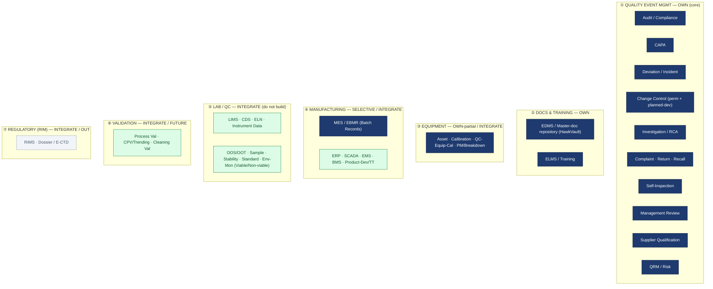
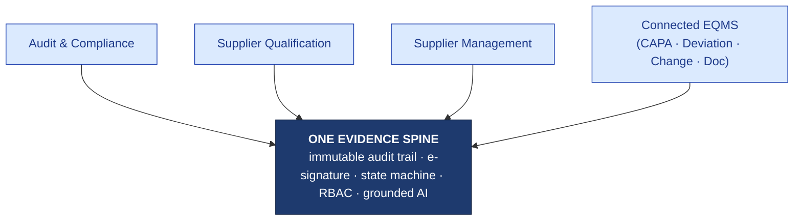
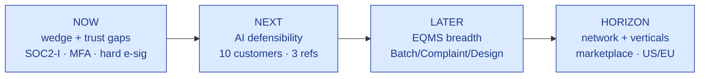
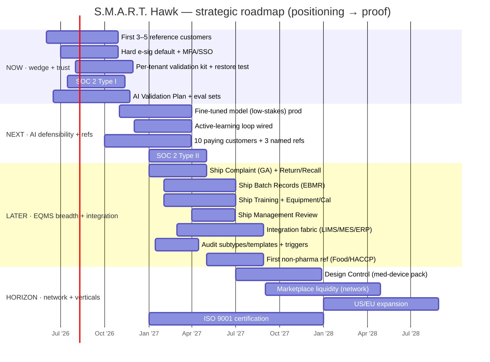

# Strategic Positioning & Market Study — S.M.A.R.T. Hawk
## A senior-GxP advisory report

> **Authored from the perspective of a 30-year GxP practitioner** — former Head of Quality Assurance; GMP/GxP audit consultant across pharmaceutical, medical-device and biotech manufacturers; computerised-system supplier-qualification and CSV/CSA reviewer for regulated software. This report is an independent, evidence-based read of where S.M.A.R.T. Hawk stands, how the platform is architected, the competitive market it enters, and the positioning and roadmap I would take to the board.

| Field | Value |
|---|---|
| Document | `HK-POS-v3.0` — Strategic Positioning & Market Study (consulting-grade) |
| Owner | Strategy / Founder |
| Status | v3.0 — extended advisory report (adds the pharma automation-ecosystem coverage map, audit-type taxonomy & scope, per-module catalog cross-link, and a Gantt roadmap) |
| Pairs with | [MODULE-FEATURE-POSITIONING-CATALOG.md](../../03-product/00-overview/MODULE-FEATURE-POSITIONING-CATALOG.md) — per-module feature lists & positioning |
| Date | 2026-06-14 |
| Audience | Founder, Product, GTM leadership, prospective investors, board |
| Classification | Confidential |
| Companion docs | [VISION.md](VISION.md) · [MARKET-ANALYSIS.md](../market-analysis/MARKET-ANALYSIS.md) · [GTM-PLAN.md](../gtm-strategy/GTM-PLAN.md) · [PRICING.md](../pricing-and-packaging/PRICING.md) · [PLATFORM-OVERVIEW.md](../../04-engineering/00-overview/PLATFORM-OVERVIEW.md) · [GAMP-CAT-4-COMPLIANCE.md](../../08-compliance-regulatory/GAMP-CAT-4-COMPLIANCE.md) · [PLATFORM-CONTROLS.md](../../08-compliance-regulatory/platform-controls/PLATFORM-CONTROLS.md) |

---

## Table of contents

1. Executive summary
2. The positioning problem — diagnosis
3. Where we stand today (honest current state)
4. The architecture — and why it *is* the positioning
5. Market study — sizing, tailwinds, structure
6. Competitor deep-profiles
7. The four overlapping categories — mapped and bounded
8. The four-category overlap — diagnosed and resolved
9. The recommended positioning
10. Messaging architecture & persona playbooks
11. Competitive battlecards (detailed)
12. Objection handling
13. Pricing & value positioning
14. Go-to-market alignment
15. Roadmap — sequenced to make the positioning true
16. Risk register
17. Deal archetypes (win/loss scenarios)
18. KPIs & proof milestones
19. Bottom line
20. References & appendices

---

## 1. Executive summary

**The problem.** S.M.A.R.T. Hawk is hard to explain because it is being described as *four products at once* — an audit/compliance tool, a supplier-qualification tool, a supplier-management tool, and a full EQMS — while delivering only the **gaps and the common benefits** across those categories rather than the complete feature surface of any one. The instinct to hedge ("we touch all four but don't cover all of each") is the root of the confusion and, untreated, it reads as *"jack of four trades, master of none."*

**The resolution.** Do not claim more. **Reframe the overlap itself as the product.** S.M.A.R.T. Hawk is one thing done well: an **AI-native evidence spine** onto which supplier audit, supplier qualification, ongoing supplier oversight, and the connected EQMS workflows all attach. The overlap is not a weakness — it is the only thing none of the incumbents possess. Enterprise suites are siloed-by-module and price out the mid-market; audit networks sell reports, not workflow; ERP supplier modules have no compliance depth; SMB EQMS tools have no cross-module evidence spine or reproducible AI.

**The one-paragraph positioning:**

> **S.M.A.R.T. Hawk is the AI-native system of record for supplier-centric quality.** It starts where the pain is sharpest — the supplier audit — and grows along the same Part-11 evidence spine into qualification, ongoing supplier oversight, and the connected EQMS (deviation, CAPA, change, document control). Unlike enterprise EQMS suites (Veeva, MasterControl, TrackWise), it is priced for the underserved mid-market/CDMO tier and ships **reproducible, cited AI** they do not. Unlike supplier-audit networks (Qualifyze, Rephine), it owns the internal **workflow and evidence**, not just a shared report library. And unlike point supplier-qualification or ERP modules, every record lands on **one immutable, e-signed, cross-module audit trail** — the chain of evidence a regulator can traverse in seconds. **One spine. Many modules. Inspector-ready by design.**

**The mandate to the board (Section 19):** Lead with the supplier audit (the wedge). Win on the evidence spine and reproducible AI (the moat). Let EQMS breadth and the supplier network be the expansion — not the headline. Prove it with three reference customers that survive a real vendor audit, and the positioning explains itself.

---

## 2. The positioning problem — diagnosis

### 2.1 Why the current explanation fails

When a product is pitched as spanning four established categories, three things go wrong in the buyer's mind:

1. **Category anchoring.** The buyer files you under the first category they recognise ("oh, an EQMS") and then benchmarks you against the *leader* of that category (Veeva). On a feature checklist against Veeva you lose — not because you're weak, but because you're being measured on the wrong axis.
2. **The completeness trap.** Claiming four categories implies four complete feature sets. The moment a vendor-audit or PoC-scoping conversation reveals that Batch Records, Complaints, and Design Control are model-only and the marketplace is a scaffold, the *entire* pitch loses credibility — including the parts that are genuinely excellent.
3. **The hedge tax.** "We touch these but don't do all of each" forces you to lead every conversation with an apology. Buyers don't buy hedged products; they buy products with a sharp point.

### 2.2 The reframe in one sentence

> You are not selling four partial categories. You are selling **one complete thing** — a supplier-quality system of record on a unified evidence spine — that *expresses itself* through audit, qualification, oversight, and connected EQMS workflows.

The rest of this report turns that sentence into evidence, words, battlecards, and a roadmap.

---

## 3. Where we stand today (honest current state)

A positioning built on overstatement is destroyed by a single failed PoC or vendor audit. The positioning below is engineered to be **defensible against a customer's CSV/CSA team**, which means it must rest only on what is real. Here is the unvarnished picture.

### 3.1 Module maturity — what is actually sellable

| # | Module | Status | Evidence / notes |
|---|---|---|---|
| 1 | **Audit Management** | **LIVE** | 8-phase state machine; PAQ + section assignment; AI observation drafter (cited, confidence-scored); auditor coach; e-sig gates (intimation G1, closure G8); compliance evaluation. 15+ controllers in code. The flagship. |
| 2 | **Document Control (HawkVault)** | **LIVE** | 6-state lifecycle; multi-step approval + e-sig; read receipts; AI classify/tag; bulk-upload wizard with batch e-sig; periodic review. |
| 3 | **CAPA** | **LIVE** | 8-state lifecycle; 5-way trigger linkage; AI 5-Why RCA drafter; effectiveness check; closure e-sig + evidence-bundle export. |
| 4 | **Change Control** | **LIVE** | 7-state lifecycle; classification; per-area impact assessment; multi-step approval (SoD enforced); PIR → CAPA spawn. |
| 5 | **Deviation & Event** | **LIVE** | 6-agent AI stack (classifier, similar-finder, 5-Why scaffolder, disposition drafter, CAPA recommender, trend alerter); disposition e-sig; one-click CAPA spawn. |
| 6 | **Risk Management** | **LIVE** | FMEA/RPN scoring; risk register; 12-dimension supplier risk snapshot; ICH Q9 framing. |
| 7 | **Supplier Prequalification** | **LIVE** | 8-state lifecycle; PQQ; transparent risk-weighted scoring; `supplierIntelAgent` (FDA/EMA/WHO public-data fusion); on-site auto-trigger; periodic-requal automation. |
| 8 | **Equipment Management** | **LIVE** | Equipment registry; calibration scheduling; maintenance tracking. |
| 9 | **AskHawk (AI assistant)** | **LIVE** | Phases 1–3 shipped: regulations Q&A, SOP templates, workflow playbooks, app wizard; grounded + cite-or-fallback. |
| 10 | **Training** | **PARTIAL** | Record creation + qualification tracking live; competency matrix / effectiveness AI thin. |
| 11 | **Management Review** | **PARTIAL** | Core periodic-review + sign-off live; enhanced Annex 11 §11 evaluation maturing. |
| 12 | **Batch Records** | **MODEL-ONLY** | Data model exists; controllers/routes/UI not deployed. Roadmap. |
| 13 | **Complaint Management** | **MODEL-ONLY** | Data model exists; intake/investigation/AI-triage planned (Wave 3). |
| 14 | **Design Control** | **MODEL-ONLY** | Data model exists; DHF/trace-matrix/V&V workflow planned (med-device vertical pack). |
| 15 | **Marketplace / auditor network** | **FRAMEWORK/VISION** | Catalog scaffolding; engagement matching, search, payments, network liquidity all post-Series-A. |

**Reading the table:** the **regulated workflow core (modules 1–9) is genuinely live and demonstrable.** A Tier-2/3 customer can validate and go live on this set today. **Modules 12–15 must never be positioned as "available."**

### 3.2 Compliance control maturity (C1–C15)

| Control | Status | Honest gap | Remediation |
|---|---|---|---|
| C1 Immutable audit trail (cross-module) | ✅ Live | — | — |
| C2 E-signature ceremony (Part 11 §11.50/200) | ✅ Live | **Soft-mode default** (warn-and-allow); hard via env flag | Hard-mode default — **Q3 2026** |
| C3 Forward-only state machines | ✅ Live | Dual legacy status fields | Cleanup Q4 2026 |
| C4 RBAC + multi-tenant isolation | ✅ Live | **No MFA/SSO yet** | TOTP + SAML — **Q3 2026 / Q1 2027** |
| C5 Document control | ✅ Live | Per-tenant retention enforcement | Q1 2027 |
| C6 Validation package (per tenant) | ⚠️ Partial | IQ/OQ scripts incomplete | **Q4 2026** |
| C7 Risk management (FMEA) | ✅ Live | Predictive risk AI | Q1 2027 |
| C8 Change control | ✅ Live | — | — |
| C9 CAPA | ✅ Live | Predictive effectiveness AI scaffolded | Q3 2026 |
| C10 Backup + recovery | ⚠️ Partial | **Annual restore-test not scheduled** | **Q4 2026** |
| C11 Training records | ✅ Live | — | — |
| C12 Supplier management | ✅ Live | Cross-tenant intel UI deferred | Q2 2027 |
| C13 Periodic review | ✅ Live | — | — |
| C14 Data integrity (ALCOA+) | ✅ Live | TSA cryptographic anchor | Q2 2027 |
| C15 **AI decision audit trail** | ✅ Live | Active-learning loop not wired | Q1 2027 |

**13 of 15 live; 2 partial.** The two items most likely to be challenged by a sharp CSV reviewer are **soft-mode e-sig** and **no MFA** — both in the Q3-2026 remediation window. Disclose them with dates and compensating controls; never let them be *discovered*.

### 3.3 Commercial state

- **Pre-revenue.** No paying pharma logo yet; **two design-partner LOIs** (in discovery).
- Beachhead: **India Tier-2 mid-pharma + Tier-3 CDMO**; blended target ACV ≈ **$9.5K**; Growth tier ₹10L (~$12K).
- Honest investor framing: *"the hard 80% — the regulated workflow engine and the AI governance — is built and real; the remaining breadth and the network are funded roadmap."*

### 3.4 The honesty register (what is NOT yet true)

> 🩺 **Use this internally to keep the pitch clean.** Overstating any of these is the fastest way to lose a regulated buyer:
> - No paying customer yet (design-partner LOIs only).
> - Batch Records / Complaint / Design Control: **models only**, not working modules.
> - Marketplace: **scaffold**, not a live network.
> - On-prem LLM: validation scaffold exists, **not proven end-to-end**.
> - E-signature: **soft-mode by default** today.
> - MFA/SSO: **not yet shipped**.

---

### 3.5 Self-assessed domain coverage (the 80 / 30 / 50)

> 📐 **Interpretation:** these percentages are **S.M.A.R.T. Hawk's own completeness against a notional 100%-complete solution in each domain** — i.e., how much of what a buyer expects in that domain we deliver today. They are a *self-assessment to guide build priorities*, not a market-share or competitor claim. (If you meant "how much of each domain the *incumbent market* covers," flag it and I'll re-frame.)

| Domain | Self-assessed coverage | What's covered | The gap (what's missing) | Plan to close |
|---|---|---|---|---|
| **Supplier Audit** | **~80%** | Full 8-phase lifecycle, PAQ + section assignment, AI observation drafting (cited), auditor coach, e-sig gates, compliance evaluation | Remote-audit cockpit UX; some internal/contractor/lab audit configs; cross-tenant intel surfacing | Phase NOW–LATER (remote cockpit, audit-type configs) |
| **Supplier Qualification** | **~30%** | Prequal lifecycle, PQQ, transparent risk scoring, public-data intel, periodic requal | Depth of the ongoing-qualification regime: up-to-50-document collection workflow, scorecards, full requalification document lifecycle, supplier-master integrations | Phase LATER (qualification depth); partner/API where faster |
| **EQMS (breadth)** | **~50%** | CAPA, Deviation, Change, Document Control, Risk, Training, MRM — live core on one evidence spine | Batch Records, Complaint Management, Design Control (model-only today); DMS/LMS breadth | Phase LATER (ship Batch/Complaint/Design); DMS/LMS = horizon |

**Positioning consequence:** the coverage profile **confirms the strategy** — we are deepest where the wedge is (audit, ~80%), thinner where expansion lies (qualification ~30%, EQMS ~50%). Lead with audit, expand along the spine, and be honest about the qualification/EQMS depth still being built. This is exactly why we position as *"supplier-quality system of record (audit-led)"* rather than *"complete EQMS."*

---

## 4. The architecture — and why it *is* the positioning

The architecture is not back-office detail; it is the proof that the "one spine, many modules" claim is *true* rather than aspirational. This section is the technical backbone of the positioning.

### 4.1 Five layers, trust-first



| Layer | What it provides | Positioning consequence |
|---|---|---|
| **L1 Trust** | GAMP Cat 4, Part 11, Annex 11, ALCOA+, RBAC, IN/US/EU residency, zero model-training on customer data | Trust is the *foundation, not a feature* — it cannot be configured away. This is the exact language a CSV team wants. |
| **L2 Data & Evidence** | Multi-tenant Mongo with row-level isolation; S3 evidence store; SHA-256 hashing; tamper-evident append-only audit log | The physical substrate of the "chain of evidence" claim. |
| **L3 AI Gateway** | Multi-LLM routing; grounded generation; cite-or-fallback; AI decision audit trail | The "AI a regulator accepts" pillar. |
| **L4 Domain Engine** | 15 modules over one configuration layer + the S.M.A.R.T. five-pillar runtime | The reason breadth is *configuration*, not new code — the engine-plus-config moat. |
| **L5 Experience** | Multi-persona UI incl. a true supplier-side portal | The supplier-first experience the suites lack. |

### 4.2 The S.M.A.R.T. pipeline — the same motion in every module

Every module — audit, CAPA, deviation, change, qualification — walks the identical five-pillar runtime; **the brand *is* the architecture**:

| Pillar | Function | In-module example |
|---|---|---|
| **S — Sense** | Ingest evidence/data (crawlers, parsers, PDF extract, doc-intel) | Supplier dossier auto-built from FDA/EMA/WHO public data |
| **M — Monitor** | Normalise, entity-resolve, structure into records | PAQ responses normalised into the audit object |
| **A — Analyze** | Compliance evaluation, standards, risk scoring | Observation classified CRITICAL/MAJOR/MINOR; supplier risk scored |
| **R — Record** | Report assembly, audit-report agents, e-signature | Closure certificate assembled, e-signed |
| **T — Trace** | Immutable audit trail, SHA-256 + ALCOA+ seal | Every state change written to the one cross-module trail |

**Why this is the positioning's structural backbone:** because every module shares one pipeline and one audit trail, the cross-module **chain of evidence** is *real* — an FDA-483 observation can flow Audit → Deviation → CAPA → Change → Document → Audit-closure as a single queryable trail in under two seconds. Siloed incumbent suites, whose modules were acquired or built separately, cannot do this without integration projects. **This demo is the single most persuasive asset you have with a regulated buyer.**

### 4.3 AI governance — built for regulators, not demos

| Control | What it does | Why it matters to the buyer |
|---|---|---|
| **Cite-or-fallback** (non-configurable) | Every AI output cites ≥1 source or returns "insufficient evidence" | Directly answers *"my regulator won't accept 'the AI said so'"* |
| **AI audit trail (C15)** | Logs model version, prompt hash, retrieval set, confidence, human disposition | An AI-drafted observation from 6 months ago is **reproducible** — no incumbent ships this |
| **Confidence floor** (0.6–0.7) | Below threshold → skeleton fallback, no fabrication | Zero hallucinated citations *by design* |
| **Human commits the record** | AI drafts/scores/suggests; a person signs | The line that makes AI *acceptable* in a GxP shop |
| **No training on customer data** | Tenant isolation + residency; API calls don't train external models | Satisfies DPDP/GDPR and quality-leadership fear of data leakage |

This is the most regulator-forward AI posture in the category and aligns precisely with **FDA CSA's explicit AI/ML scoping** and the **draft EU Annex 22 (AI)**.

### 4.4 GAMP Category 4 — the validation-cost wedge (quantified)

S.M.A.R.T. Hawk is a documented **GAMP 5 Category 4 configured product** with a Validation Accelerator Package. The buyer economics:

| Validation dimension | Cat 5 bespoke (baseline) | **Cat 4 (S.M.A.R.T. Hawk)** |
|---|---|---|
| Source-code review obligation | Required | **Not required** |
| Customer-side V-model effort | 100% | **~30–40%** |
| Typical cycle time | 6–12 months | **6–12 weeks** |
| Vendor evidence leveraged | Limited | **Extensive** (Vendor QM, SDLC evidence, FRS, IQ/OQ scripts, traceability, VAQ) |

In an FDA-CSA world this is a **concrete, quantified buyer benefit** — not a slogan. It is also a barrier to the SMB EQMS tools that do not furnish a validation package.

### 4.5 Multi-tenant & data residency

Single code base; per-tenant logical isolation at the query layer; per-tenant data residency (**India / US / EU**); per-tenant encryption (BYOK on Enterprise). This underwrites both the GAMP Cat 4 "common code base" classification and the data-sovereignty conversation that India DPDP (deadline May 2027) and EU GDPR make mandatory.

---

## 5. Market study — sizing, tailwinds, structure

### 5.1 Market sizing (top-down and bottom-up)

**Top-down (context, not the pitch):**

| Market | Size (2025) | CAGR | Forward |
|---|---|---|---|
| Pharma/medtech eQMS | ~$1.58B | ~12.2% | ~$4.9B by 2035 |
| Pharmaceutical QMS software | ~$1.59B | ~13.3% | ~$2.98B by 2030 |
| Quality management software (all-industry) | ~$12.5B | ~10–11% | ~$20–31B by 2030–34 |
| Supplier quality management (all-industry) | ~$15.5B (2026) | — | ~$42B by 2036 |

Life-sciences QMS is the **fastest-growing vertical** within QMS. North America leads; **India/SE-Asia/Middle-East are the under-penetrated growth edges** where incumbents are weakest — your beachhead.

**Bottom-up (the number to actually pitch) — India pharma:**

| Segment | Count (India) | Target ACV | 36-mo realistic capture |
|---|---|---|---|
| Tier 1 — Large pharma | ~50 | — (NOT a target) | — |
| **Tier 2 — Mid-size formulations + APIs** | ~400–500 | $12–18K | 40–60 accounts |
| **Tier 3 — CDMOs** | ~800–1,000 | $10–14K | 60–100 accounts |
| Tier 4 — SME / nutra | ~2,000+ | $4–7K | 40–80 accounts |

- **36-mo SOM (India pharma alone):** ~150–240 customers × ~$9.5K blended = **$1.4–2.3M ARR**.
- **5-yr addressable ceiling (pharma India, pre-vertical-expansion):** **$8–12M ARR**.
- Ring-1 expansion (Food/FSSAI, Cosmetics, Med-device, Cell&Gene) is **additive** and reuses ~75% of the engine.

> ⚠️ **Discipline:** never pitch the $12.5B top-down number as "our market." For a new entrant it signals naïveté to investors. The bottom-up India-pharma number, with the ring-expansion option value, is the credible story.

### 5.2 Regulatory landscape & tailwinds

| Driver | What changed | Why it favours S.M.A.R.T. Hawk |
|---|---|---|
| **FDA CSA** (final 24 Sep 2025; update 3 Feb 2026) | Risk-based assurance replaces document-heavy CSV; **explicitly scopes automation, analytics, AI/ML**; reframed around **QMSR/ISO 13485** | Your GAMP Cat 4 + reproducible-AI posture is exactly the evidence CSA wants; lowers buyer validation cost (your wedge) |
| **US QMSR** (effective Feb 2026) | 21 CFR 820 harmonised with ISO 13485 | One control set serves both FDA and ISO buyers — supports your "configure, don't rebuild" thesis |
| **EU GMP Annex 11 revision** + **draft Annex 22 (AI)** | Tightened cloud/SaaS provisions; explicit AI/ML governance | Your AI audit trail + cite-or-fallback pre-empt Annex 22 |
| **GAMP 5 2nd Ed. (2022)** | Critical-thinking, risk-based CSV | Underwrites the Cat 4 leverage argument |
| **ICH Q7/Q9/Q10** | Formalise supplier qualification, quality risk management, outsourced-activity oversight | Your supplier-quality wedge is *mandated* work, not discretionary |
| **MHRA/WHO data integrity (ALCOA+)** | Inspectors expect attributable, contemporaneous, enduring records | Your evidence spine is ALCOA+ by design |

**Net:** the regulatory current is moving *toward* exactly the things you built. This is a rare alignment — lead with it in the investor narrative.

### 5.3 Market structure — the two-pole gap

The category is barbell-shaped:



The enterprise pole can't profitably serve sub-$30K ACV; the SMB pole can't deliver the cross-module evidence spine, reproducible AI, or a GAMP Cat 4 validation package. **The mid-market supplier-quality workflow is the uncontested ground.**

---

## 5A. The pharma automation ecosystem — coverage & focus areas

> 🗺️ Synthesizing the client-provided **Automation Interlinkage (Pharma)** map with industry research on connected-quality / Pharma 4.0. The pharma digital-quality estate spans ~40 interlinked systems. The strategic question is **not** "can we build it all?" (no one should) — it is **"what do we OWN, what do we INTEGRATE with, and what do we deliberately leave OUT?"** Getting this boundary right is the difference between a focused category leader and a diffuse me-too.

### 5A.1 The estate, by domain



### 5A.2 Coverage & focus decision (the rulebook)

| Domain | Components (from the interlinkage map) | Posture | Rationale |
|---|---|---|---|
| **① Quality Event Mgmt (EQMS)** | Audit, CAPA, Deviation/Incident, Change Control (permanent + planned-deviation), Investigation/RCA, Complaint, Return, Recall, Self-Inspection, Management Review, Supplier Qualification, QRM | **🟦 OWN — core** | This *is* our product. Audit + supplier-quality is the wedge; the rest is the connected EQMS on one spine. |
| **② Documents & Training** | EDMS / master-doc repository / doc-control workflows; ELMS (training) | **🟦 OWN** | HawkVault is live; Training is forward-spec. Required for a credible EQMS and for the "connected quality" story. |
| **③ Equipment & Calibration** | Asset mgmt, Calibration, QC-equipment calibration, Preventive/Breakdown maintenance | **🟦 OWN-partial / 🟩 INTEGRATE** | Build calibration/maintenance records (Equipment module, 2027) for the GxP gating (out-of-cal blocks batch step); integrate with dedicated CMMS where customers have one. |
| **④ Manufacturing & Batch** | MES/EBMR; ERP; SCADA; EMS; BMS; Product Dev & Tech Transfer | **🟦 SELECTIVE (Batch Records) / 🟩 INTEGRATE (rest)** | Build the **electronic batch record** (overlaps EBMR) for the pharma vertical; **integrate** — never rebuild — MES/ERP/SCADA/EMS/BMS. |
| **⑤ Lab / QC (LIMS estate)** | LIMS, CDS, ELN, Instrument data, Sample/Stability/Standard mgmt, OOS/OOT, Lab incidents, Environmental monitoring | **🟩 INTEGRATE — do NOT build** | A separate, mature, capital-intensive category. We *consume* OOS/OOT/lab-incident events into deviation/CAPA; we do not become a LIMS. |
| **⑥ Validation** | Process validation, CPV/trending, Cleaning validation | **🟩 INTEGRATE / FUTURE** | Adjacent; consume validation status; possible future module, not near-term. |
| **⑦ Regulatory (RIM)** | RIMS, Dossier / E-CTD | **⬜ OUT (for now)** | Distinct category (Veeva RIM, etc.); integrate at the document/submission boundary only. |

### 5A.3 Focus areas (where to invest, in order)
1. **Deepen the EQMS event suite we already lead** — finish Complaint, add Return/Recall, harden Audit + Supplier-Quality (the 80/30/50 from §3.5).
2. **Ship the four forward-spec modules** — Training, Equipment/Calibration, Batch Records (EBMR), Management Review — to make "connected EQMS" *true*.
3. **Build the integration fabric** — published APIs + connectors to **LIMS, MES, ERP, CDS** so we are the **quality spine** of the customer's estate, not an island. This is the single highest-leverage differentiator in a "connected quality" market.
4. **Explicitly do NOT build** LIMS, CDS, ELN, RIMS, SCADA, BMS/EMS — integrate. Saying "no" here is what keeps us focused and fundable.

> 💡 **The connected-quality thesis:** incumbents and analysts increasingly frame the win as *connected quality* — QMS as the orchestration spine that interlinks LIMS, MES, ERP, DMS, LMS. S.M.A.R.T. Hawk's **one-evidence-spine architecture is purpose-built to be that orchestrator** for the mid-market — provided we build the integration fabric (focus area #3) rather than trying to absorb every box on the map.

---

## 6. Competitor deep-profiles

For each, I give the honest read a buyer's consultant would give — strengths, weaknesses, where they win, and where they cede to you.

### 6.1 Enterprise EQMS suites

**Veeva Vault Quality** — *the category king.*
- **Strengths:** 300+ life-sciences orgs incl. 13 of the 20 largest pharma; deep validation packages; brand safety ("nobody got fired for buying Veeva"); unified Vault platform.
- **Weaknesses:** price floor well above SMB reach; AI is being *embedded/retrofitted*, not native; supplier-audit is not a lead motion; implementation heavy.
- **Wins when:** Tier-1 pharma, enterprise procurement, regulatory-submission-adjacent needs.
- **Cedes to you:** anything sub-$30K ACV; the mid-market/CDMO tier; supplier-first audit workflow; reproducible cited AI.
- **Your stance:** *Do not fight Veeva at the top. Take the customers Veeva will never profitably serve.*

**MasterControl** — *the established workhorse* (surpassed $200M ARR, Sep 2025).
- **Strengths:** large installed base; mature document + CAPA; manufacturing-excellence positioning.
- **Weaknesses:** legacy UX; validation cost; AI bolt-ons; mid-market still expensive.
- **Cedes to you:** AI-native experience, price, supplier-audit wedge.

**Sparta TrackWise / TrackWise Digital (Honeywell)** — *the legacy incumbent.*
- **Strengths:** deep installed base at major pharma; longest-established.
- **Weaknesses:** complex/expensive implementation; minimal native AI; siloed modules.
- **Cedes to you:** everything on AI, price, time-to-value, supplier-first.

**ETQ Reliance (Hexagon)** — strong for mid-to-large multi-site quality; configurable. Cedes the SMB/CDMO tier and reproducible AI.

### 6.2 SMB / mid-market EQMS

**Qualio** — cloud QMS for small/mid life-sciences; strong onboarding; document + CAPA + training. **Weakness vs you:** no supplier-audit workflow as a lead motion, no cross-module evidence spine depth, no GAMP Cat 4 validation package, AI thin.

**SimplerQMS** — small-business focused; document-centric. **Cedes:** scale of evidence spine, AI, supplier-quality depth.

**Scilife / AmpleLogic / Greenlight Guru (med-device)** — vertical or SMB EQMS. AmpleLogic is GAMP-aware (India presence — note as a *direct regional competitor*); Greenlight Guru owns med-device. **Your edge:** supplier-audit wedge + reproducible AI + the one-spine evidence model; in med-device, you defer (Design Control is roadmap), so **do not pick a med-device fight yet**.

### 6.3 Supplier-audit networks (the most important to position *with*, not against)

**Qualifyze** — AI-powered supplier-risk platform with the **largest GxP audit library (5,000+ audits, ~450 new/month)**, continuous monitoring, claims ~65% audit-time reduction.
- **Strengths:** real network liquidity; shared-audit economics; pharma-specific.
- **Weakness vs you:** it is a **network/marketplace + report library**, not your internal *workflow and evidence system*. It tells you a supplier's status; it doesn't run your audit lifecycle, your CAPA, your change control, your document control on one Part-11 spine.
- **Your stance:** **complement, don't compete.** "Source audits from Qualifyze's library; *run and connect* them in S.M.A.R.T. Hawk." (Critically: your own marketplace ambition is *vision* — do not pretend to out-network Qualifyze today.)

**Rephine** — largest library of valid third-party GMP audit reports (4,000+ APIs); PharmAssess; aligned to EMA third-party audit guidance; strong COI controls.
- Same framing: a **report library / audit service**, not a workflow system of record. Position as complementary.

### 6.4 Adjacent / horizontal

**ERP supplier modules (SAP/Oracle), ServiceNow, spreadsheets+email** — distribution and breadth, but **no regulated-domain depth, no Part-11 evidence trail, no grounded AI.** You win on credibility with quality and regulatory buyers.

### 6.5 Competitive map

```mermaid
quadrantChart
    title Positioning map — completeness vs AI-native/evidence-first
    x-axis "Point tool" --> "Full platform"
    y-axis "Legacy / generic" --> "AI-native / evidence-first"
    quadrant-1 "Where we play"
    quadrant-2 "AI / network point tools"
    quadrant-3 "Legacy point tools"
    quadrant-4 "Enterprise suites"
    "Veeva Vault Quality": 0.84 0.46
    "MasterControl": 0.78 0.40
    "TrackWise": 0.74 0.24
    "ETQ": 0.70 0.38
    "Qualio": 0.46 0.44
    "SimplerQMS": 0.38 0.40
    "AmpleLogic": 0.50 0.50
    "Greenlight Guru": 0.52 0.46
    "Qualifyze": 0.30 0.64
    "Rephine": 0.24 0.40
    "ERP supplier module": 0.40 0.18
    "S.M.A.R.T. Hawk": 0.60 0.82
```

---

## 7. The four overlapping categories — mapped and bounded

For each category: what you do, real-vs-planned, the gap you exploit, and — crucially — **the boundary you must not overstate.**

### 7.1 Audit Management & Compliance
- **You do:** end-to-end supplier-audit lifecycle (8 phases), PAQ + section assignment, **AI observation drafting (cited, confidence-scored)**, auditor coach, e-sig gates, compliance evaluation against selected standards. **Live.**
- **Gap exploited:** suites price out SMB and lack a supplier-first portal/remote cockpit; networks sell reports not workflow.
- **Boundary:** you are **not** an audit *network/library* — you do not sell pre-existing third-party reports. Position *with* Qualifyze/Rephine.

### 7.1.1 Audit module scope — the audit-type taxonomy (clarified)

The client's interlinkage map enumerates a realistic audit spread. Mapping it to the standard GxP audit taxonomy and to S.M.A.R.T. Hawk's coverage resolves the "which audits do we actually do?" question:

| Audit type (map + industry) | Party | S.M.A.R.T. Hawk coverage |
|---|---|---|
| **Self-inspection / Internal audit** | First-party | ✅ `internal` type |
| **Supplier/vendor site audit** — API site · Excipient · Packaging-material (PM) · Finished-product (FP) · GxP-misc item | Second-party (conducted/outbound) | ✅ `conducted` type + per-subtype template |
| **External service-provider audit** (laundry, calibration, IT, sterilization) | Second-party | ✅ `conducted` + service-provider template |
| **External testing-lab audit** | Second-party | ✅ `conducted` |
| **Hosted/customer audit** (a customer audits you) | Second-party (inbound) | ✅ `hosted` type |
| **Regulatory inspection** (FDA/EMA/MHRA/WHO/PIC-S; PAI · routine · follow-up · **for-cause**) | Third-party | ⚠️ **inspection-readiness + record** (`hosted-regulatory` config) — we are the auditee's tool, *not* the inspector's |
| **In-licensing / Out-licensing (due-diligence) audit** | Second-party | ⚠️ configurable (`conducted` + due-diligence template) |
| **PSCI / ESG audit** | Second-party (sustainability) | ⚠️ configurable template |
| **For-cause audit** | (trigger) | ✅ any type, event/CAPA-triggered |
| **CAPA / follow-up audit** | (trigger) | ✅ `surveillance` phase / re-audit |
| **Certification audit** (ISO) | Third-party | `hosted` config |

**Coverage against the client's audit list (verbatim, one-to-one).** From the *Automation Interlinkage* map: *"Regulatory Audits, Internal Audits, Inlicensing Audit, Outlicensing Audit, API site Audit, Excipient site audit, PM site audit, FP site audit, GxP Misc item site audit, External service provider site audit (Laundry, Calibration), External Testing Lab audit, PSCI audits (ESG)."*

| # | Client term (verbatim) | S.M.A.R.T. Hawk | Status |
|---|---|---|---|
| 1 | Regulatory Audits | `hosted-regulatory` (inspection-readiness) | ⚠️ Readiness/record (auditee tool, not inspector's) |
| 2 | Internal Audits | `internal` type | ✅ Live |
| 3 | Inlicensing Audit | `conducted` + due-diligence template | ⚠️ Configurable |
| 4 | Outlicensing Audit | `conducted` + due-diligence template | ⚠️ Configurable |
| 5 | API site Audit | `conducted` + API-site template | ✅ Live (base type; subtype = backlog) |
| 6 | Excipient site audit | `conducted` + excipient template | ✅ Live (base type; subtype = backlog) |
| 7 | PM site audit | `conducted` + packaging-material template | ✅ Live (base type; subtype = backlog) |
| 8 | FP site audit | `conducted` + finished-product template | ✅ Live (base type; subtype = backlog) |
| 9 | GxP Misc item site audit | `conducted` + GxP-misc template | ✅ Live (base type; subtype = backlog) |
| 10 | External service provider site audit (Laundry, Calibration) | `conducted` + service-provider template | ✅ Live (base type; subtype = backlog) |
| 11 | External Testing Lab audit | `conducted` + testing-lab template | ✅ Live (base type; subtype = backlog) |
| 12 | PSCI audits (ESG) | `conducted` + PSCI/ESG template | ⚠️ Configurable |

**Result: 12/12 addressed** — 8 via the live `conducted`/`internal` flow, 4 as configurable templates / inspection-readiness. The per-subtype templates (rows 3–12) are specified as a groomed backlog item: [`06-modules/audit-management/AUDIT-SUBTYPES-BACKLOG-SPEC.md`](../../06-modules/audit-management/AUDIT-SUBTYPES-BACKLOG-SPEC.md).

**Scope statement (recommended positioning of the Audit module):**
> S.M.A.R.T. Hawk runs **internal audits, all second-party audits (supplier/vendor, API/excipient/PM/FP, service-provider, testing-lab, licensing due-diligence, PSCI/ESG), and inspection-readiness for regulatory audits** — with **for-cause** and **CAPA-follow-up** triggers and a **surveillance** phase. It is the **auditee/host and auditor workflow**, not the regulator's inspection tool.

**Product gap to close:** today the module ships **three base types** (hosted / conducted / internal). Recommendation: expose **audit subtypes + templates** (API-site, excipient, PM, FP, service-provider, testing-lab, regulatory-readiness, licensing, PSCI) layered on the three base types, plus explicit **for-cause** and **CAPA-follow-up** trigger flags. This converts "3 generic types" into the full taxonomy above without new core architecture (configuration, not code) — preserving Cat 4.

### 7.2 Supplier Qualification
- **You do:** gatekeeper module — 8-state lifecycle, PQQ, **transparent risk-weighted scoring**, `supplierIntelAgent` (FDA/EMA/WHO fusion), on-site auto-trigger, e-sig approval, **automated periodic requalification**. **Live.**
- **Gap exploited:** ERP modules have no compliance/risk depth; spreadsheets have no trail.
- **Boundary:** not a procurement/PO system.

### 7.3 Supplier Management (ongoing)
- **You do:** risk-weighted **periodic requalification automation**, QSL gating of downstream actions, **supplier-visible CAPAs**, auditor availability/COI filtering. **Live.** Two-sided **marketplace = scaffold/vision.**
- **Gap exploited:** nobody automates risk-weighted requalification cadence *with* downstream gating *and* supplier self-visibility.
- **Boundary (critical):** **do not sell the marketplace/network as real.** It is the post-Series-A bet.

### 7.4 Full EQMS
- **You do:** connected CAPA, Deviation (6-agent AI), Change, Document Control (AI classify + bulk upload), Risk, Training, MRM — on one audit trail with e-sig + forward-only state machines. **Core live; Batch/Complaint/Design model-only.**
- **Gap exploited:** suites siloed/expensive/AI-retrofitted; SMB tools lack evidence spine + reproducible AI.
- **Boundary:** **do not fight "EQMS completeness" vs Veeva** — you lose on breadth today. Win on spine + AI + price + wedge.

---

## 8. The four-category overlap — diagnosed and resolved



**The resolution:** the four categories are not four products — they are **four entry points to one spine**. The "common advantages/benefits" you've been struggling to articulate (the audit trail, e-signature, grounded AI, cross-module evidence) **are the product**; the category-specific features are how that product *shows up* in each buyer's world. Lead with the entry point that hurts most (supplier audit), and let the buyer *discover* that the same spine already carries their qualification, CAPA, deviation, change and document needs. **That discovery is the land-and-expand motion and the positioning, simultaneously.**

---

## 9. The recommended positioning

### 9.1 Category design — own the frame
Do not compete inside "EQMS" (lose on completeness to Veeva) or "audit network" (lose on library size to Qualifyze). **Design a frame you own:**

> **Category: "AI-native Supplier-Quality & Compliance system of record."**
> **Wedge:** the supplier audit. **Spine:** one Part-11 chain of evidence. **Expansion:** the connected EQMS.

### 9.2 Positioning statement (verbatim)

> **For** mid-market pharma manufacturers and CDMOs **who** are drowning in supplier audits, qualification paperwork, and disconnected quality records, **S.M.A.R.T. Hawk is** the AI-native supplier-quality and compliance system of record **that** runs your supplier audit end-to-end and connects it to qualification, CAPA, deviation, change and document control on one inspector-ready evidence spine — **unlike** enterprise EQMS suites that price out the mid-market and bolt AI on after the fact, or audit networks that hand you a report but not the workflow.

### 9.3 The three value pillars

1. **Start where it hurts — the supplier audit.** 30+ audits/year per CDMO; ~40% audit-prep cost reduction; payback < 4 months; ~$400 delivered cost/audit vs ~$2.5–5K for the suites. *(Wedge: concrete, measured, single-decision-maker.)*
2. **One spine, inspector-ready.** Every record on a single immutable, e-signed, cross-module audit trail; regulator traverses the chain in seconds. *(Moat: what the overlap buys.)*
3. **AI a regulator will accept.** Cited, confidence-scored, fully reproducible; human commits every record. *(Accelerant + future-proofing for CSA/Annex 22.)*

### 9.4 The tagline options (pick one and commit)
- **"The supplier-quality system of record — inspector-ready by design."** *(recommended)*
- "Run the audit. Own the evidence. Trust the AI."
- "One spine for supplier quality — from audit to CAPA."

---

## 10. Messaging architecture & persona playbooks

### 10.1 Messaging house

| | |
|---|---|
| **Roof (promise)** | Inspector-ready supplier quality, AI you can defend, at a mid-market price. |
| **Pillar 1** | Start with the supplier audit (acute pain, fast payback) |
| **Pillar 2** | One evidence spine (cross-module, immutable, e-signed) |
| **Pillar 3** | Reproducible, cited AI (CSA/Annex-22 ready) |
| **Foundation (proof)** | GAMP Cat 4 validation package · 13/15 controls live · design-partner references |

### 10.2 Persona playbooks

| Persona | Their pain | Lead message | Proof to show | Trap to avoid |
|---|---|---|---|---|
| **QA Head / Head of Quality** (economic buyer) | 30+ audits/yr; email chaos; inspection anxiety | "Run your supplier audit end-to-end; be inspection-ready in seconds." | Live audit → observation (cited AI) → closure e-sig → cross-module trail | Don't drown them in 15 modules |
| **VP / Director Quality** (exec sponsor) | Board reporting; disparate spreadsheets; risk exposure | "One source of truth across audit, CAPA, deviation, change — one chain of evidence." | Cross-module audit-trail browser; compliance posture page | Don't over-claim breadth (Batch/Complaint) |
| **CFO / Procurement** (budget) | Cost; vendor risk; validation spend | "~40% audit-prep savings, <4-month payback, ~60% less validation effort than bespoke." | ROI calculator; GAMP Cat 4 package | Don't lead with features |
| **Lead Auditor** (user/champion) | Manual Word reports; no citation tooling | "Regulator-grade observations in minutes, cited and reproducible." | Observation drafter + auditor coach | Don't imply AI replaces judgement |
| **Supplier QA Head** (the hero persona) | 30+ hosted audits; 800 Slack msgs/week | "One inbox; assign sections; respond and track CAPAs." | Supplier portal; section assignment | Don't make them feel surveilled |
| **CSV / IT Compliance** (gatekeeper) | Part-11, validation, security | "GAMP Cat 4 package; Part-11/Annex-11 by design; SOC 2 in flight." | Validation Accelerator Package; control matrix | **Disclose soft-mode e-sig + MFA roadmap proactively** |

---

## 11. Competitive battlecards (detailed)

### 11.1 vs **Veeva / MasterControl / TrackWise** (enterprise suites)
- **They say:** "The proven enterprise standard; everyone uses us."
- **We say:** "They own Tier-1 enterprise; we own the mid-market and CDMOs they price out — with a supplier-audit wedge they don't lead with and reproducible cited AI they don't ship. We're not replacing Veeva at Pfizer; we're the system of record for the 1,000+ CDMOs Veeva will never profitably serve."
- **Trap to set:** "Ask them to reproduce an AI-drafted observation from six months ago with its sources. Ask for their per-audit delivered cost. Ask their mid-market implementation timeline."
- **Proof:** ~$400/audit vs ~$2.5–5K; live cross-module trail; GAMP Cat 4 package.
- **Where we lose (be honest):** Tier-1 enterprise, regulatory-submission-adjacent, brand-safety buyers. **Don't chase these.**

### 11.2 vs **Qualifyze / Rephine** (audit networks)
- **They say:** "Thousands of ready audit reports; skip the audit."
- **We say:** "They sell you a *report*; we run your *workflow and evidence*. Use both — their library to source audits, our spine to manage them and connect them to your CAPA and change control." *(Complement, not compete.)*
- **Trap:** "Where does the report live after you buy it? How does a finding become a tracked CAPA with an e-signed closure on your audit trail?"
- **Honest boundary:** do **not** claim a live network of your own.

### 11.3 vs **Qualio / SimplerQMS / Scilife / AmpleLogic** (SMB EQMS)
- **They say:** "Affordable cloud QMS for life sciences."
- **We say:** "They're document-and-CAPA tools; we lead with the supplier-audit workflow on a cross-module evidence spine, with grounded reproducible AI and a GAMP Cat 4 validation package they don't provide."
- **Trap:** "Ask for their supplier-audit lifecycle, their cross-module audit-trail query, and their AI's citation/reproducibility."
- **Regional note:** AmpleLogic competes in India and is GAMP-aware — win on supplier-audit wedge + AI reproducibility + UX.

### 11.4 vs **ERP supplier modules / ServiceNow / spreadsheets**
- **We say:** "No Part-11 trail, no risk scoring, no compliance evaluation, no grounded AI. We're purpose-built for GxP supplier quality, inspector-ready out of the box."

---

## 12. Objection handling

| Objection | Response |
|---|---|
| *"You're a startup — who else uses you?"* | "Two design partners in pilot; our differentiator is the GAMP Cat 4 evidence package and live cross-module trail — let me show you the rigor, then introduce a reference." |
| *"Veeva/MasterControl is the safe choice."* | "For Tier-1 submissions, often yes. For supplier-audit-led mid-market quality at a fraction of the cost and validation effort, we're purpose-built — and we don't bolt AI on, it's native and reproducible." |
| *"How is your AI safe for GxP?"* | "Cite-or-fallback: it cites a source or says 'insufficient evidence.' Every call is logged — model, prompt, retrieval, confidence, your disposition — so it's reproducible to a regulator. A human signs every record." |
| *"Is it Part-11 compliant?"* | "Part-11 and Annex-11 by design: immutable audit trail, e-signature ceremony, ALCOA+. Two items are on a near-term hardening path — hard-mode e-sig default and MFA, both Q3 2026 — happy to walk your CSV team through the validation package and the roadmap." *(Proactive disclosure builds trust.)* |
| *"Do you do Batch Records / Complaints / Design Control?"* | "Those are on the roadmap (data models in place; workflow shipping 2027). Today we're live on audit, qualification, CAPA, deviation, change, document control, risk — the supplier-quality core. We'd rather be excellent at that than thin across fifteen." |
| *"What about the supplier marketplace?"* | "That's our network roadmap, post-scale. Today the value is your internal supplier-quality workflow on one evidence spine." |
| *"Cloud — is our data safe / sovereign?"* | "Per-tenant isolation, India/US/EU residency you elect, zero model-training on your data, SOC 2 in flight." |

---

## 13. Pricing & value positioning

### 13.1 The value-share narrative (Tier-3 CDMO example)

| Cost line (today) | ₹/yr | $/yr |
|---|---|---|
| Audit prep (5 QA × 30 audits × 4 days × ₹10K) | 60,00,000 | ~72,000 |
| Audit response + CAPA tracking (manual) | 18,00,000 | ~22,000 |
| External audit-prep consultants | 6–15,00,000 | ~7–18,000 |
| Findings + remediation (~1 critical/yr) | 5–25,00,000 | ~6–30,000 |
| **Total addressable cost** | **~95,00,000** | **~115,000** |
| **S.M.A.R.T. Hawk savings (~40%)** | **~38,00,000** | **~46,000** |

**Pitch:** *"You spend ~₹95L/yr on audit prep, response and findings. We cut ~40% — ~₹38L. We charge ₹9–10L. Net benefit ~₹28–29L from year one; payback under 4 months."*

### 13.2 Packaging

| Tier | Sites | Users | Modules | ACV | Target |
|---|---|---|---|---|---|
| Sandbox (free) | 1 demo | 1 | Audit (synthetic) | Free | Top-of-funnel |
| 60-day PoC (free) | 1 | ≤5 | Audit + 1 | Free→convert | Qualified |
| Starter | 1 | 3 | Audit + Doc | ₹3.5L (~$4K) | Tier-4 SME |
| **Growth ⭐** | 3 | 8 | Core EQMS | ₹10L (~$12K) | Tier-3 CDMO |
| Enterprise | ∞ | 25+ | Core + integrations + on-prem | ₹20L+ (~$24K+) | Tier-2 mid-pharma |

**Per-audit delivered cost ≈ $400** (Growth, 30 audits/yr) vs ~$2.5–5K for the suites — *the single most powerful pricing slide.*

---

## 14. Go-to-market alignment

- **Wedge:** supplier audit — acute pain, single QA-head decision, worst incumbent coverage, present in every regulated vertical, fast PoC.
- **Land → expand (≤6 months):** Audit → Document Control → Deviation/CAPA → Change → Risk → full core EQMS.
- **Motion:** founder-led; 60-day PoC on 1–2 real audits with **pre-agreed success criteria** (≥40% prep-time reduction floor; 100% AI citation completeness; full Part-11 e-sig); 35%+ PoC→paid target.
- **Segments:** India Tier-2/3 first; Ring-1 (Food/Cosmetics/Med-device/Cell&Gene) at M18+ on engine reuse; US/EU post-references.
- **Channel:** outbound + pharma events early; references + content + partners later.

---

## 15. Roadmap — sequenced to make the positioning true

Each phase converts a positioning *claim* into a *proof*. Sequence is driven by what most protects credibility.

| Horizon | Window | Theme | Positioning unlocked |
|---|---|---|---|
| **NOW (0–6 mo)** | Q2–Q3 2026 | **Prove the wedge & close trust gaps** — 3–5 reference customers live; **hard-mode e-sig default**, **MFA/SSO**, **validation kit (C6)**, **restore-test (C10)**, **SOC 2 Type I** | "Inspector-ready" and "validatable today" become *defensible against a CSV team* |
| **NEXT (6–12 mo)** | Q4 2026–Q1 2027 | **AI defensibility & first references** — fine-tuned model in prod (low-stakes), active-learning loop wired, 10 paying customers + 3 named references | "AI a regulator accepts" and "40% audit savings" become **case studies** |
| **LATER (12–18 mo)** | Q2–Q3 2027 | **Close EQMS breadth & differentiators** — ship **Batch Records, Complaint, Design Control**; remote-audit cockpit; consented cross-tenant supplier intel; predictive CAPA effectiveness; first non-pharma (Food/HACCP) reference | You can *honestly* say "connected EQMS"; the breadth caveat disappears |
| **HORIZON (18 mo+)** | 2028+ | **Network & verticalization** — supplier **marketplace** liquidity; US/EU; med-device QMSR pack; auto/aero via engine-plus-config | "Industry-agnostic compliance engine" + network-effects narrative — *only after* the wedge is proven |

> **Sequencing principle (strong recommendation):** do **not** chase breadth (Batch/Complaint/Design) or the marketplace before the trust gaps and first references are done. The positioning lives or dies on the first three reference customers surviving a real vendor audit. Protect that above all.



---

### 15.1 Roadmap Gantt



---

## 16. Risk register

| # | Risk | Likelihood | Impact | Mitigation |
|---|---|---|---|---|
| R1 | Breadth sold ahead of code (Batch/Complaint/Design) exposed in vendor audit | High if undisciplined | Credibility collapse | Roadmap explicitly; sell only the live set; enforce say/don't-say guide |
| R2 | Marketplace overstated as live | Medium | High | Call it roadmap; never demo as production |
| R3 | Soft-mode e-sig / no MFA flagged by CSV | Medium | Medium-High | Close in NOW phase; disclose with date + compensating controls |
| R4 | Pre-revenue / no logo | Certain (today) | Medium | Convert 3 design partners fast; lead with GAMP Cat 4 evidence as proof of rigor |
| R5 | "Jack of four trades" perception | High if unmanaged | High | Hold the line: wedge + spine, not "we do everything" |
| R6 | Regional competitor (AmpleLogic) in India | Medium | Medium | Win on supplier-audit wedge + AI reproducibility + UX |
| R7 | Incumbent AI catch-up (Veeva embedding AI) | Medium | Medium | Differentiate on *reproducibility + cite-or-fallback*, not "we have AI" |
| R8 | AI regulatory tightening (Annex 22) | Medium | Low (favours us) | Maintain AI audit trail + grounding ahead of guidance |
| R9 | Funding/runway before reference proof | Medium | High | Tight wedge focus; PoC→paid conversion discipline |

---

## 17. Deal archetypes (win/loss scenarios)

| Archetype | Likely outcome | Why | Play |
|---|---|---|---|
| Tier-3 CDMO, 30+ audits/yr, spreadsheets+email, recent 483 | **WIN** | Acute pain, single buyer, no incumbent | Full wedge motion; 60-day PoC |
| Tier-2 mid-pharma, multi-site, partial Veeva | **WIN (expansion-led)** | Veeva for submissions; us for supplier quality | Position as complementary; supplier-audit beachhead |
| Tier-1 pharma, enterprise Veeva | **LOSE — don't chase** | Brand safety, submission depth | Decline gracefully; harvest learnings |
| Mid-pharma needing Batch Records *now* | **LOSE (today)** | Not built | Be honest; nurture for 2027 |
| Buyer comparing to Qualifyze for "audits" | **WIN (reframe)** | They want workflow, not just reports | "Use both" — complement |
| Med-device shop needing Design Control | **DEFER** | Roadmap | Nurture; don't overclaim |

---

## 18. KPIs & proof milestones

| Proof | Target | Converts which claim |
|---|---|---|
| Reference customers (named, audit-surviving) | 3 by M12, 8–10 by M18 | "Inspector-ready," "who else uses you" |
| PoC → paid conversion | ≥35% | "Fast time-to-value" |
| Measured audit-prep reduction | ≥40% (floor 25%) | "40% savings, <4-mo payback" |
| AI citation completeness | 100% | "AI a regulator accepts" |
| SOC 2 Type I / II | Q3 2026 / Q1 2027 | "Enterprise-ready security" |
| Hard e-sig + MFA shipped | Q3 2026 | Closes the two Part-11 gaps |
| Net dollar retention | ≥110% by M18 | "Land-and-expand on one spine" |
| First non-pharma reference | M18 (Food/HACCP) | "Industry-agnostic engine" |

---

## 19. Bottom line — what I'd tell the board

S.M.A.R.T. Hawk's confusion is self-inflicted by describing it as a four-category platform. The market does not need a fifth EQMS suite or a second audit network. It needs **the supplier-quality workflow the enterprise suites neglect and the SMB tools can't make inspector-ready** — delivered AI-native, on one evidence spine, at a mid-market price, exactly as FDA CSA and EU Annex 11/22 turn toward risk-based, reproducible-AI validation.

**Lead with the supplier audit. Win on the evidence spine and reproducible AI. Let the EQMS breadth and the network be the expansion — not the headline.** Close the two trust gaps, prove it with three references that survive a vendor audit, and the positioning will explain itself — to customers, to investors, and to regulators.

---

## 20. References & appendices

### 20.1 Internal sources
[PROJECT-STATE.md](../../PROJECT-STATE.md) · [PLATFORM-OVERVIEW.md](../../04-engineering/00-overview/PLATFORM-OVERVIEW.md) · [PLATFORM-CONTROLS.md](../../08-compliance-regulatory/platform-controls/PLATFORM-CONTROLS.md) · [GAMP-CAT-4-COMPLIANCE.md](../../08-compliance-regulatory/GAMP-CAT-4-COMPLIANCE.md) · [MARKET-ANALYSIS.md](../market-analysis/MARKET-ANALYSIS.md) · [VISION.md](VISION.md) · [GTM-PLAN.md](../gtm-strategy/GTM-PLAN.md) · [PRICING.md](../pricing-and-packaging/PRICING.md) · [PERSONAS.md](../../03-product/01-personas-and-research/PERSONAS.md) · module URS/ARCHITECTURE under [06-modules/](../../06-modules/).

### 20.2 External market sources (accessed June 2026)
- InsightAce Analytic — *eQMS for Pharma & Medtech Market Size, 2026–2035*
- MarketsandMarkets — *Pharmaceutical QMS Software Market*
- Grand View Research — *Pharmaceutical QMS Software Market, to 2030*
- IntuitionLabs — *Veeva vs TrackWise vs MasterControl*; *GAMP 5 & CSA Integration*; *CSV→CSA*
- Qualifyze — *Supplier Risk Management Platform for Pharma* (shared audit library)
- Rephine — *Third-Party GMP Audits / PharmAssess* (audit library; EMA third-party audit guidance)
- US FDA — *Computer Software Assurance for Production and Quality System Software* (final 24 Sep 2025; update 3 Feb 2026)
- US FDA — *Quality Management System Regulation (QMSR)* (effective Feb 2026)
- SimplerQMS / G2 / Complere — *SMB & CDMO eQMS comparisons* (Qualio, Scilife, AmpleLogic, Greenlight Guru)
- ISPE *Pharmaceutical Engineering* — *Generative/Agentic AI in deviation & CAPA management*

### 20.3 Appendix A — Module maturity at a glance
LIVE (9): Audit · Document Control · CAPA · Change Control · Deviation · Risk · Supplier Prequalification · Equipment · AskHawk.
PARTIAL (2): Training · Management Review.
MODEL-ONLY (3): Batch Records · Complaint · Design Control.
VISION (1): Marketplace.

### 20.4 Appendix B — Control maturity at a glance
LIVE (13): C1 C2 C3 C4 C5 C7 C8 C9 C11 C12 C13 C14 C15.
PARTIAL (2): C6 (validation package) · C10 (restore-test cadence).
Hardening: hard-mode e-sig default + MFA/SSO (Q3 2026–Q1 2027).

### 20.5 Appendix C — The one-line positioning (for reuse everywhere)
> **S.M.A.R.T. Hawk — the AI-native supplier-quality system of record. Run the audit, own the evidence, trust the AI. Inspector-ready by design.**
