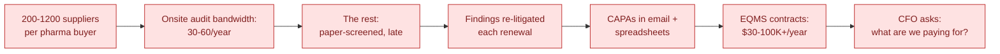
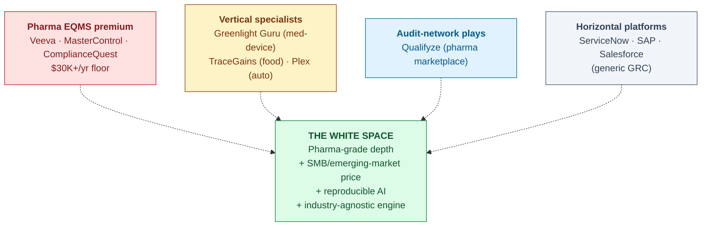
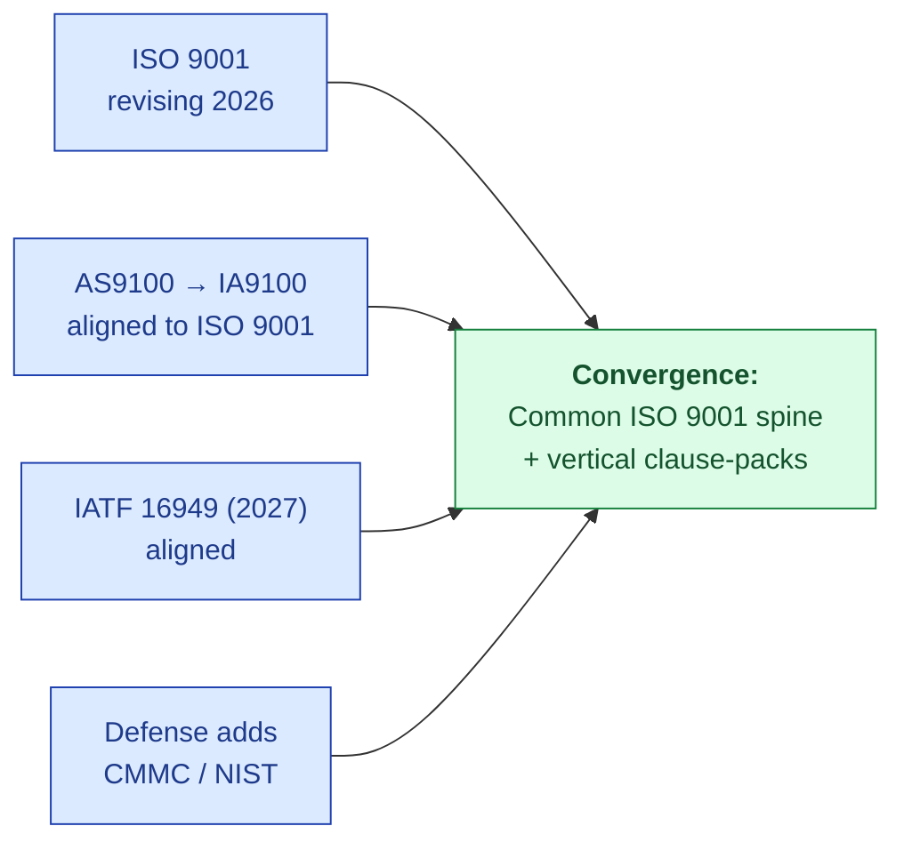
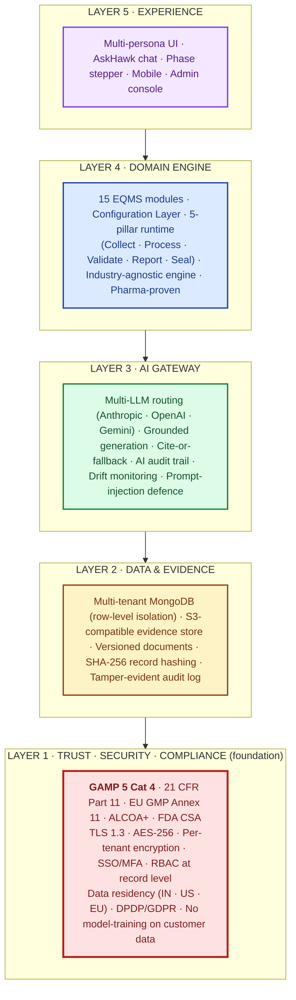
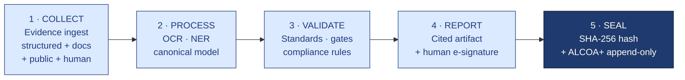

# Vision & Positioning

| Field | Value |
|---|---|
| Owner | Founders |
| Status | v1.1 (restructured Problem-first 2026-05-31) |
| Version | 1.1 |
| Last updated | 2026-05-31 |
| Length | ~10 min read |
| Source | Synthesized from MASTER-REFERENCE.pdf + per-sector-market-analysis.pdf + founder-memo.pdf |

---

> 💡 **What this is.** The strategic narrative — told in the right order. Problem first (why anything needs to exist), then market gaps (why nothing has solved it), then white space (where we live), then mission + vision (what we're going to do), then product architecture (how). Everything in `01-strategy/` and `02-fundraising/` cross-references back here.

---

## 1. The Problem (start here, always)

### 1a. What it looks like on the ground

Asha Sharma is QA Head at a mid-size CDMO in Pune. She hosts **30+ audits a year**. Each audit eats 4-12 days of her team's time. The same documents get rebound in 23 different formats for 23 different buyers. CAPAs that emerge from those audits run in email, get re-litigated at renewal, and recur because effectiveness is checked "eventually."

Her annual quality-operations cost: **~₹95L (~$115K)** — most of it spent on audit prep, response, and CAPA tracking. Not on improving the product.

She is not unusual. Every Tier-2 mid-pharma and every Tier-3 CDMO in India looks like this. Every one of the ~3,000 WHO-GMP-certified facilities is bleeding budget on the same workflow.

### 1b. Why it's broken

Three structural reasons it stays broken:

1. **Capacity gap** — bandwidth (60 audits) doesn't match supplier base (1,000 suppliers). The math doesn't work.
2. **Format chaos** — each buyer brings their own PAQ format. Same evidence, 23 representations.
3. **Workflow fragmentation** — audit, deviation, CAPA, change control, document control live in different tools. Cross-module trace requires manual reconstruction every time a regulator asks.

> 🚫 **The honest framing.** This isn't a tooling problem fixable by better forms. It's a workflow problem that needs a different architecture.

---

## 2. The Market Gaps (why nothing has solved it)

### 2a. The four incumbent types and what each cedes

| Incumbent | What they own | What they cede |
|---|---|---|
| Pharma EQMS premium (Veeva, MasterControl, CQ) | Tier-1 pharma; deep validation; enterprise refs | Anything under $30K/yr ACV; reproducible AI; cross-vertical |
| Vertical specialists (Greenlight Guru, TraceGains) | Industry-specific artifacts (FAI, FSSC, PPAP) | Cross-industry primitive; supplier-audit workflow |
| Audit-network (Qualifyze) | Pharma supplier-audit network | Internal EQMS workflow; reproducible AI |
| Horizontal platforms (ServiceNow et al.) | Distribution; ecosystem | Regulated-domain depth; GxP credibility; grounded AI |

### 2b. The 6 white spaces

1. **SMB / emerging-market pharma** — Veeva's $30K floor leaves ~900-1,400 reachable Tier-2/3 accounts in India alone untouched
2. **Reproducible AI** — every incumbent retrofitting LLMs into legacy stacks; none ship cited + confidence-scored + audit-trailed AI
3. **Supplier audit as a workflow (not a network)** — Qualifyze owns the network; nobody owns the internal supplier-quality workflow at affordable pricing
4. **Cross-industry compliance primitive** — ServiceNow could build it but won't (no domain depth); Veeva could build it but won't (vertical depth IS their moat)
5. **Inspector-readiness as a product feature** — cross-module audit trail in <2 sec for any regulator question
6. **AI that compounds with usage** — active-learning loop from user disposition on every AI draft

### 2c. The horizontal-platform trap (and why we're not falling into it)

> 🚫 **"Horizontal platform" is the most dangerous phrase in enterprise software.** The graveyard is full of horizontal compliance platforms that lost to focused vertical specialists in every single vertical. Regulated buyers want depth, references, and validation specific to their industry. "We do everything" reads as "best at nothing."

The only horizontal strategy that works is **sequenced verticalization** — win one vertical deeply enough to earn references and a validated core, then expand to the adjacent vertical that reuses the most architecture. Never "horizontal from day one."

This is our discipline. Pharma is the beachhead. Food is the first ring-1 hop. Med-device QMSR (2026) is a natural follow. Auto + aero are post-Series-A horizons when ISO 9001 convergence makes them cheap to enter.

---

## 3. Mission and Vision

### 3a. Mission

> 💡 **Make regulated-industry compliance reproducible, defensible, and affordable — so quality teams spend their day improving products, not chasing paper.**

### 3b. Vision

> 💡 **A single industry-agnostic compliance engine that powers every regulated supply chain — pharma today, food + med-device tomorrow, every standards-governed industry in time — earned one vertical at a time.**

### 3c. The macro tailwind we're rowing with

Standards bodies are **deliberately harmonizing** quality, risk, and cybersecurity expectations onto a common ISO 9001 spine with vertical clause-packs on top. That is precisely the engine-plus-config architecture Hawkeye already has. **We're rowing with this current, not against it.**

### 3d. The reframe that makes the strategy coherent

Hawkeye is:
- **Not a pharma tool** (though pharma is our beachhead)
- **Not a horizontal platform** (the trap we name)
- **Not Veeva-cheaper** (different game; Veeva owns vertical depth and we don't fight there)

Hawkeye is the **regulated-supply-chain compliance engine** whose architecture is industry-agnostic, deployed beachhead-first and expanded ring by ring.

Competition redefined: not Veeva (different game), but (1) the vertical incumbent in each new market we enter, and (2) the horizontal platforms that could claim the cross-industry primitive but lack regulated-domain depth + reproducible AI.

---

## 4. How We Do It (the Architecture in Brief)

### 4a. The Hawkeye 5-Layer Architecture

Hawkeye is built as **five layers**, with **Trust · Security · Compliance as the foundation** (Layer 1) on which every higher layer depends. This ordering is deliberate: in a regulated industry, trust is not a feature — it is the substrate.

| Layer | What it provides | Why it's there |
|---|---|---|
| **5 — Experience** | What users see and touch | Persona-tailored UI · AskHawk · mobile audit companion |
| **4 — Domain Engine** | 15 EQMS modules + configuration layer + the 5-pillar runtime every module follows | Industry-agnostic engine; pharma-proven; vertical packs (food, medtech, ISO 9001) slot in by configuration, not code |
| **3 — AI Gateway** | Multi-LLM routing · grounded generation · cite-or-fallback · AI audit trail | Intelligence that is governed, traceable, regulator-defensible |
| **2 — Data & Evidence** | Multi-tenant database · immutable audit log · tamper-evident records | System of record where every state change is captured forever |
| **1 — Trust · Security · Compliance** | GAMP Cat 4 · Part 11 · Annex 11 · ALCOA+ · data residency · encryption · zero AI training on customer data | Foundation everything stands on — not bolt-on, designed-in |

### 4b. The 5-pillar runtime (lives inside Layer 4)

Every module — Audit, CAPA, Document Control, Supplier Quality, all 15 — walks the same five-step motion when handling a record:

| Pillar | What it does | Code evidence |
|---|---|---|
| **1 Collect** | Ingest structured + unstructured + public-data + human input | `crawlers/` · `parsers/` · `pdf_extract/` · `publicIntel/connectors` · `docIntelService.js` |
| **2 Process** | Canonicalize to common model; resolve entities; store + index | `normalize/` · `entity_resolution/` · 170 Mongoose models · vector services |
| **3 Validate** | Load standard's controls → compare data → verdicts + risk weighting | `compliance/standardRegistryService.js` · `complianceEvaluationService.js` · `risk/scoring` |
| **4 Report** | Assemble cited compliance artifact → human e-sign | `reportDataService.js` · `auditReportAgent.js` · `electronicSignatureModel` |
| **5 Seal** | Per-record SHA-256 + append-only ALCOA+ trail + AI decision record | `auditTrailService.js` (Part-11 / Annex-11 writer) · `buildSnapshotHash = SHA-256` |

### 4c. The five sharpened value propositions

| # | Value | Quantified outcome | Validated by |
|---|---|---|---|
| 1 | **40% audit-prep cost reduction** | Payback < 4 months · ~₹38L savings on ₹95L baseline | Hawkeye PoC measurement on real audits |
| 2 | **GAMP 5 Category 4 configured product** | ~60% less validation effort vs Cat 5 bespoke | ISPE *GAMP 5 Guide, 2nd Edition* (Jul 2022) · industry consultant consensus |
| 3 | **Part 11 + Annex 11 + ALCOA+ by design** | 100% e-signature attribute coverage · all 9 ALCOA+ attributes designed-in · tamper-evident audit trail | 21 CFR §11.10 · §11.50 · §11.200 · EU GMP Annex 11 (2011 + 2025 draft) · MHRA 2018 · WHO TRS 1033 (2021) |
| 4 | **Trust-First Layer 1 architecture** | Per-tenant isolation · zero model-training on customer data · DPDP/GDPR · IN/US/EU residency | India DPDP Act 2023 (deadline 13 May 2027) · IBM 2025 healthcare avg breach $7.42M |
| 5 | **Cite-or-fallback grounded AI** | 100% of AI claims trace to source · zero hallucinated citations | FDA GMLP 10 Principles (Oct 2021) · EMA AI Reflection Paper (Sept 2024) |

### 4d. Two architectural guarantees that cannot be configured away

| Guarantee | What it means |
|---|---|
| **Grounded-or-fallback** | Every AI output cites a source, or returns "insufficient evidence." Never asserts what it cannot cite. |
| **Human always commits the record** | AI drafts; AI suggests; AI scores. AI never commits a record. A human always reviews and e-signs. |

### 4e. Two honesty callouts the code forces

> ⚠️ **Pillar 5 is tamper-evident, NOT blockchain.** Per-record SHA-256 + append-only ALCOA+ trail. No chained ledger, no proof-of-work, no distributed consensus. "Immutable record" in the honest sense means tamper-evident + append-only.

> ⚠️ **Pharma is the only fully-shipped vertical pack today.** The engine is industry-agnostic by construction (`industryProfile` defaults to `PHARMA_GMP`), but the shipped standards library is pharma (ICH Q7 + 21 CFR). Food / cosmetics / med-device are configuration slots awaiting their packs.

### 4f. Architectural depth (one click away)

| For | Read |
|---|---|
| Board / Investor | [PLATFORM-EXECUTIVE.md](../../04-engineering/00-overview/PLATFORM-EXECUTIVE.md) |
| CTO / Engineer | [PLATFORM-OVERVIEW.md](../../04-engineering/00-overview/PLATFORM-OVERVIEW.md) |
| Compliance | [PLATFORM-CONTROLS.md](../../08-compliance-regulatory/platform-controls/PLATFORM-CONTROLS.md) · [PART-11.md](../../08-compliance-regulatory/frameworks/PART-11.md) |

---

## 5. Positioning Statement (the one-paragraph version)

> ℹ️ **For** regulated-supply-chain quality teams who today juggle siloed EQMS tools, email-based CAPAs, and audit-prep chaos, **Hawkeye is** an AI-native, industry-agnostic compliance engine **that** reduces audit-prep time by 50-60% and turns every regulator-facing artifact into a cited, e-signed, reproducible record. **Unlike** Veeva (premium pharma-only at $30K+/yr floor) or generic GRC tools (no domain depth), Hawkeye is built around the GxP "batch, audit, recall, validated record" motion and prices to win SMB pharma and the cross-industry buyer.

---

## 6. The Proof (what's built; what's not)

### 6a. Shipped (May 2026)

- **15 EQMS modules live**: audit, CAPA, deviation, change control, doc control, batch records, complaint, risk, training, equipment, MRM, design control, supplier prequal
- **AskHawk cross-cutting AI**: regulations Q&A (11 standards × 32 clauses), SOPs (6 templates), workflow playbooks (38 persona-aware), App Wizard (8 tools)
- **Part 11 / Annex 11–grade compliance spine**: immutable audit trail, e-signature ceremony, RBAC + tenant isolation, AI decision audit trail
- **Native AI architecture**: multi-LLM gateway (Claude + GPT-4 + Gemini), grounded generation, skeleton fallback for low-confidence outputs

### 6b. Not yet (the honest part)

> ⚠️ **Pre-customer today.** 2 design-partner LOIs (Sanpras + Novex) in discovery; first paid customer pending. No SOC 2 Type 1 yet (target M12). Hawkeye-tuned Llama-3 in production planned M12. Remote-audit cockpit UI deferred. 7 URS open questions per module documented. Marketplace v2 is plan-stage. None of this is hidden — see [PRODUCT-OVERVIEW.md §3](../../03-product/00-overview/PRODUCT-OVERVIEW.md) and per-module URS.

---

## 7. What Has To Be True (for the strategy to work)

| Must be true | Why we believe it | Kills it if |
|---|---|---|
| SMB pharma wedge is reachable | 900-1,400 Tier-2/3 accounts in India alone, Veeva can't touch | India outreach fails to convert at 30%+ PoC rate |
| Five-pillar engine truly is industry-agnostic | ISO 9001:2026 convergence; engine-plus-config architecture | Food vertical needs >30% custom code |
| AI is reproducible, not magic | Citations + confidence floor + skeleton fallback shipped | Customer feedback says AI quality generic |
| Supplier-audit wedge travels | Present in every regulated industry | Food/auto/aero supplier audits prove too different |

---

## 8. The Honesty Discipline

Every doc in `Doc_V2/` follows this rule: **call out what's not yet validated**. Examples:
- This doc has §6b "Not yet"
- [STORYBOOK.md (audit)](../../06-modules/audit-management/STORYBOOK.md) has Beat 6c "Pre-customer status"
- [BUSINESS-PLAN.md §1](../../02-fundraising/business-plan/BUSINESS-PLAN.md) explicitly notes the $3M → $1.5M revision
- AskHawk docs carry DOCS-DRIFT banners where content predates code

Investors who want polished-pretend should skip us. Investors who want truth-with-conviction should keep reading.

---

## See Also

- [HAWKEYE-STORY.md](../../HAWKEYE-STORY.md) — the master narrative (this doc is one section of it)
- [MARKET-ANALYSIS.md](../market-analysis/MARKET-ANALYSIS.md) — per-sector + TAM math
- [GTM-PLAN.md](../gtm-strategy/GTM-PLAN.md) — how we win each ring
- [PRICING.md](../pricing-and-packaging/PRICING.md) — value-share math
- [STORYBOOK.md (audit module)](../../06-modules/audit-management/STORYBOOK.md) — wedge product walkthrough
- [PLATFORM-EXECUTIVE.md](../../04-engineering/00-overview/PLATFORM-EXECUTIVE.md) — 1-page architecture

---

*Doc_V2 · Strategy · Vision & Positioning · v1.1*
