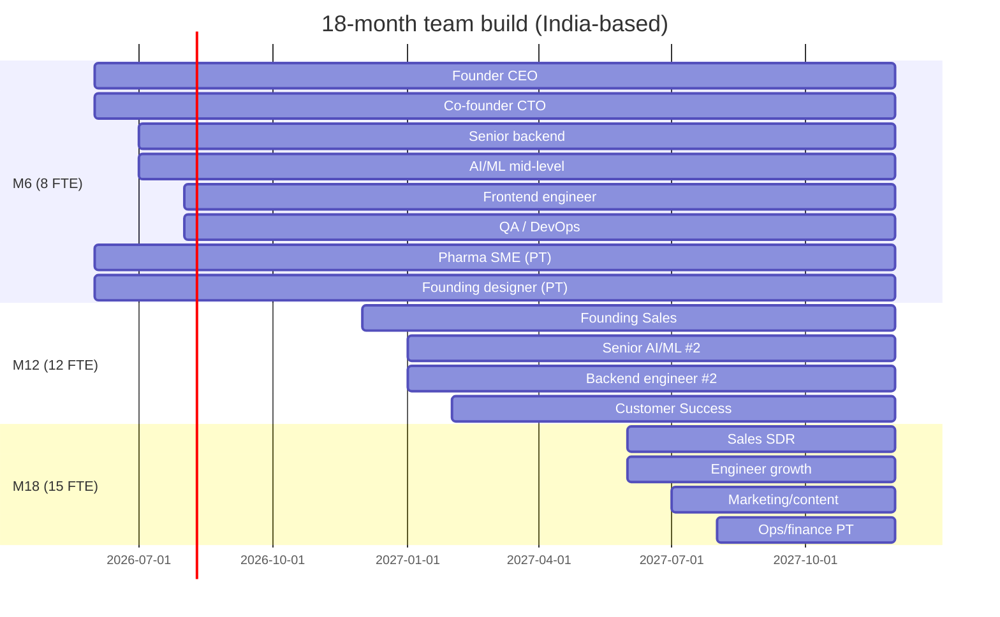
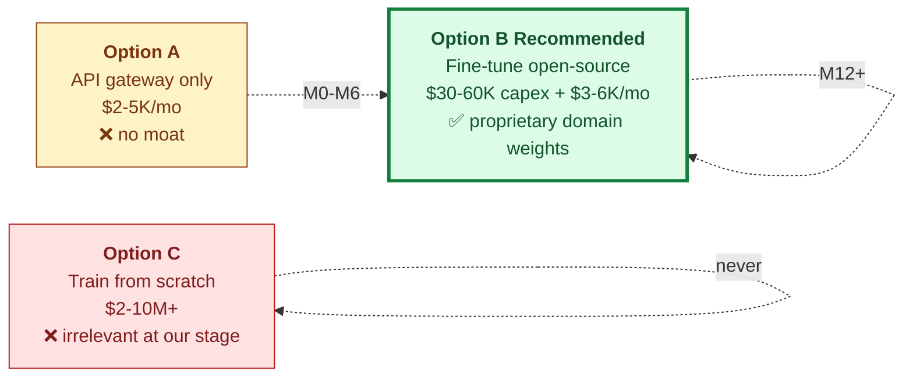
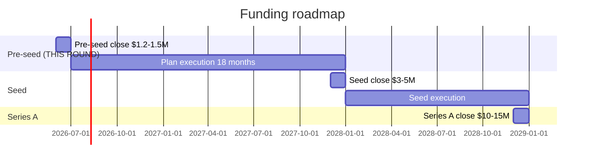
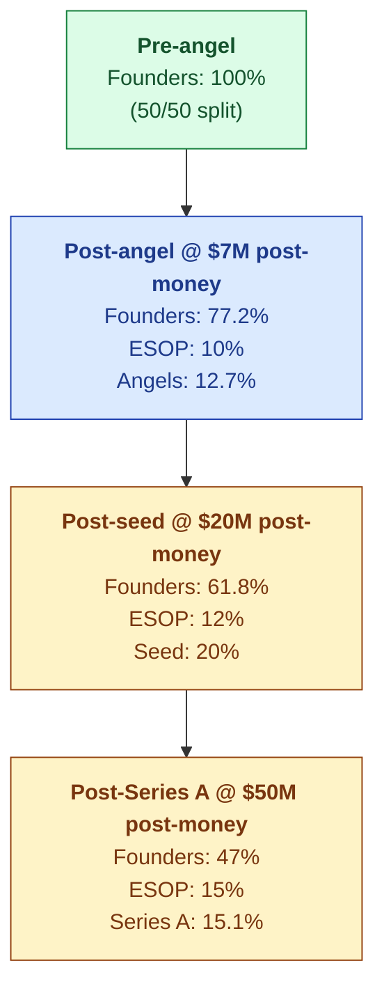

# Business Plan

| Field | Value |
|---|---|
| Owner | Founders |
| Status | v1.0 DRAFT (April 2026) |
| Source | Synthesized from BUSINESS-AND-FUNDING-PLAN.pdf |
| Last updated | 2026-05-31 |
| Pairs with | [FINANCIAL-MODEL.md](../financial-model/FINANCIAL-MODEL.md), [DATA-ROOM.md](../data-room/DATA-ROOM.md), [PITCH-DECK.md](../pitch-deck/PITCH-DECK.md) |

---

## 1. What changes from the pitch deck

> 🚫 **The pitch deck says $3M. The plan says $1.2-1.5M.** Bottom-up derivation from this plan produces a smaller, more defensible number. With India-based team the same 18 months costs ~$1.0-1.2M base + $0.3-0.5M for the AI stretch. Raising $3M would mean either over-hiring beyond the natural ARR curve OR sitting on $1.5M+ of unused cash — both weaken the Series A story. **The deck has been revised in spirit; this number is authoritative.**

## 2. Contents

| Part | Topic | Answers |
|---|---|---|
| 1 · Market study & TAM | Bottom-up TAM/SAM/SOM for pharma India + ring-1 sectors | "How big is the realistic addressable market we can win, sector by sector?" |
| 2 · Team build plan | Org chart at M6/M12/M18; India salary bands; monthly burn | "What does the team look like and what does it cost?" |
| 3 · Native AI strategy | API gateway vs fine-tune open-source vs train-from-scratch; the build-vs-buy decision | "What does 'native AI' actually mean at our stage and what does it cost?" |
| 4 · ROI-based pricing | Customer savings; pricing as % of value; per-customer ROI | "How do we price it so value-share is the story but contract is clean?" |
| 5 · Financial model | 36-month burn, hiring, ARR, gross margin, cash | "Does this work? When do we break even or need more cash?" |
| 6 · Funding plan | Derivation of angel ask from plan; round-by-round to Series A | "Why this amount, this round, what comes next?" |
| 7 · Cap table & dilution | Pre-money, post-money, ESOP, founder retention at each round | "What do we own at the end of Series A?" |
| 8 · Risks & sensitivities | What breaks the plan, by how much; fallbacks | "What's the downside case and how do we handle it?" |

## 3. Market — bottom-up TAM

### Pharma India

| Segment | Count | Notes |
|---|---|---|
| Tier 1 — Large pharma | ~50 | Not our target (use Veeva/MasterControl) |
| Tier 2 — Mid-size formulations + APIs | ~400–500 | **Sweet spot** — ₹500–5,000Cr revenue |
| Tier 3 — CDMOs | ~800–1,000 | **Highest pain** — 30+ audits/yr |
| Tier 4 — SME formulators, nutra | ~2,000+ | Long-tail, price-sensitive |
| WHO-GMP certified (subset of above) | ~3,000 | Most willing to pay |

**Realistic 36-mo SOM:** 150-240 customers × $9.5K blended ACV = **$1.4-2.3M ARR**. 5-year addressable ceiling **$8-12M ARR from pharma India alone**.

### Ring 1 hops (additive)

| Sector | India count | Target ACV | 3-yr SOM |
|---|---|---|---|
| Food & Beverage (FSSAI export-quality) | ~1,500 | $5-10K | 40-80 accounts |
| Cosmetics (ISO 22716) | ~400 | $4-8K | 20-40 |
| Med devices (ISO 13485) | ~700 | $8-15K | 25-50 |
| Blood/tissue/cell & gene | ~150 | $10-20K | 10-20 |

## 4. Team build

| Stage | FTE | Monthly cost (USD) | Annual run-rate |
|---|---|---|---|
| **M6** (foundation build) | 8 | ~$26K | ~₹2.2Cr |
| **M12** (post-PoC) | 12 | ~$42K | ~₹3.5Cr |
| **M18** (post-Series A trigger) | 15 | ~$50K | ~₹4.25Cr |

**Founder draw:** ₹40L each — ~30-40% below market for seniority. Standard pre-seed; extends runway.

## 5. Native AI strategy — the build-vs-buy decision

> 💡 **The honest framing.** "Build native LLMs" is one of the most dangerous phrases in a pre-seed pitch. Three options, only one is the right answer for our stage.

**Recommended path — Option B sequenced:**
- M0-M6: Stay on API gateway (Anthropic/OpenAI/Gemini) — cheap, fast, no infra distraction
- M6-M12: Collect fine-tune data from PoCs (with consent — this is the moat). Hire senior AI/ML M9.
- M12-M18: Ship first "S.M.A.R.T. Hawk-tuned" Llama-3/Mistral model for low-stakes tasks (intake classification, similarity search). Continue API for high-stakes (cited reports). **Hybrid architecture wins on cost AND defensibility.**
- M18+: Series A pays for the bigger fine-tune, on-prem proof-points, and ML platform team.

**18-month AI line:** $115K total ($45K API + $25K compute + $30K self-host + $15K data).

## 6. Pricing — ROI-based subscription

Cross-reference [PRICING.md](../../01-strategy/pricing-and-packaging/PRICING.md).

Representative Tier 3 CDMO baseline: **3 sites, 5 QA staff, 30 audits/yr** → **₹95L (~$115K) annual quality cost**. S.M.A.R.T. Hawk reduces by 40% blended = **₹38L (~$46K) savings**. S.M.A.R.T. Hawk charges **₹9L (~$10.8K)** = 24% of savings. **Payback < 4 months.**

| Segment | Customer savings/yr | S.M.A.R.T. Hawk ACV | Payback |
|---|---|---|---|
| Tier 2 mid-pharma (3 sites) | ~₹40-60L | ₹10-15L ($12-18K) | 3-4 mo |
| Tier 3 CDMO (2-3 sites) | ~₹30-45L | ₹8-12L ($10-14K) | 3-4 mo |
| Tier 4 SME (1 site) | ~₹10-15L | ₹3-6L ($4-7K) | 4-6 mo |

## 7. Financial model — 36 months

| Metric | M6 | M12 | M18 | M24 | M30 | M36 |
|---|---|---|---|---|---|---|
| Headcount (FTE) | 8 | 12 | 15 | 20 | 26 | 34 |
| Monthly burn ($K) | 26 | 42 | 50 | 72 | 95 | 125 |
| Paying customers (cum.) | 0-2 | 8-12 | 25-35 | 55-75 | 95-125 | 150-200 |
| Avg ACV ($) | — | 7,500 | 8,500 | 9,500 | 10,000 | 10,500 |
| **ARR ($K)** | 0 | 75 | **255** | 620 | 1,100 | **1,825** |
| Gross margin % (blended) | — | ~50% | ~55% | ~60% | ~62% | ~65% |
| Cumulative cash burn ($K) | 150 | 360 | 620 | 940 | 1,235 | ~1,400 |

> ✅ **At M18, ARR run-rate is ~$255K** with strong customer-count growth — that's when an angel-funded SaaS earns its Series A. By M24: ~$620K ARR, gross margin in the 70s. By M36: approaching cash-flow break-even on its own. **This is the conservative case.**

## 8. Funding rounds

| Round | Target close | Size | Use of funds | Milestones at close |
|---|---|---|---|---|
| **Angel / pre-seed (this round)** | Q2 2026 | $1.2–1.5M | Team build, product hardening, first 25-35 customers, S.M.A.R.T. Hawk-tuned AI in production | 0 customers today |
| **Seed** | M18 (Q4 2027) | $3–5M | Scale GTM, ship Food & Beverage pack, first non-pharma customers, SOC 2 | $250-400K ARR run-rate, 25-35 customers, 1 reference deployment |
| **Series A** | M30-36 | $10–15M | US/EU expansion, second vertical at scale, enterprise tier, network play | $1.0-1.5M ARR run-rate, 100-150 customers, multi-vertical proof, 110%+ NDR |

## 9. Cap table — founder retention through Series A

| Round | Founders combined | ESOP | New investors | Notes |
|---|---|---|---|---|
| Pre-angel | 100% | — | — | Clean cap table, no prior funding |
| Post-angel ($1.5M @ $7M post) | 77.2% | 10% | 12.7% | Healthy founder retention |
| Post-seed ($4M @ $20M post) | 61.8% | 12% | 20% | Still solid control |
| Post-Series A ($12M @ $50M post) | 47% | 15% | 15.1% | Right at the line; preserve via lean rounds |

> 💡 **The single number to anchor on.** If everything goes to plan, founders together hold ~47% post-Series A. Each founder ~23.5%. That is **healthy and normal** for two-founder Indian/global SaaS — many founders end Series A at 15-20% each. Discipline: don't raise more than you need at each round (which is why $1.5M, not $3M, at angel). Every extra $500K at this stage costs ~3-4% in dilution that compounds.

## 10. Risks & sensitivities

| Risk | Likelihood | Impact | Mitigation |
|---|---|---|---|
| PoC→paid conversion < 30% | Medium | High | Tighten qualification; written success criteria; shorter PoCs |
| Founding sales hire underperforms | Med-high | High | Founder-led selling for first 10 customers; hire only after PMF signal |
| Top engineer not hireable at planned salary | Medium | Medium | Higher ESOP % for first 3 senior hires (above 10% pool) |
| AI gateway costs spike if usage scales fast | Low-medium | Medium | Accelerate fine-tune timeline; route low-stakes to self-hosted earlier |
| Competitor launches India-specific tier (Veeva SMB) | Low | Med-high | Lock 10+ references before they react; differentiate on AI + supplier coupling |
| Regulatory shifts (data localization) | Low | Variable | On-prem deployment already on roadmap |

### Sensitivity — ARR at M18

| Scenario | Customers | Blended ACV | M18 ARR |
|---|---|---|---|
| Pessimistic | 18 | $6.5K | ~$120K |
| **Base (plan)** | **30** | **$8.5K** | **~$255K** |
| Optimistic | 45 | $11K | ~$495K |

> ⚠️ **Even in pessimistic case, M18 ARR ~$120-150K is enough for a smaller seed round at lower valuation.** Plan does not require optimistic execution.

## 11. What gets cut if revenue is slower

| Trigger | Action | Savings |
|---|---|---|
| M12 ARR < $50K | Pause sales hire; founders sell | ~$30K/mo = ~4 months runway extension |
| PoC→paid conversion <30% | Pause second AI engineer hire (M12 → M18); slow AI roadmap 6 months | ~$5K/mo |
| Cash < 6 months runway, no Series A in sight | Bridge round from existing investors at flat valuation; cut 20% of team | Survival mode |

## 12. What an angel needs to believe

1. The **wedge is real** — 200-300 reachable India pharma accounts at ~$9.5K ACV is enough for a Series A story
2. The **team can execute** the plan within the burn
3. The **native AI path** produces a real moat by M18, not just an API wrapper
4. **Founders' equity stake** post-Series A keeps them motivated (~23.5% each)
5. The **honesty discipline is real** — founders won't pretend partial things are proven

---

## See also

- [PITCH-DECK.md](../pitch-deck/PITCH-DECK.md) — slide-by-slide
- [FINANCIAL-MODEL.md](../financial-model/FINANCIAL-MODEL.md) — line items + cap table
- [DATA-ROOM.md](../data-room/DATA-ROOM.md) — diligence checklist
- [PRICING.md](../../01-strategy/pricing-and-packaging/PRICING.md) — ACV math
- [MARKET-ANALYSIS.md](../../01-strategy/market-analysis/MARKET-ANALYSIS.md) — TAM/SAM/SOM
- `00-strategy-and-pitch/BUSINESS-AND-FUNDING-PLAN.pdf` (legacy) — full source PDF
