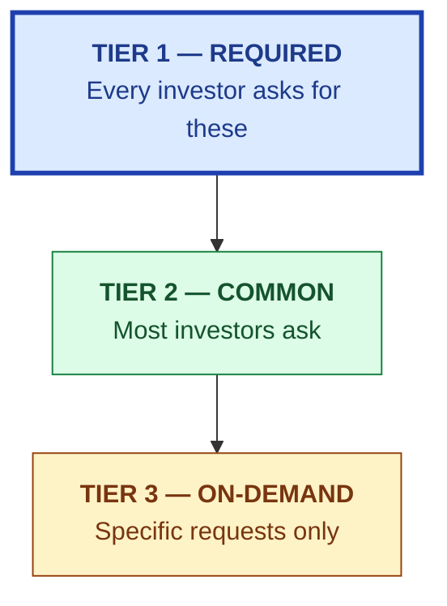
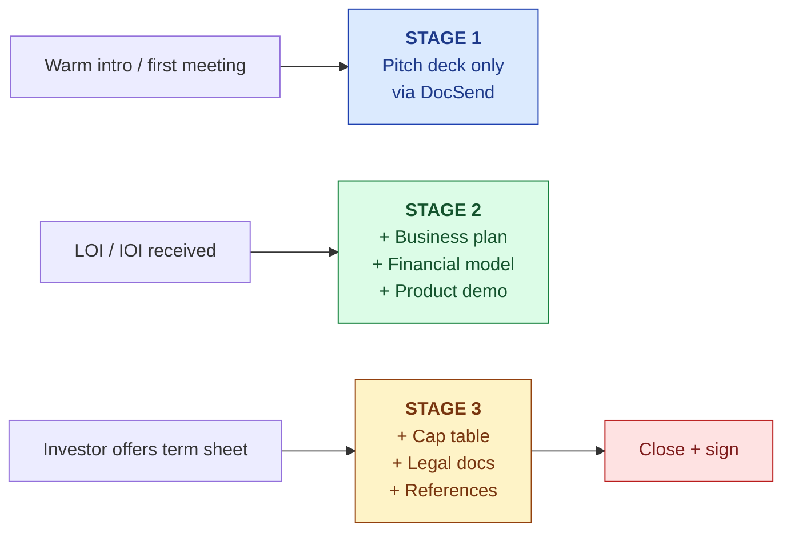

# Data Room — Diligence Index

| Field | Value |
|---|---|
| Owner | Founders + Legal |
| Status | DRAFT (pre-seed-ready) |
| Last updated | 2026-05-31 |
| Pairs with | [PITCH-DECK.md](../pitch-deck/PITCH-DECK.md), [BUSINESS-PLAN.md](../business-plan/BUSINESS-PLAN.md), [FINANCIAL-MODEL.md](../financial-model/FINANCIAL-MODEL.md) |
| Hosting | TBD (recommend Google Drive folder w/ tracked sharing OR DocSend / Dropbox) |

---

## 1. What a pre-seed data room looks like

Investors at pre-seed don't expect a 200-document data room. They expect a **tight, curated set** that answers their key diligence questions in ~30 minutes of reading. The principle: include what they will definitely ask; omit what's noise.



## 2. Folder structure

```
data-room/
├── 01-pitch/
│   ├── PITCH-DECK.pdf
│   └── founder-memo.pdf
│
├── 02-business-plan/
│   ├── BUSINESS-PLAN.pdf
│   ├── MARKET-ANALYSIS.pdf
│   └── PRICING.pdf
│
├── 03-financials/
│   ├── FINANCIAL-MODEL.pdf (this doc as PDF)
│   ├── financial-model.xlsx (the live model)
│   ├── cap-table-current.xlsx
│   └── cap-table-projected.xlsx
│
├── 04-product/
│   ├── architecture-overview.pdf (pillars-architecture-VERIFIED)
│   ├── product-demo-video.mp4 (60-sec product loop)
│   └── live-demo-environment-credentials.txt (read-only test tenant)
│
├── 05-team/
│   ├── founders-bios.pdf
│   ├── advisors-list.pdf
│   ├── hiring-plan-18-months.pdf
│   └── (optional) employment-agreements-summary.pdf
│
├── 06-legal/
│   ├── incorporation-certificate.pdf
│   ├── articles-of-incorporation.pdf
│   ├── ip-assignment-summary.pdf
│   ├── customer-MSA-template.pdf
│   └── privacy-policy-and-tos.pdf
│
├── 07-compliance/
│   ├── architecture-compliance-trace.pdf (21 CFR Part 11 + EU GMP Annex 11 mapping)
│   ├── data-protection-summary.pdf
│   └── (post-SOC-2) soc2-type-1-report.pdf
│
├── 08-traction/
│   ├── customer-LOIs.pdf (named LOI from prospects, with consent)
│   ├── design-partner-agreements.pdf
│   └── usage-metrics.pdf (if applicable)
│
└── 09-references/
    ├── customer-reference-list.pdf (contact info on request only)
    └── advisor-reference-list.pdf
```

## 3. Tier 1 — required documents (every investor asks)

| # | Doc | Source | Status |
|---|---|---|---|
| 1 | **Pitch deck** | [PITCH-DECK.md](../pitch-deck/PITCH-DECK.md) rendered as PDF | Needs $1.5M ask refresh |
| 2 | **Business plan / executive summary** | [BUSINESS-PLAN.md](../business-plan/BUSINESS-PLAN.md) rendered as PDF | ✅ Ready |
| 3 | **Financial model** (3-yr P&L, monthly first 18mo) | [FINANCIAL-MODEL.md](../financial-model/FINANCIAL-MODEL.md) + spreadsheet | ⏳ Spreadsheet TBD |
| 4 | **Current cap table** | xlsx | ⏳ TBD |
| 5 | **Projected cap table** (post-angel, post-seed, post-A) | xlsx | ⏳ TBD |
| 6 | **Founders' bios + LinkedIn** | PDF | ⏳ TBD |
| 7 | **Incorporation certificate + jurisdiction** | PDF from registrar | ⏳ TBD |
| 8 | **Articles of incorporation / MOA** | PDF | ⏳ TBD |
| 9 | **IP assignment summary** (founders → company; employee IP assignments) | PDF | ⏳ TBD |
| 10 | **Product demo** (60-sec video OR live demo environment access) | mp4 + credentials | ⏳ TBD |

## 4. Tier 2 — common requests (most investors ask)

| # | Doc | Why asked | Status |
|---|---|---|---|
| 11 | Market analysis | TAM/SAM/SOM bottom-up math | ✅ [MARKET-ANALYSIS.md](../../01-strategy/market-analysis/MARKET-ANALYSIS.md) |
| 12 | Competitive landscape | Quadrant + per-competitor analysis | ✅ in Market Analysis |
| 13 | Pricing model | ROI math + tier structure | ✅ [PRICING.md](../../01-strategy/pricing-and-packaging/PRICING.md) |
| 14 | GTM plan | Sales motion + ICP + channels | ✅ [GTM-PLAN.md](../../01-strategy/gtm-strategy/GTM-PLAN.md) |
| 15 | Product roadmap | Next 12-18 months features | ⏳ [ROADMAP.md](../../03-product/04-roadmap/ROADMAP.md) — to create |
| 16 | Architecture overview | Engineering credibility | ✅ [PLATFORM-OVERVIEW.md](../../04-engineering/00-overview/PLATFORM-OVERVIEW.md) — to create |
| 17 | Team hiring plan (18-month) | Use of funds detail | ✅ in Business Plan |
| 18 | Customer LOIs / design partners | Real demand signal | ⏳ TBD — gather as available |
| 19 | Customer reference list | DD reference calls | ⏳ TBD — first customers needed |
| 20 | Privacy policy + Terms of Service | Legal/regulatory risk | ⏳ TBD — draft for SaaS launch |

## 5. Tier 3 — on-demand (specific investor requests)

| # | Doc | Trigger | Status |
|---|---|---|---|
| 21 | SOC 2 Type 1 report | Enterprise-leaning investor | Not yet certified (target M12) |
| 22 | HIPAA / GDPR / India DPDPA compliance assessment | Healthcare investor | Self-assessment ready; formal audit TBD |
| 23 | 21 CFR Part 11 / EU GMP Annex 11 compliance matrix | Pharma-domain investor | ✅ [PART-11.md](../../08-compliance-regulatory/frameworks/PART-11.md) — to create |
| 24 | Employee equity plan summary | Series A+ | ⏳ Standard ESOP terms; doc TBD |
| 25 | Customer contracts (sample MSA) | Enterprise investor | ⏳ Template TBD |
| 26 | Detailed financial model with scenario planner | Quant investor | ⏳ Spreadsheet TBD |
| 27 | Detailed technical architecture deep-dive | Technical investor / CTO | ✅ [ARCHITECTURE.md](../../06-modules/audit-management/ARCHITECTURE.md) (audit module) |
| 28 | AI defensibility / IP strategy | AI-savvy investor | ⏳ [AI-ARCHITECTURE.md](../../04-engineering/07-ai/AI-ARCHITECTURE.md) — to create |
| 29 | Annual budgets for years 2-3 | Detail-oriented investor | ⏳ Build when model spreadsheet exists |
| 30 | Notes from customer discovery interviews | Skeptical investor | ⏳ Anonymize + share if available |

## 6. What we WON'T put in the data room (yet)

> 🚫 **Do not include at pre-seed.**
> - **Detailed competitor teardowns** — risk of leaking competitive intelligence; share verbally
> - **Source code or technical IP details** — defer to NDA-protected technical session
> - **Specific customer names** without their consent — privacy + relationship risk
> - **Employee compensation details** beyond aggregates — confidentiality
> - **Legal correspondence** — let lawyers handle if it comes up
> - **Pre-final financial projections** that contradict the active plan — pick one model and stick with it
> - **Founders' personal financial info** — never required
> - **Materials for prior fundraise attempts** (if any) — irrelevant; tells a story you don't want told

## 7. Access management



| Stage | Trigger | What's shared | Mechanism |
|---|---|---|---|
| **Stage 1** | First meeting | Pitch deck (PDF) | DocSend / Notion view link with tracking |
| **Stage 2** | Verbal interest / LOI | + Business plan, financial model, demo, market/GTM/pricing | Google Drive folder, view-only, tracked |
| **Stage 3** | Term sheet / formal DD | Full data room incl. legal + references | Google Drive folder, download enabled, NDA in place |
| **Stage 4** | Post-close | Investor portal access | Ongoing updates via monthly newsletter |

### Tracking — what we track per investor

| Field | Why |
|---|---|
| First-meeting date | Sales velocity |
| Stage 2 access granted | Diligence progression signal |
| Documents viewed (which, how long) | Engagement signal — high time on financials = serious |
| Question count + topics | Concerns to address proactively |
| Days since last contact | Follow-up prioritization |
| Status (engaged / passed / quiet) | Pipeline management |

## 8. Investor communication cadence

| Stage | Cadence | Channel |
|---|---|---|
| Post first meeting (interested) | 1 follow-up within 48hr; then weekly check-ins | Email |
| Stage 2 (in diligence) | Respond within 24hr to questions; weekly proactive update | Email + occasional call |
| Stage 3 (term sheet stage) | Daily / as-needed | Email + calls |
| Post-close | Monthly investor update (template TBD) | Email; quarterly board meeting if board seat |
| Quiet investors (>30 days no contact) | One thoughtful re-engagement; then stop | Email |

## 9. Document hygiene rules

> ✅ **Rules for every document in the data room.**
>
> 1. **Last-updated date** in the top metadata of every doc
> 2. **Version number** (v1.0 / v1.1 / etc.) — not "DRAFT-FINAL-FINAL-v2"
> 3. **Single source of truth** — if BUSINESS-PLAN.md changes, the PDF in the data room is refreshed within 24hr
> 4. **No contradictions** — if PRICING.md says $9.5K blended ACV, no other doc says $12K
> 5. **Footer with file path** so investors can ask about a specific doc
> 6. **Page numbers** on PDFs (multi-page docs)
> 7. **Honesty markers** — explicitly call out what's not yet validated (don't bury caveats)
> 8. **No marketing fluff** — investors read a lot; brevity wins
> 9. **Charts > prose** where possible (TAM math, financial trajectory, cap table)
> 10. **No watermarks "Confidential — Draft"** unless legally required (looks insecure)

## 10. Post-close — investor updates

Monthly newsletter template (TBD). Suggested structure:

```
HAWKEYE INVESTOR UPDATE — [Month Year]
─────────────────────────────────────

🎯 THE ONE THING THIS MONTH
[The single most important update — 1-2 sentences]

📊 KEY METRICS
- Paying customers: X (+Y MoM)
- ARR: $Z (+W% MoM)
- Cash on hand: $A (B months runway)
- Pipeline: $C qualified

✅ WINS
- [bullet 3-5]

⚠️ CHALLENGES
- [bullet 2-3]
- [honest about what's hard]

🙏 ASKS
- [specific intros / advice requested]

🗓 LOOKING AHEAD
- [3-5 milestones for next month]
```

> 💡 **The investor-update discipline matters most when things are hard.** Investors who get honest monthly updates (especially in tough months) become long-term allies. Investors who get silence in tough months follow on with a pass.

## 11. Common diligence questions to be prepared for

| Question | Answer source |
|---|---|
| "What's your moat?" | [VISION.md §7](../../01-strategy/vision-and-positioning/VISION.md#7-the-horizontal-trap--what-we-are-not) + AI grounded gen + reproducibility |
| "Who are your competitors?" | [MARKET-ANALYSIS.md §11-12](../../01-strategy/market-analysis/MARKET-ANALYSIS.md#11-competitive-landscape) |
| "How big is the market?" | TAM bottom-up + sector rings |
| "Why now?" | Standards convergence + native AI moment |
| "What's your unit economics?" | LTV/CAC ~8x by M24 (FINANCIAL-MODEL §6) |
| "When do you break even?" | Approaching M36 (FINANCIAL-MODEL §5) |
| "What's your moat against ServiceNow/SAP/Salesforce?" | Regulated-domain depth + reproducible AI they don't ship |
| "Why $1.5M not $3M?" | Bottom-up plan derivation (BUSINESS-PLAN §1) |
| "Who's on the team?" | Founders bios + advisory + hiring plan |
| "What could kill it?" | Risk register (BUSINESS-PLAN §10) — answer honestly |
| "Can we talk to a customer?" | Stage 3 (post-term-sheet) reference list |

---

## See also

- [PITCH-DECK.md](../pitch-deck/PITCH-DECK.md) — what's in Stage 1
- [BUSINESS-PLAN.md](../business-plan/BUSINESS-PLAN.md) — what's in Stage 2
- [FINANCIAL-MODEL.md](../financial-model/FINANCIAL-MODEL.md) — what's in Stage 2
- `Doc_V2/02-fundraising/investor-updates/` — monthly update archive (TBD)
- `Doc_V2/12-legal/` — incorporation, IP, MSA templates
