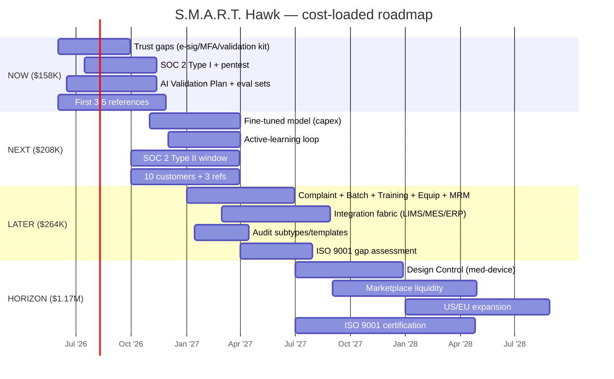

# Detailed Costing & Roadmap — Build, Validate, Certify, Operate

> A granular, **roadmap-phased cost model** for building S.M.A.R.T. Hawk to a certified, multi-module product and operating it at scale. Decomposes spend by **phase × category** (people · infrastructure · AI/LLM · compliance & certification · tooling · GTM), with unit economics, cumulative-spend vs. funding, and a cost-loaded Gantt. **Consistent with — and a drill-down of —** [FINANCIAL-MODEL.md](FINANCIAL-MODEL.md) (the source of truth for headline burn, ACV, margins, and funding rounds).

| Field | Value |
|---|---|
| Document | `HK-COST-v1.0` |
| Owner | Founders (+ CFO when hired) |
| Basis | India-cost base · FX **₹83 = $1** · fully-loaded salaries (×1.2 overhead) · conservative |
| Horizon | 36 months, mapped to roadmap phases NOW / NEXT / LATER / HORIZON |
| Reconciles to | FINANCIAL-MODEL cumulative burn: **M12 $360K · M18 $620K · M30 $1.23M · M36 ~$1.8M** |

> ⚠️ **Estimates.** Figures are planning estimates at India-cost base; one-time compliance spend sits inside the model's "Other" envelope, not on top of it. Where this doc and FINANCIAL-MODEL differ in rounding, FINANCIAL-MODEL governs the headline.

---

## 1. Cost taxonomy

| Category | What's in it | Nature |
|---|---|---|
| **People** | Eng, AI/ML, design, QA, QMS/compliance, founders, GTM hires | OpEx, ~70–78% of burn |
| **Infrastructure** | MongoDB Atlas, Vercel, S3/R2, email, monitoring, DNS | OpEx, scales with customers |
| **AI / LLM** | Inference (gateway), embeddings, fine-tune compute | OpEx + one-time fine-tune capex |
| **Compliance & certification** | SOC 2 I/II, ISO 9001, pentest, validation kit, DPA/legal, GRC tooling | Mostly one-time + annual recurring |
| **Tooling** | GitHub, CI, Sentry, design, productivity, GRC (Vanta/Drata) | OpEx subscriptions |
| **GTM** | Founder-led selling, events, content, first sales hires, CAC | OpEx, ramps post-PMF |

---

## 2. Unit-cost assumptions

### 2.1 People (fully-loaded, USD/yr; ₹83/$)
| Role | ₹/yr | $/yr (loaded ×1.2) |
|---|---|---|
| Founder draw (×2) | ₹40L | ~$58K ea |
| Principal / Sr engineer | ₹30L | ~$43K |
| Mid engineer | ₹18L | ~$26K |
| Junior engineer | ₹10L | ~$14K |
| AI/ML engineer | ₹32L | ~$46K |
| Product designer | ₹15L | ~$22K |
| QA / SDET (Subham) | ₹16L | ~$23K |
| QMS Head (fractional→FTE) | ₹24L | ~$35K *(or contract $1.5–2K/mo early)* |
| Pharma SME (advisor) | retainer | ~$2–3K/mo |
| Compliance-lifecycle owner | ₹15L | ~$22K |
| GTM/Sales lead (M9+) | ₹30L + var | ~$43K base |
| SDR / CS (M18+) | ₹12–15L | ~$17–22K |

### 2.2 Infrastructure (monthly, scaling)
| Item | Early (≤M6) | M12 | M24 | M36 |
|---|---|---|---|---|
| MongoDB Atlas (multi-region) | $120 | $350 | $900 | $1,800 |
| Vercel (FE+serverless) | $80 | $250 | $700 | $1,400 |
| S3/R2 evidence store | $40 | $200 | $700 | $1,600 |
| Email / monitoring / DNS | $60 | $200 | $450 | $900 |
| **Infra total / mo** | **~$300** | **~$1.0K** | **~$2.75K** | **~$5.7K** |

### 2.3 AI / LLM
- **Per-customer inference** (27–40% of variable COGS): ~$270 (small) · ~$1,200 (medium) · ~$3,800 (large) per year.
- **Shared platform AI** (gateway, eval, embeddings): ~$1.5K/mo (M6) → $4.5K/mo (M12) → $9K/mo (M24).
- **Fine-tune capex** (Year 2): ~$15–25K one-time (compute + data curation + eval) → **−40% inference cost** at scale (the single biggest COGS lever).

### 2.4 Compliance & certification (one-time + annual)
| Item | One-time | Annual recurring |
|---|---|---|
| GRC tooling (Vanta/Drata) | — | $10–15K |
| **SOC 2 Type I** (auditor) | $15–25K | — |
| **SOC 2 Type II** (auditor + 6-mo window) | $25–40K | $20–30K (annual re-exam) |
| **ISO 9001** (consultant + registrar Stage 1+2) | $18–35K | $5–8K (surveillance) |
| External penetration test | — | $8–15K |
| Validation Accelerator Package (IQ/OQ/PQ, VSR) | internal (≈1.5 FTE-mo) | refresh per release |
| Legal — DPA, MSA, entity, IP | $10–20K | $3–6K |

---

## 3. Headcount ramp by phase

| Role | NOW (M0–6) | NEXT (M6–12) | LATER (M12–18) | HORIZON (M18–36) |
|---|---|---|---|---|
| Founders | 2 | 2 | 2 | 2 |
| Engineers (Sr/Mid/Jr) | 3 | 5 | 7 | 10–12 |
| AI/ML engineer | 1 | 1 | 2 | 3 |
| Product designer | 1 | 1 | 1 | 2 |
| QA / SDET | 1 | 1 | 2 | 2 |
| QMS Head + compliance owner | 0.5 (contract) | 1 | 2 | 2 |
| Pharma SME (advisor) | 0.3 | 0.3 | 0.5 | 0.5 |
| GTM (lead → SDR/AE/CS) | 0 | 1 | 2 | 4–5 |
| **Approx FTE** | **~8** | **~12** | **~18** | **~26–30** |

---

## 4. Roadmap → cost mapping (the core)

Each phase lists the roadmap deliverables, the **build effort**, and the **phase spend by category**. Phase totals sit inside the FINANCIAL-MODEL cumulative envelope.

### Phase NOW — M0–6 (Q2–Q3 2026): wedge + trust gaps
**Deliverables:** first 3–5 reference customers; **hard-mode e-sig default; MFA/SSO; per-tenant validation kit; backup restore-test; SOC 2 Type I; AI Validation Plan + eval sets; audit-subtype templates groundwork.**

| Category | Spend (6 mo) | Notes |
|---|---|---|
| People | ~$115K | ~8 FTE, ramping |
| Infrastructure | ~$2K | ~$300/mo |
| AI / LLM | ~$9K | shared platform; eval sets |
| Compliance & cert | ~$22K | SOC 2 Type I + GRC tool start + pentest scoping |
| Tooling | ~$4K | GitHub/CI/Sentry/design |
| GTM | ~$6K | founder-led; first events |
| **Phase total** | **~$158K** | cumulative ≈ **$158K** |

### Phase NEXT — M6–12 (Q4 2026–Q1 2027): AI defensibility + first refs
**Deliverables:** fine-tuned model in prod (low-stakes); active-learning loop; 10 paying customers + 3 named refs; **SOC 2 Type II** start; predictive-CAPA scaffolding.

| Category | Spend (6 mo) | Notes |
|---|---|---|
| People | ~$150K | ~12 FTE |
| Infrastructure | ~$5K | ~$0.8K/mo |
| AI / LLM | ~$20K | **fine-tune capex ~$15–25K** + inference |
| Compliance & cert | ~$18K | SOC 2 Type II window + pentest |
| Tooling | ~$5K | + GRC annual |
| GTM | ~$10K | first sales hire ramp |
| **Phase total** | **~$208K** | cumulative ≈ **$366K** *(≈ model M12 $360K)* |

### Phase LATER — M12–18 (Q2–Q3 2027): EQMS breadth + integration
**Deliverables:** ship **Complaint (GA), Batch Records (EBMR), Training, Equipment/Calibration, Management Review**; **integration fabric (LIMS/MES/ERP connectors); audit subtypes/templates**; first non-pharma (Food/HACCP) ref; SOC 2 Type II issued.

| Category | Spend (6 mo) | Notes |
|---|---|---|
| People | ~$190K | ~18 FTE; biggest build phase |
| Infrastructure | ~$10K | scaling with customers |
| AI / LLM | ~$22K | inference grows; fine-tune savings begin |
| Compliance & cert | ~$22K | SOC 2 II issuance + ISO 9001 gap-assessment start |
| Tooling | ~$6K | |
| GTM | ~$14K | SDR + content |
| **Phase total** | **~$264K** | cumulative ≈ **$630K** *(≈ model M18 $620K → seed trigger)* |

### Phase HORIZON — M18–36 (2028): network + verticals (post-seed)
**Deliverables:** **Design Control (med-device pack); Marketplace liquidity; US/EU expansion; ISO 9001 certification; QMSR pack.** Burn scales to ~$125K/mo at M36.

| Category | Spend (18 mo) | Notes |
|---|---|---|
| People | ~$900K | 26–30 FTE |
| Infrastructure | ~$70K | $2.75K→$5.7K/mo |
| AI / LLM | ~$120K | scale inference, offset by fine-tune (−40%) |
| Compliance & cert | ~$70K | ISO 9001 cert + SOC 2 annual + pentest + validation refresh |
| Tooling | ~$25K | |
| GTM | ~$180K | sales team + CAC (≈$4.5K × new logos) |
| **Phase total** | **~$1.17M** | cumulative ≈ **$1.8M** *(≈ model M36)* |

---

## 5. Compliance & certification cost schedule (one-time view)

| When | Item | Cost |
|---|---|---|
| M0–6 | GRC tool onboarding + SOC 2 Type I + first pentest | ~$30–45K |
| M6–12 | SOC 2 Type II (window + audit) + fine-tune capex | ~$40–60K |
| M12–18 | ISO 9001 gap-assessment + internal audit + validation kit refresh | ~$20–35K |
| M18–30 | ISO 9001 Stage 1+2 certification + SOC 2 annual + annual pentest | ~$45–70K |
| **Total compliance/cert to M30** | | **~$135–210K** |

> 💡 These are the costs that *unlock revenue* — ISO 9001 and SOC 2 are gating for mid/large pharma supplier-qualification. Treat as **revenue-enabling**, not overhead.

---

## 6. Unit economics (cost-to-serve) — from cost-model.xlsx

| Tier | Variable cost / customer / yr | List ACV | Gross margin |
|---|---|---|---|
| Small (1 site / 5 users) | **$1,011** | ~$4–7K | **77.5%** |
| Medium (3 sites / 20 users) | **$3,840** | ~$10–14K | **64.4%** |
| Large (5 sites / 50 users) | **$11,543** | ~$18–24K+ | **47.5%** |
| **Blended (portfolio mix)** | — | **$9,500** | **~60%** |

- **AI inference = 27–40% of variable cost** → self-hosted fine-tuned models (Year 2) cut ~40% off variable cost at scale → blended GM trends toward ~70%.
- CAC **~$4,500**; gross profit/customer ~$7,410; **CAC payback ~7 months**.

---

## 7. Cumulative spend vs funding & runway

| Milestone | Cumulative build/operate spend | Cash on hand | Runway | Event |
|---|---|---|---|---|
| M0 | $0 | $1.5M | 32 mo | Angel close ($1.5M @ $7M post) |
| M6 | ~$158K | ~$1.34M | ~28 mo | First references live |
| M12 | ~$366K | ~$1.14M | 24 mo | 10 customers / SOC 2 Type II underway |
| **M18** | **~$630K** | **~$880K** | **14 mo** | **Seed trigger → +$4M @ $20M post** |
| M30 | ~$1.23M | ~$3.65M (post-seed) | 35 mo | **Series A trigger → +$12M @ $50M post** |
| M36 | ~$1.8M | scaling | 100+ mo | 150–200 customers / $1.8M ARR |

**Read:** the **$1.5M angel funds the entire NOW+NEXT+LATER build (to M18, ~$630K spent)** with ~14 months runway remaining at the seed trigger — i.e., the trust-gap closure, SOC 2, AI validation, and the EQMS-breadth build are all covered pre-seed. The seed funds HORIZON (Design Control, Marketplace, geo, ISO 9001).

---

## 8. Cost-loaded roadmap (Gantt)

---

## 9. Levers & sensitivities

| Lever | Effect |
|---|---|
| **Self-hosted fine-tuned models** (Year 2) | −40% AI variable cost → +~10pt blended GM |
| **India-cost engineering base** | ~3–4× cheaper FTE vs US; the core cost advantage |
| **Customer-led validation (Cat 4)** | validation cost is the *customer's*; our cost = the accelerator package (one-time) |
| **Mix shift to Medium tier** | best margin-×-volume balance; avoid over-indexing Large (47% GM) |
| **Delay Marketplace/Design Control** | defers ~$300–400K HORIZON spend if runway tightens |
| **GRC tooling (Vanta/Drata)** | cuts SOC 2 prep effort ~40% vs manual |

---

## 10. Summary

| | To M18 (pre-seed) | To M36 |
|---|---|---|
| Total spend | **~$630K** | **~$1.8M** |
| Funded by | Angel $1.5M | Angel + Seed $4M |
| Of which compliance/cert | ~$80–110K | ~$135–210K |
| Of which AI (incl. fine-tune) | ~$50K | ~$180K |
| Blended gross margin | ~60% → 65% | ~65% → 70% |
| Outcome | Certified, AI-defensible, breadth-complete EQMS; 25–35 customers | Network + verticals; 150–200 customers; $1.8M ARR |

**One line:** the **angel round fully funds a certified, multi-module, AI-validated product to the seed trigger (~$630K of a $1.5M raise)**; compliance/certification is ~$135–210K of revenue-*enabling* spend; and the dominant cost lever beyond the India base is **moving AI inference to self-hosted fine-tuned models in Year 2 (−40% COGS).**

---

## See also
- [FINANCIAL-MODEL.md](FINANCIAL-MODEL.md) — headline burn, cash, funding rounds (source of truth)
- [BUSINESS-PLAN.md](../business-plan/BUSINESS-PLAN.md) · [PRICING.md](../../01-strategy/pricing-and-packaging/PRICING.md)
- [POSITIONING-AND-MARKET-STUDY-2026.md](../../01-strategy/vision-and-positioning/POSITIONING-AND-MARKET-STUDY-2026.md) §15 (roadmap) · [SDLC §11](../../08-compliance-regulatory/sdlc/SDLC-PROCESS-AND-DOCUMENTATION-STANDARD.md) (SOC/cert posture)
