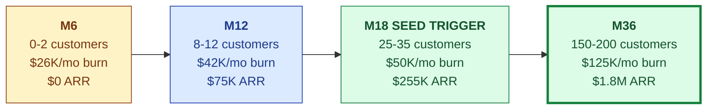
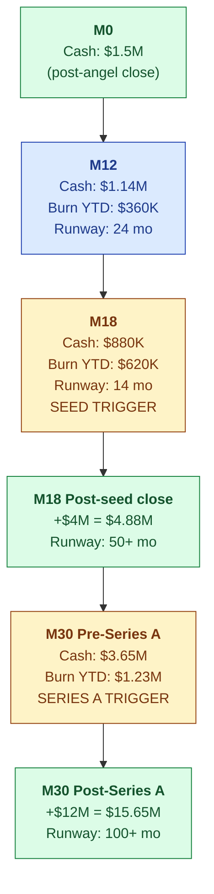

# Financial Model

| Field | Value |
|---|---|
| Owner | Founders + CFO (when hired) |
| Status | v1.0 DRAFT |
| Last updated | 2026-05-31 |
| Pairs with | [BUSINESS-PLAN.md](../business-plan/BUSINESS-PLAN.md), [DATA-ROOM.md](../data-room/DATA-ROOM.md) |
| Spreadsheet | TBD — Google Sheets / Causal link goes here when built |

---

## 1. Model overview

Conservative 36-month plan. India-cost base. Numbers derived bottom-up from BUSINESS-PLAN.md.

## 2. Revenue model

### Pricing assumptions (from PRICING.md)

| Tier | List ACV (USD) | Target customer mix |
|---|---|---|
| Starter | $4K | 20% — Tier 4 SMEs |
| Growth | $12K | 50% — Tier 3 CDMOs |
| Enterprise | $24K+ | 30% — Tier 2 mid-pharma |
| **Blended (year 3)** | **$9,500** | — |

### Customer acquisition assumptions

| Metric | M6 | M12 | M18 | M24 | M30 | M36 |
|---|---|---|---|---|---|---|
| Demos / month | 6 | 10 | 18 | 30 | 45 | 60 |
| Demo→PoC conversion | 25% | 30% | 35% | 40% | 42% | 45% |
| PoC→paid conversion | 25% | 30% | 35% | 40% | 42% | 45% |
| New customers / month | <1 | 1-2 | 3-4 | 5-6 | 7-8 | 9-12 |
| Churn (annual) | — | 8% | 6% | 5% | 4% | 4% |
| Net Dollar Retention | — | 100% | 105% | 110% | 112% | 115% |

### Revenue progression

| Quarter | Customers | New | Churned | Net | ARR | QoQ growth |
|---|---|---|---|---|---|---|
| Q1 (M3) | 0 | 0 | 0 | 0 | $0 | — |
| Q2 (M6) | 1 | 1 | 0 | 1 | $7K | — |
| Q3 (M9) | 4 | 3 | 0 | 4 | $32K | 357% |
| Q4 (M12) | 10 | 6 | 0 | 10 | $75K | 134% |
| Q5 (M15) | 18 | 8 | 0 | 18 | $148K | 97% |
| Q6 (M18) | 30 | 12 | 0 | 30 | $255K | 72% |
| Q7 (M21) | 45 | 16 | 1 | 44 | $400K | 57% |
| Q8 (M24) | 65 | 22 | 2 | 63 | $620K | 55% |
| Q12 (M36) | 175 | 35 | 8 | 167 | $1,825K | — |

## 3. Cost structure

### Monthly burn build (M12 snapshot)

| Line | $/mo | % of burn | Notes |
|---|---|---|---|
| Team salaries (12 FTE incl. founders) | $35.2K | 75% | India-cost base; founder draw ₹40L each |
| AI / LLM infra (gateway + fine-tune) | $4.5K | 10% | Growing with usage |
| Cloud infra (AWS / GCP / Vercel / MongoDB Atlas) | $1.5K | 3% | Multi-tenant cluster + backups |
| Tools & SaaS subscriptions | $0.8K | 2% | Slack, Linear, Notion, observability, CI/CD |
| Office, ops, legal, accounting | $2.5K | 5% | Co-working, registered agent, accountant, legal retainer |
| Compliance & certifications (SOC 2 amortized) | $1.0K | 2% | Spread over the year |
| Marketing / GTM / events | $1.5K | 3% | Conferences, content, early demand-gen |
| **Total monthly burn at M12** | **~$47K** | **100%** | ≈ ₹39 lakh, ~₹4.7Cr/year |

### Burn by stage

| Stage | Team $ | AI $ | Cloud $ | Other $ | Total $/mo |
|---|---|---|---|---|---|
| M6 | $19K | $2.5K | $1K | $3.5K | **$26K** |
| M12 | $35K | $4.5K | $1.5K | $6K | **$47K** |
| M18 | $42K | $6K | $2K | $7K | **$57K** |
| M24 | $58K | $8K | $3K | $10K | **$79K** |
| M36 | $97K | $14K | $6K | $18K | **$135K** |

## 4. Gross margin model

| Cost component | % of revenue | Trend over time |
|---|---|---|
| Cloud + storage | 4% | Drops as fixed costs amortize |
| AI inference (API + self-hosted) | 8% | Drops 50% with fine-tuned models at scale |
| Customer support (people) | 6% | Tightens as docs + AI deflect tickets |
| Implementation (per-customer) | 4% | One-time at deal close; amortized |
| **COGS (blended)** | **~40-45%** | **Trending to ~35% by M36 as self-hosted AI replaces hosted-API spend** |
| **Gross margin (blended)** | **~55-60% by M24** | **~62-65% by M36** |

> ⚠️ **Correction note.** Per cost-model.xlsx (78 inputs, 300 formulas, verified): real per-customer variable cost is **size-dependent — $1,011 (small, 1 site/5 users) · $3,840 (medium, 3 sites/20 users) · $11,543 (large, 5 sites/50 users)** — NOT the flat ~$1,900 figure in earlier drafts. Gross margin by tier: 77.5% (small) · 64.4% (medium) · 47.5% (large). Blended margin at portfolio scale (mix-weighted) is ~60%, not ~80%. AI inference is 27-40% of variable cost; **self-hosted fine-tuned models in Year 2+ are the single biggest cost-reduction lever** (~40% off variable cost at scale).

## 5. Cash position over 36 months

### Cash table (cumulative)

| Month | Burn-to-date ($K) | Cash on hand ($K) | Months runway | Notes |
|---|---|---|---|---|
| M0 | 0 | 1,500 | 32 | Pre-seed close |
| M6 | 150 | 1,350 | 36 | Foundation built |
| M12 | 360 | 1,140 | 24 | PoCs running |
| M18 | 620 | 880 | 14 | **Trigger seed raise NOW** |
| M18 (post-seed) | 620 | 4,880 | 50+ | After $4M close at $20M post |
| M24 | 940 | 4,560 | 41 | |
| M30 | 1,235 | 4,265 | 35 | **Trigger Series A NOW** |
| M30 (post-A) | 1,235 | 16,265 | 100+ | After $12M close at $50M post |
| M36 | ~1,400 | ~16,100 | 100+ | Cash-flow break-even approaching |

## 6. Unit economics

### Per-customer LTV / CAC

| Metric | Value | Notes |
|---|---|---|
| Blended ACV (steady state) | $9,500 | From pricing/segment mix |
| Gross margin | 78% | Steady-state |
| Annual gross profit per customer | $7,410 | ACV × GM% |
| Average customer lifetime | 5+ years | 92% GRR + 110% NDR floor |
| **Customer LTV** | **~$37K** | 5yr × $7.4K (conservative; doesn't account for expansion) |
| Customer Acquisition Cost (CAC) | $4,500 | Founder-led + light SDR; matches 2yr payback |
| **LTV / CAC** | **~8x** | Healthy SaaS metric (>3x is target; >5x is excellent) |
| Payback period (CAC) | ~7 months | < 12 months is healthy |

### Magic Number (sales efficiency)

| Quarter | New ARR added | Sales+Marketing spend | Magic Number |
|---|---|---|---|
| Q4 M12 | $75K | $30K | 2.5 |
| Q8 M24 | $545K | $180K | 3.0 |
| Q12 M36 | ~$1.2M | ~$450K | 2.7 |

> Magic Number > 1.0 is healthy growth efficiency. >2 is excellent.

## 7. Funding rounds in numbers

| Round | Pre-money | Raise | Post-money | New investor % | ESOP refresh | Founder dilution |
|---|---|---|---|---|---|---|
| Pre-angel | — | — | — | — | — | 50/50 founders |
| **Angel (NOW)** | $5.5M | $1.5M | $7M | 12.7% post-ESOP | 10% new | Founders → 77.2% combined |
| **Seed (M18)** | $16M | $4M | $20M | 20% | 12% (top-up) | Founders → 61.8% |
| **Series A (M30)** | $38M | $12M | $50M | 15.1% post-ESOP | 15% (top-up) | Founders → 47% |

## 8. Sensitivity scenarios

### M18 ARR sensitivity (the seed-trigger moment)

| Variable | Pessimistic | Base | Optimistic |
|---|---|---|---|
| Customers at M18 | 18 | 30 | 45 |
| Blended ACV | $6.5K | $8.5K | $11K |
| PoC→paid conversion | 22% | 35% | 50% |
| Sales cycle (months) | 7 | 4 | 2.5 |
| **M18 ARR** | **~$120K** | **~$255K** | **~$495K** |

### Founders' M36 ownership sensitivity (if Series A is bigger/smaller)

| Series A size | Series A % | Founders M36 % |
|---|---|---|
| $8M @ $40M post | 20% | ~44% |
| **$12M @ $50M post (plan)** | **15%** | **~47%** |
| $15M @ $60M post | 12.5% | ~49% |
| $20M @ $80M post | 16% | ~46% |

> 💡 **Optimization isn't always "bigger round" — sometimes "smaller round at higher valuation" is better for founders' end-state.** The plan threads this needle by raising what the milestones require, not what the market would tolerate.

## 9. Key assumptions register

| Assumption | Value | Source | Confidence | If wrong by |
|---|---|---|---|---|
| India team cost (avg loaded) | ₹3.5L/mo per FTE | 2026 Glassdoor / Scaler bands | High | ±10% → ±$5K/mo burn |
| Blended ACV | $9.5K (year 3) | Bottom-up segment mix | Medium | -20% → ARR -20% |
| PoC→paid conversion | 35% | Estimate from analogous SaaS | Low-medium | -10% → customer count -29% |
| Annual churn | 6% steady-state | Standard SaaS benchmark | Medium | +5% → LTV halved |
| Gross margin (year 3) | 78% | Cost model + fine-tune savings | Medium | -5% → GP -6% |
| AI inference cost decline (fine-tune savings) | 50% by M24 | Self-hosted vLLM math | Medium | If 0% → AI line +$15K/mo |
| Customer LTV | $37K (5-year) | LTV calc | Low-medium (no live data) | Halved if churn doubles |

## 10. What's NOT modeled yet (build as we go)

- [ ] Revenue from Ring 1 sectors (Food & Beverage, Cosmetics, Med-Device QMSR) — starts contributing M24+
- [ ] Geographic expansion revenue (SE Asia, Middle East) — starts contributing M18+
- [ ] On-prem deployment revenue uplift (+30% on base ACV)
- [ ] Marketplace network economics (auditor matching fees) — post-Series A
- [ ] Channel partner revenue share (10-25% partner economics)
- [ ] Vertical pack add-on pricing (per-vertical clause libraries)
- [ ] Currency hedging (USD revenue, INR cost — exposed to ~₹/$ movement)

## 11. What investors will probe in DD

1. **PoC→paid conversion assumption** — can we name 3 PoCs in progress and their probability?
2. **Blended ACV math** — show actual quotes signed (or quoted, not signed) for each tier
3. **Churn** — pre-customer; investor will discount. Be honest.
4. **AI cost trajectory** — how does $4.5K/mo at M12 scale to $14K at M36? Reasonable per-customer cost?
5. **Founder dilution discipline** — why is angel $1.5M not $3M? (Answer: bottom-up plan.)
6. **Headcount ramp vs revenue** — do we hire ahead of ARR or behind? (Plan: behind, except sales hire at M9 which is the bet.)
7. **Cash buffer** — how much runway do we hold at all times? (Target: never below 9 months.)

## 12. Linked artifacts

- `Doc_V2/02-fundraising/financial-model/MODEL.xlsx` — TBD detailed spreadsheet
- `Doc_V2/02-fundraising/financial-model/CAP-TABLE.xlsx` — TBD cap table
- `Doc_V2/02-fundraising/financial-model/SCENARIOS.xlsx` — TBD scenario planner
- `Doc_V2/02-fundraising/investor-updates/` — eventual home of monthly investor updates

---

## See also

- [BUSINESS-PLAN.md](../business-plan/BUSINESS-PLAN.md) — narrative behind the numbers
- [PITCH-DECK.md](../pitch-deck/PITCH-DECK.md) — investor-facing summary
- [DATA-ROOM.md](../data-room/DATA-ROOM.md) — what diligence requests
- [PRICING.md](../../01-strategy/pricing-and-packaging/PRICING.md) — pricing logic underpinning ACV
- `00-strategy-and-pitch/BUSINESS-AND-FUNDING-PLAN.pdf` (legacy) — source PDF
