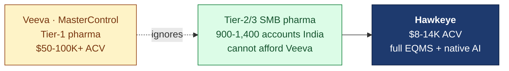
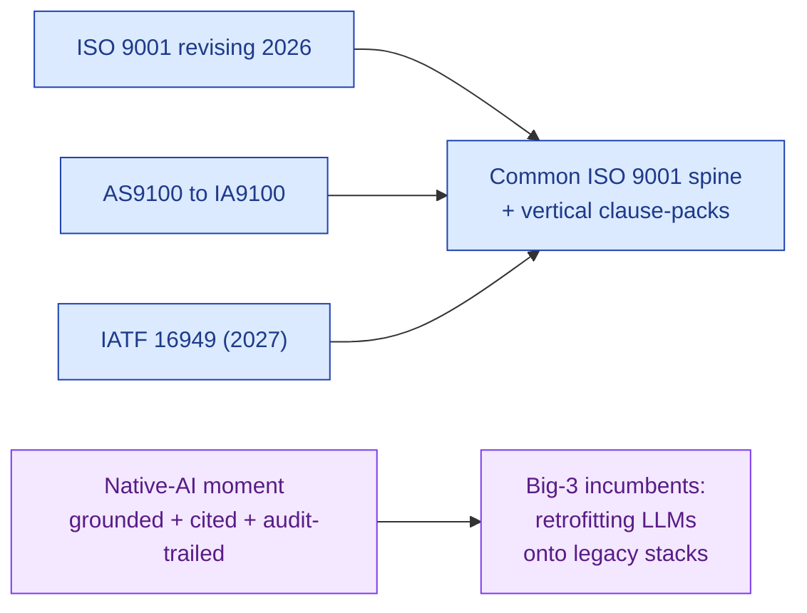
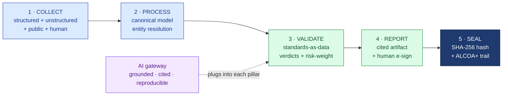
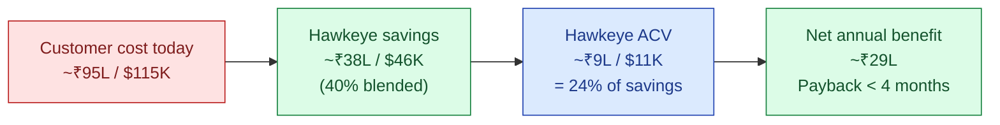
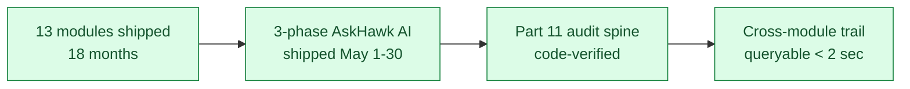

# Hawkeye — Investor Deck

| Field | Value |
|---|---|
| Audience | Angel investors + early-stage VCs |
| Round | Pre-seed / Angel — $1.2–1.5M (target $1.5M) |
| Status | v1.0 — 2026-06-01 |
| Pairs with | [HAWKEYE-STORY.md](../../HAWKEYE-STORY.md) · [BUSINESS-PLAN.md](../business-plan/BUSINESS-PLAN.md) · [PITCH-DECK.md](PITCH-DECK.md) |
| Format | 15 slides · 12-15 min delivery |

---

## 1. Hawkeye — The Regulated-Supply-Chain Compliance Engine

> 💡 **The one line.** An industry-agnostic compliance engine that wins regulated supply chains one vertical at a time. Pharma today, food + med-device tomorrow, every standards-governed industry over time.

- Native-AI from day one — grounded, cited, reproducible, audit-trailed
- 13 EQMS modules live · Part 11 / Annex 11–grade audit spine
- Beachhead: SMB + emerging-market pharma — ~900-1,400 reachable accounts in India alone
- Founders bootstrapped to product completion; raising to land first 25-35 customers

*Slide 1 / 15*

---

## 2. The Problem — Meet Asha

> *Asha Sharma is QA Head at a mid-size CDMO in Pune. She hosts 30+ audits a year. Her team of 5 spends 60% of their time on audit prep — not on improving the product.*

| Cost line (one Tier-3 CDMO) | ₹/yr | $/yr |
|---|---|---|
| Audit prep time (5 QA × 30 audits × 4 days × ₹10K/day) | ₹60L | $72K |
| Audit response + CAPA tracking (manual) | ₹18L | $22K |
| External audit-prep consultants | ₹6-15L | $7-18K |
| Cost of audit findings + remediation (~1 critical/yr) | ₹5-25L | $6-30K |
| **Total annual quality cost** | **~₹95L** | **~$115K** |

This is what every mid-pharma in India is paying. EQMS spend ($300K+/yr at Tier 1) barely covers the basics.

*Slide 2 / 15*

---

## 3. The Market — White Space the Incumbents Cede

| Layer | Number |
|---|---|
| Pharma TAM (global QMS + SQM) | $28B · 10-14% CAGR |
| India Tier-2/3 reachable accounts | ~900-1,400 |
| Blended ACV (plan) | $9.5K |
| 36-month SOM (pharma India alone) | $1.4-2.3M ARR |
| 5-year ceiling (pharma India alone) | $8-12M ARR |

Ring 1 hops (food, cosmetics, med-device, blood/tissue): +1,250 reachable accounts · additive $5-15M ARR potential.

*Slide 3 / 15*

---

## 4. Why Now — Two Tailwinds Converging

- **Standards convergence** — regulators are explicitly aligning onto an ISO 9001 spine with vertical packs on top. That's our engine-plus-config architecture.
- **Native-AI moment** — every Big-3 incumbent's investor call flags the "pharma AI gap." None ship grounded + cited + reproducible AI.

> 💡 We're rowing with the current, not against it.

*Slide 4 / 15*

---

## 5. The Product — 5-Pillar Engine + AI Moat

- Pipeline is fixed. Standards, vocabulary, rules, templates are **configuration**.
- AI plugs into every pillar but never commits a record — humans always e-sign.
- That separation is what makes the engine industry-agnostic AND makes the AI defensible to a regulator.

*Slide 5 / 15*

---

## 6. The Wedge — Supplier Audit, Sequenced Verticalization

| Why audit-management first | Evidence |
|---|---|
| Acute pain | 30+ audits/yr per CDMO; ₹95L quality cost |
| Single decision-maker | QA Head can buy without IT/board |
| Worst incumbent coverage | Veeva too expensive; Qualifyze is network-only |
| Travels across verticals | Audit exists in pharma, food, auto, aero, electronics |
| Fast time-to-value | 60-day PoC on real audits; payback <4 months |

> 💡 Audit lands → expand to CAPA / Deviation / Change / Doc within 6 months. Land-and-expand is architectural, not aspirational.

**Sequenced verticalization, never horizontal-from-day-one:**
- M0-M18 — Pharma India SMB beachhead
- M18-M30 — Food & Beverage, cosmetics (ISO 22716)
- M30+ — Med-device (ISO 13485), auto (IATF), aero (AS9100/IA9100)

*Slide 6 / 15*

---

## 7. Traction — Honest

> ✅ **Built (May 2026):**
> - 13 EQMS modules · Part 11 / Annex 11 audit trail · e-sig across every regulated action
> - 3-phase AskHawk AI shipped May 1-30 (Regulations Q&A + SOPs + 8-tool App Wizard)
> - 6-agent AI stack on Deviation (intake / similarity / disposition / CAPA recommend / trend / 5-Why)
> - Doc Control AI bulk upload · Audit observation drafter · Auditor coach
> - Multi-LLM gateway (Anthropic + OpenAI + Gemini) with grounded gen + skeleton fallback
> - Cross-module audit-trail browser (<2 sec query)

> ⚠️ **Not yet:**
> - Paid customers (2 design partners in active discovery: Sanpras + Novex)
> - SOC 2 Type 1 (target M12)
> - Per-tenant validation packs (template ready; first execution at first customer)
> - Hawkeye-tuned Llama-3 in production (M12)

*Slide 7 / 15*

---

## 8. Business Model — ROI-Based Pricing

| Tier | Sites | Users | ACV | Target |
|---|---|---|---|---|
| Starter | 1 | 3 | ₹3.5L (~$4K) | Tier 4 SME / nutra |
| **Growth** | 3 | 8 | ₹10L (~$12K) | **Tier 3 CDMO** |
| Enterprise | unlimited | 25+ | ₹20L+ (~$24K+) | Tier 2 mid-pharma |

> 💡 Lead the conversation with **savings**. Close on a **clean per-site + per-user + AI-credits contract**.

*Slide 8 / 15*

---

## 9. The Moat — Why Incumbents Can't Copy This

| Defender | What they own | What they CANNOT cross |
|---|---|---|
| Veeva / MasterControl | Tier-1 pharma · deep validation packages | Going downmarket destroys their $50-100K ACV anchor |
| Greenlight Guru / vertical specialists | Industry-specific artifacts (FAI, FSSC) | Cross-industry primitive — vertical depth IS their moat |
| ServiceNow / SAP / Salesforce | Distribution · ecosystem | Regulated-domain depth · GxP credibility · grounded AI |
| Qualifyze | Live supplier audit network | Internal EQMS workflow at affordable pricing |

> 💡 **Our durable advantage:** grounded AI + cross-module audit trail + AskHawk App Wizard, all on one engine, at a price the SMB can pay. Every audit-trail row captures `modelVersion + promptHash + retrievalSet + confidence`. That's reproducible AI no incumbent ships today.

*Slide 9 / 15*

---

## 10. Team

| Role | Profile |
|---|---|
| Founder · CEO | Pharma domain + product · deep buyer-side network in India + emerging markets |
| Co-founder · CTO | Full-stack engineer · shipped 13 modules + 3-phase AI in 18 months solo + co-founder |
| Pharma SME (advisor, PT) | 20+ yrs at Tier-1 CDMO · QA Head experience · validation package authority |
| Ex-regulator advisor (planned) | Target persona: ex-CDSCO or ex-FDA inspector for credibility + intro network |
| Founding designer (PT) | UX validated across all 13 modules + AskHawk arc |

**Hiring plan:** 8 FTE at M6 → 12 at M12 → 15 at M18 (India-based, ~30% below market salaries + healthy ESOP).

*Slide 10 / 15*

---

## 11. Financials — 36-Month Plan

| Metric | M6 | M12 | M18 | M24 | M30 | M36 |
|---|---|---|---|---|---|---|
| Headcount FTE | 8 | 12 | 15 | 20 | 26 | 34 |
| Monthly burn ($K) | 26 | 42 | 50 | 72 | 95 | 125 |
| Paying customers cum. | 0-2 | 8-12 | 25-35 | 55-75 | 95-125 | 150-200 |
| **ARR ($K)** | 0 | 75 | **255** | 620 | 1,100 | **1,825** |
| Gross margin (blended) | — | ~50% | ~55% | ~60% | ~62% | ~65% |

- M18 ARR ~$255K with 25-35 customers · 1 reference deployment — triggers Seed at $3-5M
- M30-36 ARR ~$1.0-1.5M · 100-150 customers · multi-vertical proof — triggers Series A at $10-15M

*Slide 11 / 15*

---

## 12. The Ask

| Field | Value |
|---|---|
| **Round** | Pre-seed / Angel |
| **Size** | $1.2-1.5M (target $1.5M) |
| **Pre-money** | ~$5.5M |
| **Post-money** | ~$7M |
| **Runway** | 18 months |
| **Founders post-close** | 77.2% combined (38.6% each) |

**Use of funds:**
- 65% team build (8 → 15 FTE, India)
- 10% AI/LLM infra (gateway → fine-tune → self-host)
- 10% compliance / SOC 2 / validation
- 8% GTM (events, content, tools)
- 7% buffer + ops

**Milestones at close:** 25-35 paying customers · $250-400K ARR · Hawkeye-tuned AI in production · 1+ ring-1 customer signed.

*Slide 12 / 15*

---

## 13. Honesty Register

> ⚠️ **What we are NOT pretending.**
> - Pre-customer (LOIs only; 2 design partners in discovery — Sanpras + Novex)
> - PoC → paid conversion rate (35%) is an **assumption**, not validated
> - Sales cycle (4-6 months) is an **estimate** from analogous interviews
> - The ask was revised **down** ($3M → $1.5M) — bottom-up planning produced a smaller, more defensible number
> - 7 URS open questions tracked across modules
> - Pillar 5 is **tamper-evident**, NOT blockchain (per-record SHA-256 + append-only ALCOA+)
> - Pharma is the only fully-shipped vertical pack today; food/med-device/auto are config slots awaiting standards packs
> - First non-pharma vertical = **M24+ aspiration**, not active development

> 💡 The honesty discipline is the moat against polished-pretend competitors. Investors who want truth-with-conviction should keep reading.

*Slide 13 / 15*

---

## 14. Why Us — Execution Velocity Is the Tell

- **18-month bootstrapped build** with founder + co-founder producing what most pre-seed teams deliver post-funding
- **3-phase AI arc in 30 days** (Regulations Q&A · SOPs · App Wizard with 8 tools) — velocity proof
- **Engineering discipline visible**: 4-layer middleware chain, immutable audit trail, grounded-or-fallback AI architecture
- **Doc discipline visible**: Doc_V2 publishes the honest gaps alongside the wins

> 💡 Pre-seed pattern-match: founders who ship before they raise, then raise to scale. That's the bet.

*Slide 14 / 15*

---

## 15. Next Steps

| Action | Owner | Timing |
|---|---|---|
| 30-min follow-up call (deep-dive demo) | Founder | This week |
| Data-room access (see [DATA-ROOM.md](../data-room/DATA-ROOM.md)) | On request | 24h |
| Reference call with design partner (Sanpras / Novex) | Founder | Week 2 |
| Term sheet | Investor lead | Week 3-4 |
| Close | Joint | 30-45 days |

**Contact:** founders@hawkeye.app · `[insert Calendly]`

Read next: [HAWKEYE-STORY.md](../../HAWKEYE-STORY.md) for the full narrative · [BUSINESS-PLAN.md](../business-plan/BUSINESS-PLAN.md) for the bottom-up financials.

*Slide 15 / 15 · Thank you · Q&A*
