# Pitch Deck — Outline & Speaker Notes

| Field | Value |
|---|---|
| Owner | Founders |
| Status | v2.0 — $1.5M ask aligned to BUSINESS-PLAN.md (corrected from earlier $3M draft) |
| Format | 12 slides, 8-12 min delivery |
| Last updated | 2026-05-31 |
| Pairs with | [BUSINESS-PLAN.md](../business-plan/BUSINESS-PLAN.md), [FINANCIAL-MODEL.md](../financial-model/FINANCIAL-MODEL.md) |

---

## Deck flow at a glance

```mermaid
flowchart LR
    classDef intro fill:#dbeafe,stroke:#1e40af,color:#1e3a8a
    classDef proof fill:#dcfce7,stroke:#15803d,color:#14532d
    classDef ask fill:#fef3c7,stroke:#92400e,color:#78350f

    S1["1. Problem"]:::intro
    S2["2. Why now"]:::intro
    S3["3. Solution"]:::intro
    S4["4. Product / demo"]:::proof
    S5["5. AI moat"]:::proof
    S6["6. Market + wedge"]:::proof
    S7["7. GTM motion"]:::proof
    S8["8. Traction / proof"]:::proof
    S9["9. Business model"]:::proof
    S10["10. Team"]:::proof
    S11["11. Roadmap"]:::ask
    S12["12. The ask"]:::ask

    S1 --> S2 --> S3 --> S4 --> S5 --> S6 --> S7 --> S8 --> S9 --> S10 --> S11 --> S12
```

## Slide-by-slide

### 1 · Problem
**Title:** "Pharma quality teams audit 30 suppliers a year. They have time for 5."
- 200-1,200 suppliers per mid-pharma; in-person bandwidth: 30-60/yr
- Rest: paper-screened, late; CAPAs run in email; findings re-litigated every renewal
- $300K/yr EQMS spend often barely covers the basics

### 2 · Why now
- 2026 standards convergence: ISO 9001, AS9100→IA9100, IATF 16949 onto common spine + vertical packs
- Native-AI moment for grounded compliance (Part 11–grade traceability now feasible)
- Pharma AI gap explicitly flagged by every Big-3 incumbent's investor calls

### 3 · Solution
- **Industry-agnostic compliance engine, deployed beachhead-first**
- The 5-pillar engine: Source → Model → Assess → Report → Trace
- Same architecture serves pharma → food → med-device → auto over time
- *Not* a pharma tool; *not* a horizontal platform; the **regulated-supply-chain compliance primitive**

### 4 · Product / demo
- Live screens (or 60-sec video):
  1. Audit list → create audit via App Wizard
  2. AI-drafted observation with citations + confidence
  3. E-sig closure ceremony (Part 11)
  4. Cross-module audit-trail browser

### 5 · AI moat
> 💡 **The AI defensibility no incumbent ships:** grounded generation + citations + confidence floor + skeleton fallback + reproducibility (modelVersion, promptHash, retrievalSet, confidence captured in every audit-trail row).

- 3 layers: API gateway today → fine-tuned open-source on our corpus (M12) → reproducible AI moat
- Auditor coach (private review) + observation drafter + supplier intel — all opt-in, audit-trailed

### 6 · Market + wedge
- TAM: $12.5B QMS + $15.5B SQM, growing 10-14% CAGR
- Wedge: ~900–1,400 reachable Tier 2/3 pharma accounts in India alone
- ICP: WHO-GMP-export Tier 2 mid-pharma + Tier 3 CDMOs
- **The wedge that travels: supplier audit** (present in every regulated industry; worst incumbent coverage)

### 7 · GTM motion
- Founder-led for first 10 customers
- Founding sales hire at M9 (pharma-domain)
- Land with supplier-audit module; expand to full EQMS within 6 months
- Channels: outbound + industry events + customer referrals; partnerships are force-multipliers, not primary

### 8 · Traction / proof
> ⚠️ **Pre-customer today.** Honest:
> - Built: full EQMS (audit, CAPA, deviation, change, doc-control, batches, training, risk, complaint, MRM) with Part-11 audit trail + e-sig across 5 modules
> - 3-phase AskHawk AI co-worker shipped (Regulations Q&A + SOPs + App Wizard)
> - LOIs with TBD prospects
> - Reference customer: 1 design-partner pharma (Sanpras) in active discovery

### 9 · Business model
- ROI-based pricing: customer saves ~$46K/yr (40% of $115K audit-prep cost); we charge ~$10.8K = 24% of savings
- Three tiers: Starter ($4K) / Growth ($12K) / Enterprise ($24K+)
- 1-year contracts; 70%+ gross margins by M24

### 10 · Team
- **[Founder 1 name]** — [bio: domain background, prior wins, why this problem]
- **[Co-founder 2 name]** — [bio: technical background, prior systems built]
- **Pharma SME consultant** (advisory): [name + bio when engaged]
- **Ex-regulator advisor** (planned): [target persona]
- Hiring plan: 8 FTE at M6 → 12 at M12 → 15 at M18 (India-based)

### 11 · Roadmap
- M0-M6: First 10 reference customers (India pharma SMB)
- M6-M12: 25 paying customers, fine-tuned AI in production
- M12-M18: Seed round trigger ($250-400K ARR); Food & Beverage standards pack
- M18-M36: Series A; US/EU; second vertical at scale

### 12 · The ask

- **Raising:** $1.2–1.5M pre-seed (target $1.5M)
- **Pre-money:** ~$5.5M
- **Use of funds:**
  - 65% team build (8→15 FTE, India)
  - 10% AI/LLM infra (gateway → fine-tune → self-host)
  - 10% compliance/SOC 2 + validation
  - 8% GTM (events, content, tools)
  - 7% buffer + ops
- **Milestones at close:** 25-35 paying customers, $250-400K ARR, S.M.A.R.T. Hawk-tuned AI in production, 1+ ring-1 customer signed

---

## Honesty register (always at the back of the deck)

> ✅ **The honesty discipline that earns the room.** Founders explicitly call out what's NOT yet validated, including:
> - Pre-customer (LOIs only)
> - PoC→paid conversion rate (35%) is an assumption
> - Sales cycle (4-6 mo) is an estimate
> - The AI fine-tune roadmap depends on successful PoC data collection
> - The dollar ask was revised down ($3M → $1.5M) — explain why bottom-up planning produced a smaller, more defensible number
>
> Investors specifically look for this discipline. Don't bury it.

## What's NOT in the deck (deliberately)

- TAM headline numbers as primary (lead with wedge math)
- 5-year revenue forecast (don't fight on a chart; live by the milestones)
- Specific competitor logos in attack mode (frames us as below them; we're a different game)
- Detailed cap table (that's for diligence, in [DATA-ROOM.md](../data-room/DATA-ROOM.md))

## Asset checklist for sending

- [ ] Deck rendered with **$1.5M ask** (text-level corrected; verify rendered PDF reflects)
- [ ] [founder-memo.pdf](legacy/) attached as email companion
- [ ] [BUSINESS-PLAN.md](../business-plan/BUSINESS-PLAN.md) PDF available for follow-up
- [ ] [DATA-ROOM.md](../data-room/DATA-ROOM.md) index ready
- [ ] Demo video link (60-sec product loop) embedded in email
- [ ] Calendly link for 30-min follow-up

---

## See also

- [BUSINESS-PLAN.md](../business-plan/BUSINESS-PLAN.md) — the model behind every slide
- [FINANCIAL-MODEL.md](../financial-model/FINANCIAL-MODEL.md) — numbers
- [DATA-ROOM.md](../data-room/DATA-ROOM.md) — what diligence covers
- [VISION.md](../../01-strategy/vision-and-positioning/VISION.md) — strategic context
- `00-strategy-and-pitch/pitch/pitch-deck.pdf` (legacy) — current $3M ask PDF
- `00-strategy-and-pitch/pitch/founder-memo.pdf` (legacy) — email companion
