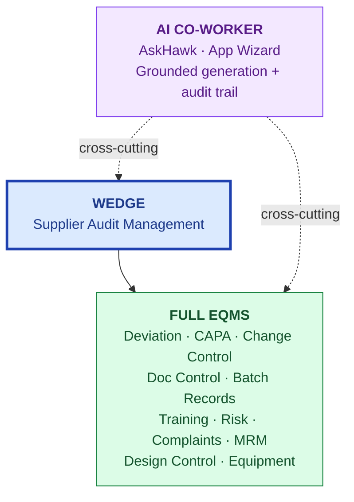
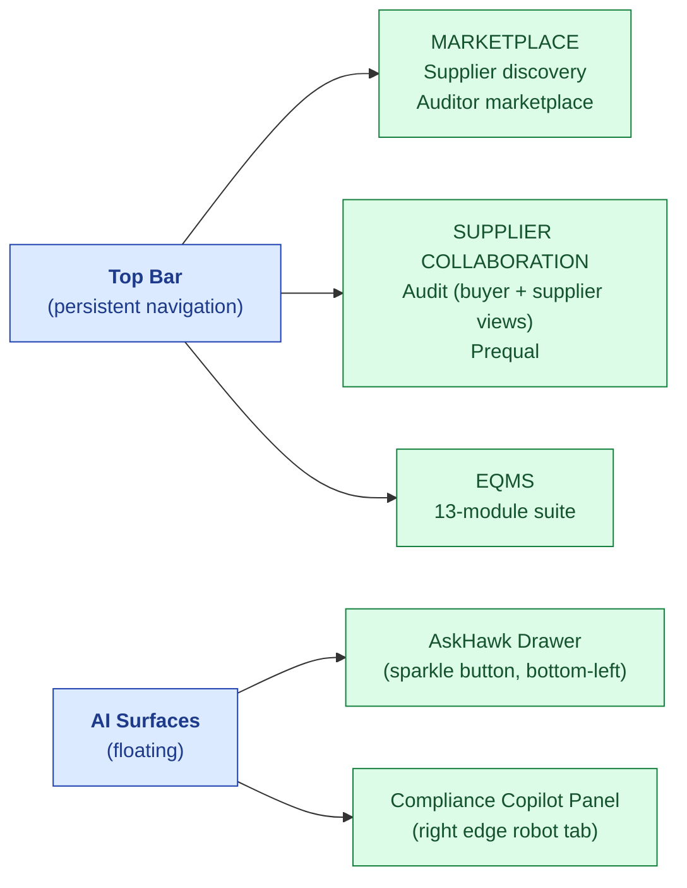

# Product Overview

| Field | Value |
|---|---|
| Owner | Product (Founders + PM) |
| Status | v1.0 |
| Last updated | 2026-05-31 |

---

## 1. What S.M.A.R.T. Hawk is, in product terms

S.M.A.R.T. Hawk is an **AI-native EQMS SaaS for regulated supply chains** — built around supplier audit as the wedge, expanding into the full EQMS suite (deviation, CAPA, change control, doc control, batches, training, risk, complaints, MRM).

## 2. The 13 modules

| Module | Status | Persona-of-the-day | Primary use case |
|---|---|---|---|
| Audit Management | ✅ Live | Buyer, Auditor, Supplier | End-to-end supplier audit lifecycle |
| CAPA | ✅ Live | All quality teams | Corrective + preventive action workflow |
| Deviation | ✅ Live (6-agent AI) | QA + production | Deviation intake + investigation + RCA |
| Change Control | ✅ Live | QA + management | Formal change workflow with approvals |
| Document Control | ✅ Live (AI bulk upload) | Doc Control Officer | SOP/Procedure/Record versioning + approval |
| Batch Records | ✅ Live | Production + QP | Batch manufacture + release |
| Complaint Management | ✅ Live | Customer Service + QA | Customer complaint triage + investigation |
| Risk Management | ✅ Live | QA + management | Risk register + FMEA |
| Training | ✅ Live | HR + QA | Per-user training records + effectiveness |
| Equipment | ✅ Live | Maintenance + QA | Equipment calibration + maintenance |
| Management Review | ✅ Live | Top management | Periodic QMS review + sign-off |
| Design Control | ✅ Live | R&D + QA (med-device) | Design history + verification + validation |
| Supplier Prequalification | ✅ Live | Procurement + QA | Supplier onboarding + scoring |

## 3. Cross-cutting capabilities

| Capability | Why it matters |
|---|---|
| **AskHawk AI co-worker** | Regulations Q&A + SOP templates + Workflow playbooks + App Wizard (do-this-for-me) |
| **Cross-module audit trail** | Inspector-readiness: query "every change to every record" in <2 sec |
| **Part 11 e-signature** | Every regulated action ceremonied with bcrypt-verified password + reason for change |
| **Multi-tenant + RBAC** | One platform serves buyer/auditor/supplier roles across multiple orgs |
| **Grounded AI** | Every AI output cited + confidence-scored + reproducible |
| **Notifications** | Email + in-app for milestone events, overdue tasks |

## 4. Product principles

> ✅ **The principles we don't violate.**

| Principle | Implication |
|---|---|
| **Grounded AI, never magical** | Every AI claim has a citation; below confidence floor → skeleton fallback, not hallucination |
| **Part 11 by default** | Audit trail + e-sig on every regulated action; soft-mode warns, hard-mode blocks |
| **Cross-module is the moat** | Records link across modules; audit-trail browser shows the chain |
| **Persona-aware** | UI gates + AI replies + notifications differ per role |
| **Configurable, not customizable** | New verticals = config + standards pack; never fork code |
| **Honest about what's not done** | URS includes "open questions" and "known gaps" sections; docs flag DRIFT |

## 5. Product surface map (where features live)

## 6. Per-module URS index

Per-module deep requirements live in `06-modules/<module>/URS.md`:

- [Audit Management URS](../../06-modules/audit-management/URS.md) ✅ DRAFT
- CAPA URS — TBD
- Deviation URS — TBD
- Change Control URS — TBD
- Doc Control URS — TBD
- Batch Records URS — TBD
- Complaint URS — TBD
- Risk URS — TBD
- Training URS — TBD
- Equipment URS — TBD
- MRM URS — TBD
- Design Control URS — TBD
- Supplier Prequal URS — TBD
- AskHawk URS — TBD

## 7. Open product questions

1. Should the **AskHawk drawer** and **Compliance Copilot** consolidate into a single AI surface?
2. **Mobile app** — when does it justify the dev cost?
3. **Customizable dashboards** per-tenant — how much customization vs locked-in?
4. **Module gating** — sell modules a-la-carte or always-on with usage gates?
5. **Inviting external auditors** to a tenant — workflow vs full account?

---

## See also

- [PERSONAS.md](../01-personas-and-research/PERSONAS.md)
- [ROADMAP.md](../04-roadmap/ROADMAP.md)
- [PLATFORM-OVERVIEW.md](../../04-engineering/00-overview/PLATFORM-OVERVIEW.md) — technical
- [VISION.md](../../01-strategy/vision-and-positioning/VISION.md) — strategic
