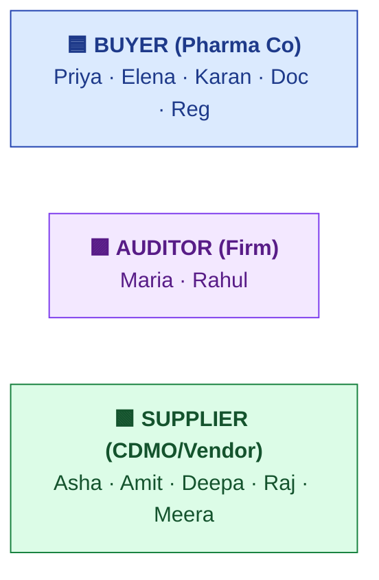
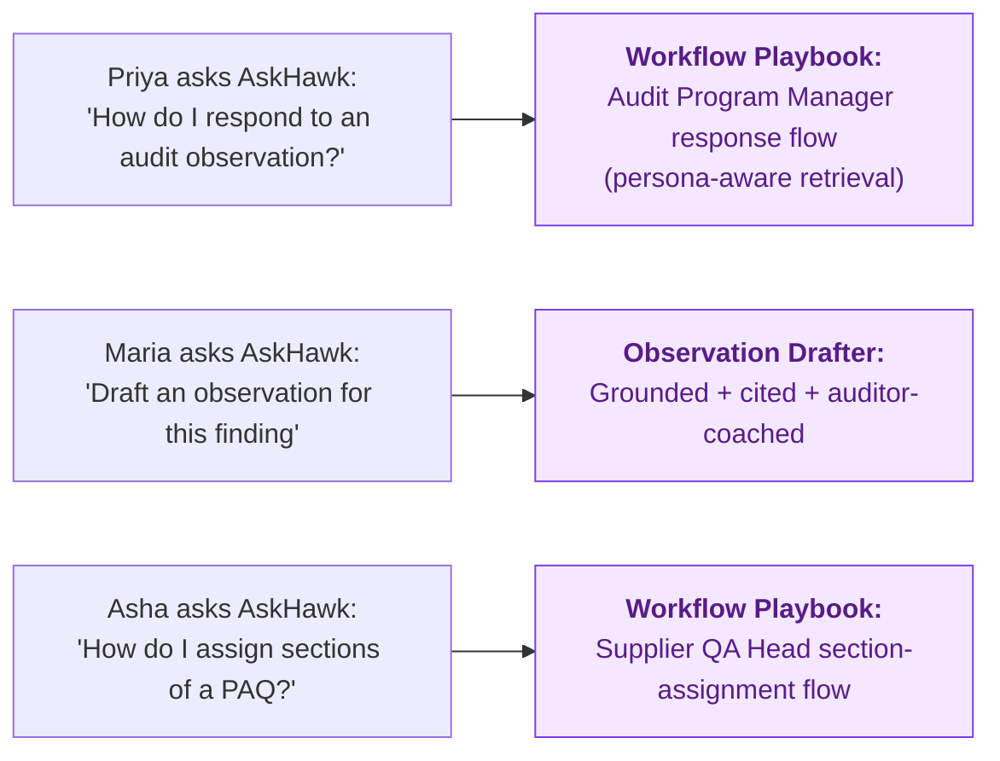

# Personas

| Field | Value |
|---|---|
| Owner | Product (Founders + PM) |
| Status | v1.0 |
| Last updated | 2026-05-31 |

---

## 1. Persona families

S.M.A.R.T. Hawk serves **3 organization types** × **4-7 personas each** = 14 named personas across 3 categories:

## 2. Buyer personas (Pharma quality teams)

### Priya Nair — Audit Program Manager
- **Title:** Senior Manager, Supplier Quality
- **Org:** Mid-pharma (e.g., Tier 2 formulations)
- **Goals:** Run audit programme across 200-1,200 suppliers; demonstrate compliance to regulators; reduce CAPAs-in-email
- **Pain:** In-person audit bandwidth ~30-60/yr; rest paper-screened, late; tracking in spreadsheets
- **S.M.A.R.T. Hawk for Priya:** Audit list with phase visibility; one-click auditor assignment; cross-audit dashboard
- **Quote:** *"I want to see at a glance which audits are stuck and why."*

### Dr. Elena Vasquez — VP Quality
- **Title:** VP / Head of Quality
- **Org:** Mid- to large pharma
- **Goals:** Programme oversight; board-level reporting; closure approvals on critical audits
- **Pain:** Annual board QMS reviews built from disparate spreadsheets
- **S.M.A.R.T. Hawk for Elena:** Compliance Health Score dashboard; closure cert e-sig; MRM module
- **Quote:** *"Give me a single source of truth for the next FDA inspection."*

### Karan Mehta — Procurement (Buyer-side)
- **Title:** Supply Chain Manager
- **Org:** Mid-pharma
- **Goals:** Onboard new suppliers fast; track prequalification status
- **Pain:** Supplier onboarding is a 6-month dance across QA + procurement + legal
- **S.M.A.R.T. Hawk for Karan:** Supplier Prequal module; checklist-driven onboarding workflow

### Doc Control Officer
- **Title:** Document Control Specialist
- **Goals:** Keep document master current; route reviews; ensure retention compliance
- **Pain:** Email reminders + spreadsheet tracking + missed deadlines
- **S.M.A.R.T. Hawk:** Doc Control module + AI bulk upload + scheduled review reminders

### Regulatory Affairs Manager
- **Title:** Reg Affairs Specialist
- **Goals:** Map product changes to filings; respond to regulator questions fast
- **Pain:** Reg Affairs gets pulled into every audit + change review without a structured input
- **S.M.A.R.T. Hawk:** AskHawk regulations Q&A + cross-module audit trail + reg-affairs view filter

## 3. Auditor personas (Auditing firms OR internal auditors)

### Maria Santos — Lead Auditor
- **Title:** Lead Auditor (3rd-party firm OR internal)
- **Cross-tenant scenario:** Works for multiple buyer pharma cos via `Affiliation` records
- **Goals:** Draft regulator-grade observations w/ citations; reuse prior findings; consistent severity
- **Pain:** Manual report drafting in Word; no citation tooling; inconsistent language across team
- **S.M.A.R.T. Hawk for Maria:** ObservationDrafterButton (AI with citations + confidence); AuditorCoachPanel (private review); report assembler with integrity hash
- **Quote:** *"AI drafts get me to a regulator-quality observation in 5 minutes instead of 45."*

### Rahul Kapoor — Co-Auditor
- **Role:** Witness + notes; no signing authority
- **Pain:** Pass-the-docs-via-email coordination with lead auditor
- **S.M.A.R.T. Hawk:** Auditor notes thread on artifacts + questions; view-only access to closure cert

## 4. Supplier personas (CDMOs, ingredient vendors, etc.)

### Asha Sharma — Supplier QA Head
- **Title:** Head of Quality Assurance
- **Org:** CDMO / formulation contract manufacturer
- **Goals:** Single inbox for incoming audits; auditable acceptance ceremony; structured PAQ response; assignable sections
- **Pain:** Email chaos across 30+ audits/year; lost evidence files; CAPA tracking in spreadsheets
- **S.M.A.R.T. Hawk for Asha:** Supplier inbox view; SignatureDialog acceptance; assign-sections workflow; PAQ progress tracker
- **Quote:** *"Pre-S.M.A.R.T. Hawk my Slack was 800 messages a week with auditors. Now it's a clean inbox."*

### Supplier Operations (Amit, Deepa, Raj, Meera)
- **Roles:** Production Manager, Maintenance Lead, QC Manager, Document Officer
- **Goals:** Respond to assigned questionnaire sections; upload evidence; mark complete
- **Pain:** "Whole questionnaire" forwarded by Asha; unclear which parts apply to me
- **S.M.A.R.T. Hawk:** Per-section assignment; SmartQuestion form with attachment upload; section status board

## 5. Platform / admin personas

### Tenant Admin
- **Goals:** Configure audit types; manage RBAC; set e-sig policy; invite users
- **Pain:** No standardized tenant onboarding playbook
- **S.M.A.R.T. Hawk:** Tenant admin console (still building); user invitation flow; audit-type catalog

### S.M.A.R.T. Hawk Superadmin (platform side)
- **Goals:** Multi-tenant oversight; platform-wide AI/SOP/playbook content management
- **S.M.A.R.T. Hawk:** Internal-admin AI Ops dashboard + KB sync + telemetry

## 6. Personas-by-module matrix

| Module | Buyer | Auditor | Supplier | Tenant Admin |
|---|---|---|---|---|
| Audit Management | ✅ Priya, Elena (closure) | ✅ Maria, Rahul (execution) | ✅ Asha (intimation, PAQ), Amit/Deepa (sections) | Config |
| CAPA | ✅ Priya, Elena (approval) | ✅ Maria (recommend) | ✅ Asha (action plan) | — |
| Deviation | ✅ Priya (review) | — | ✅ Asha, Amit (intake + RCA) | — |
| Change Control | ✅ Priya, Elena (approval) | — | ✅ Asha (proposer) | — |
| Doc Control | ✅ Doc Officer (manage) | ✅ Maria (review during audit) | ✅ Asha (response) | Config |
| Batch Records | — | ✅ Maria (review during audit) | ✅ Amit, QP | — |
| Complaint | ✅ Priya, Customer Service | — | — | — |
| Risk | ✅ Priya, Elena | ✅ Maria (input) | — | Config |
| Training | ✅ Doc Officer / HR | — | ✅ Asha (records) | Config |
| Equipment | — | — | ✅ Deepa (records) | — |
| MRM | ✅ Elena (chair) | — | — | Config |
| Design Control | ✅ Priya (med-device) | — | — | — |
| Supplier Prequal | ✅ Karan (onboarding) | — | ✅ Asha (intake) | Config |

## 7. Persona-aware AI

AskHawk uses persona-aware retrieval — the answer to "how do I do X?" differs by role.

## 8. What we DON'T have personas for (out of scope today)

- **Regulator personas** (inspector view) — we serve the people preparing FOR inspection, not the inspector themselves
- **Patient personas** — irrelevant; we're B2B SaaS
- **CFO at customer org** — they sign POs but don't use the product directly
- **End consumers** — out of scope
- **Lawyer at customer org** — uses S.M.A.R.T. Hawk-generated artifacts but doesn't operate the product

---

## See also

- [PRODUCT-OVERVIEW.md](../00-overview/PRODUCT-OVERVIEW.md)
- [GTM-PLAN.md §2](../../01-strategy/gtm-strategy/GTM-PLAN.md#2-ideal-customer-profile-icp--phase-1-pharma-india)
- [06-modules/audit-management/DESIGN.md §1](../../06-modules/audit-management/DESIGN.md#1-personas-5-primary-2-secondary)
