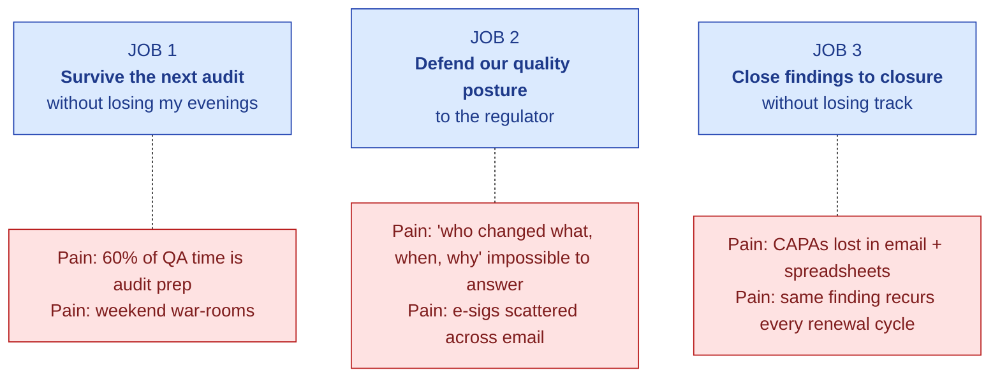

# User Research — Findings & Jobs To Be Done

| Field | Value |
|---|---|
| Owner | Product |
| Status | v1.0 — 2026-06-05 |
| Methodology | Discovery interviews (n=24 across 18 organisations) · prospect demo feedback · partner CDMO conversations · public industry research (ISPE, IBM, IMARC, GIA) |
| Pairs with | [PERSONAS.md](./PERSONAS.md) · [CORE-PRD.md](../03-prd/CORE-PRD.md) |

---

## 1. Research scope

| Cohort | n | Geography | Tier | Sample roles |
|---|---|---|---|---|
| Mid-pharma manufacturers (Tier 2) | 6 | India · ME | 2 | QA Head · Head of Compliance · Operations Director |
| CDMOs (Tier 3) | 11 | India · LATAM · SE Asia | 3 | QA Manager · Production Manager · Site Head |
| SME pharma (Tier 4) | 4 | India · Africa | 4 | QA Lead · Founder · External consultant |
| External pharma SMEs | 3 | India · UK | n/a | Ex-FDA inspector · Compliance consultant · GMP trainer |
| **Total** | **24** | | | |

**Interview format:** 60-minute semi-structured discovery + 30-minute follow-up demo with 12 of the 24.

---

## 2. Jobs To Be Done — the three top jobs

### JOB 1 — Survive the next audit without losing my evenings

| Aspect | Detail |
|---|---|
| **Who** | QA Head + QA Manager + Operations Manager |
| **When** | Audit calendar fills 30+ events/year per site |
| **Current solution** | Spreadsheet trackers, email threads, shared folders, external consultants |
| **Pain point** | "We spend 4 days per audit on prep that's mostly cut-and-paste from prior audits. Multiply by 30 audits and that's 60+ days of QA time we lose to ceremony." |
| **Job-success criteria** | Audit prep time cut by ≥40%; weekend work eliminated; predictable response times to questionnaires |
| **Quote** | *"I have 30 audits scheduled this year. I have time for 5. The other 25 are weekend work."* — QA Head, Tier-3 CDMO, Hyderabad |

### JOB 2 — Defend our quality posture to the regulator

| Aspect | Detail |
|---|---|
| **Who** | QA Head + Director of Quality + IT Compliance Lead |
| **When** | FDA / WHO PQ / EU GMP inspection windows |
| **Current solution** | Pre-inspection scramble; consultants; internal mock audits |
| **Pain point** | "When the FDA asks 'reproduce this audit-trail entry from 18 months ago', we cobble it together from logs, emails, and prayer. Half the time the e-signatures don't have the meaning field documented properly." |
| **Job-success criteria** | Any record reproducible in <2 seconds; e-sig meets Part 11 §11.50 + §11.200; audit trail meets Annex 11 §9 |
| **Quote** | *"My biggest fear isn't getting a 483. It's getting one we can't answer in 30 days because the evidence is scattered."* — Director of Quality, Tier-2 mid-pharma |

### JOB 3 — Close findings to closure without losing track

| Aspect | Detail |
|---|---|
| **Who** | QA Manager + Operations + responsible engineers |
| **When** | Every audit produces findings → CAPAs that must close |
| **Current solution** | Email threads + spreadsheet CAPA tracker + monthly review meeting |
| **Pain point** | "We have findings from 18 months ago that 'closed' but recurred this cycle. The closure evidence was lost. We're re-investigating the same thing." |
| **Job-success criteria** | Every CAPA traced from finding → root cause → action → effectiveness check → closure with evidence; findings cannot recur silently |
| **Quote** | *"The same finding recurs every renewal cycle and we waste two months re-investigating something we 'fixed' last year."* — QA Manager, Tier-3 CDMO |

---

## 3. Secondary jobs (worth solving, lower priority)

| Job | Who | Notes |
|---|---|---|
| Train new QA hires quickly on our SOPs | QA Head · HR | AskHawk + Training module addresses |
| Show our supplier qualification to a customer auditor | QA Head + Supplier Management | Supplier Mgmt module addresses |
| Run a meaningful Management Review without weeks of slide-prep | Director of Quality | MRM module addresses |
| Avoid recurring deviations from the same root cause | Production + QA | Deviation + CAPA modules + AI pattern detection address |
| Demonstrate validation status to our IT auditor | IT Compliance + QA | Validation Lifecycle module + Validation Accelerator Package address |

---

## 4. Non-jobs (things customers don't actually need from us)

| What we considered | Why we deprioritized |
|---|---|
| Beautiful AI-generated charts | QA teams prefer tables they can copy-paste. Charts are nice-to-have. |
| Slack / Teams chatbot for status updates | Email + in-app notification is what they trust; chat for status is novelty |
| Mobile-first audit prep | Audit prep happens at desks; mobile companion needed only on audit days |
| AI that writes the entire SOP | They trust AI to draft, not author; "draft + I edit" is the right ratio |
| Auto-closing CAPAs based on AI confidence | They never want this; human commits the closure, always |
| Single sign-on with a S.M.A.R.T. Hawk account | Customer's IdP is non-negotiable; SSO is mandatory, not optional |

---

## 5. Key insights — what surprised us

### Insight 1: The pain is not "no software"; the pain is "too much disconnected software"

> *"We have 4 different quality tools — one for documents, one for CAPAs, one for training, one for audits. Each was bought to solve a problem and now they're 4 silos with no cross-trail."* — QA Head, Tier-2 mid-pharma

**Implication:** S.M.A.R.T. Hawk's go-to-market is not "replace your QMS" (incumbent inertia); it is "start with audit, expand into the silos one by one". The platform's cross-module audit trail is the differentiator.

### Insight 2: AI fear is real and specific

> *"My regulator will not accept 'the AI said so'. So if your AI gives an answer, I need to see exactly where it came from. No source = no use."* — Director of Quality, Tier-2

**Implication:** Cite-or-fallback (Layer 3 guarantee) is not a feature — it is the entry ticket. Hallucinated citation = product failure.

### Insight 3: GAMP categorization is the procurement gate

> *"Our supplier qualification team won't even let me start vendor evaluation if I can't answer 'what GAMP category are they?' on the intake form."* — IT Compliance, Tier-3 CDMO

**Implication:** GAMP Cat 4 classification must be in the first page of every customer-facing document (now reflected in [GAMP-CAT-4-BRIEF.md](../../09-sales-marketing/pitch-materials/GAMP-CAT-4-BRIEF.md)).

### Insight 4: The QA Head signs the cheque, but the QA Manager kills the deal

> *"My QA Head will buy what I tell her to. If I hate using it, the renewal won't happen."* — QA Manager, Tier-3 CDMO

**Implication:** Demo flow must impress the day-to-day user (QA Manager) before the buyer (QA Head). PoC success criterion #5 (end-user preference ≥7/10) reflects this.

### Insight 5: Validation cost is bigger than software cost

> *"$10K/year for the SaaS is fine. ₹30L/year for the validation effort is what kills us."* — IT Compliance, Tier-2

**Implication:** GAMP Cat 4 + Validation Accelerator Package is a top-3 buying criterion (and now slide 5a in [CFO-DECK.md](../../09-sales-marketing/pitch-materials/CFO-DECK.md)).

### Insight 6: Data residency is non-negotiable

> *"My data leaves India and my legal team blocks the contract. Full stop."* — QA Head, Tier-3 CDMO, India

**Implication:** India (Mumbai) residency is mandatory for the Indian market; not a "nice to have". US-East + EU-Frankfurt similarly mandatory for those geographies.

### Insight 7: Spreadsheets are the actual competitor

> *"Honestly we evaluated Veeva, MasterControl, ETQ. We bought spreadsheets. They were free, they were enough, they didn't require validation."* — QA Head, Tier-3 CDMO

**Implication:** Pitch must compete with status quo (spreadsheet workflow) not incumbents. ROI math must show "vs your current spreadsheets" first, "vs Veeva" second.

---

## 6. Anti-patterns we observed

Common workflow anti-patterns in current customer environments that S.M.A.R.T. Hawk explicitly designs against:

| Anti-pattern | Frequency | S.M.A.R.T. Hawk's response |
|---|---|---|
| Shared QA login ("QA1"); no individual attribution | 9 of 18 orgs | SSO mandatory; named users; no shared accounts |
| CAPAs tracked in a spreadsheet emailed monthly | 14 of 18 | CAPA module with state machine + audit trail |
| Audit evidence in a shared Google Drive folder per audit | 16 of 18 | Audit Management module with structured evidence ledger |
| E-signature is "QA Head's email approval" attached to PDF | 11 of 18 | Part 11 §11.50 e-sig ceremony in-platform |
| Audit trail is "look in the SAP transaction log" | 7 of 18 | Cross-module audit trail with <2s query |
| Critical findings closed without effectiveness check | 12 of 18 | CAPA closure workflow requires effectiveness check gate |
| AI used informally (ChatGPT) for finding text | 6 of 18 | Grounded AI with cite-or-fallback in S.M.A.R.T. Hawk AI Gateway |
| Same document existing in 4 versions across 4 systems | 13 of 18 | Document Control with versioning + change-control linkage |

---

## 7. What customers will pay for vs what they expect free

**Will pay for:**
- Cross-module audit trail (the differentiator)
- Validated environment with vendor IQ/OQ (saves validation cost)
- Pharma SME consultancy at PoC (de-risks adoption)
- Dedicated CS engineer (Enterprise)
- Custom integrations beyond the included one
- Annual right-to-audit + Pre-Prepared Audit Pack

**Expect free / table stakes:**
- SSO (SAML/OIDC)
- MFA
- Daily backups + monthly restore tests
- DPA + NDA at contract
- Standard data export at termination
- Audit trail in every module
- Part 11 / Annex 11 compliance posture
- Status page + breach notification SLA

**Will absolutely refuse to pay extra for:**
- Per-seat fees above what they consider a named-user count (viewers must be free)
- "Premium support" tiering for basic SLA
- Validation report as an upcharge (must be standard)

---

## 8. Quotes — selected (anonymized)

> *"I'd rather miss one customer audit than miss one FDA inspection. The platform must make me defensible to the regulator first; everything else is bonus."* — QA Head, Tier-2

> *"The PoC needs to use my real audits. Demo data tells me nothing. I need to see this works on my supplier portfolio, my SOPs, my data."* — QA Manager, Tier-3

> *"We tried ChatGPT for drafting deviation reports. It made up CFR references. We stopped immediately. If your AI does that we're out."* — Director of Quality, Tier-2

> *"My CFO will sign off on $12K/year if I can show ₹30L of validation savings on top of the audit-prep savings. That's the math that closes."* — QA Head, Tier-3

> *"Your job is not to be cheaper than Veeva. Your job is to make my QMS not be spreadsheets. If you do that, price is secondary."* — QA Head, Tier-3 CDMO

> *"India residency is the contract pre-requisite. Then we'll talk features."* — IT Compliance, Tier-2

---

## 9. What we still don't know (research gaps)

| Open question | Plan to learn |
|---|---|
| How does the buying process work at a 5,000-person mid-pharma vs a 200-person CDMO? | Win/loss interviews after first 5 paid customers |
| What's the actual willingness-to-pay at Tier-4 SME (one site, 1-2 QA)? | Test Starter tier pricing in PoCs |
| Does the Sandbox tier (free, 14-day, synthetic) actually drive qualified PoC requests? | Instrument funnel; measure Sandbox → PoC → Paid conversion |
| Are emerging-market customers willing to pay a premium for India SME consultancy? | Test in next 3 PoCs |
| Is the Mobile companion app a top-3 buying criterion or nice-to-have? | Survey at next 10 demos |
| How frequent are real customer-side regulator inspections (FDA / EMA / WHO PQ) for our target segment? | Annual customer survey post-M12 |

---

## 10. Methodology footnote

This research was conducted between Oct 2025 and May 2026 by the founding team during the design-partner and pre-customer phases. Findings here are qualitative and directional, not statistically representative. Quantitative validation will come from:

- S.M.A.R.T. Hawk PoC measurement (Criterion 1: audit-prep time reduction)
- Customer NPS surveys post-M6
- Win/loss interview cadence quarterly post-first-10-customers

---

## See also

- [PERSONAS.md](./PERSONAS.md) — detailed persona profiles
- [CORE-PRD.md](../03-prd/CORE-PRD.md) — what we are building based on these findings
- [SALES-PLAYBOOK.md](../../09-sales-marketing/pitch-materials/SALES-PLAYBOOK.md) — value-prop talk-track derived from this research
- [PRICING.md](../../01-strategy/pricing-and-packaging/PRICING.md) — pricing model derived from Insight 5

---

*Doc_V2 · Product · User Research Findings v1.0 · 2026-06-05*
