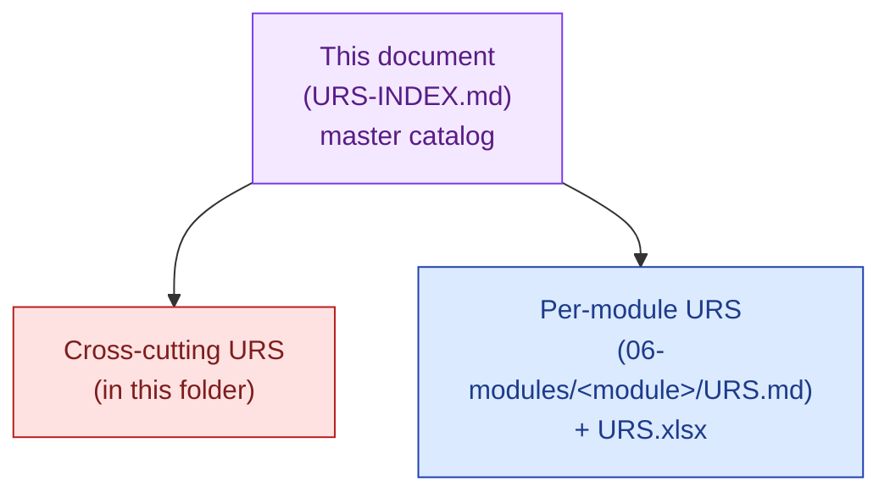

# URS Index

## User Requirements Specifications — Catalog

| Field | Value |
|---|---|
| Owner | Product · Founders |
| Status | v1.0 — 2026-06-05 |
| Purpose | Top-level catalog of all User Requirements Specifications (URS) — per-module + cross-cutting |
| Pairs with | [CORE-PRD.md](../03-prd/CORE-PRD.md) · [PRD-INDEX.md](../03-prd/PRD-INDEX.md) · [GAMP-CAT-4-COMPLIANCE.md §10](../../08-compliance-regulatory/GAMP-CAT-4-COMPLIANCE.md) |

---

## How URS is organized in Doc_V2

| Tier | Location | Purpose |
|---|---|---|
| **Platform-level URS** | This folder (`03-product/02-urs/`) | Cross-cutting requirements that span modules: SSO, audit trail, RBAC, AI governance, accessibility, compliance |
| **Per-module URS** | `06-modules/<module-name>/URS.md` + `URS.xlsx` | Module-specific user requirements with traceability to FRS/Configuration Spec |
| **Customer-side URS** | Authored by the customer per [GAMP-CAT-4-COMPLIANCE.md §10](../../08-compliance-regulatory/GAMP-CAT-4-COMPLIANCE.md#10-urs--user-requirements-specification); Hawkeye provides templates |

---

## Per-module URS catalog

| # | Module | URS | URS.xlsx | DESIGN | ARCHITECTURE | Storybook | Status |
|---|---|---|---|---|---|---|---|
| 1 | **Audit Management** | [URS.md](../../06-modules/audit-management/URS.md) | URS.xlsx | DESIGN.md | ARCHITECTURE.md | STORYBOOK.md | ✅ v1.0 |
| 2 | **Document Control** | [URS.md](../../06-modules/document-control/URS.md) | URS.xlsx | DESIGN.md | ARCHITECTURE.md | STORYBOOK.md | ✅ v1.0 |
| 3 | **CAPA** | [URS.md](../../06-modules/capa/URS.md) | URS.xlsx | DESIGN.md | ARCHITECTURE.md | STORYBOOK.md | ✅ v1.0 |
| 4 | **Deviation** | [URS.md](../../06-modules/deviation/URS.md) | URS.xlsx | DESIGN.md | ARCHITECTURE.md | STORYBOOK.md | ✅ v1.0 |
| 5 | **Change Control** | [URS.md](../../06-modules/change-control/URS.md) | URS.xlsx | DESIGN.md | ARCHITECTURE.md | STORYBOOK.md | ✅ v1.0 |
| 6 | **Training** | [URS.md](../../06-modules/training/URS.md) | URS.xlsx | DESIGN.md | ARCHITECTURE.md | STORYBOOK.md | ✅ v1.0 |
| 7 | **Risk Management** | [URS.md](../../06-modules/risk-management/URS.md) | URS.xlsx | DESIGN.md | ARCHITECTURE.md | STORYBOOK.md | ✅ v1.0 |
| 8 | **Complaint Management** | [URS.md](../../06-modules/complaint-management/URS.md) | URS.xlsx | DESIGN.md | ARCHITECTURE.md | STORYBOOK.md | ✅ v1.0 |
| 9 | **Supplier Prequalification** | [URS.md](../../06-modules/supplier-prequalification/URS.md) | URS.xlsx | DESIGN.md | ARCHITECTURE.md | STORYBOOK.md | ✅ v1.0 |
| 10 | **Equipment Management** | [URS.md](../../06-modules/equipment-management/URS.md) | URS.xlsx | DESIGN.md | ARCHITECTURE.md | STORYBOOK.md | ✅ v1.0 |
| 11 | **Batch Records** | [URS.md](../../06-modules/batch-records/URS.md) | URS.xlsx | DESIGN.md | ARCHITECTURE.md | STORYBOOK.md | ✅ v1.0 |
| 12 | **Management Review** | [URS.md](../../06-modules/management-review/URS.md) | URS.xlsx | DESIGN.md | ARCHITECTURE.md | STORYBOOK.md | ✅ v1.0 |
| 13 | **Design Control** | [URS.md](../../06-modules/design-control/URS.md) | URS.xlsx | DESIGN.md | ARCHITECTURE.md | STORYBOOK.md | ✅ v1.0 |
| 14 | **AskHawk** (AI cross-cutting) | [URS.md](../../06-modules/askhawk/URS.md) | URS.xlsx | DESIGN.md | ARCHITECTURE.md | STORYBOOK.md | ✅ v1.0 |
| 15 | **Marketplace** | [URS.md](../../06-modules/marketplace/URS.md) | URS.xlsx | DESIGN.md | ARCHITECTURE.md | STORYBOOK.md | 🚧 v0.5 |

Master spreadsheet across all modules: [EQMS-URS.xlsx](../../06-modules/EQMS-URS.xlsx).

---

## Cross-cutting URS (platform-level requirements)

These URS items apply across all modules and are referenced by the Core PRD:

| URS-ID | Requirement | Where enforced (Layer) | Verified by |
|---|---|---|---|
| URS-PLT-001 | Multi-tenant logical isolation at the query layer | Layer 1 + Layer 2 | tenantMiddleware OQ |
| URS-PLT-002 | SSO via SAML 2.0 or OIDC from Day 1; MFA enforceable per tenant | Layer 1 | SSO-OQ |
| URS-PLT-003 | RBAC at module and record level | Layer 1 | RBAC-OQ |
| URS-PLT-004 | Tamper-evident audit trail per 21 CFR §11.10(e); cannot be disabled by any user role | Layer 1 + Layer 2 | Audit-trail-OQ |
| URS-PLT-005 | E-signature per 21 CFR §11.50 (name + UTC + meaning) + §11.200 (two distinct components) | Layer 1 | E-sig-OQ |
| URS-PLT-006 | TLS 1.3 in transit · AES-256 at rest · per-tenant encryption keys (BYOK on Enterprise) | Layer 1 | Security-OQ |
| URS-PLT-007 | Data residency election (IN / US / EU) at provisioning | Layer 1 + Layer 2 | Provisioning-OQ |
| URS-PLT-008 | Daily snapshots · 7-day rolling retention (PoC) / 30-day (production) · monthly restore tests | Layer 2 | Backup-OQ |
| URS-PLT-009 | Cite-or-fallback enforced at AI Gateway — AI returns "insufficient evidence" if no source meets confidence threshold | Layer 3 | AI-gateway-OQ |
| URS-PLT-010 | AI Audit Trail captures model · version · promptHash · retrievalSet · confidence · user disposition per AI call | Layer 3 + Layer 2 | AI-audit-trail-OQ |
| URS-PLT-011 | No customer data used for AI training without explicit written consent | Layer 3 | Contractual + vendor config |
| URS-PLT-012 | Human always commits the record; AI never commits a record-state-change action | Layer 3 + Layer 4 | Workflow-OQ |
| URS-PLT-013 | Configuration Layer (vocabularyService, standardRegistryService, WorkflowDefinitionService, universalModuleConfigService) supports per-tenant configuration without code change | Layer 4 | Config-OQ |
| URS-PLT-014 | 5-pillar runtime (Collect → Process → Validate → Report → Seal) consistent across all 15 modules | Layer 4 | Per-module OQ |
| URS-PLT-015 | Multi-persona UI (Buyer · Supplier · Auditor · Auditee · SME · Admin) with role-aware rendering | Layer 5 | UI-OQ |
| URS-PLT-016 | AskHawk conversational agent scoped to tenant; grounded in tenant data + regulatory corpus | Layer 5 + Layer 3 | AskHawk-OQ |
| URS-PLT-017 | WCAG 2.2 AA accessibility target; keyboard-first; screen-reader compatible | Layer 5 | Accessibility-OQ |
| URS-PLT-018 | Print-ready PDF rendering for all signed records | Layer 5 | Print-OQ |
| URS-PLT-019 | API with OpenAPI 3.1 spec · JWT or API-key authenticated · webhook events per module | Layer 4 + Layer 5 | API-OQ |
| URS-PLT-020 | Mobile-responsive web UI; mobile companion app for audit days (planned M9) | Layer 5 | Mobile-OQ |

---

## URS structure per module

Each module's `URS.md` follows this template:

| Section | Content |
|---|---|
| 1. Purpose & Scope | What this module does, for whom |
| 2. Stakeholders | Buyer · Supplier · Auditor · Auditee · SME · Admin |
| 3. Use cases | Primary workflows, with persona |
| 4. Functional requirements | URS-`<MODULE>`-NNN items with MoSCoW priority |
| 5. Non-functional requirements | Performance · security · compliance |
| 6. Regulatory mapping | Which clauses of Part 11 · Annex 11 · ICH apply |
| 7. Interfaces | API · webhook · UI · external |
| 8. Constraints & assumptions | Out of scope; assumptions |
| 9. Acceptance criteria | What "done" looks like |
| 10. Traceability | URS → FRS → IQ/OQ/PQ → VSR |

Each module also ships a parallel `URS.xlsx` for customer convenience (sortable, MoSCoW filter, status column).

---

## How to extend (new module / new vertical pack)

When adding a new module or a vertical pack (e.g., Food, Medical Device):

1. Copy `06-modules/_module-template/` to `06-modules/<new-module>/`
2. Author URS.md per the template above
3. Generate URS.xlsx via the script (`Doc_V2/_scripts/urs-to-excel.mjs`)
4. Author DESIGN.md (UI + persona flows)
5. Author ARCHITECTURE.md (5-pillar walkthrough + code paths)
6. Author STORYBOOK.md (key scenarios)
7. Add to the catalog table above
8. Cross-reference from [CORE-PRD.md §5](../03-prd/CORE-PRD.md) module list

---

## See also

- [CORE-PRD.md](../03-prd/CORE-PRD.md) — platform-level PRD
- [PRD-INDEX.md](../03-prd/PRD-INDEX.md) — feature-level PRDs
- [PERSONAS.md](../01-personas-and-research/PERSONAS.md) — persona definitions
- [GAMP-CAT-4-COMPLIANCE.md](../../08-compliance-regulatory/GAMP-CAT-4-COMPLIANCE.md) — URS in the validation lifecycle
- [06-modules/](../../06-modules/) — all module folders

---

*Doc_V2 · Product · URS Index v1.0*
