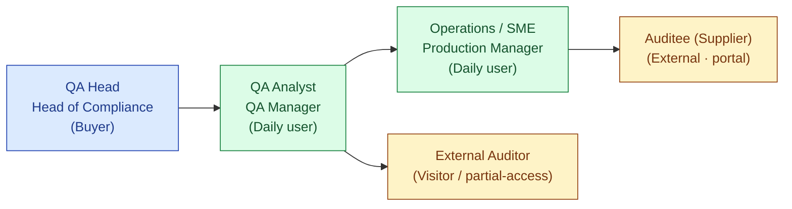
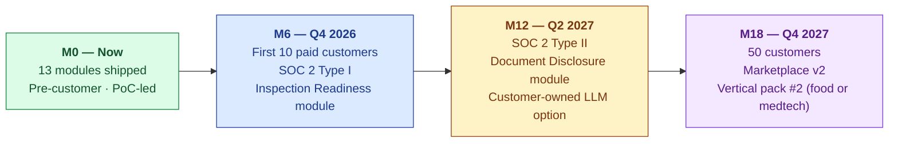

# Core Product Requirements Document

## S.M.A.R.T. Hawk AI-Native EQMS Platform

| Field | Value |
|---|---|
| Owner | Product · Founders |
| Status | v1.0 — 2026-06-05 |
| Scope | Platform-level PRD covering all 13 EQMS modules + cross-cutting capabilities |
| Pairs with | [PRD-INDEX.md](./PRD-INDEX.md) · [URS-INDEX.md](../02-urs/URS-INDEX.md) · [ROADMAP.md](../04-roadmap/ROADMAP.md) · [PRODUCT-OVERVIEW.md](../00-overview/PRODUCT-OVERVIEW.md) |

---

## 1. The product in one paragraph

> 💡 **S.M.A.R.T. Hawk is an AI-native Enterprise Quality Management System (EQMS) for pharmaceutical manufacturers and contract manufacturing organisations (CDMOs).** It replaces the spreadsheet-email-sharedrive sprawl that today consumes 60% of a QA team's time on audit prep, response, and remediation. The platform is built as a GAMP 5 Category 4 configured product across five architectural layers — Trust · Data · AI · Domain · Experience — with grounded AI (cite-or-fallback) at every touchpoint and a human always committing the record.

## 2. Problem statement

A representative Tier-3 CDMO (3 sites, 5 QA staff, 30 audits/year) carries a quality cost burden of ~₹95L (~$115K) annually. The breakdown:

| Cost line | Annual ₹ | Annual $ |
|---|---|---|
| Audit preparation time | 60L | 72K |
| Audit response + CAPA tracking | 18L | 22K |
| External audit-prep consultants | 6–15L | 7–18K |
| Cost of audit findings + remediation | 5–25L | 6–30K |
| **Total** | **~95L** | **~115K** |

The qualitative burden is heavier: weekend war-rooms before regulatory inspections, dread of FDA Form 483 observations, recurring findings every renewal cycle, no defensible source-of-truth for "who changed what, when, why".

## 3. Vision

> 📜 S.M.A.R.T. Hawk is the **regulated-supply-chain compliance engine** whose architecture is industry-agnostic, deployed pharma-first and expanded ring by ring. By 2030 we are the EQMS standard for SMB/mid-pharma globally (10,000+ customers) and have begun to convert into adjacent regulated verticals (food, medical devices, automotive aerospace).

## 4. Target users

| Persona | Role | Daily use | Decision power |
|---|---|---|---|
| **QA Head** | Director of Quality / Head of Compliance | Owns budget; reviews dashboards weekly; signs critical CAPAs | Purchase decision-maker |
| **QA Analyst / Manager** | Day-to-day QA execution | Audit hosting · CAPA tracking · doc reviews | Champion / power user |
| **Operations / SME** | Production manager · process owner | Submits evidence · responds to audits · authors deviations | User |
| **External Auditor** | Customer's audit team or regulator | Conducts on-site or remote audit using portal | External (read-mostly) |
| **Auditee (Supplier)** | Supplier's QA team | Receives audit requests; uploads evidence via portal | External |

Full persona detail: [PERSONAS.md](../01-personas-and-research/PERSONAS.md).

## 5. The 15 default EQMS modules

> ℹ️ **Source of truth.** Module list and code keys verified against `backend/src/models/ModuleConfigModel.js` and `backend/src/services/universalModuleConfigService.js`. The PHARMA_GMP `industryProfile` is the default; other industry profiles (MEDICAL_DEVICE, ISO9001, FOOD_SAFETY, ORGANIC_FARMING, FOREST_COC, REAL_ESTATE, HIGH_TICKET, CUSTOM) enable different default toggle sets.

| # | Code key | Friendly name | Purpose | Default ON for PHARMA_GMP |
|---|---|---|---|---|
| 1 | `AUDIT_MANAGEMENT` | **Audit Management** | Host + conduct supplier audits end-to-end | ✅ |
| 2 | `DOCUMENT_CONTROL` | **Document Control** | SOPs, work instructions, validation packages | ✅ |
| 3 | `CAPA_MANAGEMENT` | **CAPA** | Corrective + preventive action tracking | ✅ |
| 4 | `CHANGE_CONTROL` | **Change Control** | Process / equipment / document change governance | toggle |
| 5 | `EVENT_MANAGEMENT` | **Deviation & Event** | Manufacturing deviations, quality events, investigations | toggle |
| 6 | `TRAINING_MANAGEMENT` | **Training Management** | Personnel training + competency tracking | toggle |
| 7 | `RISK_MANAGEMENT` | **Risk Management** | ICH Q9-aligned risk assessment + FMEA | toggle |
| 8 | `SUPPLIER_QUALITY` | **Supplier Quality** | Approved supplier list + qualification + scorecards | ✅ |
| 9 | `MANAGEMENT_REVIEW` | **Management Review** | Quarterly Management Review (ICH Q10) | toggle |
| 10 | `ASSET_MANAGEMENT` | **Asset & Equipment Management** | Equipment master + calibration scheduling + asset lifecycle | toggle |
| 11 | `CHAIN_OF_CUSTODY` | **Chain of Custody** | Material / batch / sample chain of custody (multi-vertical) | toggle |
| 12 | `TRANSACTION_REVIEW` | **Transaction Review** | High-ticket / regulated transaction review workflows | toggle |
| 13 | `REGULATORY_INTEL` | **Regulatory Intelligence** | Public-data fusion (openFDA, EDQM, EudraGMDP, PharmaCompass) | ✅ |
| 14 | `AI_ASSISTANT` | **AskHawk (AI Assistant)** | Cross-cutting conversational agent across all modules | ✅ |
| 15 | `RFQ_PROCUREMENT` | **RFQ & Procurement** | Request-for-quote + procurement governance (thin v1) | ✅ |

**Module bundling** (per `universalModuleConfigService.MODULE_BUNDLES`):
- Enabling `SUPPLIER_QUALITY` force-enables `CAPA_MANAGEMENT` + `EVENT_MANAGEMENT` + `AUDIT_MANAGEMENT` (supplier findings need somewhere to land)
- Enabling `AUDIT_MANAGEMENT` force-enables `CAPA_MANAGEMENT` + `DOCUMENT_CONTROL`
- Enabling `RFQ_PROCUREMENT` force-enables `SUPPLIER_QUALITY`

**Roadmap modules (not yet in default config):**
- **Inspection Readiness** — regulator-facing portal + pack generation (planned M12)
- **Document Disclosure** — controlled external sharing (planned M18)

> ⚠️ **Honesty register.** Modules vary in maturity. AUDIT_MANAGEMENT · DOCUMENT_CONTROL · CAPA_MANAGEMENT · SUPPLIER_QUALITY · AI_ASSISTANT are the most-built. TRAINING_MANAGEMENT · MANAGEMENT_REVIEW · EVENT_MANAGEMENT are functional but less mature. RFQ_PROCUREMENT is **thin** (framework only). Live shared-audit marketplace component within Audit Management is a roadmap bet, not built-network.

Per-module detailed URS/DESIGN/ARCHITECTURE: [URS-INDEX.md](../02-urs/URS-INDEX.md).

## 6. The 5 sharpened value propositions

| # | Value | Quantified outcome |
|---|---|---|
| 1 | **40% audit-prep cost reduction** | Payback < 4 months on ₹95L baseline |
| 2 | **GAMP 5 Category 4 configured product** | ~60% less validation effort vs Cat 5 bespoke |
| 3 | **Part 11 + Annex 11 + ALCOA+ by design** | 100% e-sig attribute coverage · 9 ALCOA+ attributes · tamper-evident audit trail |
| 4 | **Trust-First Layer 1 architecture** | Per-tenant isolation · zero AI training on customer data · IN/US/EU residency |
| 5 | **Cite-or-fallback grounded AI** | 100% of AI claims trace to source · zero hallucinated citations |

## 7. Architectural envelope (functional requirements)

| Requirement | Specification |
|---|---|
| Multi-tenancy | Single code base, row-level tenant isolation, ~100 tenants per deployment |
| Concurrency | 100+ concurrent users per tenant, 1000+ records per audit |
| Audit volume | Support 1,000+ audits/year per tenant |
| Document volume | 100,000+ controlled documents per tenant |
| Retention | ≥10 years configurable; ≥30 years for batch records |
| Data residency | India (Mumbai), US-East, EU-Frankfurt — customer elects at provisioning |
| Uptime SLA | 99.5% (PoC), 99.9% (Enterprise) |
| API response (p95) | <500ms for read; <2s for AI-assisted draft generation |
| Audit-trail query (p95) | <2s for any record's full lineage |
| Backup | Daily snapshots · monthly restore test · 7-day rolling (PoC) / 30-day (production) |
| Disaster recovery | RTO <4 hours · RPO <24 hours |

## 8. Non-functional requirements

| Category | Requirement |
|---|---|
| **Security** | TLS 1.3 in transit · AES-256 at rest · per-tenant encryption keys (BYOK on Enterprise) · SSO (SAML/OIDC) · MFA enforceable · RBAC at record level |
| **Compliance** | GAMP 5 Cat 4 · 21 CFR Part 11 · EU GMP Annex 11 (2011 + 2026 revision) · MHRA ALCOA+ (9 attributes) · FDA CSA · ICH Q9/Q10 · India DPDP Act · EU GDPR |
| **AI governance** | Cite-or-fallback enforced at AI Gateway · AI Audit Trail (model + version + promptHash + retrievalSet + confidence + user disposition per call) · zero training on customer data without consent · FDA GMLP 10 Principles + EMA AI Reflection Paper alignment |
| **Accessibility** | WCAG 2.2 AA target; keyboard-first navigation; screen-reader compatible · accessibility considerations for e-signature ceremony |
| **Observability** | Per-tenant metrics dashboard · Sentry error reporting · structured logs with correlation IDs · public status page |

## 9. Out of scope (deliberately)

| Out of scope | Why |
|---|---|
| Clinical trial management (CTMS) | Different regulatory regime (GCP); not our beachhead |
| Drug development workflow | S.M.A.R.T. Hawk is downstream of R&D; we serve manufacturing + supply chain |
| Manufacturing execution (MES) | Adjacent but distinct — S.M.A.R.T. Hawk integrates with MES, doesn't replace it |
| Laboratory information management (LIMS) | Adjacent — S.M.A.R.T. Hawk integrates with LIMS |
| Patient-facing applications | Regulatory regime differs (SaMD); not our beachhead |
| Custom on-prem deployments at Tier 4 SME tier | TCO doesn't work below Enterprise tier |

## 10. Release strategy

Detailed quarter-by-quarter roadmap: [ROADMAP.md](../04-roadmap/ROADMAP.md).

## 11. Success metrics

| Layer | Metric | Target (12 months) |
|---|---|---|
| **Adoption** | Active tenants | 10 (then 50 by M24) |
| **Adoption** | Monthly active QA users / tenant | 8+ |
| **Adoption** | Audits hosted per tenant per year | 25+ |
| **Value** | Audit-prep time reduction (PoC measurement) | ≥40% |
| **Value** | Customer-reported NPS | ≥40 |
| **Value** | Customer logo retention | 92%+ |
| **Value** | Net dollar retention | 110%+ |
| **Trust** | Critical security incidents | 0 |
| **Trust** | Data breaches | 0 |
| **Trust** | Customer audits passed (annual right-to-audit) | 100% |
| **AI quality** | AI-drafted findings citation rate | 100% |
| **AI quality** | AI hallucination incidents | 0 |
| **AI quality** | Customer AI disposition rate (accepted + edited) | ≥75% |

## 12. Open product questions

> ⚠️ **Things we deliberately have not yet decided.** These map to upcoming PDRs in [DECISIONS-INDEX.md](../05-decisions/DECISIONS-INDEX.md).
>
> 1. Per-tenant LLM customization vs single shared multi-LLM gateway (cost vs personalization)
> 2. Mobile-first vs web-first roadmap balance (audit days vs day-to-day)
> 3. Marketplace v2 economics (per-audit fee vs platform fee)
> 4. When to ship a second vertical pack (food vs med-device first?)
> 5. Self-serve onboarding vs hands-on (the moment to introduce Sandbox tier broadly)
> 6. AI fine-tuning on customer corpus (opt-in feature?)

## 13. Companion documents

- [PRODUCT-OVERVIEW.md](../00-overview/PRODUCT-OVERVIEW.md) — short product narrative
- [PERSONAS.md](../01-personas-and-research/PERSONAS.md) — persona detail
- [URS-INDEX.md](../02-urs/URS-INDEX.md) — per-module URS
- [PRD-INDEX.md](./PRD-INDEX.md) — per-feature PRDs
- [ROADMAP.md](../04-roadmap/ROADMAP.md) — quarter-by-quarter
- [DECISIONS-INDEX.md](../05-decisions/DECISIONS-INDEX.md) — product decision records
- [VISION.md](../../01-strategy/vision-and-positioning/VISION.md) — strategic positioning
- [PLATFORM-OVERVIEW.md](../../04-engineering/00-overview/PLATFORM-OVERVIEW.md) — engineering reference

---

*Doc_V2 · Product · Core PRD v1.0 · 2026-06-05*
