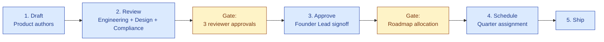

# PRD Index

| Field | Value |
|---|---|
| Owner | Product |
| Status | v1.0 — 2026-06-05 |
| Purpose | Catalog of feature-level Product Requirements Documents |
| Pairs with | [CORE-PRD.md](./CORE-PRD.md) · [URS-INDEX.md](../02-urs/URS-INDEX.md) · [ROADMAP.md](../04-roadmap/ROADMAP.md) |

---

## How PRDs are organized

**S.M.A.R.T. Hawk uses a two-tier PRD model:**

1. **Core PRD ([CORE-PRD.md](./CORE-PRD.md))** — platform-level requirements covering all 15 modules + cross-cutting capabilities
2. **Feature PRDs (this index)** — focused PRDs for specific feature shipments or experiments

**Per-module deep specs** (URS + DESIGN + ARCHITECTURE) live under [06-modules/](../../06-modules/), not here. This index lists only PRDs that span modules or introduce platform-level capabilities.

---

## PRD index

| # | PRD | Status | Target ship | Module(s) affected |
|---|---|---|---|---|
| 0 | [CORE-PRD.md](./CORE-PRD.md) | ✅ v1.0 | n/a (canonical) | Platform-wide |
| 1 | *Inspection Readiness — regulator-facing portal* | 📝 To draft | M12 (Q2 2027) | Audit · Doc Control · CAPA |
| 2 | *Document Disclosure — controlled external sharing* | 📝 To draft | M18 (Q4 2027) | Doc Control · Supplier Mgmt |
| 3 | *Mobile companion app — audit-day workflow* | 📝 To draft | M9 (Q1 2027) | Audit · Doc Control |
| 4 | *Marketplace v2 — supplier discovery + per-audit billing* | 📝 To draft | M18 (Q4 2027) | Supplier Mgmt · Marketplace |
| 5 | *AskHawk App Wizard — natural-language workflow authoring* | ✅ Shipped (M0) | M0 | Cross-cutting (AskHawk) |
| 6 | *Vertical Pack #2 — Food or Medical Device* | 📝 To scope | M18+ | Platform (configuration layer) |
| 7 | *Customer-owned LLM option (Enterprise tier)* | 📝 To draft | M12 (Q2 2027) | AI Gateway (Layer 3) |
| 8 | *Validation Accelerator Package — customer self-service portal* | 📝 To draft | M9 (Q1 2027) | Compliance (Layer 1) |
| 9 | *AI Drift Monitor — production observability* | 📝 To draft | M12 (Q2 2027) | AI Gateway · AI Audit Trail |
| 10 | *Active Learning Loop — customer-correction feedback into prompts* | ✅ Shipped (M0) | M0 | AI Gateway |

> ℹ️ **Status legend.** ✅ Shipped · 🚧 In flight · 📝 To draft · 🎯 Approved for next quarter

---

## PRD template

Every PRD follows this structure (matching the Core PRD):

| Section | Content |
|---|---|
| 1. Problem statement | What problem does this solve, for whom |
| 2. Goals & non-goals | Explicit scope |
| 3. Users + personas affected | Cross-reference [PERSONAS.md](../01-personas-and-research/PERSONAS.md) |
| 4. User stories | "As a … I want … so that …" |
| 5. Functional requirements | What the feature must do |
| 6. Non-functional requirements | Performance · security · compliance |
| 7. UX / design considerations | Cross-reference [05-design/](../../05-design/) |
| 8. Architecture impact | Cross-reference [04-engineering/](../../04-engineering/) |
| 9. Compliance impact | Cross-reference [08-compliance-regulatory/](../../08-compliance-regulatory/) |
| 10. Success metrics | Adoption · value · trust |
| 11. Open questions | What we don't yet know |
| 12. Release plan | Phasing · feature flag · rollout |

A blank template is available at `_prd-template.md` (forthcoming).

---

## How a PRD gets approved

| Stage | Approver | SLA |
|---|---|---|
| Draft | Product | n/a |
| Engineering review | Engineering lead | 5 business days |
| Design review | Design lead | 5 business days |
| Compliance review | Compliance lead (if Layer 1 impact) | 5 business days |
| Founder approval | Founder Lead | 3 business days post-reviews |
| Roadmap allocation | Product + Founder | Quarterly planning |

---

## See also

- [CORE-PRD.md](./CORE-PRD.md) — platform-level requirements
- [URS-INDEX.md](../02-urs/URS-INDEX.md) — per-module URS
- [ROADMAP.md](../04-roadmap/ROADMAP.md) — quarterly delivery schedule
- [DECISIONS-INDEX.md](../05-decisions/DECISIONS-INDEX.md) — product decision records
- [06-modules/](../../06-modules/) — per-module deep specs

---

*Doc_V2 · Product · PRD Index v1.0*
