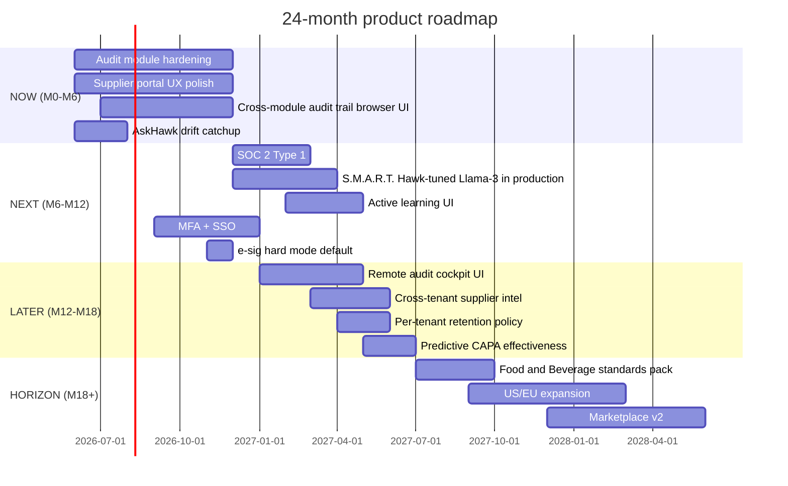
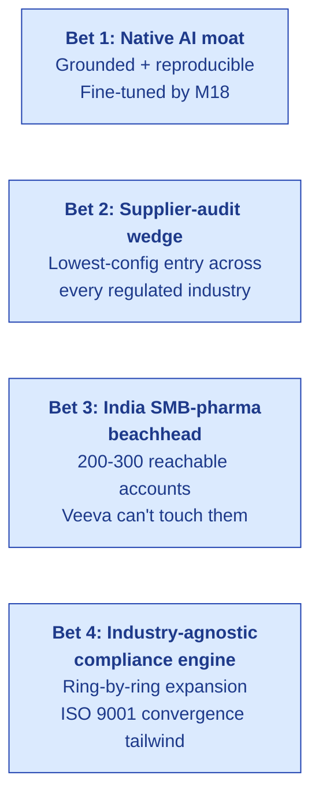
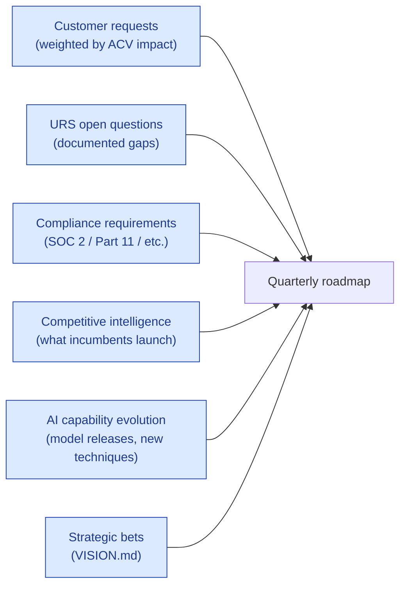

# Product Roadmap

| Field | Value |
|---|---|
| Owner | Product (Founders + PM) |
| Status | v1.0 |
| Last updated | 2026-05-31 |
| Cadence | Quarterly review + adjust |

---

## 1. Roadmap horizons

## 2. NOW (M0–M6) — June-November 2026

Theme: **Harden the audit module + close drift + prep for SOC 2.**

| # | Deliverable | Owner | Status |
|---|---|---|---|
| 1 | Audit module — close 9 known engineering gaps (URS open questions 1-9) | Eng | In progress |
| 2 | Supplier portal UX polish (response forms, section assignment, status board) | Eng + Product | In progress |
| 3 | Cross-module audit trail browser UI | Eng | Foundation exists; UI new |
| 4 | AskHawk docs DRIFT catchup (3 askhawk/ docs refresh) | Docs | Banners added; refresh pending |
| 5 | Pre-SOC 2 hygiene (access reviews, security policies, vendor list) | Security | Planning |
| 6 | First 5 reference customers (in PoC or paid) | GTM | Pre-PoC |

## 3. NEXT (M6–M12) — December 2026-May 2027

Theme: **AI defensibility + security maturity + Seed-trigger milestones.**

| # | Deliverable | Owner | Why |
|---|---|---|---|
| 1 | SOC 2 Type 1 certified | Security | Enterprise prospect prerequisite |
| 2 | S.M.A.R.T. Hawk-tuned Llama-3 in production (low-stakes tasks) | AI Eng | The fine-tune moat path |
| 3 | Active-learning loop UI (variant proposal + A/B test) | AI Eng | Continuous improvement |
| 4 | MFA + SSO (TOTP + SAML/Okta/Azure AD) | Security | Enterprise + Part 11 §11.200(a)(1) |
| 5 | E-sig hard mode default for production tenants | Eng | Part 11 §11.10(j) production-readiness |
| 6 | First 10 paying customers + 3 named references | GTM | Seed-round narrative |
| 7 | Validation summary packages for first 5 customers | Compliance | Tenant-side IQ/OQ/PQ |
| 8 | Demo environment + onboarding tutorial for self-serve | Product | Sales velocity |

## 4. LATER (M12–M18) — June-November 2027

Theme: **Differentiator features + Seed close.**

| # | Deliverable | Owner | Why |
|---|---|---|---|
| 1 | Remote audit cockpit UI (URS-B-001: video + screen-share + annotation) | Eng + Design | The wedge feature no incumbent ships |
| 2 | Cross-tenant supplier intel UI (with consent — URS-B-006) | Eng | Network-effects moat |
| 3 | Per-tenant retention policy enforcement | Eng | Compliance maturity |
| 4 | Predictive CAPA effectiveness model wired to drafter | AI Eng | Reduce re-litigation cycles |
| 5 | Per-tenant configurable dashboards | Product | Customer customization |
| 6 | Seed round close ($3-5M @ $20M post) | Founders | Trigger via $250-400K ARR |
| 7 | First non-pharma customer signed (Food & Beverage prospect) | GTM | Vertical-2 traction |
| 8 | Public API v1 + partner portal | Eng | Channel partner enablement |

## 5. HORIZON (M18+) — Post-Seed

Theme: **Vertical expansion + geographic expansion + network economics.**

| Phase | Quarter | Focus |
|---|---|---|
| M18-M24 | Q3-Q4 2027 | Food & Beverage standards pack (HACCP / FSSC 22000); first 5 F&B customers |
| M24-M30 | Q1-Q2 2028 | US/EU geographic expansion; multi-region hosting; first 10 US customers |
| M30-M36 | Q3-Q4 2028 | Marketplace v2 (auditor matching + supplier network economics); Series A close |
| M36+ | 2029+ | Med-device QMSR migration vertical; Automotive supplier-audit wedge; Aerospace (post ISO 9001:2026 convergence) |

## 6. The 4 strategic bets driving this roadmap

| Bet | Validates by | Kills it if |
|---|---|---|
| 1 — Native AI moat | M18: fine-tuned model in prod + 60% cost reduction vs API + customer feedback on AI quality | Fine-tune doesn't outperform API for our tasks |
| 2 — Supplier-audit wedge | M12: 10 customers landed via supplier-audit; expansion into 2+ other modules per customer | Customers buy as 1-module standalone; no expansion |
| 3 — India SMB-pharma beachhead | M18: 25-35 paying customers from India Tier 2/3 | <10 customers; conversion rates too low |
| 4 — Industry-agnostic engine | M24: first non-pharma customer signed using <30% custom config | Food vertical needs >50% custom code |

## 7. What's NOT on the roadmap (and why)

> 🚫 **Things we will NOT pursue in the 24-month window.**

| Not doing | Why |
|---|---|
| Veeva displacement in Tier 1 pharma | Wrong fight; long cycles; we lose on validation history |
| On-prem deployment as default | Cloud-first wins SMB; on-prem is opt-in for sovereignty customers Post-Series A |
| Custom-built vertical "products" (separate codebases) | Defeats the engine-plus-config thesis; vertical packs only |
| Free tier / freemium | Erodes value-share pricing; PoC IS the trial |
| Mobile-first redesign | Desktop-first; mobile companion app considered Post-Series A |
| Open-source community edition | Distribution potential but distracts from enterprise focus |
| Marketplace network at scale | Need supply-side critical mass first (post-Series A) |
| Custom AI model per tenant | Won't scale; fine-tune on aggregated corpus instead |

## 8. Roadmap inputs (where the next features come from)

## 9. Revision cadence

- **Weekly:** sprint planning (engineering)
- **Bi-weekly:** product review (founders + product)
- **Monthly:** customer feedback synthesis + roadmap re-prioritization
- **Quarterly:** full roadmap revision + stakeholder alignment
- **Yearly:** strategy refresh + 24-month horizon update

## 10. Open product decisions (need founder alignment)

1. **AskHawk + Compliance Copilot consolidation** — single AI surface or keep two?
2. **Module pricing** — all-or-nothing or a-la-carte tiers?
3. **Auditor-firm tier** — separate pricing for auditor-firm accounts (multi-tenant scale)?
4. **PAYG add-ons** — pay-per-audit overage for usage spikes?
5. **Customer-facing AI prompts** — let tenants customize AskHawk system prompts?

---

## See also

- [PRODUCT-OVERVIEW.md](../00-overview/PRODUCT-OVERVIEW.md)
- [PERSONAS.md](../01-personas-and-research/PERSONAS.md)
- [VISION.md](../../01-strategy/vision-and-positioning/VISION.md) — strategic bets
- [GTM-PLAN.md §12](../../01-strategy/gtm-strategy/GTM-PLAN.md#12-pre-series-a-milestone-targets) — milestone alignment
- [BUSINESS-PLAN.md §4](../../02-fundraising/business-plan/BUSINESS-PLAN.md#4-team-build) — team build supporting the roadmap
- `backend/docs/11-roadmap/URS-v1.0-DRAFT.pdf` (legacy) — full URS source
