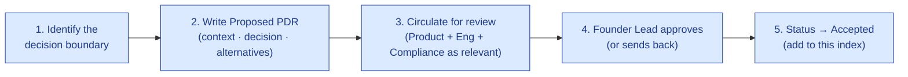

# Product Decision Records — Index

| Field | Value |
|---|---|
| Owner | Product · Founders |
| Status | v1.0 — 2026-06-05 |
| Purpose | Index of Product Decision Records (PDRs) — significant product choices, the alternatives considered, and the rationale |
| Pairs with | [CORE-PRD.md](../03-prd/CORE-PRD.md) · [04-engineering/08-adrs/ADR-INDEX.md](../../04-engineering/08-adrs/ADR-INDEX.md) (engineering ADRs) |

---

## What is a PDR vs an ADR?

| | Product Decision Record (PDR) | Architecture Decision Record (ADR) |
|---|---|---|
| **Scope** | Product/business decisions (what to build, what to charge, who to serve) | Engineering/architecture decisions (how to build it) |
| **Owner** | Product + Founders | Engineering + Founders |
| **Location** | `03-product/05-decisions/` | `04-engineering/08-adrs/` |
| **Naming** | `PDR-NNN-<slug>.md` | `ADR-NNN-<slug>.md` |
| **Status options** | Proposed · Accepted · Superseded · Deprecated | Same |

A decision is significant enough to warrant a PDR/ADR when:

- It costs >$5K to reverse, OR
- It commits us to a customer for >12 months, OR
- It rules out a meaningful alternative path, OR
- It would surprise a new team member who joins later

---

## PDR Index

| # | Title | Status | Owner | Date |
|---|---|---|---|---|
| 001 | [PDR-001 — No production freemium tier (Sandbox + PoC instead)](./PDR-001-no-production-freemium.md) | Accepted | Product · Founders | 2026-06-01 |
| 002 | [PDR-002 — GAMP Cat 4 classification as a product commitment](./PDR-002-gamp-cat-4-commitment.md) | Accepted | Product · Founders · Compliance | 2026-06-05 |
| 003 | *Three-tier packaging (Starter / Growth / Enterprise) — not five tiers* | 📝 To draft | Product · Founders | (2026-05) |
| 004 | *Cloudflare R2 default storage; multi-provider via S3-compatible interface* | 📝 To draft | Product + Engineering | (2026-06) |
| 005 | *Reverse the no-freemium principle by adding the Sandbox tier* | 📝 To draft | Product · Founders | (2026-06) |
| 006 | *AskHawk is a cross-cutting agent, not a standalone module* | 📝 To draft | Product | (2026-04) |
| 007 | *Per-tenant LLM customization deferred to M12+* | 📝 To draft | Product · Engineering | (2026-06) |
| 008 | *India residency is mandatory default; not premium add-on* | 📝 To draft | Product | (2026-05) |
| 009 | *Mobile companion app deferred to M9; web-mobile-responsive first* | 📝 To draft | Product | (2026-06) |
| 010 | *Pharma is the only shipped vertical pack until ≥50 paid pharma customers* | 📝 To draft | Product · Founders | (2026-05) |

> ℹ️ **Status legend.** ✅ Accepted · 🚧 Proposed · 📝 To draft (decision made, doc not yet written) · ❌ Superseded

---

## PDR template

Each PDR follows this structure:

| Section | Content |
|---|---|
| 1. Status | Proposed · Accepted · Superseded · Deprecated |
| 2. Context | Why are we deciding this now? What is the situation? |
| 3. Decision | What did we decide? (One paragraph max) |
| 4. Alternatives considered | Each alternative with pros/cons |
| 5. Rationale | Why this option over the others |
| 6. Consequences | What follows from this decision (positive + negative) |
| 7. Compliance + commercial implications | Cross-references to other docs |
| 8. When to revisit | What signal would cause us to reopen this decision |
| 9. References | Documents, conversations, data that informed the decision |

A blank template is available at `_pdr-template.md` (to be added).

---

## How to write a PDR

**SLA:** PDR review cycle is 5 business days from circulation to approval. Significant cross-functional decisions may require a 30-minute review meeting.

---

## How decisions get superseded

When a decision changes (e.g., the no-freemium principle was reversed by adding the Sandbox tier in PDR-005):

1. Don't delete the original PDR.
2. Change its status to `Superseded by PDR-NNN`.
3. The new PDR's `Rationale` section explicitly references and justifies superseding the prior decision.
4. Cross-link updates in this index.

This preserves the decision history — invaluable when a future team member asks "why did we choose this?"

---

## See also

- [CORE-PRD.md](../03-prd/CORE-PRD.md) — platform-level product requirements (many decisions trace from here)
- [PRD-INDEX.md](../03-prd/PRD-INDEX.md) — feature-level PRDs
- [ADR-INDEX.md](../../04-engineering/08-adrs/ADR-INDEX.md) — engineering architecture decisions
- [PRICING.md](../../01-strategy/pricing-and-packaging/PRICING.md) — pricing principles (relates to several PDRs)
- [GAMP-CAT-4-COMPLIANCE.md](../../08-compliance-regulatory/GAMP-CAT-4-COMPLIANCE.md) — compliance commitments (relates to PDR-002)

---

*Doc_V2 · Product · Decisions Index v1.0*
