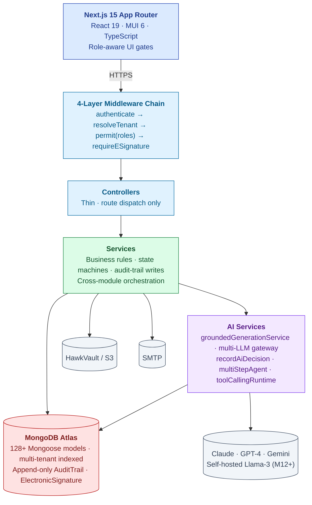
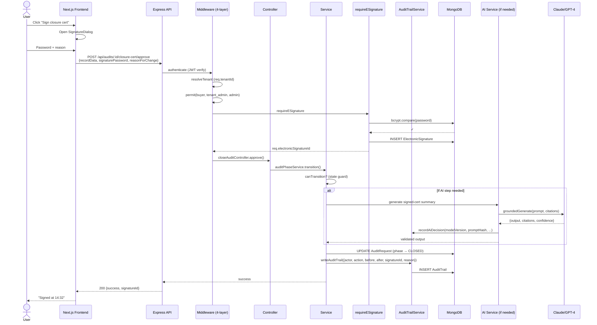
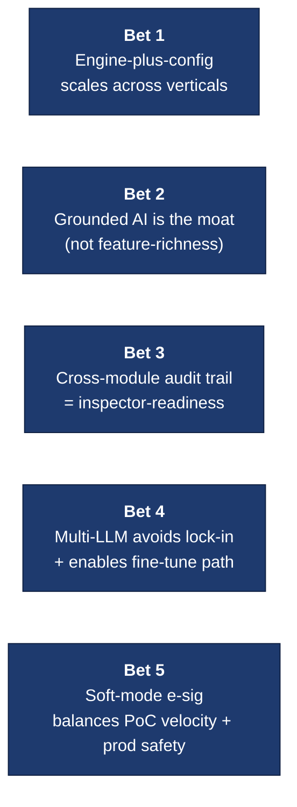

# Platform Architecture — Engineering View

| Field | Value |
|---|---|
| Audience | CTO · Senior Engineer · Architect |
| Length | 1 page · 5 min read |
| Last updated | 2026-05-31 |
| Companion docs | [PLATFORM-EXECUTIVE.md](PLATFORM-EXECUTIVE.md) · [PLATFORM-USER-FLOWS.md](PLATFORM-USER-FLOWS.md) · [PLATFORM-OVERVIEW.md](PLATFORM-OVERVIEW.md) (full ref) |

---

> 💡 **The one-line summary.** Express monolith over MongoDB with 4-layer middleware (auth/tenant/RBAC/e-sig), grounded multi-LLM AI gateway, cross-module immutable audit trail. Next.js frontend. Multi-tenant from day one. 128+ Mongoose models. Architecture intentionally boring so business logic can be interesting.

---

## The Layered Stack

---

## The Engineering Principles (the ones we don't violate)

| # | Principle | Implication |
|---|---|---|
| 1 | **Multi-tenant from day one** | Every record has `tenantOrgId`; service-layer query helpers enforce scope; cross-tenant access only via `Affiliation` records |
| 2 | **Every state change writes audit trail** | `auditTrailService.writeAuditTrail()` is the single non-skippable path; mandatory `reasonForChange` ≥10 chars |
| 3 | **Every AI output is grounded + cited + confidence-scored** | `groundedGenerationService` enforces citations; floor 0.6; skeleton fallback if low |
| 4 | **Forward-only state machines unless explicit revert** | `canTransition()` validates gate prerequisites; revert requires reason + RBAC |
| 5 | **Configurable over code-changed** | New vertical = standards pack + templates, not a fork |
| 6 | **No client-side authority** | All RBAC decisions on server; frontend gates are UX-only |
| 7 | **Honest error envelopes** | 403 includes diagnostic `details.hint` explaining why (`TENANT_MISMATCH`, `RBAC_DENIED`, `ESIG_REQUIRED`) |

---

## Per-Request Data Flow (the canonical path)

*A single click traverses 4 middleware layers, mints an e-signature, writes business state + audit-trail in transaction, optionally invokes AI with its own grounded gen + audit-trail. Every layer is testable. Every step is reproducible.*

---

## Tech Stack (versions + why)

| Layer | Tech | Why this, not the alternative |
|---|---|---|
| Frontend framework | **Next.js 15 App Router** | Server components + client islands; SSR for SEO; mature ecosystem |
| UI | **MUI 6 + React 19 + TypeScript** | Boring, productive; type safety; theme-able |
| Backend | **Node.js 20 + Express** | Same language as frontend; mature middleware; team velocity |
| Database | **MongoDB Atlas (M10+)** | Document model fits per-module schema variance; multi-tenant via `tenantOrgId` indexed; horizontal scaling later |
| ORM | **Mongoose** | Schema validation + hooks for audit trail; indexes per-model |
| Auth | **Custom JWT + bcrypt** | Cost; will migrate to managed (Auth0/Clerk) when scale demands |
| File storage | **AWS S3 (HawkVault wrapper)** | Tenant-prefixed buckets; standard ACLs |
| AI inference | **Multi-LLM gateway** (Anthropic / OpenAI / Gemini) | No provider lock-in; route by task; cost optimization |
| Hosting | **Vercel (FE) + Render/Railway (BE)** | Fast iteration; AWS migration M12+ for sovereignty |
| Observability | **Sentry + audit-trail** | Errors + regulatory observability |

---

## Key Tradeoffs (the ones we've made)

| Decision | Why we chose it | Cost |
|---|---|---|
| **Monolith over microservices** | Pre-product-market-fit; iteration speed > service boundaries | Need to monitor when this breaks |
| **Document DB over relational** | Per-module schema variance fits document model; faster iteration | Cross-module joins harder; mitigated with denormalization |
| **JS on backend (not TS)** | Team velocity; LLM-friendly | Less type safety; lint + tests must catch what types would |
| **Mongo for embeddings (vs pgvector)** | One DB; simpler ops | Won't scale past ~100K chunks; migration planned |
| **Multi-LLM gateway (vs single)** | No lock-in; per-task routing | More config complexity; gateway abstraction must be solid |
| **Soft-mode e-sig default** | PoC velocity; customers can opt to hard | Production-readiness flip planned Q4 2026 |

---

## Known Engineering Debt

| Debt | Impact | Plan |
|---|---|---|
| Dual status fields (`trackStatus` text vs `phaseState` structured) | Drift risk | Burn down `trackStatus` callers, drop field M12 |
| No MFA / SSO yet | Enterprise blocker | Q3 2026 (TOTP) + Q4 (SAML) |
| Soft-mode e-sig default | Part 11 strict-mode pending | Q4 2026 — flip default to hard for prod tenants |
| Mongo cosine for AI embeddings | Won't scale past ~100K chunks | pgvector migration M18+ |
| LLM gateway no streaming | High-latency UX for long outputs | Q1 2027 |
| TSA cryptographic timestamp not anchored | Audit-trail integrity beyond DB | Q2 2027 |

---

## Where The Architectural Bets Are Concentrated

| Bet | Validates by | Kills it if |
|---|---|---|
| 1 (engine-plus-config) | M24: first non-pharma customer with <30% custom config | Food vertical needs >50% code changes |
| 2 (grounded AI) | M18: AI acceptance rate > 70% across observation drafter | Customer feedback says AI quality is generic |
| 3 (audit trail) | First customer regulator inspection answered in <1 day | Cross-entity queries timeout or miss data |
| 4 (multi-LLM) | M18: fine-tuned model in prod at <50% cost of API | Fine-tune underperforms API for our tasks |
| 5 (soft-mode e-sig) | First customer accepts soft-mode for PoC, flips to hard for prod | Customer refuses without hard-mode default |

---

## How To Onboard An Engineer In Week 1

1. Read this doc (5 min) + [PLATFORM-OVERVIEW.md](PLATFORM-OVERVIEW.md) (15 min)
2. Read one module: [audit-management/ARCHITECTURE.md](../../06-modules/audit-management/ARCHITECTURE.md) (15 min)
3. Read the AI architecture: [AI-ARCHITECTURE.md](../07-ai/AI-ARCHITECTURE.md) (20 min)
4. Read security: [SECURITY.md](../06-security/SECURITY.md) (15 min)
5. Read 4 source files in this order:
   - `backend/src/middlewares/{auth,role,tenant,requireESignature}Middleware.js` (the 4-layer chain — read these together)
   - `backend/src/services/auditTrailService.js` (the audit trail)
   - `backend/src/services/groundedGenerationService.js` (the AI grounding)
   - `backend/src/services/ai/wave2/multiStepAgent.js` (the wizard runtime)
6. Run the local backend + frontend, make a trivial PR (typo fix in a module)

---

## See Also

- [PLATFORM-OVERVIEW.md](PLATFORM-OVERVIEW.md) — full reference
- [DATA-MODEL.md](../02-data-model/DATA-MODEL.md) — 128+ entities
- [API-CONTRACTS.md](../03-api-contracts/API-CONTRACTS.md) — REST conventions
- [SECURITY.md](../06-security/SECURITY.md) — Part 11 spine
- [AI-ARCHITECTURE.md](../07-ai/AI-ARCHITECTURE.md) — multi-LLM + grounding + agents

---

*Doc_V2 · Platform Architecture · Engineering · 1 page*
