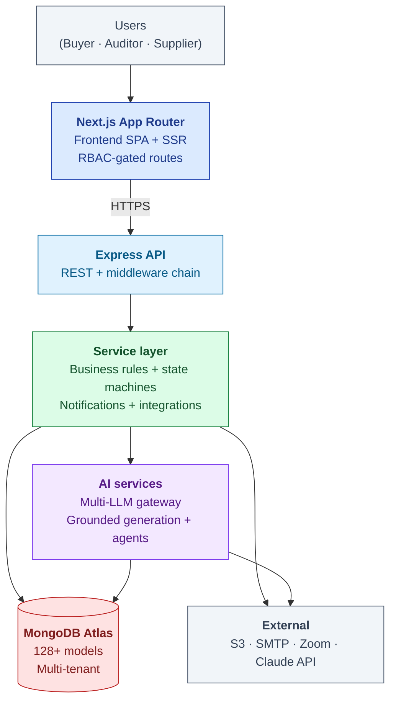
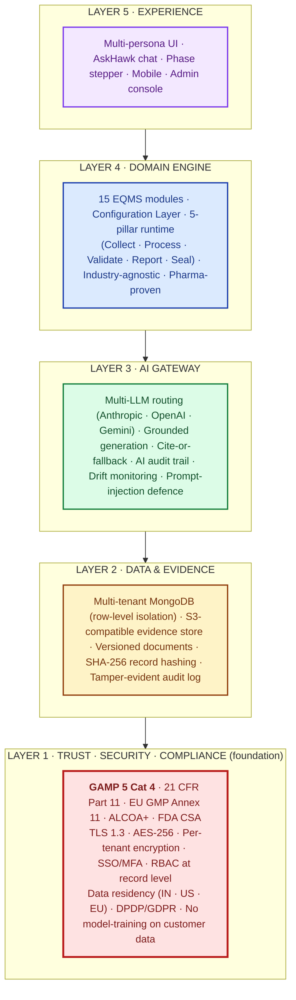
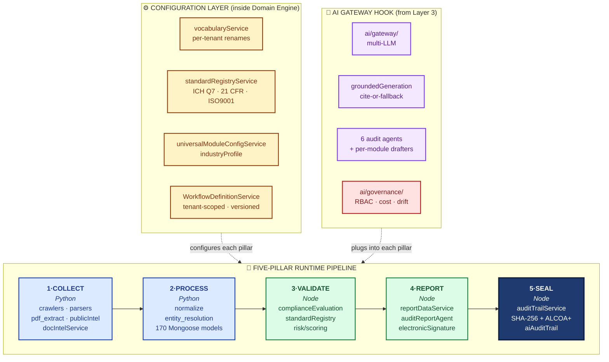
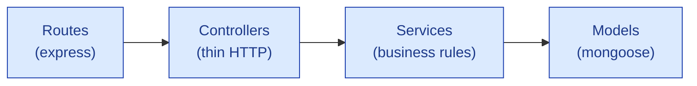

# Platform Overview

| Field | Value |
|---|---|
| Owner | CTO + Founding engineers |
| Status | v1.0 |
| Last updated | 2026-05-31 |
| Source | pillars-architecture-VERIFIED.pdf + audit-management/ARCHITECTURE.md + live code inspection |

---

## 1. What Hawkeye is, technically



## 2. The Hawkeye 5-Layer Architecture

Hawkeye is built as **five layers**, with **Trust · Security · Compliance as Layer 1 — the foundation** on which every higher layer depends. This ordering is deliberate: in a regulated industry, trust is not a feature — it is the substrate.



### 2a. Reading the architecture

| Layer | What it provides | Why it's there | Code home |
|---|---|---|---|
| **5 — Experience** | Multi-persona UI · AskHawk chat · Phase stepper · Mobile · Admin console | What users see and touch | `frontend/` (Next.js App Router) · `askhawk/` |
| **4 — Domain Engine** | 15 EQMS modules + Configuration Layer + 5-pillar runtime pipeline | Industry-agnostic engine; pharma-proven; vertical packs slot in by configuration | `backend/src/modules/*` · `vocabularyService` · `universalModuleConfigService` · `WorkflowDefinitionService` |
| **3 — AI Gateway** | Multi-LLM routing · grounded generation · cite-or-fallback · AI audit trail | Intelligence that is governed, traceable, regulator-defensible | `backend/src/ai/gateway/` · `groundedGeneration` · `ai/audit-agents/` · `ai/governance/` · `aiAuditTrail` |
| **2 — Data & Evidence** | Multi-tenant DB · S3-compatible evidence store · versioned documents · tamper-evident audit log | System of record where every state change is captured forever | MongoDB Atlas (170+ Mongoose models) · `utils/s3Upload.js` · `auditTrailService.js` |
| **1 — Trust · Security · Compliance** | GAMP Cat 4 · Part 11 · Annex 11 · ALCOA+ · data residency · encryption · zero AI training on customer data | Foundation everything stands on — not bolt-on, designed-in | `middleware/auth.js` · `electronicSignatureModel` · `services/security/*` · tenant isolation at query layer |

### 2b. The 5-pillar runtime (lives inside Layer 4)

The Domain Engine (Layer 4) houses the original **3-internal-components** that make the platform industry-agnostic — a Configuration Layer (top) that tunes the engine per tenant/industry, a Five-Pillar Pipeline (middle) that does the universal motion every module follows, and an AI Gateway hook (bottom) that plugs into each pillar but never commits a record.



What varies per module/industry is the **configuration**: vocabulary (batch / lot / part / sample), standard (GMP / HACCP / IATF), artifact type (batch release / CoA / PPAP), retention rules. The pipeline itself is constant.

### 2c. Compliance & security posture (Layer 1 detail)

Hawkeye is built as a **GAMP 5 Category 4 configured product** (ISPE *GAMP 5 Guide, 2nd Edition*, Jul 2022). Customers focus their validation on the configuration of their tenant, not on bespoke source-code review.

| | Cat 3 — non-configured | **Cat 4 — configured (Hawkeye)** | Cat 5 — custom/bespoke |
|---|---|---|---|
| Validation effort | Install + UAT | **URS + risk assessment + IQ/OQ/PQ of configuration** | Full SDLC + source review + V-model |
| Vendor evidence leveraged | Minimal | **Extensive** (per GAMP 5 supplier-leverage clause + FDA CSA) | Limited |
| Customer effort vs Cat 5 | n/a | **~60% less** *(industry consultant consensus)* | Baseline |
| Examples | Simple instrument firmware | **EQMS · ERP · LIMS · EDMS** (Veeva Vault, MasterControl, TrackWise also Cat 4) | Custom-built bespoke apps |

Layer-1 controls map to specific regulatory clauses:

| Clause | Requirement | Hawkeye implementation |
|---|---|---|
| **21 CFR §11.10(e)** | Secure, computer-generated, time-stamped audit trails retained for record lifetime | `auditTrailService.js` writes immutable rows: user · UTC timestamp · session · IP · reason |
| **21 CFR §11.50** | Signed records show printed name + date/time + meaning | `electronicSignatureModel` captures name, UTC, and meaning string on every signed object |
| **21 CFR §11.200** | Non-biometric e-sigs use ≥2 distinct components | Password + Reason re-prompted on every signing event; session boundaries enforce per the rule |
| **21 CFR §11.70** | E-sig linked to record; cannot be excised or transferred | E-sig binds to SHA-256 snapshot hash of the signed record |
| **EU GMP Annex 11 §3** | Written supplier/service-provider agreement; audit basis | DPA + Vendor Assessment Questionnaire + annual right-to-audit |
| **EU GMP Annex 11 §9** | Audit trails capture user · time · reason for change/deletion | Built-in; cannot be disabled by any user role |
| **EU GMP Annex 11 §12** | Access control + provisioning records | SSO (SAML/OIDC) · MFA · RBAC at record level · provisioning audit log |
| **MHRA ALCOA+** (2018) + **WHO TRS 1033** (2021) | 9 attributes: Attributable · Legible · Contemporaneous · Original · Accurate · Complete · Consistent · Enduring · Available | Enforced by design at audit-trail and signature ceremony level |
| **FDA CSA** (Final Sep 2025; re-issued Feb 2026) | Risk-based assurance leveraging vendor SDLC evidence | Validation Accelerator Package shipped to customers |

> ℹ️ **Privacy & sovereignty.** Customer data is NEVER used for AI model training without explicit written consent. Per-tenant logical isolation enforced at the query layer; per-tenant encryption keys available on Enterprise (BYOK). Data residency in India (Mumbai · default), United States (US-East), or European Union (Frankfurt) — customer elects at provisioning. India DPDP Act 2023 obligations met ahead of the 13 May 2027 hard deadline. EU GDPR DPA signed at contract.

### 2b. Per-module consistency (every module walks the same 5 pillars)

| Module | Collect | Process | Validate | Report | Seal |
|---|---|---|---|---|---|
| **Audit** | PAQ + intimation + evidence | Audit aggregate + phaseState | Standard's controls + scope lock | Report + closure cert | E-sig + audit trail |
| **Deviation** | Intake event (auto-classify) | Linked + normalized | 5-Why scaffolder + impact | Disposition + RCA | E-sig + audit trail |
| **CAPA** | From deviation/audit/event | Linked + prefilled | RCA drafter + effectiveness | CAPA record through states | E-sig + audit trail |
| **Change Control** | Initiator change request | Impact assessment | Risk + regulatory impact | Multi-step approval | E-sig + audit trail |
| **Doc Control** | Author draft + bulk upload | Classifier + version | Review chain | Approve + distribute | E-sig + audit trail |

> ✅ **The architectural test passes.** Adding a new industry should require a new configuration pack (vocabulary + standards + workflow + module toggles), **not edits to the pipeline**. The code shows exactly these as data-driven structures. The engine is industry-agnostic by construction; pharma is the proven instantiation; other industries are config slots awaiting their packs.

### 2c. Two honesty callouts the code forces

> ⚠️ **Pillar 5 is tamper-evident, NOT blockchain.** Per-record SHA-256 + append-only ALCOA+ trail. No chained ledger. Say "tamper-evident + append-only," never "blockchain."

> ⚠️ **Wave-2 toolCallingRuntime is custom, not MCP-compliant.** No protocol/handshake in the code; the gateway's "MCP path" comment is a label, not an implementation. Wave-3 `onPremLlmDeploy.js` is a real scaffold with frozen `ONPREM_VALIDATION_REQUIREMENTS` (IQ/OQ/PQ, change control, DR, model card) — say "available, validation-gated," not "proven end-to-end."

### 2d. Governance guarantees (built into AI layer, cannot be configured away)

| Guarantee | What it means |
|---|---|
| **Grounded-or-fallback** | Every AI output cites a source, or returns "insufficient evidence." Never asserts what it cannot cite. |
| **Human always commits the record** | AI drafts; AI suggests; AI scores. AI never commits a record. A human always reviews and e-signs. |

## 3. Tech stack

| Layer | Technology | Why |
|---|---|---|
| Frontend | **Next.js 15 (App Router)**, React 19, TypeScript, MUI 6 | Server components + client islands; type safety; mature UI lib |
| API | **Node.js 20 + Express** | Mature ecosystem; matches team skills; sync-by-default reasoning model |
| Database | **MongoDB Atlas (M10+)** | Document model fits per-module schema variance; multi-tenant via discriminator |
| ORM | **Mongoose** | Schema validation + indexes + hooks for audit trail |
| Auth | **JWT + bcrypt** (custom; not Auth0 today) | Cost; future migration to managed when scale demands |
| File storage | **AWS S3 (HawkVault wrapper)** | Standard; supports tenant-prefixed buckets |
| AI inference | **Multi-LLM gateway**: Anthropic Claude, OpenAI GPT-4, Google Gemini | No single-provider lock-in; route by task |
| AI grounding | Custom `groundedGenerationService` | Citations + confidence + skeleton fallback |
| Email | **Nodemailer + SMTP** (provider-agnostic) | Easy to swap (SendGrid / SES / Postmark) |
| Video | **Zoom + Microsoft Teams APIs** | Customer-side licensing; we orchestrate |
| Hosting | **Vercel (frontend)** + **Render / Railway (backend)** today; cloud-agnostic | Fast iteration; AWS/GCP migration M12+ |
| CI/CD | **GitHub Actions** + Vercel auto-deploy | Standard |
| Observability | **Sentry + custom audit-trail** | Errors + the regulatory observability layer |

## 4. Repository structure

```
hawkeye-clean/
├── backend/                       Express API + services
│   ├── src/
│   │   ├── routes/                Express route definitions (~40 route files)
│   │   ├── controllers/           Thin HTTP layer
│   │   ├── services/              Business rules + AI orchestration
│   │   │   └── ai/                AI services (grounded gen, agents, wave2 tools)
│   │   ├── models/                Mongoose schemas (~128 models)
│   │   ├── middlewares/           Auth, tenant, RBAC, e-sig
│   │   ├── utils/                 Shared helpers
│   │   ├── constants/             Enum vocab (phases, statuses)
│   │   └── data/                  Seed data (regulatory corpus, SOPs, playbooks)
│   └── scripts/                   One-off scripts (seeds, reports, PDF renders)
│
├── frontend/                      Next.js App Router
│   ├── app/                       Routes
│   │   ├── (console)/             Authenticated app surface
│   │   │   ├── audits/            Audit module pages
│   │   │   ├── capa/              CAPA module pages
│   │   │   ├── deviations/        Deviation pages
│   │   │   └── ...                (each EQMS module)
│   │   └── api/                   Next.js API routes (proxy to backend)
│   ├── components/                Reusable components
│   │   ├── audits/                Audit components
│   │   ├── askhawk/               AskHawk drawer + wizard stepper
│   │   ├── ai/                    AI feature components
│   │   ├── compliance/            Compliance copilot
│   │   └── eqms/                  Shared EQMS components (SignatureDialog)
│   ├── hooks/                     Custom React hooks
│   └── lib/                       Client helpers (axios, theme tokens)
│
├── Doc_V2/                        Canonical documentation (this folder)
│
└── docs/                          Legacy documentation (pre-cleanup, archived)
```

## 5. Module architecture pattern

Every EQMS module follows the same internal pattern (see [audit-management/ARCHITECTURE.md](../../06-modules/audit-management/ARCHITECTURE.md) for the worked example):



| Layer | Responsibility | Files per module (avg) |
|---|---|---|
| Routes | Path + method + middleware chain | 1-3 files |
| Controllers | Parse request, call service, return response | 2-5 files |
| Services | Business rules, state transitions, AI orchestration, audit trail writes | 3-8 files |
| Models | Schema, indexes, validation hooks | 5-15 models |

## 6. Cross-cutting concerns

### Authentication + authorization
- `authenticate` middleware: JWT verification
- `resolveTenant` middleware: tenant scoping from session
- `permit(...roles)` middleware: RBAC enforcement
- `requireESignature` middleware: Part 11 e-sig on write endpoints

### Multi-tenancy
- Every record has `tenantOrgId` indexed
- Service-layer `buildTenantScopeQuery()` enforces tenant filtering at query level
- Cross-tenant guards: `canAuditorAccessAudit()`, `canUserAccessAudit()`
- Special tenant `__platform__` for cross-tenant content (regulatory corpus)

### Audit trail (the regulatory observability layer)
- Every state change writes an `AuditTrail` row via `writeAuditTrail()`
- Mandatory `reasonForChange` (≥10 chars; never auto-defaulted)
- Immutable (no UPDATE / DELETE)
- Cross-module queryable via `GET /api/audit-trail/by-entity`
- AI decisions: extra fields (modelVersion, promptHash, retrievalSet, confidence, tokens)

### AI grounding (when AI is involved)
- All LLM calls route through `groundedGenerationService.js`
- Mandatory: structured JSON output schema, citations, confidence floor (0.6)
- Below floor → skeleton fallback (preserves citations only)
- `recordAiDecision()` writes audit-trail row per call

## 7. Modules shipped + planned

| Module | Status | Doc |
|---|---|---|
| **Audit Management** | ✅ Live (3-phase AI: drafter + coach + report) | [06-modules/audit-management/](../../06-modules/audit-management/) |
| **CAPA** | ✅ Live (basic) | [06-modules/capa/](../../06-modules/capa/) |
| **Deviation** | ✅ Live (6-agent AI stack) | [06-modules/deviation/](../../06-modules/deviation/) |
| **Change Control** | ✅ Live (basic) | [06-modules/change-control/](../../06-modules/change-control/) |
| **Document Control** | ✅ Live (AI bulk upload + SignatureDialog) | [06-modules/document-control/](../../06-modules/document-control/) |
| **Batch Records** | ✅ Live | [06-modules/batch-records/](../../06-modules/batch-records/) |
| **Training** | ✅ Live | [06-modules/training/](../../06-modules/training/) |
| **Risk Management** | ✅ Live | [06-modules/risk-management/](../../06-modules/risk-management/) |
| **Complaint Management** | ✅ Live | [06-modules/complaint-management/](../../06-modules/complaint-management/) |
| **Equipment Management** | ✅ Live | [06-modules/equipment-management/](../../06-modules/equipment-management/) |
| **Design Control** | ✅ Live | [06-modules/design-control/](../../06-modules/design-control/) |
| **Management Review** | ✅ Live | [06-modules/management-review/](../../06-modules/management-review/) |
| **Supplier Prequalification** | ✅ Live | [06-modules/supplier-prequalification/](../../06-modules/supplier-prequalification/) |
| **Marketplace v2** | ⏳ Plan stage | [06-modules/marketplace/](../../06-modules/marketplace/) |
| **AskHawk** (cross-cutting AI co-worker) | ✅ Live — 3-phase arc shipped May 2026 | [06-modules/askhawk/](../../06-modules/askhawk/) |

## 8. Engineering principles

> ✅ **The principles we don't violate.**

| # | Principle | Why |
|---|---|---|
| 1 | **Everything is multi-tenant from day one** | Retrofitting tenancy is the most expensive mistake a SaaS makes |
| 2 | **Every state change writes audit trail** | Part 11 / Annex 11 baseline; non-negotiable |
| 3 | **Every AI output is grounded + cited + confidence-scored** | Reproducibility moat; never ship un-attributable AI claims |
| 4 | **Forward-only state machines unless explicit revert** | Avoids "where did the record go" investigations |
| 5 | **Configurable over code-changed** | If a new vertical needs core code changes, the architecture is leaking |
| 6 | **No client-side authority** | All RBAC decisions on server; frontend gates are UX only |
| 7 | **Honest error messages** | Surface diagnostic info to the user (especially permissions) |
| 8 | **Documentation lives with the code** | If a doc and code disagree, code wins; refresh the doc |

## 9. Known engineering gaps + debt

| Gap | Module | Tracked in |
|---|---|---|
| Dual status fields (`trackStatus` text vs `phaseState` structured) | Audit | [audit ARCHITECTURE §9](../../06-modules/audit-management/ARCHITECTURE.md#9-known-gaps--engineering-debt) |
| Hard vs soft e-sig mode default | All write endpoints | [audit URS-A-023](../../06-modules/audit-management/URS.md) |
| Remote-audit cockpit UI (foundation present; UI deferred) | Audit | URS-B-001 |
| Real-time follow-up suggester (handler scaffold only) | Audit AI | — |
| TSA integration for cryptographic timestamp anchor | Cross-module | URS-B-012 |
| Vector DB migration (pgvector scaffolded, not in prod) | AI / KB | — |
| Active-learning auto-tuning (manual approval today) | AI | URS-B-004 |
| Cross-tenant supplier intel surfacing (consent UI) | Supplier | URS-B-006 |
| AskHawk docs DRIFT (3 files pre-date May 1-30 wizard work) | Docs | Docs DRIFT banners present |

## 10. Roadmap themes (engineering, 18 months)

| Quarter | Theme | Key deliverables |
|---|---|---|
| Q3 2026 | **Validation & hardening** | SOC 2 Type 1 prep; e-sig hard mode; status machine unification |
| Q4 2026 | **AI defensibility** | Fine-tuned Llama-3 in production for low-stakes tasks; active-learning UI |
| Q1 2027 | **Remote audit cockpit** | Consolidated video + screen-share + annotation UI (URS-B-001) |
| Q2 2027 | **Cross-tenant intel** | Supplier-intel cross-buyer aggregation with consent UI |
| Q3 2027 | **First non-pharma vertical** | Food & Beverage standards pack (HACCP / FSSC 22000) |
| Q4 2027 | **Marketplace v2** | Auditor matching + network economics |

## 11. Engineering hiring plan (cross-reference [BUSINESS-PLAN.md §4](../../02-fundraising/business-plan/BUSINESS-PLAN.md#4-team-build))

| Stage | Engineering FTE | New hires |
|---|---|---|
| M0 (today) | 2 (founders) | — |
| M6 | 6 (founders + 4) | +Senior Backend, +AI/ML mid, +Frontend, +QA/DevOps |
| M12 | 9 (founders + 7) | +Senior AI/ML #2, +Backend #2 |
| M18 | 11 | +Engineer (growth) |
| M24 | 14 | +Backend #3, +Frontend #2, +ML platform |
| M36 | 22 | +5 more (per growth) |

## 12. Open engineering questions

1. **State machine library** — adopt XState for declarative state machines, or stay ad-hoc?
2. **Mongo vs pgvector** for AI embeddings at scale — when does latency/cost cross the threshold?
3. **WebSocket for live audit cockpit** — investment to switch from polling, when?
4. **Multi-region deployment** — current single-region; how to partition for EU GDPR / India DPDPA / US tenants?
5. **On-prem deployment** — when does customer demand justify the support cost?
6. **Read replica strategy** — audit trail grows fast; split reads vs writes when?
7. **TypeScript on backend** — currently JS only; migrate before too big?

---

## See also

- [DATA-MODEL.md](../02-data-model/DATA-MODEL.md) — schema overview
- [API-CONTRACTS.md](../03-api-contracts/API-CONTRACTS.md) — REST conventions
- [SECURITY.md](../06-security/SECURITY.md) — auth + e-sig + audit trail
- [AI-ARCHITECTURE.md](../07-ai/AI-ARCHITECTURE.md) — grounding + agents
- [06-modules/audit-management/ARCHITECTURE.md](../../06-modules/audit-management/ARCHITECTURE.md) — worked module example
- `Doc_V2/01-strategy/vision-and-positioning/VISION.md` — strategic context for the engine
