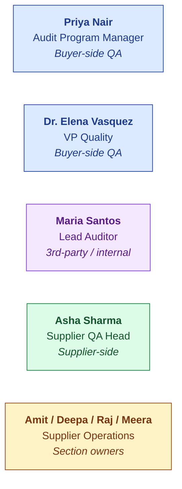
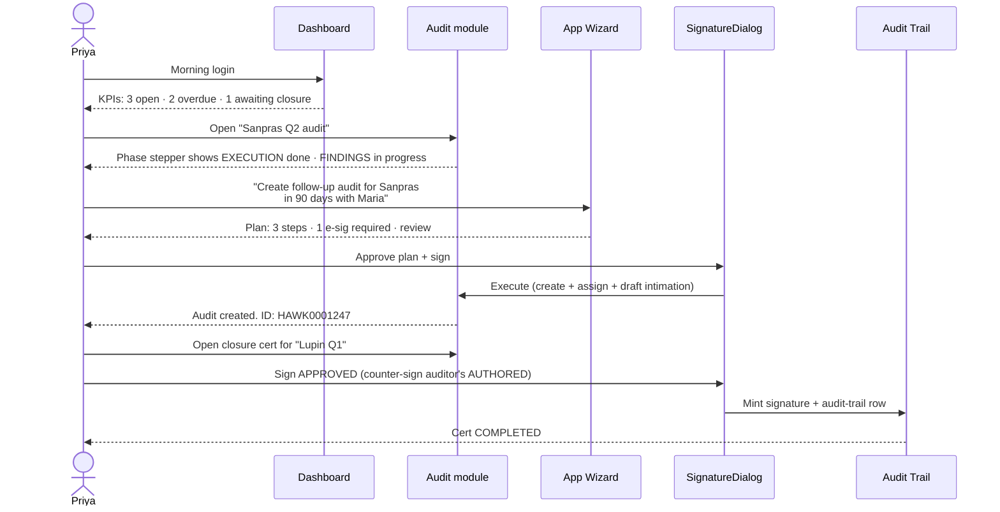
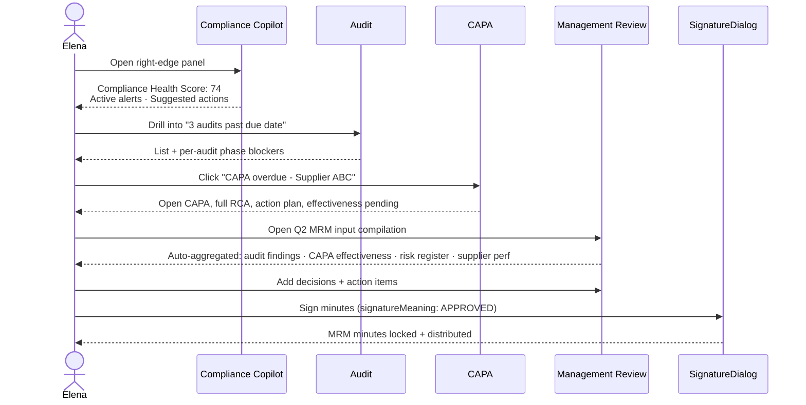
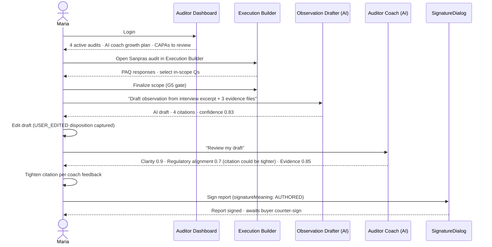
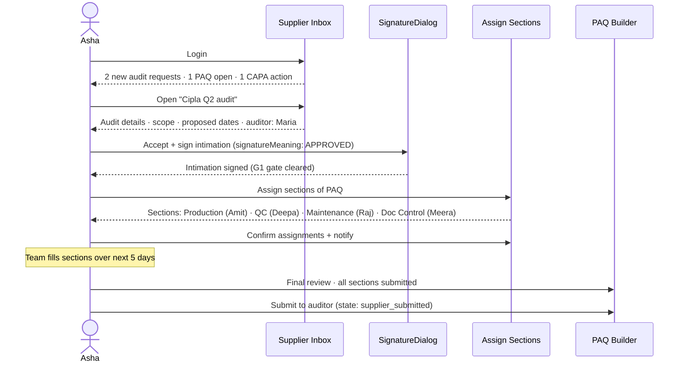
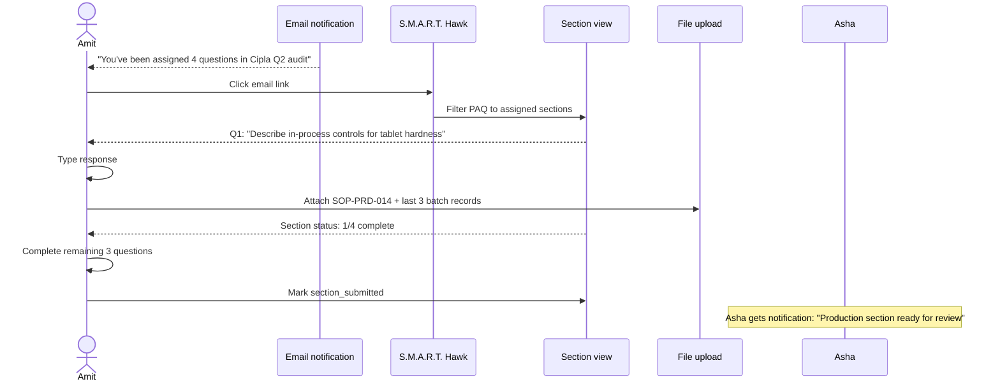
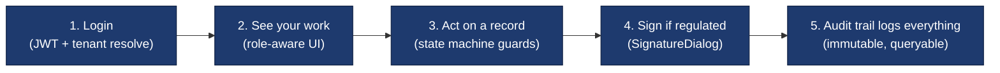

# Platform Architecture — User-Flows View

| Field | Value |
|---|---|
| Audience | Practitioner (QA Head · Auditor · Supplier) · UX designer · Customer Success |
| Length | ~6 pages · 8 min read |
| Last updated | 2026-05-31 |
| Companion docs | [PLATFORM-EXECUTIVE.md](PLATFORM-EXECUTIVE.md) · [PLATFORM-ENGINEERING.md](PLATFORM-ENGINEERING.md) |

---

> 💡 **What this document is.** Architecture seen through the eyes of the people who use the product. Five personas, five walkthroughs, all moving through the same five-pillar engine — but each persona experiences it differently.

---

## The Five Personas at a Glance

Each persona enters the system from a different door, traverses a different path, and signs a different artifact. But all use the same engine.

---

## Persona 1: Priya Nair — Audit Program Manager 🟦

**Her job:** run the audit programme across 200-1,200 suppliers. Demonstrate compliance to regulators. Keep CAPAs out of email.

**Her week:** 3 active audits, 2 in CAPA phase, 1 closure cert awaiting her signature.

### The flow

### Where the architecture shows up

- **5-pillar engine:** Priya's PoC question is `VALIDATE` (vs audit gates); her closure is `REPORT` (artifact) + `SEAL` (signature)
- **AskHawk wizard:** translates her natural-language goal into a plan; she reviews + signs
- **Cross-module audit trail:** when regulator asks "show me your audit programme for Q2", one query answers
- **RBAC:** Priya sees buyer-side data only; auditors + suppliers see their slices

### What she'd say if asked

> *"Pre-S.M.A.R.T. Hawk my Q2 audit program was 47 spreadsheet rows and 800 Slack messages. Now it's a dashboard, three e-sigs, and a CAPA loop that closes itself."*

---

## Persona 2: Dr. Elena Vasquez — VP Quality 🟦

**Her job:** programme oversight. Board-level reporting. Sign closure certs on critical audits. Chair MRM.

**Her week:** prep for the quarterly board QMS review; sign 4 closure certs; review CAPA effectiveness for last quarter's recurring deviations.

### The flow

### Where the architecture shows up

- **Compliance Health Score (cross-module aggregator):** pulls KPIs from every module to one number
- **MRM module:** auto-input compiler (planned Q2 2027) reads from audit, CAPA, complaint, risk, supplier
- **Audit-trail:** every Elena signature is attributable + reproducible + queryable

### What she'd say if asked

> *"My board review used to take three weeks of QA-team-prep. Now I open MRM, it pre-fills 80% of the inputs, I add the strategic decisions, and I sign. Three hours instead of three weeks."*

---

## Persona 3: Maria Santos — Lead Auditor 🟪

**Her job:** plan, execute, draft findings, sign report + closure cert. Works across multiple buyer tenants (third-party auditor).

**Her week:** executing one onsite audit; drafting observations for two completed audits; coaching her co-auditor through a tough finding.

### The flow

### Where the architecture shows up

- **AI grounded gen:** every AI output cited + confidence-scored; below 0.6 → skeleton fallback
- **AI audit trail:** Maria's USER_EDITED disposition feeds active-learning loop (gets the next AI better)
- **Cross-tenant access:** Maria's `Affiliation` records grant her access to multiple buyer tenants safely
- **E-sig with role meaning:** Maria signs AUTHORED; buyer signs APPROVED; supplier optionally WITNESSED

### What she'd say if asked

> *"The AI doesn't write the observation for me. It gets me 80% of the way there with citations, then the coach tells me what's still weak. My average observation went from 45 min to draft → 15 min. And my drafts are tighter, not sloppier."*

---

## Persona 4: Asha Sharma — Supplier QA Head 🟩

**Her job:** accept incoming audits (with e-sig); assign sections to her team; respond to PAQs; author CAPAs in response to findings.

**Her week:** 2 new intimations in inbox; 1 PAQ due Friday; 1 CAPA action plan to author.

### The flow

### Where the architecture shows up

- **Single-inbox UX:** Asha sees all audits across all buyers in one place (no email chaos)
- **G1 e-sig gate:** intimation must be signed before audit can proceed to PREP phase
- **Section assignment:** each section becomes its own assignment with its own owner — parallelism
- **Persona-aware AskHawk:** Asha asks "how do I respond to a critical observation?" → gets supplier-side playbook, not buyer-side

### What she'd say if asked

> *"Pre-S.M.A.R.T. Hawk my inbox was 800 messages a week — auditors asking the same questions in different formats. Now it's a clean inbox, structured questionnaires, my team owns their sections, and I sign acceptance once."*

---

## Persona 5: Amit / Deepa / Raj / Meera — Supplier Operations 🟧

**Their job:** fill assigned sections of incoming PAQs; upload evidence; mark complete.

**Their week:** Amit has 4 production-section questions due Friday; Deepa has 6 QC questions; Raj has 3 maintenance.

### The flow

### Where the architecture shows up

- **Granular RBAC:** Amit sees only his assigned sections (not whole PAQ)
- **SmartQuestion component:** adaptive form fields (text, multi-choice, attachment, date)
- **File storage:** HawkVault/S3 with tenant-prefixed buckets; encrypted at rest
- **Notification:** email + in-app; Asha gets alerted when Amit completes

---

## The Universal Flow (what every persona shares)

*Every persona, every module, every action. The architecture serves the persona — the persona never has to think about the architecture.*

---

## Where AI Meets Each Persona

| Persona | Primary AI surface | What it does |
|---|---|---|
| Priya | AskHawk wizard (drawer) | "Create an audit for X" → plan-then-execute |
| Elena | ComplianceCopilot (right panel) | Health score · suggested actions · ask AskHawk |
| Maria | ObservationDrafter + AuditorCoach | Draft observations + private growth feedback |
| Asha | AskHawk (drawer) | "How do I respond as supplier QA?" → role-aware playbook |
| Amit | AI auto-fill (PAQ) | OCR + LLM pre-fills questionnaire fields from source docs |

> 💡 **The AI is invisible until you ask for it.** No floating "AI" banner on every page. AI is a tool in the persona's workflow, not a feature in itself.

---

## What This Architecture Does NOT Do (the honest part)

> 🚫 **For the practitioner reading this — what you won't get:**
> - **Mobile-first experience** — desktop-first today; mobile companion planned post-Series A
> - **Voice-driven workflows** — no Alexa-style "Hey S.M.A.R.T. Hawk"
> - **Real-time collaborative editing** — like Google Docs; no, today it's lock-and-edit
> - **Custom AI per tenant** — tenants share the platform AI; no per-tenant fine-tunes
> - **Customizable dashboards** — not yet; planned Q1 2027
> - **Slack/Teams integration** — planned; not built

---

## See Also

- [PLATFORM-EXECUTIVE.md](PLATFORM-EXECUTIVE.md) — 1 page for the board
- [PLATFORM-ENGINEERING.md](PLATFORM-ENGINEERING.md) — 1 page for the CTO
- [PLATFORM-OVERVIEW.md](PLATFORM-OVERVIEW.md) — full reference
- [PERSONAS.md](../../03-product/01-personas-and-research/PERSONAS.md) — full persona definitions
- [audit-management STORYBOOK](../../06-modules/audit-management/STORYBOOK.md) — deepest persona walkthrough

---

*Doc_V2 · Platform Architecture · User Flows · 6 pages*
