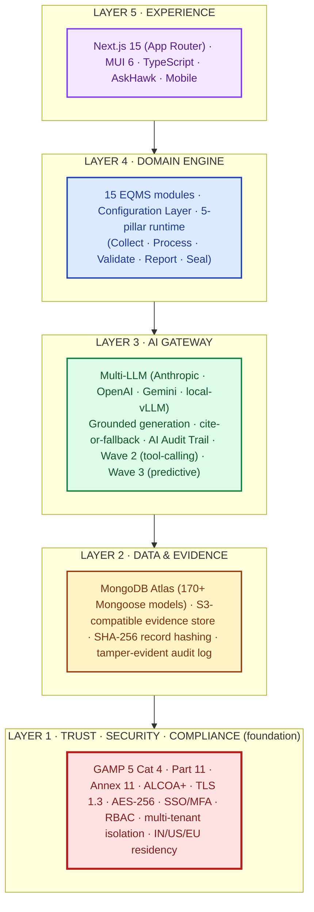
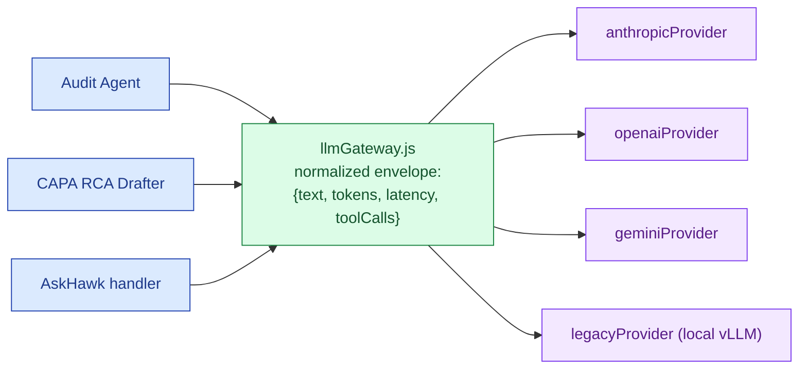
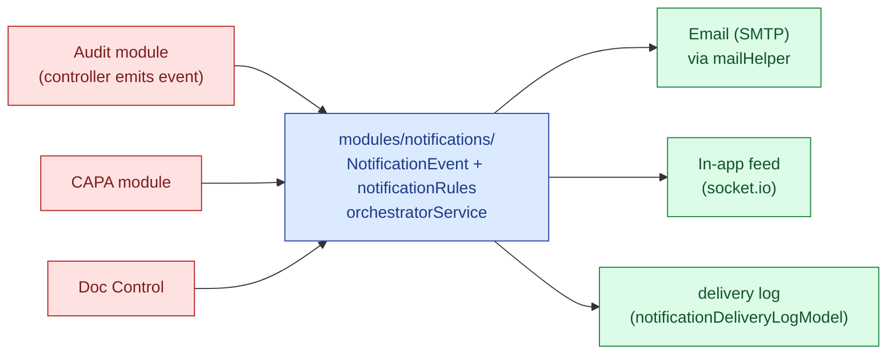
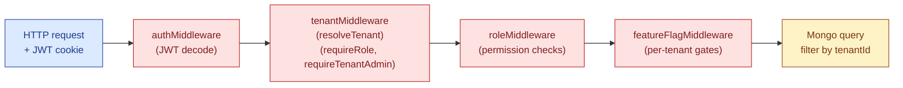
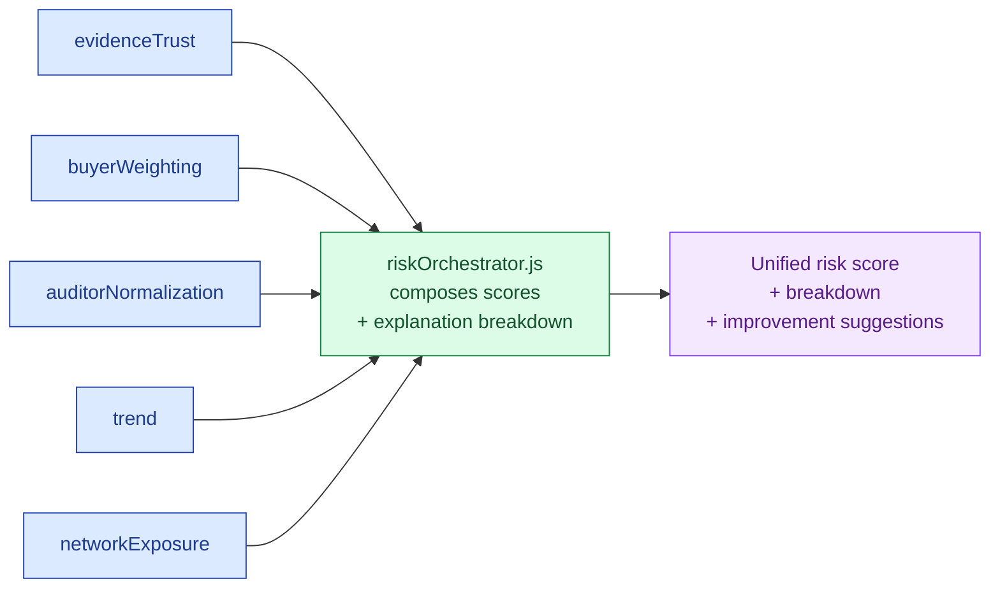
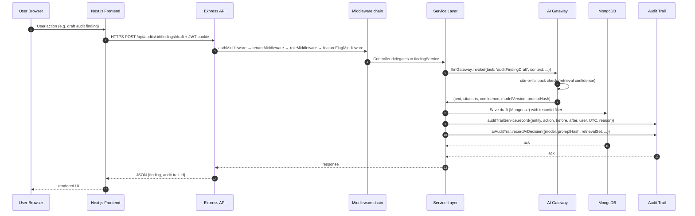

# System Architecture

## Hawkeye AI-Native EQMS Platform

| Field | Value |
|---|---|
| Owner | Engineering · CTO |
| Status | v1.0 — 2026-06-05 |
| Scope | System architecture for the backend Node.js + Python services (frontend covered separately in [FRONTEND.md](../04-frontend/FRONTEND.md)) |
| Pairs with | [PLATFORM-OVERVIEW.md](../00-overview/PLATFORM-OVERVIEW.md) · [DATA-MODEL.md](../02-data-model/DATA-MODEL.md) · [API-CONTRACTS.md](../03-api-contracts/API-CONTRACTS.md) · [INFRASTRUCTURE.md](../05-infrastructure/INFRASTRUCTURE.md) · [SECURITY.md](../06-security/SECURITY.md) · [AI-ARCHITECTURE.md](../07-ai/AI-ARCHITECTURE.md) · [ADR-INDEX.md](../08-adrs/ADR-INDEX.md) |

---

## 1. The 5-Layer Architecture (canonical)



The full canonical layer architecture is in [PLATFORM-OVERVIEW.md §2](../00-overview/PLATFORM-OVERVIEW.md). This document zooms into the **Layer 4 (Domain Engine) + Layer 3 (AI Gateway) + Layer 2 (Data) backend implementation**.

---

## 2. Repository structure

The backend lives at `backend/` and is a single Node.js + Express + Mongoose codebase with vertical-slice modules + horizontal cross-cutting services.

```
backend/src/
├── config/                  ← DB, env, Swagger, SMTP, feature flags
├── auth/                    ← JWT auth strategies + token handling
├── controllers/             ← Global controllers (platform, supplierUserProfile, commonController…)
├── routes/                  ← 95+ route files (1 per domain)
├── models/                  ← 170 Mongoose schemas
├── services/                ← Business logic, grouped by domain
│   ├── ai/                  ← Multi-LLM gateway, agents (Wave 1/2/3)
│   ├── compliance/          ← Standards, rules, evaluation
│   ├── risk/                ← Scoring, orchestration, evidence trust
│   ├── governance/          ← Audit logging, persona, notification policy
│   ├── publicIntel/         ← FDA inspections/recalls connectors
│   ├── eqms/                ← Unified dashboards, dynamic questionnaires
│   ├── digilocker/          ← DigiLocker vault integration
│   ├── marketplaceCatalog/  ← Service offerings + compatibility
│   └── scheduling/          ← Calendar/SLA scheduling
├── middleware/              ← 12 stages: auth, tenant, role, validation, feature-flag…
├── modules/                 ← Vertical-slice feature modules
│   ├── notifications/       ← Event bus + email orchestration
│   ├── auditEngine/         ← Assessment builder + module packs
│   ├── capaV2/              ← CAPA with state machine
│   └── compliance/          ← Standards bootstrap
├── validators/              ← Joi schemas
├── helpers/                 ← Mail rendering
├── jobs/                    ← Cron schedulers (riskCron)
├── integrations/            ← Partner connectors
├── docs/                    ← OpenAPI/Swagger
├── utils/                   ← s3Upload, sanitizeForLLM, templateEngine
├── constants/               ← Global constants
└── data/                    ← Seed files
```

**Top-level entry:**
- `server.js` — http.Server bootstrap, Socket.IO mount, listens on `PORT`
- `app.js` — Express app, CORS, route mounting, middleware pipeline, scheduler init

---

## 3. Architectural patterns

Seven core patterns govern the Hawkeye backend:

### 3.1 Multi-Provider LLM Gateway (Adapter + Service Locator)



- **One interface, many providers.** `services/ai/gateway/llmGateway.js` is the only file that fans out to provider SDKs.
- **No controller calls a provider directly** — that's the architectural rule. Search `import { anthropic }` outside `services/ai/` should return zero results.
- **Tenant-level provider selection + per-call overrides.** Tenant config picks the default; an individual call can override per task type.
- **Normalized output envelope:** `{ text, tokens, latency, toolCalls, modelVersion, promptHash }`. All callers code against the envelope, never against provider-specific shapes.
- **AI Audit Trail captured on every call** via `services/ai/audit/aiAuditTrail.js` — covered in [AI-ARCHITECTURE.md](../07-ai/AI-ARCHITECTURE.md).

ADR: [ADR-002 — Multi-LLM Gateway](../08-adrs/ADR-002-multi-llm-gateway.md).

### 3.2 Event-Driven Notifications (Observer + Outbox)



- **Decoupled** — modules don't know about email/socket; they emit events.
- **Outbox-style delivery log** ensures notifications survive transient failures.
- **Handlebars templates** per event type (AUDIT_REQUEST_CREATED, QUESTIONNAIRE_OVERDUE, …).
- **Real-time UI updates** via Socket.IO mount in `server.js`.

### 3.3 Domain-Driven Modules with Vertical Slicing

Four modules under `backend/src/modules/` own their full slice (routes + controllers + models + services + templates):

| Module | Purpose | Internal pieces |
|---|---|---|
| `notifications/` | Event-driven notification engine | models (5), controllers (3), services (4), templates (handlebars) |
| `auditEngine/` | Assessment builder + phase state machine | constants, modulePacks, assessmentBuilder, phaseRules |
| `capaV2/` | CAPA v2 with state machine | constants, prefillService, statusMachine |
| `compliance/` | Regulatory standards framework | constants, defaultStandards |

The remaining 9 EQMS module concerns (audit, deviation, change control, document control, training, risk, complaint, supplier prequal, equipment, batch records, MRM, design control) are implemented via the **horizontal pattern** — model + route + controller + service in their respective top-level folders — because they share more than they differ. The four vertical-slice modules earned their isolation by genuine cross-cutting needs.

### 3.4 Multi-Tenant Isolation (Middleware + Schema Pattern)

Every Hawkeye-deployed tenant runs on a shared code base with logical isolation:



- **Every model has `tenantId`** indexed; every query carries the tenant filter.
- **Middleware enforces it** — controllers can't accidentally leak across tenants because the query layer requires the filter (enforced in service-layer wrappers, with tests).
- **adminScope enum** (`TENANT` vs `PLATFORM`) distinguishes per-tenant admins from platform super-admins.
- **No physical isolation** by default; per-tenant database is available as Enterprise option (BYOK + dedicated tenant) but not the default.

### 3.5 GxP Audit Trail (Compliance-as-Code)

Two parallel audit trails capture different categories of events:

| Trail | Purpose | Model |
|---|---|---|
| **Domain audit trail** | Every state change on a GxP record (create/modify/delete) | `auditEventModel.js` — captures entity, action, before/after, IP, actor, reason, UTC timestamp |
| **Governance audit trail** | Admin actions, RBAC changes, configuration changes | `services/governance/governanceAuditLogService.js` |
| **AI audit trail** | Every AI Gateway call: model, version, promptHash, retrievalSet, confidence, user disposition | `services/ai/audit/aiAuditTrail.js` |

These satisfy 21 CFR §11.10(e) (audit trail), Annex 11 §9 (user · time · reason), and ALCOA+ Attributable + Contemporaneous + Original + Accurate + Complete + Enduring.

Per-record SHA-256 hashing via `buildSnapshotHash` ensures tamper-evidence. **Not blockchain** — flagged honestly in [VISION.md §4e](../../01-strategy/vision-and-positioning/VISION.md).

ADR: [ADR-004 — Audit-trail as compliance spine](../08-adrs/ADR-INDEX.md).

### 3.6 Risk Orchestration (Domain Service + Aggregator)



- Five separate scoring modules compose into one unified risk view.
- The orchestrator is the only place that knows about all five — keeps individual scorers independently testable.
- Per-supplier and per-buyer risk profiles snapshotted (immutable for audit purposes).

### 3.7 Agentic AI Tool-Calling Runtime (Wave 2)

Beyond raw LLM calls, Hawkeye runs multi-step agents that compose tool calls:

- `services/ai/wave2/toolCallingRuntime.js` — orchestrates LLM → tool call → result → LLM loop
- `services/ai/wave2/multiStepAgent.js` — Wave 2 generic agent base
- Per-domain agents (changeControl, crossCompanyAudit, MRM, risk, training) ride on the runtime
- **Active learning loop** captures user dispositions to refine prompts over time

Wave 3 (predictive features — auditor coach, drift monitor, IoT fusion, predictive CAPA effectiveness) extends this for proactive/predictive use cases.

Detail: [AI-ARCHITECTURE.md](../07-ai/AI-ARCHITECTURE.md).

---

## 4. Request lifecycle (end-to-end)

A typical authenticated API request flows through:



Two writes always accompany a meaningful action: the domain change AND the audit-trail row. The service-layer wrapper ensures both succeed atomically.

---

## 5. Data layer

**MongoDB Atlas** — 170 Mongoose models. Highlights of the most strategically important models:

| Model | Purpose |
|---|---|
| `tenantModel.js` | Multi-tenant org + settings + branding + data residency election |
| `userModel.js` | User identity + role (supplier · buyer · auditor · auditee · admin) + adminScope (TENANT · PLATFORM) |
| `auditEventModel.js` | GxP audit trail — entity, action, before/after, IP, actor, reason, UTC |
| `evidenceModel.js` | Audit evidence submissions + versioning |
| `documentControlModel.js` | Document lifecycle (draft · review · approved · effective · obsolete) |
| `templateModel.js` | Questionnaire + workflow templates (versioned) |
| `assessmentFindingModel.js` | Audit findings + risk levels + linked CAPAs |
| `complianceStandardModel.js` | Regulatory framework definitions (ICH Q7 · 21 CFR · ISO 9001 etc.) |
| `capaV2Model` (via capaV2 module) | CAPAs with status machine |
| `deviationModel` | Quality deviations + RCA |
| `electronicSignatureModel` | E-signature manifestations (name + UTC + meaning + record snapshot hash) |
| `hawkConversationModel.js`, `hawkUnansweredModel.js` | AskHawk conversational context |
| `SupplierRisk*`, `BuyerRiskProfile` | Risk scoring snapshots (immutable) |
| `notificationModel`, `notificationDeliveryLogModel` | Notification engine outbox |
| `workflowMilestone*` | SLA + workflow gate definitions |
| `digilocker*` (6 models) | Vault integration + access control |
| `integration*` (4 models) | Third-party sync + audit logging |

Full schema inventory: [DATA-MODEL.md](../02-data-model/DATA-MODEL.md).

---

## 6. API layer

**Express + Mongoose + Joi**. 95+ route files under `backend/src/routes/`, organized one route file per domain. Each route file:
- Imports its controller
- Defines REST endpoints
- Applies middleware (auth, tenant, role, validation, feature-flag, e-signature when required)

**API characteristics:**

| Feature | Implementation |
|---|---|
| Auth | JWT in httpOnly cookie (`authToken`) issued at login; verified by `authMiddleware` |
| Tenant resolution | From JWT claims; enforced by `tenantMiddleware` |
| Validation | Joi schemas in `validators/`; enforced by `validate.js` middleware |
| Rate limiting | Per-tenant + per-IP at edge (Vercel / proxy) |
| Documentation | OpenAPI 3.1 spec served at `/docs` via swagger |
| Webhook events | Emitted per domain on state changes |
| Error envelope | Standard `{ error, code, requestId }` shape |

Full API contract spec: [API-CONTRACTS.md](../03-api-contracts/API-CONTRACTS.md).

---

## 7. External integrations

| Integration | Library | Purpose |
|---|---|---|
| Anthropic | Raw fetch | Claude API for grounded generation, drafting |
| OpenAI | `openai` npm | GPT for select tasks |
| Google Gemini | Via legacy client | Fallback / specialty tasks |
| Local vLLM (Llama 3) | `llmServiceClient.js` | Sovereign-deployment option (Enterprise/Defense) |
| AWS S3 / Cloudflare R2 / any S3-compatible | `@aws-sdk/client-s3` (in `s3Upload.js`) | Evidence + file storage |
| SMTP (Resend default; AWS SES legacy) | `nodemailer` | Transactional email |
| openFDA | `services/publicIntel/connectors/` | Public FDA inspection / recall data |
| FDA Establishment Registry | Custom scraper | Public establishment lookup |
| DigiLocker (India) | `services/digilocker/` | Indian government document vault import |

The S3 + SMTP layers are intentionally provider-agnostic via env-driven endpoints (see [AWS-DECOMMISSION.md](../05-infrastructure/AWS-DECOMMISSION.md)).

---

## 8. Background jobs

| Job | Owner | Cadence | Purpose |
|---|---|---|---|
| Risk re-score | `jobs/riskCron.js` | Hourly | Refresh supplier/buyer risk scores |
| Public Intel ingest | `services/publicIntel/scheduler.js` | Daily | Pull openFDA inspections + recalls |
| Notification dispatcher | `modules/notifications/scheduler.js` | Continuous | Drain notification outbox |
| Integration sync | `services/integrations/scheduler` | Configurable per integration | Third-party sync |
| Backup | Cloud-provider snapshot | Daily | Database + evidence-store snapshots |

---

## 9. Non-functional architecture decisions

| NFR | How it's achieved |
|---|---|
| **Multi-tenant safety** | Middleware + schema tenantId + service-layer query wrappers; OQ tests verify no cross-tenant leak |
| **Audit-trail integrity** | Append-only collection + per-record SHA-256 + retention configuration; cannot be disabled by any user role |
| **AI traceability** | AI Audit Trail captures everything needed to reproduce an AI output 12+ months later |
| **Compliance posture** | Code paths satisfying Part 11 / Annex 11 / ALCOA+ are tested per release; evidence shipped in Validation Accelerator Package |
| **Scalability** | Stateless Express services + MongoDB Atlas clustering + queue-based notification + edge caching of static |
| **Observability** | Sentry error reporting + structured logs with correlation IDs + per-tenant metrics dashboard |
| **Security** | TLS 1.3 + AES-256 + SSO + MFA + RBAC + tenant isolation + Dependabot + annual pentest |
| **Resilience** | Daily backups + monthly restore tests + DR runbook + read replicas + idempotent state machines |

Detail per concern: [SECURITY.md](../06-security/SECURITY.md) · [INFRASTRUCTURE.md](../05-infrastructure/INFRASTRUCTURE.md).

---

## 10. Where things live (quick reference)

| If you need to … | Look in |
|---|---|
| Add a new EQMS module | `services/`, `routes/`, `controllers/`, `models/` (or `modules/<new-module>/` for full vertical slice) |
| Add a new AI capability | `services/ai/` (gateway never bypassed) |
| Add a new compliance standard | `services/compliance/standardRegistryService.js` + seed in `data/` |
| Change the audit-trail behavior | `services/governance/governanceAuditLogService.js` · `auditTrailService.js` (think twice — this is the compliance spine) |
| Add an integration | `integrations/` + `services/integrations/scheduler` |
| Add a background job | `jobs/<job-name>.js` (cron-style) |
| Trace why an action emitted a notification | `modules/notifications/notificationRules.js` |
| Trace AI provider selection | `services/ai/gateway/llmGateway.js` |
| Trace tenant isolation enforcement | `middleware/tenantMiddleware.js` |
| Add a new RBAC role | `middleware/roleMiddleware.js` + `userModel.js` role enum |
| Generate a Mongoose model | `models/<entity>Model.js` — always include `tenantId` index |

---

## 11. Architectural rules (the must-follow list)

> ✅ **Rules every engineer follows.** Violations get blocked at code review.
>
> 1. **No controller calls a provider SDK directly.** All AI/LLM traffic goes through `services/ai/gateway/llmGateway.js`.
> 2. **No query without tenantId.** Every Mongoose query filters by tenant; enforced at service-layer wrapper + tested.
> 3. **No state change without audit trail.** Every meaningful mutation writes a parallel audit-trail row in the same transaction.
> 4. **No AI output committed without human.** AI drafts, suggests, scores. The human always e-signs the record commit.
> 5. **Cite-or-fallback is non-negotiable.** AI returns "insufficient evidence" rather than fabricate a citation. Built into `llmGateway` + grounded-generation services.
> 6. **No PII to LLM training.** All LLM provider configurations have training opt-out enforced at vendor level; PII redaction at `services/ai/redaction/`.
> 7. **No hard-coded compliance constants.** Standards, retention periods, e-sig meanings come from `services/compliance/` config, not hard-coded.
> 8. **No skipped peer review on `main`.** Branch protection enforces ≥2 reviewer approvals + CI green.

---

## 12. Known engineering debt (honest list)

> ⚠️ **What we owe to ourselves.** Tracked in the engineering backlog.
>
> 1. Migrate remaining 4 vertical-slice modules to the same DDD-style folder layout (3 are inconsistent).
> 2. Tests cover ~70% of critical paths; target 85% by Q4 2026.
> 3. Some service files exceed 800 lines and should be decomposed.
> 4. Notification template hot-reload is manual; should be config-table-driven.
> 5. Per-tenant LLM customization is a roadmap item ([PRD-INDEX #7](../../03-product/03-prd/PRD-INDEX.md)).
> 6. On-prem Llama 3 deployment scripts are draft-quality; needs hardening for Enterprise customers.
> 7. The two parallel audit trails (governance + domain) should converge to a single read API.

---

## See also

- [PLATFORM-OVERVIEW.md](../00-overview/PLATFORM-OVERVIEW.md) — full 5-layer canonical reference
- [PLATFORM-ENGINEERING.md](../00-overview/PLATFORM-ENGINEERING.md) — engineer-focused 1-pager
- [DATA-MODEL.md](../02-data-model/DATA-MODEL.md) — schema inventory
- [API-CONTRACTS.md](../03-api-contracts/API-CONTRACTS.md) — REST endpoint spec
- [FRONTEND.md](../04-frontend/FRONTEND.md) — frontend architecture
- [INFRASTRUCTURE.md](../05-infrastructure/INFRASTRUCTURE.md) — deployment + ops
- [SECURITY.md](../06-security/SECURITY.md) — security architecture
- [AI-ARCHITECTURE.md](../07-ai/AI-ARCHITECTURE.md) — AI gateway, agents, governance
- [ADR-INDEX.md](../08-adrs/ADR-INDEX.md) — architecture decision records
- [GAMP-CAT-4-COMPLIANCE.md](../../08-compliance-regulatory/GAMP-CAT-4-COMPLIANCE.md) — Cat 4 validation reference

---

*Doc_V2 · Engineering · System Architecture v1.0 · 2026-06-05*
