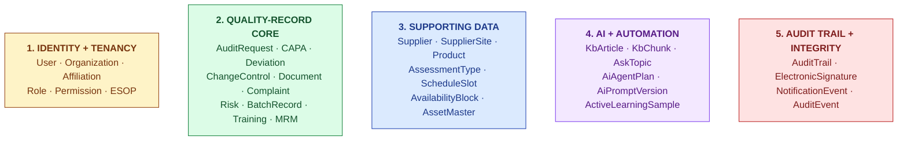
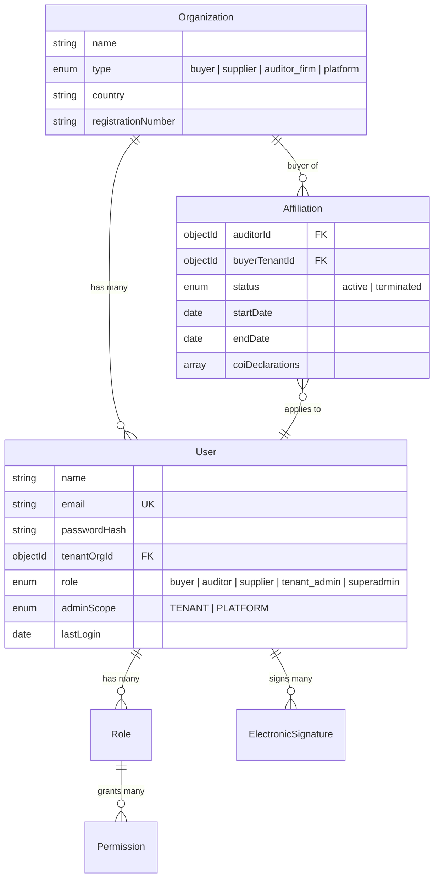
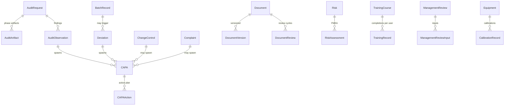
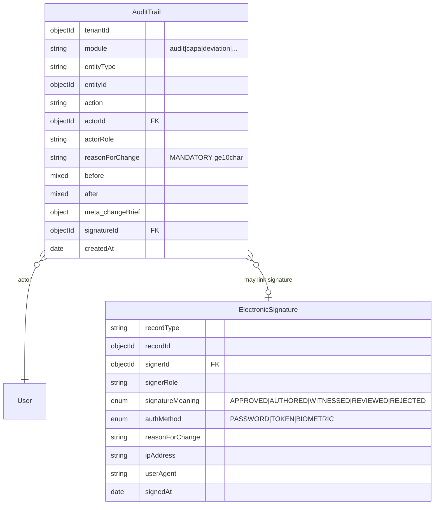
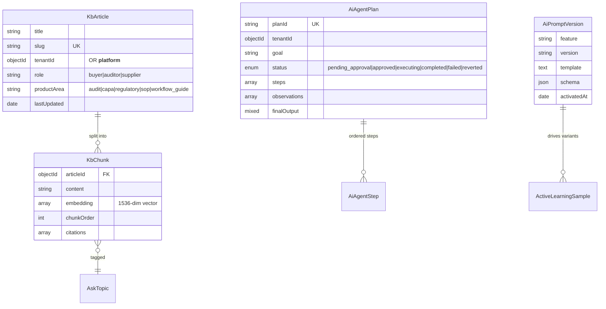

# Data Model

| Field | Value |
|---|---|
| Owner | Engineering (CTO) |
| Status | v1.0 |
| Last updated | 2026-05-31 |
| Source | `backend/src/models/` (128+ Mongoose schemas) + audit module ERD |

---

## 1. Overview

Hawkeye's data model spans **128+ Mongoose models** organized around 5 concept groups:

## 2. Identity + tenancy

### Key tenancy rules

- Every quality-record model has `tenantOrgId` indexed
- Cross-tenant access ONLY via `Affiliation` records (e.g., third-party auditor working with multiple buyer tenants)
- Special tenant `__platform__` for cross-tenant content (regulatory corpus, SOP templates)
- Service-layer enforced via `buildTenantScopeQuery()` — never trusted to controllers alone

## 3. Quality-record core (the EQMS domain)

| Module | Primary model | Children / linked models |
|---|---|---|
| Audit | `AuditRequest` | AuditArtifact, AuditObservation, AuditNote, RemoteSession, AuditSchedule |
| CAPA | `CAPA` | CAPAAction, CAPAEffectivenessCheck, CAPATrigger |
| Deviation | `Deviation` | DeviationCategorization, DeviationInvestigation, DeviationRCA |
| Change Control | `ChangeControl` | ChangeControlStep, ChangeImpactAssessment |
| Document Control | `Document` | DocumentVersion, DocumentReview, DocumentApproval, DocumentRevision |
| Complaint | `Complaint` | ComplaintTriage, ComplaintInvestigation, ComplaintLink |
| Risk | `Risk` | RiskAssessment, RiskMitigation, RiskReview |
| Batch Records | `BatchRecord` | BatchStep, BatchAttributeValue, BatchRelease |
| Training | `TrainingCourse` | TrainingRecord, TrainingEffectiveness, TrainingMatrix |
| Equipment | `Equipment` | CalibrationRecord, MaintenanceRecord, EquipmentStatus |
| Management Review | `ManagementReview` | MRMInput, MRMOutput, MRMAttendance |
| Design Control | `DesignProject` | DesignInput, DesignOutput, DesignReview, DesignTransfer |

## 4. The audit-trail spine (cross-module integrity)

### Audit-trail extensions for AI

When an AI decision is logged, additional fields:

| Field | Purpose |
|---|---|
| `ai.feature` | Which AI feature ran (e.g., `observation-drafter`, `capa-recommender`) |
| `ai.modelVersion` | LLM identifier (e.g., `claude-opus-4-7-20260128`) |
| `ai.promptVersion` | Prompt template version |
| `ai.promptHash` | SHA-256 of resolved prompt (for reproducibility) |
| `ai.retrievalSet` | Array of KbChunk IDs used for grounding |
| `ai.citations` | Citation strings shown to user |
| `ai.confidence` | 0.0-1.0 score |
| `ai.tokensInput` / `ai.tokensOutput` | Cost tracking |
| `ai.latencyMs` | Performance tracking |
| `ai.userDisposition` | USER_ACCEPTED / USER_EDITED / USER_REJECTED / SUPERSEDED |

### Why this matters (the regulatory observability layer)

> 💡 **The audit trail IS the regulatory observability layer.** Every regulator question — "what changed, when, by whom, why, with what evidence?" — is answerable in <2 sec via `GET /api/audit-trail/by-entity?entityId=X`. This is the inspector-readiness moat.

## 5. AI + automation data

## 6. Key indexes (for performance)

| Model | Index | Purpose |
|---|---|---|
| `AuditRequest` | `tenantOrgId, internalRequestId (unique)` | List + lookup |
| `AuditRequest` | `auditor_id` | Auditor work queue |
| `AuditTrail` | `(tenantId, auditId)` | Per-audit trail in <100ms |
| `AuditTrail` | `(tenantId, module, entityId)` | Cross-entity trail |
| `AuditTrail` | `(tenantId, action)` | Action-type queries |
| `ElectronicSignature` | `(recordType, recordId)` | Signature lookup per signed record |
| `KbChunk` | `articleId, chunkOrder` | Article reconstruction |
| `KbChunk` | `(tenantId, role, productArea)` | Retrieval scoping |
| `User` | `email (unique)` | Login |
| `Affiliation` | `(auditorId, buyerTenantId, status)` | Auditor cross-tenant access |
| `AvailabilityBlock` | `(ownerId, start, end)` | Auditor availability filter |

## 7. Data model evolution principles

> ✅ **Schema-evolution rules we follow.**

1. **Additive changes only** — new fields are optional with safe defaults
2. **Never delete a field** in use; deprecate with `@deprecated` JSDoc + migration plan
3. **Tenant-isolated migrations** — run per-tenant when possible to limit blast radius
4. **Indexes added in `background: true` mode** to avoid blocking production
5. **State enum changes** require lookup-table migration; never break old values
6. **Embedded vs referenced**: embedded when 1:1 + lifecycle-bound (e.g., `phaseState` in `AuditRequest`); referenced when child has independent lifecycle (e.g., `CAPA` from `Deviation`)
7. **Audit trail is append-only** — never UPDATE or DELETE rows; if data was wrong, log a correction event with reasonForChange

## 8. ERD by module

Per-module ERDs live in each module folder:
- [audit-management ERD](../../06-modules/audit-management/ARCHITECTURE.md#2-data-model)
- (TBD) [capa ERD](../../06-modules/capa/ARCHITECTURE.md)
- (TBD) [deviation ERD](../../06-modules/deviation/ARCHITECTURE.md)
- (TBD) ... etc

## 9. Future-state evolution (URS-driven)

Per [11-roadmap/URS-v1.0-DRAFT.pdf](../../../backend/docs/11-roadmap/URS-v1.0-DRAFT.pdf) (legacy) + [eqms-db-evolution-proposal.md](../../../backend/docs/11-roadmap/eqms-db-evolution-proposal.md):

| Future direction | Why | Impact |
|---|---|---|
| **Unified `QualityRecord` base** | Avoid duplicating audit-trail / e-sig logic per module | Schema refactor; backwards-compat via discriminator |
| **`StatusTransitionEngine` formalized** | Today ad-hoc per module; convergence on declarative state machines (XState?) | Engineering rewrite per module; ~3-month effort |
| **`AuditTrailEntry` cross-module type** | Already exists as `AuditTrail`; needs schema-evolution to handle cross-module deeper queries | Index additions |
| **Retention policy enforcement** | Mandatory per Part 11 §11.10(c); today partial | Per-module retention rules + scheduled cleanup jobs |
| **Event-driven architecture** | Today: synchronous service calls; future: emit events for cross-module reactions | New event-bus (Redis Streams / Kafka?) |
| **Part 11 §11.30 closed-system attestation** | Required for closed-system label | Documentation + control framework |

## 10. Known data-model debt

| Debt | Module | Impact | Plan |
|---|---|---|---|
| Dual status fields (`trackStatus` text + `phaseState` structured) | Audit | Drift risk | Burn down `trackStatus` callers; remove field by M12 |
| `User.role` is single-string enum; some users actually have multiple roles | Identity | Workaround in code today | Migrate to `User.roles[]` array; M18 |
| `Affiliation` has no time-bound validity per audit (only org-level) | Affiliation | Workaround in `canAuditorAccessAudit()` | Per-audit affiliation grants; M24 |
| `KbChunk.embedding` on MongoDB cosine; pgvector experiments not migrated | AI | Scale ceiling | Migrate to pgvector when KB > 100K chunks |
| No explicit `Tenant` model; tenant info derived from `Organization` | Tenancy | Conflates business org with tenant boundary | Split when first multi-org tenant arrives |

---

## See also

- [PLATFORM-OVERVIEW.md](../00-overview/PLATFORM-OVERVIEW.md) — high-level architecture
- [API-CONTRACTS.md](../03-api-contracts/API-CONTRACTS.md) — REST endpoints over this data model
- [SECURITY.md](../06-security/SECURITY.md) — RBAC + audit trail
- [06-modules/audit-management/ARCHITECTURE.md §2](../../06-modules/audit-management/ARCHITECTURE.md#2-data-model) — worked example
- `backend/src/models/` (live code) — authoritative schema
- `backend/docs/01-architecture/current-db-schema-inventory.md` (legacy) — detailed inventory
- `backend/docs/01-architecture/current-db-erd.mmd` (legacy) — Mermaid ERD source
- `backend/docs/11-roadmap/eqms-db-evolution-proposal.md` (legacy) — evolution plan
