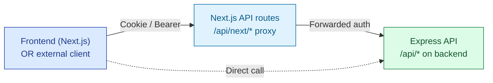
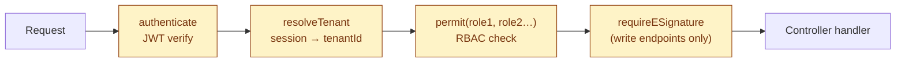

# API Contracts

| Field | Value |
|---|---|
| Owner | Engineering (CTO) |
| Status | v1.0 |
| Last updated | 2026-05-31 |
| Authoritative source | `backend/src/routes/*.js` (live code) |

---

## 1. API conventions

Hawkeye exposes a **REST-over-JSON** API. Internal services use the same API as the frontend (no separate internal/external split today). All endpoints under `/api/`.



> 💡 **Two access paths.** Browser uses `/api/next/*` (Next.js proxy) which forwards to backend; this handles cookie→bearer translation and CORS. External clients (post-public-API launch) hit backend directly.

## 2. Middleware chain

Every protected endpoint runs through this middleware chain:



| Middleware | Purpose | Failure response |
|---|---|---|
| `authenticate` | Verify JWT in `Authorization: Bearer` or cookie | 401 |
| `resolveTenant` | Look up tenant from user record, attach `req.tenantId` | 401 (no tenant) |
| `permit(...roles)` | Check `req.user.role` against allowed list | 403 |
| `requireESignature` | Verify e-sig payload (password OR ticket) for write endpoints | 403 with diagnostic envelope |

## 3. URL conventions

| Pattern | Used for | Example |
|---|---|---|
| `GET /api/<resource>` | List | `/api/audit-requests/buyer` |
| `GET /api/<resource>/:id` | Read one | `/api/audits/abc123` |
| `POST /api/<resource>` | Create | `/api/audit-requests` |
| `PATCH /api/<resource>/:id` | Partial update | `/api/audits/abc123` |
| `DELETE /api/<resource>/:id` | Soft-delete | `/api/audits/abc123` |
| `POST /api/<resource>/:id/<action>` | Domain action | `/api/audits/abc123/intimation/sign` |
| `GET /api/<resource>/:id/<sub-resource>` | Nested | `/api/audits/abc123/observations` |

## 4. Request/response envelope

### Standard success response

```json
{
  "data": { "id": "abc123", "name": "Audit Request #001" },
  "meta": { "page": 1, "limit": 25, "total": 87 }
}
```

### Standard error response

```json
{
  "error": "Access denied",
  "code": "TENANT_MISMATCH",
  "details": {
    "auditId": "abc123",
    "userTenant": "buyer-tenant-1",
    "resourceTenant": "buyer-tenant-2",
    "hint": "This audit belongs to a different tenant; verify the URL"
  }
}
```

> ✅ **Diagnostic error envelope.** Every 403 / 404 includes a `details.hint` field telling the user (or the developer) what's wrong. Avoid bare `{"error": "Forbidden"}` which forces guessing.

## 5. Endpoint catalog (grouped by module)

### Identity & users
| Method | Path | RBAC | Purpose |
|---|---|---|---|
| `POST` | `/api/auth/login` | public | Login (returns JWT) |
| `POST` | `/api/auth/logout` | authenticated | Logout |
| `GET` | `/api/auth/me` | authenticated | Current user info |
| `POST` | `/api/auth/refresh` | authenticated | Refresh JWT |
| `GET` | `/api/users` | tenant_admin | List tenant users |
| `POST` | `/api/users/invite` | tenant_admin | Invite a new user |

### Audit Management (full catalog in [audit ARCHITECTURE §3](../../06-modules/audit-management/ARCHITECTURE.md#3-api-contract-catalog-grouped))

| Group | Endpoints | Roles |
|---|---|---|
| List + read | `GET /api/audit-requests/{buyer\|auditor\|supplier}`, `/api/audit-requests/requestSingleAudit` | role-specific |
| Lifecycle | `POST /api/audit-requests`, `POST /:id/assign-auditors`, `POST /:id/supplier-decision` | buyer, supplier |
| Phase | `GET /api/audits/:id/phases`, `POST /phases/transition`, `POST /execution/finalize` | role-per-phase |
| E-sig gates | `POST /api/audits/:id/intimation/sign`, `/:id/closure-certificate`, `/:id/closure-certificate/approve`, `/:id/report/sign` | varies |
| Observations | `POST /api/audits/:id/observations/draft` | auditor, admin |
| Report | `POST /api/audits/:id/report/draft`, `/report/sign`, `/report/review` | auditor, buyer |
| Remote | `GET/POST/PATCH /api/audits/:id/remote-sessions` | varies |
| Audit trail | `GET /api/audits/:id/audit-trail`, `GET /api/audit-trail/by-entity` | all |

### CAPA
| Method | Path | RBAC | Purpose |
|---|---|---|---|
| `POST` | `/api/capa` | auditor, buyer | Create CAPA (from observation OR standalone) |
| `GET` | `/api/capa/:id` | all | Read |
| `PATCH` | `/api/capa/:id/triage` | buyer, supplier | Classify as No-CAPA / Correction / Formal |
| `POST` | `/api/capa/:id/investigation` | supplier | Submit RCA |
| `POST` | `/api/capa/:id/actions` | supplier | Add action item |
| `POST` | `/api/capa/:id/effectiveness-check` | supplier | Effectiveness verification |
| `POST` | `/api/capa/:id/close` | buyer (with e-sig) | Close CAPA |

### Deviation, Change Control, Document Control, Complaint, Risk, Batch Records, Training, Equipment, Design Control, MRM
Similar CRUD + domain-action patterns per module. Full catalogs in each module's `06-modules/<module>/ARCHITECTURE.md` (TBD).

### AskHawk (cross-cutting AI)
| Method | Path | RBAC | Purpose |
|---|---|---|---|
| `POST` | `/api/askhawk/chat` | all | Q&A with intent routing |
| `POST` | `/api/askhawk/retrieve` | all | Just KB search |
| `POST` | `/api/askhawk/ingest` | tenant_admin | Upload custom KB content |
| `GET` | `/api/askhawk/kb/stats` | tenant_admin | KB inventory |
| `POST` | `/api/askhawk/wizard/plan` | wizard-roles | Create App Wizard plan |
| `POST` | `/api/askhawk/wizard/:planId/approve` | initiator | Approve plan |
| `POST` | `/api/askhawk/wizard/:planId/execute` | initiator (+e-sig if writes) | Execute |
| `GET` | `/api/askhawk/wizard/:planId` | initiator | Fetch plan state |
| `GET` | `/api/askhawk/wizard/tools` | wizard-roles | List available tools |

### Cross-module
| Method | Path | RBAC | Purpose |
|---|---|---|---|
| `GET` | `/api/audit-trail/by-entity?entityId=X&module=Y` | all (tenant-scoped) | Cross-module audit trail |
| `GET` | `/api/notifications` | authenticated | User notifications |
| `POST` | `/api/notifications/:id/mark-read` | authenticated | Mark read |
| `GET` | `/api/health` | public | Service health |
| `GET` | `/api/health/llm` | public | LLM provider health |

## 6. Authentication

### JWT structure

```json
{
  "userId": "65abc...",
  "email": "user@tenant.com",
  "role": "buyer",
  "tenantOrgId": "65xyz...",
  "adminScope": null,
  "iat": 1717100000,
  "exp": 1717186400
}
```

| Field | Notes |
|---|---|
| Expiry | 24h default; refresh endpoint extends |
| Secret | Per-environment env var `JWT_SECRET` |
| Algorithm | HS256 (move to RS256 when external services consume) |
| Storage (frontend) | HttpOnly cookie `authTokenClient` (preferred) OR localStorage (legacy) |

## 7. RBAC enforcement

Every endpoint declares allowed roles via `permit(...roles)`. The full RBAC matrix for the audit module is in [audit ARCHITECTURE §4](../../06-modules/audit-management/ARCHITECTURE.md#4-rbac-matrix).

Cross-cutting guards (in addition to `permit()`):
- `canAuditorAccessAudit(userId, auditId)` — auditor must have active affiliation with the audit's tenant
- `canUserAccessAudit(userId, auditId)` — user must be one of: buyer-tenant member, assigned auditor, or supplier-tenant member
- `buildAuditTenantScopeQuery(req)` — service-level filter on tenant + (optional) cross-tenant affiliations

## 8. E-signature contract

For write endpoints requiring Part 11 e-signature:

### Request payload
```json
{
  "...record data...": "...",
  "signaturePassword": "user's own password (will be bcrypt-verified)",
  "reasonForChange": "Mandatory ≥10 chars, e.g. 'Audit closure approved per QA review meeting 2026-05-31'"
}
```

OR (pre-signed ticket flow):
```json
{
  "...record data...": "...",
  "electronicSignatureId": "65sig..."
}
```

### Backend behavior
1. `requireESignature` middleware intercepts
2. If `signaturePassword` present: verify password (bcrypt) for `req.user.id`
3. Mint `ElectronicSignature` row with `signatureMeaning` derived from endpoint context
4. Attach `req.electronicSignatureId` for controller use
5. Controller writes business record + AuditTrail row linking the signature

### Soft mode vs hard mode
- **Soft (default)**: missing signature → warn in response, still complete the action; `req.eSigStatus = "warned"`
- **Hard**: missing signature → 403; controlled by env var `ENFORCE_ESIG=hard`

> ⚠️ **Open question (URS-A-023)**: should default flip from soft to hard for production tenants?

## 9. Pagination, filtering, sorting

| Query param | Type | Example |
|---|---|---|
| `page` | int (1-based) | `?page=2` |
| `limit` | int (max 100) | `?limit=50` |
| `sort` | string | `?sort=-createdAt` (descending) |
| `filter[field]` | per-field | `?filter[status]=in_progress` |
| `q` | text search | `?q=supplier+xyz` |

Response includes pagination meta:
```json
{
  "data": [...],
  "meta": { "page": 2, "limit": 50, "total": 187, "totalPages": 4 }
}
```

## 10. Webhooks (planned, not live)

Future support for outbound webhooks per tenant config:

| Event | When fired | Payload |
|---|---|---|
| `audit.created` | New audit request | `{ auditId, supplierIds, auditorIds }` |
| `audit.signed` | Intimation signed by supplier | `{ auditId, signatureId, signedAt }` |
| `audit.closed` | Closure cert approved | `{ auditId, outcome, validUntil }` |
| `capa.opened` | CAPA created from observation | `{ capaId, observationId, severity }` |
| `capa.closed` | CAPA effectiveness verified | `{ capaId, closedAt }` |
| `deviation.classified` | Deviation triaged | `{ deviationId, classification }` |
| `*.ai_decision` | Any AI decision logged | `{ feature, modelVersion, promptHash, confidence }` |

Delivery semantics: at-least-once; signed HMAC body; retry with exponential backoff.

## 11. Rate limiting

| Endpoint group | Rate limit | Why |
|---|---|---|
| `/api/auth/login` | 10/min/IP | Brute-force prevention |
| `/api/askhawk/chat`, `/wizard/*` | 30/min/user | LLM cost control |
| `/api/audits/:id/observations/draft` (AI) | 20/min/user | LLM cost control |
| Other GET endpoints | 600/min/user | Standard SaaS |
| Other write endpoints | 100/min/user | Standard SaaS |

Headers returned:
- `X-RateLimit-Limit`: limit
- `X-RateLimit-Remaining`: remaining
- `X-RateLimit-Reset`: epoch when window resets

## 12. Versioning policy

Today the API has no explicit version prefix. We treat it as `/api/v1/` implicitly.

**Future:** when breaking changes are needed:
1. Introduce `/api/v2/` for the new contract
2. Maintain `/api/v1/` for ≥12 months
3. Send `Deprecation: true` + `Sunset: <date>` headers on v1 responses
4. Document migration in `Doc_V2/04-engineering/03-api-contracts/MIGRATIONS.md` (TBD)

## 13. Public API (planned, post-Series A)

Eventual public REST API for integration partners:

| Component | Approach |
|---|---|
| Authentication | OAuth 2.0 client-credentials grant (per-partner client ID/secret) |
| Scope | Per-tenant explicit grant (customer authorizes partner per scope) |
| Documentation | OpenAPI 3.0 spec + Stoplight / Redoc portal |
| Sandbox tenant | Free read-only sandbox for partner dev |
| SDK | TypeScript + Python clients auto-generated from OpenAPI |
| Webhooks | Per-partner subscription management UI |
| Rate limits | Per-client limits with usage dashboard |

## 14. Error code catalog

| Code | HTTP | Meaning | Resolution |
|---|---|---|---|
| `UNAUTHENTICATED` | 401 | No / invalid JWT | Re-login |
| `TENANT_MISMATCH` | 403 | Resource belongs to different tenant | Check URL / contact admin |
| `RBAC_DENIED` | 403 | User role lacks permission | Contact admin to elevate |
| `ESIG_REQUIRED` | 403 | Write endpoint needs e-signature | Submit with signaturePassword |
| `ESIG_VERIFICATION_FAILED` | 403 | Password didn't match | Retry with correct password |
| `VALIDATION_FAILED` | 400 | Request body schema invalid | Fix per `details.fields` |
| `STATE_TRANSITION_INVALID` | 409 | Cannot transition phase (gate not met) | Check `details.blockers` |
| `ENTITY_NOT_FOUND` | 404 | Record doesn't exist or no access | Verify URL |
| `RATE_LIMITED` | 429 | Too many requests | Back off per `Retry-After` |
| `LLM_PROVIDER_UNAVAILABLE` | 503 | AI provider down; skeleton fallback used | Retry or accept skeleton |
| `INTERNAL_ERROR` | 500 | Unexpected server error | Auto-reported to Sentry; retry |

---

## See also

- [PLATFORM-OVERVIEW.md](../00-overview/PLATFORM-OVERVIEW.md) — tech stack
- [DATA-MODEL.md](../02-data-model/DATA-MODEL.md) — schemas behind these endpoints
- [SECURITY.md](../06-security/SECURITY.md) — auth + e-sig deep dive
- [AI-ARCHITECTURE.md](../07-ai/AI-ARCHITECTURE.md) — AI endpoints + grounding
- [06-modules/audit-management/ARCHITECTURE.md](../../06-modules/audit-management/ARCHITECTURE.md) — full audit API catalog
- `backend/src/routes/` (live code) — authoritative source
