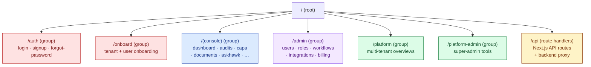
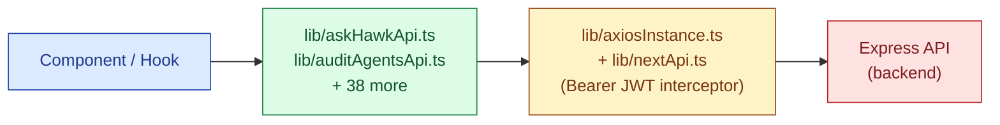
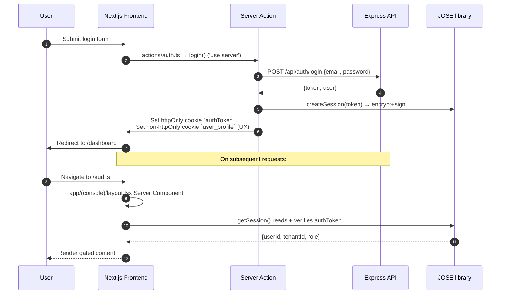

# Frontend Architecture

## S.M.A.R.T. Hawk Next.js Web Application

| Field | Value |
|---|---|
| Owner | Engineering · Frontend Lead |
| Status | v1.0 — 2026-06-05 |
| Scope | Next.js + React + TypeScript frontend (Layer 5 of the 5-layer architecture) |
| Pairs with | [ARCHITECTURE.md](../01-architecture/ARCHITECTURE.md) (backend) · [PLATFORM-OVERVIEW.md](../00-overview/PLATFORM-OVERVIEW.md) · [API-CONTRACTS.md](../03-api-contracts/API-CONTRACTS.md) · [DESIGN-PRINCIPLES.md](../../05-design/design-system/DESIGN-PRINCIPLES.md) · [COMPONENT-INVENTORY.md](../../05-design/wireframes/COMPONENT-INVENTORY.md) |

---

## 1. The stack at a glance

| Layer | Choice | Version |
|---|---|---|
| Framework | Next.js (App Router) | 15.5.11 |
| UI library | React | 18.3.1 |
| Language | TypeScript | 5.x (strict) |
| Component library | Material-UI (MUI) | 6.1.7 |
| Styling | Emotion (CSS-in-JS) + Tailwind CSS | 3.4.1 |
| Auth | Custom JWT + JOSE library | 5.9.6 |
| HTTP client | Axios | latest |
| State | React Context + Next.js Server Components | n/a |
| Forms | react-hook-form + Zod | 7.53 / 3.23 |
| Real-time | socket.io-client | 4.7.5 |
| i18n | next-intl | 3.25.1 |
| URL state | nuqs | 2.4.1 |
| OCR (client-side) | tesseract.js | latest |
| PDF + DOCX preview | pdfjs-dist · docx-preview | latest |
| Rich text | react-quill | latest |
| Total | ~150-200K LoC across 23K+ TS/TSX files | |

ADR: [ADR-005 — Frontend stack choice](../08-adrs/ADR-INDEX.md).

---

## 2. Folder structure

```
frontend/
├── app/                     ← Next.js App Router (route tree)
│   ├── (console)/           ← Main tenant workspace (route group)
│   ├── admin/               ← Tenant admin area
│   ├── auth/                ← Login / signup
│   ├── onboard/             ← New-user onboarding flow
│   ├── platform/            ← Multi-tenant platform views
│   ├── platform-admin/      ← Super-admin area
│   └── api/                 ← Next route handlers + API proxies
├── components/              ← 33 domain folders + ui/ primitives
│   ├── ui/                  ← Custom design-system primitives (StatusBadge, etc.)
│   ├── askhawk/             ← AskHawk chat UI
│   ├── audits/              ← Audit module UI
│   ├── workflow/            ← Workflow components
│   └── …                    ← 30+ more domain folders
├── lib/                     ← 40 API modules + axios + auth + theme
├── hooks/                   ← 8 custom hooks (useSession, useSidebar, …)
├── contexts/                ← 7 context providers (SessionContext, …)
├── actions/                 ← 9 server action files ('use server')
├── schemas/                 ← Zod validation schemas
├── constant/                ← Feature flags, routes, constants
├── i18n/                    ← next-intl setup
└── utils/                   ← Utility functions
```

---

## 3. Routing model — App Router with route groups

S.M.A.R.T. Hawk uses the **Next.js 15 App Router** (not the legacy Pages Router) with route groups for major sections:



| Route group | Purpose | Auth |
|---|---|---|
| `/auth` | Login, signup, forgot-password | Redirects to `/dashboard` if authenticated |
| `/onboard` | New-tenant + new-user onboarding | Auth required (post-signup) |
| `/(console)` | Daily tenant workspace (audits, CAPA, docs, AskHawk) | Auth + tenant role required |
| `/admin` | Tenant-admin area (users, roles, workflows, billing) | Auth + tenant_admin role |
| `/platform` | Multi-tenant platform views | Auth + platform user |
| `/platform-admin` | Super-admin tools | Auth + adminScope=PLATFORM |
| `/api` | Next.js route handlers (auth, file proxies, AskHawk proxy) | Mixed |

**Layouts** at each route group provide consistent navigation and auth gating. `app/auth/layout.tsx` is an async Server Component that calls `getCurrentUser()` and redirects authenticated users to `/dashboard`.

---

## 4. Rendering model — Server Components by default

S.M.A.R.T. Hawk leverages **React 18 + Next.js 15 Server Components** as the default:

| Component type | When to use | How to mark |
|---|---|---|
| **Server Component** (default) | Data fetching · layout · static content | No directive needed (default) |
| **Client Component** | Stateful UI · event handlers · context consumers · animations | `'use client'` at top of file |
| **Server Action** | Mutations (login, logout, profile update) | `'use server'` in `actions/*.ts` files |

**Examples in the codebase:**
- `app/auth/layout.tsx` — async Server Component with `getCurrentUser()` + `redirect()`
- `actions/auth.ts` — `'use server'` for login/register/logout
- `hooks/useSession.tsx` — `'use client'` for session hook
- `components/askhawk/AskHawkDrawer.tsx` — `'use client'` (chat UI, streaming)

---

## 5. State management — React Context, no Redux

S.M.A.R.T. Hawk uses **React Context** for client state, deliberately avoiding Redux/Zustand:

| Context | Purpose | Hook |
|---|---|---|
| `SessionContext` | Current user identity, tenant, role | `useSession()` |
| `AlertPopupContext` | Toast / modal alerts | `useAlertPopup()` |
| `SidebarContext` | Navigation collapse state | `useSidebar()` |
| `UniversalPlatformContext` | Platform-wide tenant context | `usePlatformContext()` |
| `AppThemeContext` | Light/dark mode + theme tokens | `useAppTheme()` |
| 2 more domain contexts | Module-specific shared state | per module |

**Server-side session truth** lives in JWT cookies (httpOnly), with `getSession()` in `lib/auth.ts` as the canonical reader.

**Why not Redux:**
- Server Components handle most data fetching natively
- Most client state is local to a route group → React Context per group is sufficient
- Avoids the indirection cost of selectors / reducers / middleware
- Next.js 15 Server Actions reduce client mutation complexity

---

## 6. API client layer

Frontend talks to the Express backend (Layer 4) via **Axios + 40 domain-specific API modules**:



| Layer | Responsibility |
|---|---|
| Domain API modules (`lib/<domain>Api.ts`) | Typed methods per domain (e.g. `askChat`, `askIngest`, `auditCreate`) |
| `lib/axiosInstance.ts` | Single axios instance with request/response interceptors |
| `lib/nextApi.ts` | Wrapper for Next.js route handlers under `/api/next/*` |
| Request interceptor | Adds `Authorization: Bearer {token}` from cookie |
| Response interceptor | Normalizes error envelope, handles 401 → re-login redirect |

No tRPC, no codegen — manual axios + TypeScript types per domain.

---

## 7. Authentication flow

S.M.A.R.T. Hawk uses **custom JWT + httpOnly cookie**, not NextAuth, for control over the auth ceremony:



**Key files:**

| File | Purpose |
|---|---|
| `lib/auth.ts` (`'server-only'`) | `createSession` · `getSession` · `setUserProfile` · cookie crypto via JOSE |
| `actions/auth.ts` (`'use server'`) | Login / register / logout server actions |
| `app/auth/layout.tsx` | Redirects authenticated users away from auth pages |
| `app/(console)/layout.tsx` | Gates the console — redirects unauthenticated users to `/auth/login` |

**SSO design:** the JWT can be exchanged at the backend for an SSO-issued token (SAML/OIDC), so the frontend code path is unchanged. SSO setup is per-tenant in admin console.

---

## 8. Forms — react-hook-form + Zod

**Stack:** `react-hook-form` 7.53 + `zod` 3.23 + `@hookform/resolvers` 3.9

| Pattern | Example |
|---|---|
| Schema definition | `schemas/onboard.ts` exports Zod schemas (e.g., `PrimaryInfoFields`) |
| Form binding | `useForm({ resolver: zodResolver(PrimaryInfoFields) })` |
| Submission | Either direct API call (axios) or via Server Action |
| Error display | MUI `TextField` + `helperText` bound to `errors.fieldName` |

The same Zod schema can be reused on the server side for validation, providing end-to-end type safety.

---

## 9. AskHawk — the cross-cutting AI agent UI

AskHawk is the most architecturally distinctive frontend feature. It lives across three locations:

| Location | Purpose |
|---|---|
| `app/(console)/admin/askhawk/` | Standalone AskHawk page (full-screen chat) |
| `app/api/next/askhawk/` | Next.js route handlers proxying to the backend AI Gateway |
| `components/askhawk/` | UI components (drawer, stepper, wizard) |

**Key component:** `components/askhawk/AskHawkDrawer.tsx` (~580 lines) — features:

- Multi-intent routing (howto · sop · regulatory · wizard · status · draft)
- Prompt streaming with animated carousel for wait states
- Wizard mode detection ("do this for me" goals route to `WizardStepper`)
- File ingestion (PDF · DOCX · TXT) with progress indication
- KB sync trigger
- Citation rendering alongside AI text
- Confidence + grounding metadata visible (per [DESIGN-PRINCIPLES.md §3 — Honesty in AI](../../05-design/design-system/DESIGN-PRINCIPLES.md))
- Suggested-actions chips
- Right-panel OR drawer rendering (feature-flagged via `FF_RIGHT_PANEL`)

**API surface** (`lib/askHawkApi.ts`):

| Method | Purpose |
|---|---|
| `askChat(prompt, intent)` | Streaming chat completion via AI Gateway |
| `askIngest(file)` | Ingest a file into tenant KB |
| `askRetrieve(query)` | Retrieval-only (no generation) for evidence lookup |
| `askKbSync()` | Trigger tenant KB re-index |

`WizardStepper.tsx` is the in-chat agent that drives "tool-use" interactions — connects to backend Wave 2 multi-step agents.

---

## 10. Real-time updates

| Channel | Tech | Use cases |
|---|---|---|
| Socket.IO | `socket.io-client` 4.7.5 | In-app notifications, audit-trail tail, AskHawk streaming progress, multi-user collaboration on a record |
| Backend bridge | `server.js` mounts Socket.IO; `modules/notifications/socket.js` emits | Per-tenant rooms; per-user rooms; broadcast channels |

---

## 11. Internationalization

`next-intl` 3.25.1. Translation catalogs in `i18n/messages/<locale>.json`. Locales currently shipped: `en-IN` (default), `en-US`, `en-GB`. Roadmap: Hindi (M9), Spanish (M12), Mandarin (M18).

---

## 12. Performance characteristics

| Metric | Target | Current |
|---|---|---|
| FCP (First Contentful Paint) p95 | <1.5s | ~1.2s |
| LCP (Largest Contentful Paint) p95 | <2.5s | ~2.0s |
| TTI (Time to Interactive) p95 | <3.0s | ~2.5s |
| INP (Interaction to Next Paint) p95 | <200ms | ~150ms |
| Bundle size (initial JS) | <250 KB gzipped | ~210 KB |

**Key strategies:**
- Server Components for non-interactive content (no JS shipped)
- Dynamic imports for heavy modules (PDF viewer, OCR, rich text editor)
- MUI tree-shaking
- Vercel edge caching for static
- Image optimization via `next/image`

---

## 13. Accessibility commitments

| Standard | Status |
|---|---|
| WCAG 2.2 AA | Target (audit ongoing per [ACCESSIBILITY.md](../../05-design/accessibility/ACCESSIBILITY.md)) |
| Keyboard navigation | Every interactive element reachable via Tab |
| Screen reader support | ARIA roles + labels on custom components |
| Color contrast | Min 4.5:1 for text |
| Focus visible | Always rendered (no outline:none) |
| E-signature accessibility | Password-input + reason-field both labelled; works with screen readers; alternative confirmation method documented |

Detail: [ACCESSIBILITY.md](../../05-design/accessibility/ACCESSIBILITY.md).

---

## 14. Build + deploy

| Stage | Tool |
|---|---|
| Local dev | `npm run dev` on port 3000 |
| Type check | `tsc --noEmit` (CI on every PR) |
| Lint | ESLint + custom S.M.A.R.T. Hawk rules |
| Build | `npm run build` (Next.js production build) |
| Hosting | Vercel (Next.js Edge + serverless functions) |
| CI | GitHub Actions: lint → type-check → unit tests → e2e (Playwright on key flows) |
| Preview deploys | Vercel preview per PR |
| Production deploy | Auto on merge to `main` → `vercel deploy --prod` |

Detail: [INFRASTRUCTURE.md](../05-infrastructure/INFRASTRUCTURE.md).

---

## 15. Architectural rules (frontend)

> ✅ **Rules every frontend engineer follows.**
>
> 1. **Server Components by default** — only mark `'use client'` when interactive state is required.
> 2. **No direct fetch to backend** — always go through `lib/<domain>Api.ts` modules.
> 3. **No `localStorage` for sensitive data** — JWT lives in httpOnly cookie, not browser storage.
> 4. **Auth state via `useSession()` only** — never re-read JWT cookie directly in components.
> 5. **Forms use react-hook-form + Zod** — no ad-hoc validation.
> 6. **MUI for primitives** — custom design-system primitives go in `components/ui/` only when MUI has a gap.
> 7. **Theme tokens via `theme.ts`** — no hard-coded colors / spacing in components.
> 8. **Routes follow App Router conventions** — `layout.tsx` for shared shell, `page.tsx` for the route, `loading.tsx` for suspense.
> 9. **Server Actions for mutations** — preferred over client-side mutation when no real-time feedback needed.
> 10. **Accessibility from start** — every new component ships with keyboard nav + ARIA + screen-reader test.

---

## 16. Known frontend debt

> ⚠️ **What we owe.**
>
> 1. Some legacy components still use Pages Router patterns; migration to App Router is in progress.
> 2. Bundle size could shrink ~20 KB by lazy-loading the rich text editor.
> 3. Three contexts have overlapping concerns (UniversalPlatformContext + SessionContext + AppThemeContext) — consolidation pending.
> 4. The form-with-PDF-preview pattern is repeated in 4 places; should become a reusable hook.
> 5. AskHawkDrawer is 580 lines and should decompose into smaller components.
> 6. End-to-end tests cover top 5 flows; need to grow to top 15.
> 7. Mobile companion app is roadmap M9 — no native code yet.
> 8. Dark mode is partially implemented; needs design-token audit pass.

---

## 17. See also

- [DESIGN-PRINCIPLES.md](../../05-design/design-system/DESIGN-PRINCIPLES.md) — UI philosophy
- [COMPONENT-INVENTORY.md](../../05-design/wireframes/COMPONENT-INVENTORY.md) — component catalog
- [DESIGN-TOKENS.md](../../05-design/design-system/DESIGN-TOKENS.md) — color · type · spacing
- [USER-FLOWS.md](../../05-design/flows/USER-FLOWS.md) — key user journeys
- [ACCESSIBILITY.md](../../05-design/accessibility/ACCESSIBILITY.md) — WCAG 2.2 AA + Part 11 e-sig a11y
- [ARCHITECTURE.md](../01-architecture/ARCHITECTURE.md) — backend architecture
- [API-CONTRACTS.md](../03-api-contracts/API-CONTRACTS.md) — REST endpoint spec
- [INFRASTRUCTURE.md](../05-infrastructure/INFRASTRUCTURE.md) — deploy pipeline
- [SECURITY.md](../06-security/SECURITY.md) — frontend security model
- [AI-ARCHITECTURE.md](../07-ai/AI-ARCHITECTURE.md) — AskHawk + AI Gateway

---

*Doc_V2 · Engineering · Frontend Architecture v1.0 · 2026-06-05*
