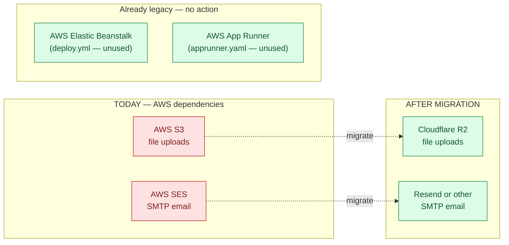

# AWS Decommissioning Runbook

| Field | Value |
|---|---|
| Owner | Founders / Engineering |
| Status | v1.0 — ready to execute |
| Audience | Engineer doing the migration |
| Estimated time | **~2-3 hours end-to-end** (including testing) |
| Pre-customer | Yes — safe to execute now |
| Rollback time if needed | ~5 min (flip env vars back) |

> 💡 **What this is.** Step-by-step runbook to remove every active AWS dependency from Hawkeye, while keeping all functionality working. The destination state is: Cloudflare R2 for file storage, Resend (or any SMTP) for email, AWS account fully terminable.

> ⚠️ **Read this once end-to-end before starting.** The code changes are already merged (see §0); your job is provisioning + env vars + smoke tests + cutover.

---

## §0. Code changes (already shipped)

These three files were updated to be provider-agnostic — they default to current AWS behavior if no new env vars are set, and switch to any S3-compatible / SMTP provider when env vars point at one:

| File | What changed |
|---|---|
| `backend/src/utils/s3Upload.js` | Reads `S3_ENDPOINT` / `S3_REGION` / `S3_BUCKET` / `S3_ACCESS_KEY_ID` / `S3_SECRET_ACCESS_KEY` / `S3_PUBLIC_URL`. Falls back to legacy `AWS_*` names. KMS encryption auto-skipped on non-AWS endpoints. |
| `backend/src/services/digilocker/digilockerStorageService.js` | `useLocalStorage()` honors either `S3_*` or `AWS_*` names. `storageProvider` field set to `s3-compatible` for R2/B2/etc. |
| `backend/src/config/sesTransporter.js` | `SMTP_HOST` / `SMTP_PORT` / `SMTP_SECURE` env-driven. Defaults to AWS SES for back-compat. |
| `backend/.env.example` | New env conventions documented with provider quick-reference. |

**Before this runbook:** the code shipped with hardcoded AWS endpoints. Now it works against any S3-API endpoint + any SMTP server. The migration is now purely an env-var + provisioning exercise.

---

## §1. Pre-flight inventory



### What you can shut off in AWS after migration
| Resource | Action |
|---|---|
| S3 bucket | Migrate contents → delete bucket |
| SES domain + suppression list | Decommission |
| IAM users with S3 / SES policies | Disable |
| (Legacy) Elastic Beanstalk environment | If exists, terminate |
| (Legacy) App Runner service | If exists, terminate |
| AWS account itself | Close (or leave dormant — closure is permanent after 90 days) |

---

## §2. Pick your providers

### File storage — Cloudflare R2 (recommended)

| Why R2 | Free tier | Egress |
|---|---|---|
| S3-compatible API (drop-in) | 10 GB storage + 1M class-A ops + 10M class-B ops/month | **$0 — free forever** |
| Production-grade SLA | + paid tier $0.015/GB-month over free | (S3 charges $0.09/GB) |

**Alternatives** (in case you prefer): Backblaze B2 ($0.01/GB egress), DigitalOcean Spaces ($5/mo flat), MinIO (self-hosted), Supabase Storage (1 GB free).

### Email — Resend (recommended)

| Why Resend | Free tier | Note |
|---|---|---|
| Modern API, simple setup | 3,000 emails / month + 100/day | React-email components if desired |
| SMTP relay built-in (no SDK swap needed) | Includes test domain `resend.dev` | Production needs domain verification |

**Alternatives:** Postmark ($15/mo for 10K — premium transactional), SendGrid (100/day free), Mailgun (already partially configured in `apprunner.yaml`), Brevo (300/day free, EU-hosted).

---

## §3. Set up Cloudflare R2 (one-time, ~15 min)

| # | Step | Where |
|---|---|---|
| 1 | Sign up at `https://dash.cloudflare.com` (free; no card for R2 free tier) | cloudflare.com |
| 2 | Enable R2 in the left nav (one-click) | Cloudflare dashboard → **R2** |
| 3 | Click **Create bucket**. Name: `hawkeye-uploads-dev` (or `-prod`). Location: Automatic. | R2 → Create bucket |
| 4 | Click **Manage API Tokens** → **Create API Token** | R2 → Settings → API Tokens |
| 5 | Token name: `hawkeye-backend`. Permissions: **Object Read & Write**. Bucket: select your bucket. TTL: forever. | API token form |
| 6 | **Copy and store the Access Key ID + Secret Access Key NOW** — Cloudflare shows them once | (vault them in 1Password / Vercel env) |
| 7 | Note the **S3 API endpoint** — format: `https://<account-id>.r2.cloudflarestorage.com` | R2 → Settings (top of page) |
| 8 | (Optional but recommended) Connect a custom domain so URLs are pretty | R2 → Settings → Custom Domains → Connect Domain → `files.hawkeye.io` (requires Cloudflare-managed DNS) |

> 💡 **About the custom domain.** If you skip it, files are served via the S3 API URL using presigned URLs (works fine, just uglier). With a custom domain, files at `https://files.hawkeye.io/uploads/<key>` are directly accessible. For pharma docs with sensitivity, use **presigned URLs even with a custom domain** — never expose private docs publicly.

---

## §4. Set up Resend (one-time, ~10 min)

| # | Step |
|---|---|
| 1 | Sign up at `https://resend.com` (free, no card) |
| 2 | Click **API Keys** → **Create API Key**. Name: `hawkeye-backend`. Permission: **Sending access**. |
| 3 | Copy and store the API key (`re_xxx...`). |
| 4 | Verify your sending domain (e.g. `hawkeye.io`): add 3 DNS records (SPF, DKIM, DMARC) per Resend's instructions |
| 5 | Wait for DNS propagation (~10 min). Verify status turns green in Resend dashboard. |
| 6 | Test: from Resend dashboard, send a test email to your own inbox. Confirm it arrives. |

> ⏳ **DNS step can wait.** Until DNS verifies, you can send from Resend's `onboarding@resend.dev` test sender. Production emails must come from your verified domain.

> ⚠️ **AWS SES users may need a temporary deliverability runway.** If your existing SES has warmed-up IPs, the new Resend send IPs are cold. Inbox-placement may temporarily degrade for the first ~1000 emails. Mitigation: don't send marketing blasts in week 1; the transactional volume (signups, password resets) will warm naturally.

---

## §5. Update environment variables (the cutover)

This is the actual cutover. Do it in **Vercel project settings** (Production environment).

### 5.1 Add new vars

```env
# File storage (Cloudflare R2)
S3_ENDPOINT=https://<your-account-id>.r2.cloudflarestorage.com
S3_REGION=auto
S3_BUCKET=hawkeye-uploads-dev
S3_ACCESS_KEY_ID=<from-step-3.6>
S3_SECRET_ACCESS_KEY=<from-step-3.6>
S3_PUBLIC_URL=https://files.hawkeye.io   # only if you set up custom domain

# Email (Resend SMTP relay)
SMTP_HOST=smtp.resend.com
SMTP_PORT=465
SMTP_SECURE=true
SMTP_USER=resend
SMTP_PASS=<resend-api-key-from-step-4.3>
```

### 5.2 Leave old vars in place (for now)

**Do NOT remove `AWS_*` vars yet.** Keep them as fallback during smoke testing. If the new vars work, you can delete them in §8.

### 5.3 Trigger redeploy

After saving env vars, trigger a Vercel redeploy (push a commit OR use Vercel's "Redeploy" button on the latest deployment). New env vars take effect on the next deployment.

---

## §6. Smoke tests (do these in order, ~20 min)

### 6.1 File upload smoke test

| # | Test | Pass criteria |
|---|---|---|
| 1 | Login to deployed app as a tenant_admin user | Login succeeds |
| 2 | Go to Document Control → Upload a small PDF (1-2 pages, < 1 MB) | Upload completes without error |
| 3 | Open R2 dashboard → check bucket → confirm the file is there | File visible in R2 bucket |
| 4 | Click the file link in Document Control | File downloads / opens |
| 5 | Verify the URL: should NOT contain `amazonaws.com` | URL points to R2 endpoint or your custom domain |

### 6.2 Audit attachment smoke test

| # | Test | Pass criteria |
|---|---|---|
| 1 | Create a new audit (or open existing) | OK |
| 2 | Go to Artifacts → upload an evidence file | Upload completes |
| 3 | Refresh and re-open the artifact | File loads from R2 |

### 6.3 Email smoke test

| # | Test | Pass criteria |
|---|---|---|
| 1 | Logout → Click "Forgot password" → enter a test user email | Backend reports success |
| 2 | Check the inbox for the reset email (within 30 sec) | Email arrives |
| 3 | Check email headers — sender should match your verified Resend domain | `From:` header correct |
| 4 | Click the reset link | Reset flow works |
| 5 | (If notifications enabled) Trigger an audit assignment | Recipient gets notification email |

### 6.4 What to do if anything fails

| Symptom | Likely cause | Fix |
|---|---|---|
| Upload returns 500 | R2 credentials wrong / bucket name typo | Recheck env vars; check Vercel logs for the exact error |
| File uploads but URL 404s | Public domain not set up but `S3_PUBLIC_URL` is set | Remove `S3_PUBLIC_URL` to fall back to presigned URLs OR finish custom domain setup |
| Email sender rejected | Domain not yet verified in Resend OR using test sender for non-test recipient | Wait for DNS verification; switch to `from: onboarding@resend.dev` temporarily |
| Email sends but in spam | Cold IP from new provider | Expected for week 1; will improve as volume builds |
| Login still uses S3 URLs | Vercel hasn't redeployed | Trigger manual redeploy |

---

## §7. Migrate existing files (if any)

For pre-customer with only demo data, **probably skip this** — just regenerate test data. For real data, here's how.

### 7.1 List what's in your S3 bucket

```bash
aws s3 ls s3://your-bucket/ --recursive --human-readable --summarize
```

### 7.2 Copy with rclone (the simplest tool)

```bash
# install rclone (one-time)
brew install rclone   # or: curl https://rclone.org/install.sh | sudo bash

# configure both ends — interactive setup
rclone config
#   1. n) New remote
#   2. name: aws-s3 / provider: AWS S3
#   3. n) New remote (again)
#   4. name: r2 / provider: Cloudflare R2
#   5. paste R2 endpoint + access key + secret

# Copy (preserves keys/paths so DB URLs don't break)
rclone copy aws-s3:your-old-bucket r2:hawkeye-uploads-dev --progress --transfers 16
```

**Time estimate:** ~1 min per 1 GB on a 100 Mbps link. Demo data (~100 MB) = 1-2 minutes.

### 7.3 Rewrite URLs in MongoDB (only if needed)

If `S3_PUBLIC_URL` differs from the old S3 URL pattern (e.g. you used `https://bucket.s3.us-east-1.amazonaws.com/...` but now use `https://files.hawkeye.io/...`), update the existing records:

```js
// scripts/migrate-file-urls.mjs (one-off)
import mongoose from "mongoose";

const OLD_PREFIX = "https://your-bucket.s3.us-east-1.amazonaws.com/";
const NEW_PREFIX = "https://files.hawkeye.io/";

await mongoose.connect(process.env.MONGO_URI);
const models = ["AuditArtifact", "Document", "RemoteSession", "AuditNote"];
for (const name of models) {
  const M = mongoose.model(name);
  const docs = await M.find({ "data.fileUrl": { $regex: `^${OLD_PREFIX.replace(/\./g, "\\.")}` } });
  for (const d of docs) {
    d.data.fileUrl = d.data.fileUrl.replace(OLD_PREFIX, NEW_PREFIX);
    await d.save();
  }
  console.log(`${name}: rewrote ${docs.length} URLs`);
}
await mongoose.disconnect();
```

Run once. Verify with a few spot-checks. **Take a DB backup first.**

---

## §8. Shut down AWS (the final step)

> ⚠️ **Only after §6 smoke tests pass and you've waited 24-48 hours observing for any silent issues.**

### 8.1 Remove AWS env vars from Vercel

In Vercel project settings, delete these (no longer needed):
- `AWS_REGION`
- `AWS_S3_BUCKET`
- `AWS_ACCESS_KEY_ID`
- `AWS_SECRET_ACCESS_KEY`
- `AWS_KMS_KEY_ID`

### 8.2 Delete legacy AWS deploy configs

```bash
cd backend
rm apprunner.yaml                       # legacy AWS App Runner
rm .github/workflows/deploy.yml         # legacy AWS Elastic Beanstalk

git add -A && git commit -m "chore: remove legacy AWS deploy configs after R2 + Resend migration"
git push
```

### 8.3 Terminate AWS resources (in this order)

| # | Resource | Action | AWS console |
|---|---|---|---|
| 1 | S3 bucket | Empty bucket → Delete bucket | S3 |
| 2 | SES domain identity | Delete identity | SES → Verified identities |
| 3 | IAM users with `hawkeye-*` policies | Disable, then delete | IAM → Users |
| 4 | Elastic Beanstalk environment (if exists) | Terminate environment | Elastic Beanstalk |
| 5 | App Runner service (if exists) | Delete service | App Runner |
| 6 | CloudWatch log groups | (Optional) clean up old logs | CloudWatch |
| 7 | AWS account closure | Account settings → Close account | Billing → Account |

> ⚠️ **AWS account closure is permanent after 90 days.** Confirm one last time that no other system depends on this account before closing. If unsure, leave it dormant (zero resources = ~zero bill).

### 8.4 Re-verify after AWS is gone

Re-run the §6 smoke tests one more time. If everything still works, you're done.

---

## §9. Rollback plan (if something breaks)

If R2 or Resend has an outage OR you hit a bug:

| Step | Time |
|---|---|
| 1. In Vercel env, remove `S3_ENDPOINT` (forces back to AWS defaults) | 30 sec |
| 2. Confirm `AWS_*` vars are still set (from §5.2) | 30 sec |
| 3. Trigger redeploy | 2 min |
| 4. App is back on AWS S3 | done |

For SMTP: change `SMTP_HOST` back to `email-smtp.us-east-1.amazonaws.com` and `SMTP_USER`/`SMTP_PASS` back to AWS SES creds.

> 💡 **This is why we kept AWS_* vars in §5.2.** The migration is reversible until you delete those env vars in §8.1. Don't delete them until you're confident.

---

## §10. Cost projection (post-migration)

For pre-customer + early-customer scale:

| Service | Free tier | Estimated monthly cost (first 6 mo) |
|---|---|---|
| Cloudflare R2 storage | 10 GB | $0 |
| Cloudflare R2 ops (class-A + class-B) | 1M + 10M / mo | $0 |
| Cloudflare R2 egress | unlimited | **$0** |
| Resend email | 3,000 / mo | $0 |
| Vercel (frontend + backend serverless) | existing plan | unchanged |
| MongoDB Atlas | existing M10 | unchanged |
| **TOTAL new monthly cost** | | **$0** |

Once you exceed free tiers (typically post-Series-A):
- R2: $0.015/GB-month storage, still zero egress
- Resend: $20/mo for 50K emails

**Net savings vs current AWS spend:** depends on current AWS bill, but for the file-storage + SES combo at SaaS scale, expect **40-70% reduction** in this line item primarily due to zero R2 egress fees.

---

## §11. Open questions for you to decide

| Decision | Recommendation | Implication |
|---|---|---|
| Custom domain for R2 files? | Yes — `files.hawkeye.io` | Cleaner URLs; small DNS one-time setup |
| Private bucket + presigned URLs vs public bucket? | **Private + presigned** for pharma docs | Slightly more code (already supported in `@aws-sdk/s3-request-presigner`) |
| Email FROM address? | `notifications@hawkeye.io` (production) + reply-to support address | Standard transactional pattern |
| Keep AWS account dormant or close? | **Close after 90 days of zero use** | One less thing to monitor |
| Migration window (when to cut over) | Weekend or low-usage hour | Minimize user impact (low for pre-customer) |

---

## §12. Post-migration cleanup checklist

```
☐ AWS S3 bucket deleted
☐ AWS SES identity deleted
☐ AWS IAM hawkeye-* users deleted
☐ apprunner.yaml deleted from repo
☐ .github/workflows/deploy.yml deleted from repo
☐ AWS_* env vars removed from Vercel
☐ AWS_* env vars removed from local .env (for dev)
☐ DNS records pointing to AWS removed (if any)
☐ Cloudflare R2 backup configured (R2 → Replication, if you want regional redundancy)
☐ Resend domain verified + SPF/DKIM/DMARC green
☐ Updated team docs / wiki referring to AWS storage URLs
☐ Notified anyone with bookmarked S3 URLs
☐ Tagged release as "v1.0-aws-free" in git
☐ AWS account closure scheduled OR account left dormant
```

---

## See also

- [PLATFORM-OVERVIEW.md](../00-overview/PLATFORM-OVERVIEW.md) — tech stack reference
- [SECURITY.md](../06-security/SECURITY.md) — security posture (file storage section)
- [.env.example](../../../backend/.env.example) — env-var conventions
- [Cloudflare R2 docs](https://developers.cloudflare.com/r2/)
- [Resend docs](https://resend.com/docs)

---

*Doc_V2 · Engineering · Infrastructure · AWS Decommissioning Runbook v1.0*
