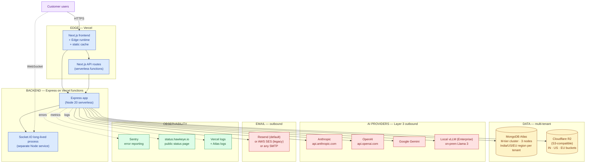
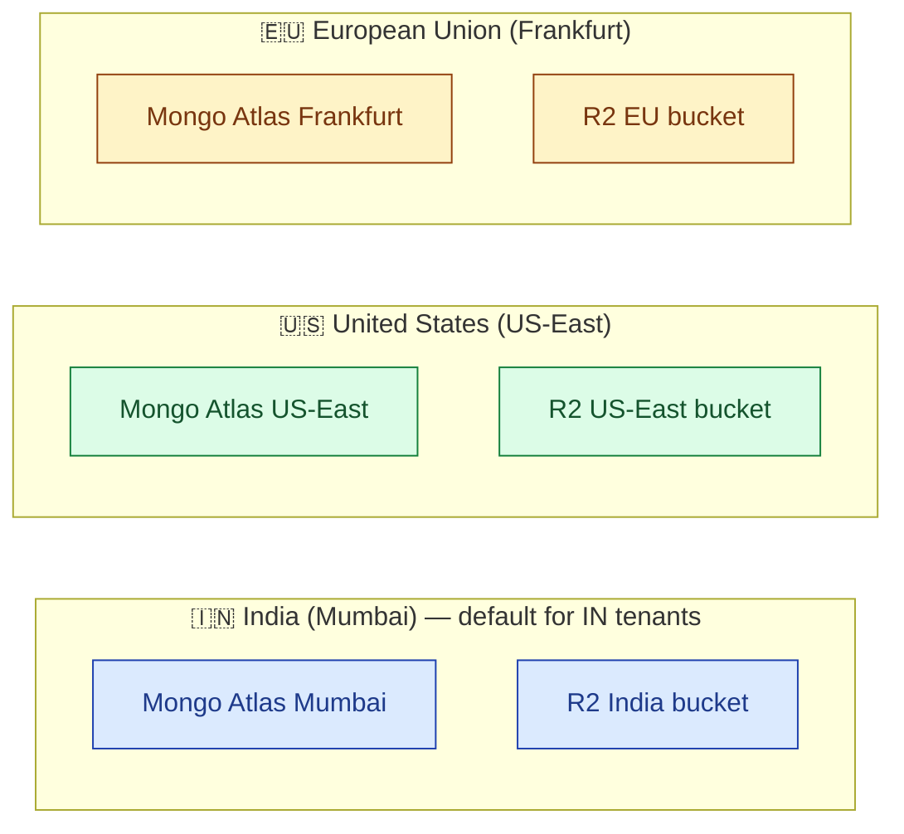

# Infrastructure & Operations

## S.M.A.R.T. Hawk Platform Deployment, CI/CD, Observability

| Field | Value |
|---|---|
| Owner | Engineering · Platform Lead |
| Status | v1.0 — 2026-06-05 |
| Scope | Hosting topology · deployment pipeline · observability · backup/DR · runbooks pointer |
| Pairs with | [ARCHITECTURE.md](../01-architecture/ARCHITECTURE.md) · [SECURITY.md](../06-security/SECURITY.md) · [AWS-DECOMMISSION.md](./AWS-DECOMMISSION.md) · [07-operations/](../../07-operations/) |

---

## 1. Hosting topology

| Tier | Provider | Why |
|---|---|---|
| **Frontend + Next.js** | Vercel | Native Next.js host; global edge cache; preview deploys |
| **Backend Express** | Vercel serverless functions (Node 20) | Co-located with frontend; managed scaling; no infra ops |
| **Socket.IO real-time** | Separate Node process (Vercel + Fly.io for long-lived) | Serverless functions cannot hold WebSockets |
| **Primary database** | MongoDB Atlas M-tier cluster (3 nodes) | Managed Mongo; per-region clusters for residency |
| **Evidence storage** | Cloudflare R2 (S3-compatible) | Zero egress fees · India/US/EU residency · S3-API compatible |
| **AI providers** | Anthropic / OpenAI / Gemini / local vLLM | Multi-provider gateway per Layer 3 |
| **Email** | Resend (default; SMTP) | Modern API · 3K free / month |
| **Observability** | Sentry + Vercel logs + Atlas logs + status page | Composable stack; no vendor lock-in |

---

## 2. Multi-region topology (data residency)

Customer elects region at tenant provisioning:

| Region | Mongo cluster | R2 bucket | Vercel edge node |
|---|---|---|---|
| India (Mumbai) — default | Atlas M10 Mumbai | `hawkeye-uploads-in` | Mumbai (Vercel edge) |
| United States | Atlas M10 US-East | `hawkeye-uploads-us` | US-East |
| European Union | Atlas M10 Frankfurt | `hawkeye-uploads-eu` | Frankfurt |

Tenant data **never leaves the elected region** without explicit customer instruction.

---

## 3. Environments

| Environment | Purpose | URL | Data |
|---|---|---|---|
| `local` | Engineer machines | localhost:3000 | Seeded synthetic |
| `dev` | Integration testing | `dev.hawkeye.io` | Synthetic; reset weekly |
| `staging` | Pre-production validation; vendor-side IQ/OQ execution | `staging.hawkeye.io` | Synthetic + benchmark fixtures |
| `production` | Live customer tenants | `app.hawkeye.io` | Customer real data |
| `enterprise-onprem` | Sovereign deployments (per customer) | Customer's domain | Customer real data; isolated infra |

Promotion path: feature branch → preview deploy (Vercel) → `dev` (merge to `dev` branch) → `staging` (merge to `staging`) → `production` (merge to `main` after release gate).

---

## 4. CI/CD pipeline

```mermaid
flowchart LR
    classDef stage fill:#DBEAFE,stroke:#1E40AF,color:#1E3A8A
    classDef gate fill:#FEF3C7,stroke:#92400E,color:#78350F
    classDef ship fill:#DCFCE7,stroke:#15803D,color:#14532D

    A["Engineer<br/>opens PR"]:::stage
    B["GitHub Actions<br/>CI suite"]:::stage
    G1["Gate: <br/>lint · type-check · unit · integration<br/>+ SAST + Dependabot"]:::gate
    C["Vercel<br/>preview deploy"]:::stage
    R["Code review<br/>≥2 approvers"]:::stage
    G2["Gate: <br/>signed commits<br/>+ branch protection"]:::gate
    M["Merge to main"]:::stage
    D["Auto deploy<br/>to production"]:::ship
    P["Post-deploy<br/>smoke tests"]:::ship
    N["Customer release<br/>notification"]:::ship

    A --> B --> G1 --> C --> R --> G2 --> M --> D --> P --> N
```

### 4.1 CI checks (GitHub Actions, every PR)

| Check | Tool | Blocks merge? |
|---|---|---|
| Lint | ESLint + Prettier | Yes |
| Type check | `tsc --noEmit` | Yes |
| Unit tests | Jest / Mocha | Yes |
| Integration tests | supertest | Yes |
| E2E (key flows) | Playwright | Yes (on `main` only) |
| Security scan | CodeQL (SAST) | Yes for CRITICAL |
| Dependency scan | Dependabot | Yes for CRITICAL |
| License audit | Custom script | Yes for AGPL / unknown |
| Bundle-size budget | `size-limit` | Soft (warns) |

### 4.2 Branch model

| Branch | Purpose | Protection |
|---|---|---|
| `main` | Production canonical | Signed commits · ≥2 reviewers · CI green · no force-push |
| `staging` | Pre-production | ≥1 reviewer · CI green |
| `dev` | Integration | CI green |
| `feature/*` | Feature work | n/a |
| `hotfix/*` | Production hotfix | Same as `main` but fast-track |

### 4.3 Release classification

Every release published to customers is classified per [GAMP-CAT-4-COMPLIANCE.md §18](../../08-compliance-regulatory/GAMP-CAT-4-COMPLIANCE.md):

| Class | Cadence | Customer notification SLA |
|---|---|---|
| Major | 1–2 per year | 90 days advance |
| Minor | Monthly | 30 days advance |
| Patch — functional bugfix | As needed | 7 days advance |
| Patch — security | Immediate | ≤24 hours |
| Cosmetic | At release | Published in notes |

---

## 5. Backup, recovery, disaster recovery

| Asset | Backup mechanism | Frequency | Retention | Restore SLA |
|---|---|---|---|---|
| MongoDB Atlas | Atlas continuous backup + daily snapshot | Continuous | 30 days (production) · 7 days (PoC) | <2 hours |
| Cloudflare R2 | Cross-region replication (optional) | Continuous | Per object policy | <1 hour |
| Audit-trail collection | Hot replica + offline cold archive | Continuous + monthly | Per-record lifetime + 1 year | <4 hours |
| Configuration | Git versioning of all config-as-code | Per change | Forever | <30 min |
| Customer data export bundles | On-demand at PoC end / contract termination | On-demand | 30-day retention | Same-day |

### 5.1 DR runbook

Documented in [07-operations/disaster-recovery/](../../07-operations/disaster-recovery/) (to be expanded).

**RTO (Recovery Time Objective):** <4 hours
**RPO (Recovery Point Objective):** <24 hours (production) · <1 hour for paying customers via continuous backup

### 5.2 Restore tests

Monthly restore test cadence in `staging`. Last restore test result logged in the Periodic Vendor Audit Pack (shared with customers per GAMP Cat 4 evidence).

---

## 6. Observability stack

| Concern | Tool | What it captures |
|---|---|---|
| Application errors | Sentry | Stack traces, breadcrumbs, user context |
| Structured logs | Vercel logs + Atlas logs | Per-request correlation ID, tenant, user |
| Performance (frontend) | Vercel Analytics | Core Web Vitals (LCP, INP, CLS) |
| API performance | Custom timing middleware → Sentry | p50/p95/p99 per endpoint |
| Database performance | Atlas Performance Advisor | Slow queries, index suggestions |
| Uptime | UptimeRobot + Vercel monitor | Per-endpoint availability |
| Status page | status.hawkeye.io | Customer-facing service status |
| Customer-visible incidents | Status page + email to affected customers | Per [GAMP-CAT-4-COMPLIANCE.md §21](../../08-compliance-regulatory/GAMP-CAT-4-COMPLIANCE.md) |

### 6.1 Per-tenant metrics

A per-tenant dashboard exposes: API call volume, AI Gateway usage (per provider), storage usage, active users, audit-trail growth, error rate, latency p95. Available to tenant_admin role.

---

## 7. Security at the infrastructure layer

| Control | Implementation |
|---|---|
| Network | All traffic TLS 1.3 · no plaintext anywhere |
| Edge protection | Vercel + Cloudflare DDoS protection · WAF rules · rate limiting |
| Secrets | Vercel environment variables (encrypted at rest) · GitHub Actions secrets · per-environment isolation |
| SSH access | Disabled for serverless functions; per-engineer on-call for Mongo Atlas via 1Password vault |
| Bastion | Mongo Atlas private network endpoints (Enterprise tenants) |
| Audit logging | Vercel deploy log + GitHub audit log + Atlas access log |
| Vulnerability mgmt | Dependabot weekly · SAST every PR · annual external pentest |
| Encryption at rest | AES-256 for Mongo + R2; per-tenant keys available BYOK on Enterprise |

Detail: [SECURITY.md](../06-security/SECURITY.md).

---

## 8. Cost model (steady state, M12 with 10 customers)

| Line | Monthly | Notes |
|---|---|---|
| Vercel (Pro tier) | $20–200 | Per project; scales with build minutes + bandwidth |
| MongoDB Atlas (M10 × 3 regions) | $174 × 3 = $522 | M10 is dev-grade; M30 for production scale |
| Cloudflare R2 storage | ~$0–15 | 10 GB free; $0.015/GB-month after |
| Cloudflare R2 egress | $0 | Zero egress fees forever |
| AI providers (Anthropic + OpenAI + Gemini) | $500–3000 | Variable per customer usage |
| Resend (SMTP) | $0 | Free tier covers 3K emails/month |
| Sentry | $26 | Team plan |
| GitHub | $4 × seats | Team plan |
| 1Password | $8 × seats | Team plan |
| **Total infra** | **~$1,200–4,500/month** | At 10 customers |

Per-customer break-even at Growth tier ACV ($12K/yr ≈ $1K/mo) reached at ~3 customers. Margin improves materially after 25 customers (fixed-cost amortization).

---

## 9. On-prem option (Enterprise sovereign deployment)

For Enterprise customers in regulated jurisdictions or defense contexts:

| Component | On-prem option |
|---|---|
| Application | Containerized via Docker Compose; runs on customer's Kubernetes or VM |
| Database | Customer's MongoDB Enterprise (Atlas or self-hosted) |
| Object storage | Customer's MinIO or S3-compatible appliance |
| LLM | Local vLLM serving Llama 3 70B on customer GPU |
| AI providers | Disabled OR customer's own Azure OpenAI / Bedrock |
| Email | Customer's SMTP relay |

On-prem TCO is +30% on Growth ACV (per [PRICING.md §7](../../01-strategy/pricing-and-packaging/PRICING.md)). Currently a roadmap item (M12+) with select Enterprise design partners.

---

## 10. Runbooks (operational SOPs)

Documented in [07-operations/runbooks/](../../07-operations/runbooks/):

| Runbook | Scenario |
|---|---|
| Deploy rollback | Production deploy fails smoke test |
| Database restore | Mongo corruption or accidental deletion |
| AI provider outage | Anthropic / OpenAI / Gemini down — failover routing |
| Tenant data export | Customer requests off-boarding bundle |
| Tenant data deletion | Customer requests hard-deletion (DPDP / GDPR) |
| Security incident | Suspected breach response |
| Customer-reported P1 | Platform-unreachable for a tenant |

---

## 11. On-call rotation

Documented in [07-operations/on-call/](../../07-operations/on-call/):

| Tier | Coverage | Response SLA |
|---|---|---|
| Tier 1 | Engineer on-call (weekly rotation) | <30 min during business hours; <1 hr off-hours |
| Tier 2 | Founder Lead escalation | <2 hr |
| Tier 3 | Vendor / cloud-provider escalation | Per vendor SLA |

PagerDuty (or equivalent) triggers paging based on Sentry severity + uptime monitor failure.

---

## 12. AWS decommission status (as of 2026-06-05)

S.M.A.R.T. Hawk historically used AWS (S3 + SES) but has migrated to provider-agnostic S3 + SMTP. See [AWS-DECOMMISSION.md](./AWS-DECOMMISSION.md) for the full migration runbook.

Current status: code is provider-agnostic; default deployment uses Cloudflare R2 + Resend.

---

## 13. Known infrastructure debt

> ⚠️ **What we owe.**
>
> 1. Production database is M10 — needs upgrade to M30 before 25 customers.
> 2. Socket.IO service needs proper home (Vercel functions can't host long-lived sockets); Fly.io migration planned Q4 2026.
> 3. DR runbook tested only quarterly — should be monthly per Cat 4 expectations.
> 4. No multi-region failover for primary database (only backup); next quarter.
> 5. Status page is manual (Statuspage.io); should be automated from monitors.
> 6. On-prem deployment scripts are draft-quality; needs hardening before first Enterprise customer.
> 7. Per-tenant resource metering not yet implemented — needed for AI credit usage billing.
> 8. Backup-restore tests are documented but not automated end-to-end.

---

## See also

- [ARCHITECTURE.md](../01-architecture/ARCHITECTURE.md) — backend system architecture
- [SECURITY.md](../06-security/SECURITY.md) — security posture
- [AWS-DECOMMISSION.md](./AWS-DECOMMISSION.md) — migration runbook
- [07-operations/](../../07-operations/) — runbooks, on-call, incident response, DR
- [GAMP-CAT-4-COMPLIANCE.md §18 + §19 + §20](../../08-compliance-regulatory/GAMP-CAT-4-COMPLIANCE.md) — operational compliance
- [PLATFORM-OVERVIEW.md](../00-overview/PLATFORM-OVERVIEW.md) — full 5-layer canonical reference
- [PRICING.md](../../01-strategy/pricing-and-packaging/PRICING.md) — pricing tiers (on-prem +30%)

---

*Doc_V2 · Engineering · Infrastructure v1.0 · 2026-06-05*
