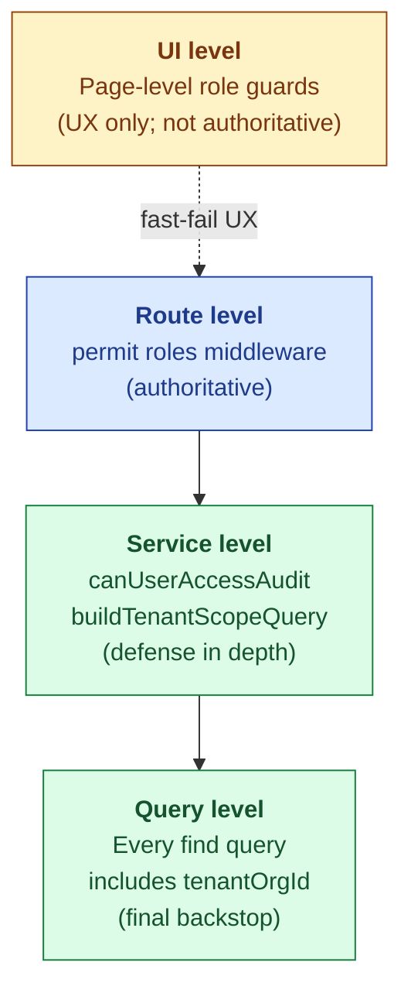
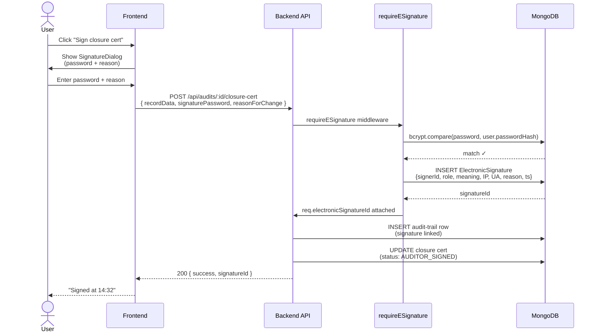

# Security

| Field | Value |
|---|---|
| Owner | Engineering (CTO) + Compliance |
| Status | v1.0 |
| Last updated | 2026-05-31 |
| Source | `backend/src/middlewares/`, `services/auditTrailService.js`, `models/ElectronicSignature.js` |

---

## 1. Security posture in one paragraph

> 💡 **Hawkeye implements Part 11 / Annex 11–grade access control + audit trail + e-signature as the platform's primary security spine.** Every protected request runs through a 4-layer middleware chain (auth → tenant → RBAC → e-sig). Every state change writes an immutable audit-trail row with mandatory reason-for-change. Every signed action mints an `ElectronicSignature` record with bcrypt-verified password + IP + UA + intent. Multi-tenancy is service-layer enforced, not just route-layer. AI is grounded + reproducible, with model version + prompt hash captured in audit trail. The goal: a regulator can ask "what changed, when, by whom, why, with what evidence" and get an answer in <2 sec.

## 2. The 4-layer security chain

```mermaid
flowchart LR
    classDef layer fill:#dbeafe,stroke:#1e40af,color:#1e3a8a

    REQ["HTTP Request"]
    L1["<b>L1 · authenticate</b><br/>JWT verify<br/>req.user populated"]:::layer
    L2["<b>L2 · resolveTenant</b><br/>req.tenantId populated<br/>tenant context for downstream"]:::layer
    L3["<b>L3 · permit roles</b><br/>RBAC check<br/>Role allowlist per endpoint"]:::layer
    L4["<b>L4 · requireESignature</b><br/>Write endpoints only<br/>bcrypt verify password OR ticket"]:::layer
    HANDLER["Controller handler<br/>+ service business rules"]
    SVC["<b>Service-layer guards</b><br/>canUserAccessAudit canAuditorAccessAudit<br/>buildTenantScopeQuery"]:::layer
    DB[("MongoDB<br/>All queries tenant-scoped")]

    REQ --> L1 --> L2 --> L3 --> L4 --> HANDLER --> SVC --> DB
```

## 3. Authentication

| Component | Implementation |
|---|---|
| Method | JWT (HS256) over HTTPS |
| Issued by | `/api/auth/login` endpoint after email + password verification |
| Storage (client) | HttpOnly cookie `authTokenClient` (preferred); localStorage `authToken` (legacy) |
| Expiry | 24h default; refresh via `/api/auth/refresh` |
| Password hashing | bcrypt cost 12 |
| Multi-factor (MFA) | ⏳ Not yet shipped; planned M12 (TOTP) |
| SSO | ⏳ Not yet shipped; planned M18 (SAML / Okta / Azure AD) |
| Session invalidation | Logout = client-side clear (no server-side denylist today; planned with MFA) |

> ⚠️ **Known gap:** no server-side session/token denylist today. If a JWT is leaked, the only mitigation is short expiry. **Mitigation roadmap:** Redis-backed session denylist alongside MFA rollout.

## 4. Authorization (RBAC)

### Role taxonomy

| Role | Capability |
|---|---|
| `buyer` | Quality team at a buyer organization (creates audits, manages CAPAs, approves closures) |
| `auditor` | Third-party OR internal auditor (executes audits, drafts observations, signs reports) |
| `supplier` | QA Head at a supplier organization (accepts intimations, submits PAQ responses) |
| `supplierUser` | Supplier ops staff (fills assigned sections) |
| `tenant_admin` | Manages users + RBAC + tenant config within their tenant |
| `admin` | Platform-side admin (limited; legacy) |
| `superadmin` | Platform-wide admin (Hawkeye staff only) |

### RBAC enforcement points

## 5. Multi-tenancy

### Tenant model

- `Organization` is the tenant boundary (buyer org, supplier org, or auditor firm)
- Every record carries `tenantOrgId`
- Cross-tenant access only via `Affiliation` records (e.g., third-party auditor working with multiple buyer tenants)

### Defense-in-depth enforcement

| Layer | Mechanism | Failure mode |
|---|---|---|
| Route middleware | `resolveTenant` sets `req.tenantId` from user session | 401 if no tenant |
| Service guards | `canUserAccessAudit()` checks user/audit tenant + affiliation | 403 with diagnostic envelope |
| Query helpers | `buildAuditTenantScopeQuery()` injects tenant filter into Mongoose query | (no resource returned) |
| Test coverage | Per-module cross-tenant guard tests | CI blocks merge if guards regress |

### Cross-tenant special cases

| Case | Mechanism |
|---|---|
| Third-party auditor at multiple buyer tenants | `Affiliation` records; `canAuditorAccessAudit()` checks active affiliation per audit |
| Platform-wide content (regulatory corpus, SOPs) | Stored at `tenantId = "__platform__"`; readable by all tenants via `includePlatform: true` flag |
| Inspector-readiness queries (cross-module trail) | Tenant-scoped: `GET /api/audit-trail/by-entity?tenantId=...` |

## 6. Electronic signature (Part 11 / Annex 11)

### ElectronicSignature record schema (key fields)

| Field | Purpose | Part 11 requirement |
|---|---|---|
| `recordType` | What's being signed (e.g., `audit-closure-cert`) | §11.50(a) |
| `recordId` | The signed record's ID | §11.50(a) |
| `signerId` + `signerRole` | Who signed (attributable) | §11.10(d), §11.50(b) |
| `signatureMeaning` | APPROVED / AUTHORED / WITNESSED / REVIEWED / REJECTED | §11.50(b) |
| `authMethod` | PASSWORD / TOKEN / BIOMETRIC | §11.10(d) |
| `reasonForChange` | Mandatory ≥10 chars (the "why") | ALCOA+ "Contemporaneous" |
| `ipAddress` + `userAgent` | Context attribution | §11.10(e) |
| `signedAt` | Timestamp (server time, ISO-8601 UTC) | §11.10(f) |
| `password verification proof` | Hash-of-hash proof (not the password itself) | §11.300 |

### Soft mode vs hard mode

| Mode | Behavior | Default | Override |
|---|---|---|---|
| **Soft** | Missing/invalid e-sig → log warning, complete action | Default today | per-endpoint config |
| **Hard** | Missing/invalid e-sig → 403, action blocked | Production-ready | `ENFORCE_ESIG=hard` env var |

> ⚠️ **Open question (URS-A-023):** flip default to hard mode for new production tenants?

### E-sig gates per module

| Module | E-sig gate | Meaning |
|---|---|---|
| Audit | Intimation signature (G1) | Supplier APPROVED |
| Audit | Report sign | Auditor AUTHORED / Buyer APPROVED |
| Audit | Closure cert (G8) | Auditor AUTHORED + Buyer APPROVED |
| CAPA | CAPA close | Buyer APPROVED |
| Deviation | Disposition + RCA approval | QA APPROVED |
| Change Control | CC approval gates | Per-step approver |
| Document Control | Doc approval gates | Per-step approver |
| MRM | Sign-off | Management Review chair APPROVED |

## 7. Audit trail (the regulatory observability layer)

| Property | Implementation |
|---|---|
| **Immutability** | No UPDATE, no DELETE — only INSERT. Enforced at service layer (`writeAuditTrail` is append-only). |
| **Mandatory reasonForChange** | ≥10 chars; never auto-defaulted; UI requires user input |
| **Cross-module queryable** | Indexed on `(tenantId, module, entityId)`, `(tenantId, action)` — <100ms per-entity, <2s cross-entity |
| **Before/after diffs** | `meta.changeBrief.fields[]` captures field-level diffs for "what changed" queries |
| **Signature linkage** | `signatureId` field links e-sig to its triggering action |
| **AI decision linkage** | `ai.{modelVersion, promptHash, retrievalSet, confidence}` fields for AI-driven actions |
| **Retention** | Indefinite by default; per-tenant config (planned M18) |

### What goes into the audit trail

> ✅ **Every** state change, e-signature, AI decision, RBAC denial, login, logout, password change, role change.

| Event class | Examples |
|---|---|
| State change | Phase transition, status update, ownership change |
| E-signature | All e-sig events (success + failure) |
| AI decision | Observation drafted, supplier intel run, wizard plan executed |
| Access denial | 403 on protected endpoint (with `actorId`, `attemptedEntityId`, `reason`) |
| Authentication | Login (success + failure), logout, password change |
| Admin | User added/removed, role grant/revoke |
| Integration | Webhook fired, external system sync |

## 8. Data integrity (ALCOA+)

Hawkeye implements all 9 ALCOA+ principles:

| Principle | Implementation |
|---|---|
| **A**ttributable | Every record carries `createdBy` + `updatedBy`; audit trail links every change to `actorId` |
| **L**egible | UTF-8 text storage; PDF/HTML rendering preserves source; no proprietary binary formats |
| **C**ontemporaneous | Audit trail timestamps server-side at write time; client clock not trusted |
| **O**riginal | Original data preserved; corrections logged as new events with reasonForChange (no overwrite) |
| **A**ccurate | Schema validation at write; required field enforcement; type checks |
| **C**omplete | All metadata (signature, reason, IP, UA, timestamp) captured per action |
| **C**onsistent | Status enums centralized in `constants/auditPhases.js`; never duplicated |
| **E**nduring | S3 + MongoDB Atlas backups + point-in-time recovery; retention indefinite |
| **A**vailable | Cross-module trail query < 2 sec; export to CSV/PDF supported |

## 9. Network + infrastructure security

| Layer | Control |
|---|---|
| **Transport** | TLS 1.2+ for all HTTP; HSTS header `max-age=31536000` |
| **Frontend** | Content Security Policy (CSP) restricts script sources; SameSite=Lax cookies |
| **Backend** | Express helmet middleware (XSS, clickjacking, MIME-sniffing protection) |
| **CORS** | Allowlist per environment; production locked to known frontend origins |
| **Hosting** | Vercel frontend (DDoS protection), Render/Railway backend (TLS termination at edge) |
| **Database** | MongoDB Atlas with VPC peering (planned M12); IP allowlist today |
| **File storage** | S3 with bucket-level encryption (SSE-S3 minimum, SSE-KMS for tenant-isolated) |
| **Secrets** | Env vars only; never in code or logs. Rotated quarterly. |
| **DDoS** | Provider-level protection (Cloudflare-class) |

## 10. Compliance certifications

| Certification | Status | Target date | Scope |
|---|---|---|---|
| **SOC 2 Type 1** | ⏳ Not yet certified | M12 (June 2027) | Full platform |
| **SOC 2 Type 2** | ⏳ Not yet certified | M24 | Full platform |
| **HIPAA BAA-readiness** | ⏳ Not in scope today | M18 if healthcare prospect | Conditional |
| **GDPR compliance** | ✅ Self-assessed; no live EU customers | Audit before first EU customer | EU customers |
| **India DPDPA** | ✅ Self-assessed | Re-audit M12 with legal | Indian customers |
| **21 CFR Part 11** | ✅ Self-assessed compliance matrix | Customer-led validation (per-tenant) | Pharma customers |
| **EU GMP Annex 11** | ✅ Self-assessed compliance matrix | Customer-led validation | EU pharma customers |
| **ISO 27001** | ⏳ Not yet certified | M30 | Full platform |

> ⚠️ **Pre-customer reality.** No third-party certifications yet. Self-assessment matrices live in `Doc_V2/08-compliance-regulatory/`. First customer audit will be the real test.

## 11. Privacy

| Data class | Handling |
|---|---|
| PII (user emails, names) | Stored encrypted at rest (Mongo Atlas SSE); never logged plaintext |
| Customer data (audit findings, CAPAs, etc.) | Tenant-isolated; no cross-tenant access without affiliation |
| AI prompts/responses | Logged in audit trail with prompt hash (not plaintext); LLM provider data-retention disabled where supported (Anthropic + OpenAI enterprise) |
| Voice/video recordings (remote audits) | S3 with tenant-prefixed bucket; encrypted at rest; per-tenant retention rules |
| Payment data | Stripe-tokenized; NEVER touches Hawkeye servers |

### Data subject rights

| Right (per GDPR / DPDPA) | Mechanism | Owner SLA |
|---|---|---|
| Access | `GET /api/users/me/export-data` (planned M12) | 30 days |
| Rectification | Self-service in profile UI | Immediate |
| Erasure | Tenant_admin request → support process (audit-trail rows preserved per regulatory retention) | 30 days |
| Portability | JSON export of tenant data | 30 days |
| Objection / restriction | Per-tenant config | 30 days |

## 12. Incident response

(See [07-operations/incident-response/](../../07-operations/incident-response/) for full runbook — TBD.)

| Severity | Response time | Notification |
|---|---|---|
| **SEV-1** (data breach, unauthorized cross-tenant access) | <1 hour | All affected tenants + DPA where required + executive team |
| **SEV-2** (auth/RBAC failure, e-sig bypass) | <4 hours | Affected tenants + executive team |
| **SEV-3** (audit-trail integrity, AI-decision inconsistency) | <24 hours | Affected tenants |
| **SEV-4** (low-impact: UX bug in security feature) | <72 hours | Internal only |

## 13. Threat model — what we worry about

| Threat | Likelihood | Impact | Mitigation |
|---|---|---|---|
| **Cross-tenant data leak** (e.g., a query returns wrong tenant's data) | Low | Critical | 4-layer enforcement; per-module tests; CI guard |
| **E-sig bypass** (signature attached without password verification) | Low | Critical | `requireESignature` is single code path; tests; soft/hard mode |
| **Audit-trail tampering** (someone manipulating the immutable log) | Low | Critical | Append-only at service layer; DB-level write restrictions (planned with TSA integration) |
| **JWT compromise** | Medium | High | Short expiry (24h); MFA roadmap; planned denylist with MFA rollout |
| **LLM prompt injection** (user input manipulates AI to do bad things) | Medium | Medium | Grounded gen requires citations; structured output; user reviews AI drafts |
| **DDoS / rate-limit bypass** | Medium | Medium | Provider-level + endpoint-level rate limits |
| **Insider threat** (Hawkeye staff misuse) | Low | Critical | Superadmin access logged in audit trail; least-privilege roles |
| **Dependency vulnerability** (npm package CVE) | High | Medium | `npm audit` in CI; Dependabot; quarterly review |
| **Customer data exfiltration via legitimate API** | Medium | Medium | Rate limits + per-user usage monitoring + alerting on anomalies |

## 14. Security roadmap

| Quarter | Key deliverables |
|---|---|
| Q3 2026 | MFA (TOTP); SAML SSO (Okta/Azure AD); SOC 2 Type 1 audit kickoff |
| Q4 2026 | SOC 2 Type 1 certified; e-sig hard mode default; per-tenant audit-trail retention config |
| Q1 2027 | Pen test (annual); SCIM provisioning; ISO 27001 prep |
| Q2 2027 | TSA integration (cryptographic timestamp anchor for audit trail); SBOM published |
| Q3 2027 | SOC 2 Type 2 certified; HIPAA-readiness if needed |
| Q4 2027 | ISO 27001 certified |

## 15. Known security debt

| Debt | Severity | Plan |
|---|---|---|
| No MFA today | Medium | Q3 2026 |
| No SSO today | Medium | Q3 2026 |
| Soft-mode e-sig default | Low (intentional during PoC phase) | Q4 2026 — flip to hard for production tenants |
| No server-side JWT denylist | Medium | Q3 2026 alongside MFA |
| Manual security review for new endpoints | Medium | Add automated RBAC test scaffold |
| No TSA timestamp anchor on audit trail | Low | Q2 2027 |
| Some AI features lack confidence-floor enforcement | Low | Audit + fix per-feature (ongoing) |

---

## See also

- [PLATFORM-OVERVIEW.md](../00-overview/PLATFORM-OVERVIEW.md) — tech stack
- [API-CONTRACTS.md](../03-api-contracts/API-CONTRACTS.md) — middleware chain, error envelope
- [DATA-MODEL.md](../02-data-model/DATA-MODEL.md) — AuditTrail + ElectronicSignature schemas
- [AI-ARCHITECTURE.md](../07-ai/AI-ARCHITECTURE.md) — AI security (grounding + reproducibility)
- [08-compliance-regulatory/frameworks/PART-11.md](../../08-compliance-regulatory/frameworks/PART-11.md) — Part 11 mapping
- [08-compliance-regulatory/data-integrity/](../../08-compliance-regulatory/data-integrity/) — ALCOA+ deep dive
