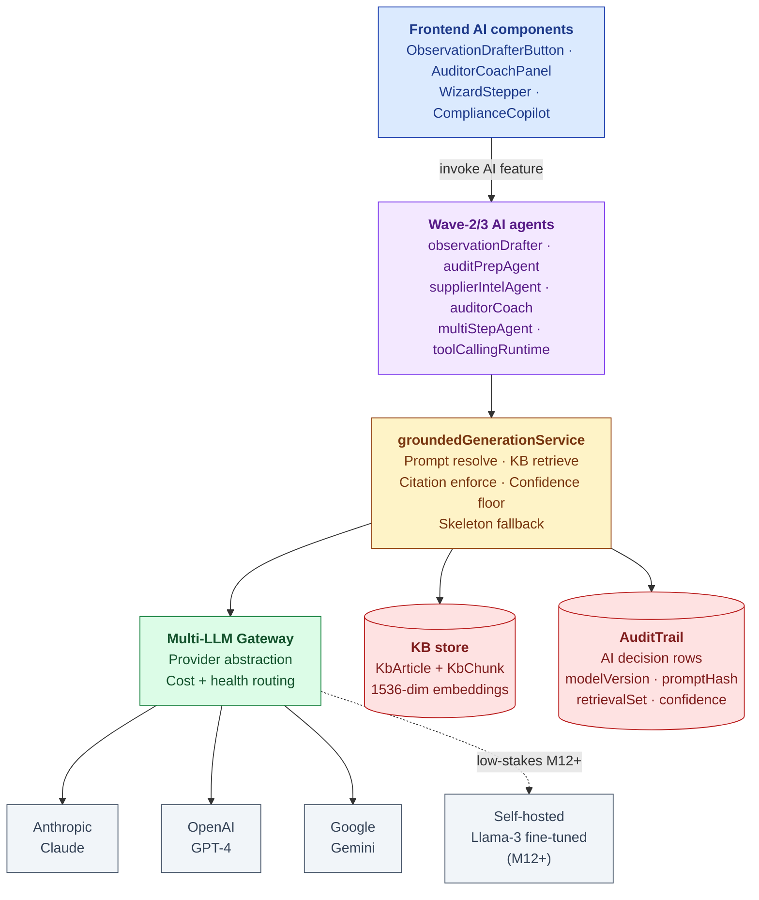
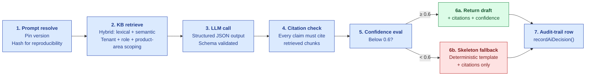
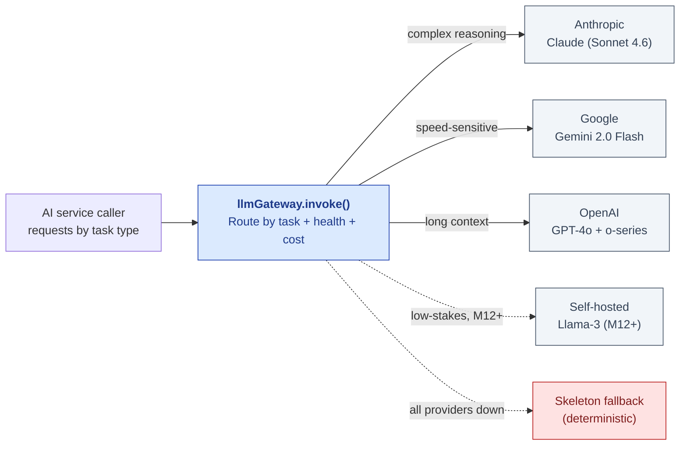
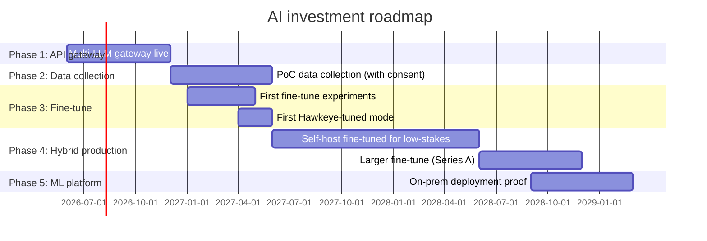
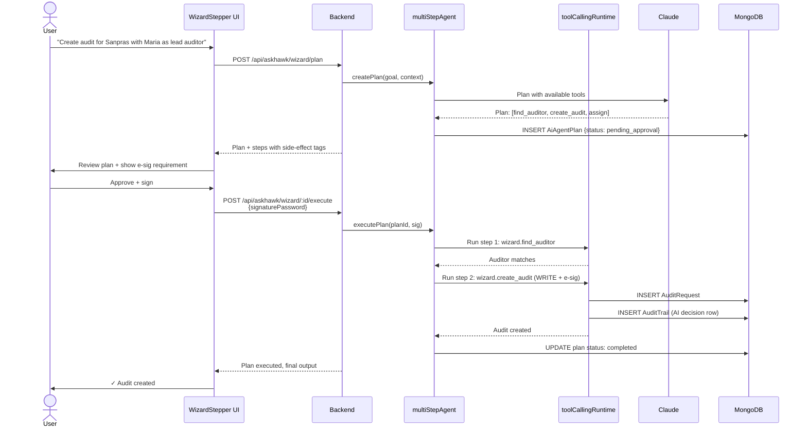

# AI Architecture

| Field | Value |
|---|---|
| Owner | Engineering (CTO) + AI lead |
| Status | v1.0 |
| Last updated | 2026-05-31 |
| Source | `backend/src/services/ai/`, `groundedGenerationService.js`, audit module AI inventory |

---

## 1. The AI strategy in one paragraph

> 💡 **Hawkeye's AI is grounded, cited, confidence-scored, audit-trailed, and reproducible from day one.** Every LLM call produces a JSON-validated output with mandatory citations to KB chunks and a confidence score; below the floor (0.6), a skeleton fallback preserves citations only. Every call writes an audit-trail row with modelVersion, promptHash, retrievalSet, confidence, tokens, latency, and the user's disposition (accepted / edited / rejected). The architecture is multi-LLM gateway today (Anthropic + OpenAI + Gemini), with a sequenced path to fine-tuned open-source models (Llama-3 / Mistral) on our proprietary audit-domain corpus by M12-M18. The competing AI vendors retrofit LLMs into legacy stacks; Hawkeye's AI is native, defensible, and Part 11–grade.

## 2. Architecture overview

## 3. The grounded generation pattern (the core moat)

Every AI output goes through this pattern:

### Grounding contract

| Property | Default | Why |
|---|---|---|
| Output format | JSON (schema-validated) | Re-ask on parse failure; no hallucinated structure |
| Citations | **Mandatory ≥1** | No claim without traceable evidence |
| Confidence floor | **0.6** (configurable per feature) | Below floor → skeleton fallback (don't fabricate) |
| Retrieval mode | Hybrid (lexical 30% + semantic 70%) | Lexical catches exact terms; semantic catches paraphrase |
| Retrieval scope | Tenant + `__platform__` (regulatory corpus) | Customer's own KB + cross-tenant regulatory canon |
| PII handling | Redact before LLM call; unredact on receipt | Don't send identifiers to provider |
| Streaming | Disabled for grounded calls | Full-response validation required |

### Skeleton fallback (the honesty path)

When confidence is too low OR no citations were produced, instead of fabricating, the system returns a **deterministic skeleton** with:
- Generic structure (e.g., observation template with empty findings field)
- Citations from retrieved chunks (so user can see what was relevant)
- Honest message: "Confidence too low for AI draft; please complete manually"

> 💡 **The competitive differentiator.** No incumbent ships an "honest fallback" path. Most retrofit AI to legacy stacks and produce confident-looking outputs even when grounding is weak. We choose visible honesty over invisible confidence.

## 4. AI features inventory

### Audit module
| Feature | Type | Read/Write | E-sig | Confidence floor |
|---|---|---|---|---|
| `observationDrafter` | Wave 2 LLM draft | Read (returns draft) | No (sign separately) | 0.6 |
| `auditorCoach` | Wave 3 private review | Read | No | 0.5 |
| `auditPrepAgent` | Risk-weighted PAQ drafting | Read | No | 0.6 |
| `supplierIntelAgent` | FDA + EMA + WHO-PQ dossier fusion | Read | No | 0.55 |
| `realTimeFollowupSuggester` | In-audit follow-up Qs (scaffold only) | Read | No | 0.65 |
| `auditAutofillAgent` | OCR + LLM PAQ field match | Read | No | 0.6 |

### CAPA module
| Feature | Purpose | Confidence floor |
|---|---|---|
| `capaRcaDrafter` | RCA + 5-Why drafter from deviation/observation | 0.6 |
| `capaEffectivenessPredictor` | Predict CAPA success likelihood | 0.7 |

### Deviation module (6-agent stack)
| Agent | Purpose |
|---|---|
| `deviationIntakeClassifier` | Classify Critical / Major / Minor |
| `deviationSimilarFinder` | Find historically similar deviations |
| `deviationDispositionDrafter` | Suggest disposition + RCA |
| `capaRecommender` | Recommend CAPA type + scope |
| `trendAlerter` | Cross-deviation trend detection |
| `deviationFiveWhyScaffolder` | Structured 5-Why guidance |

### Document Control
| Feature | Purpose |
|---|---|
| `docIntelClassifier` | Auto-classify uploaded documents (SOP / Procedure / Record) |
| `docIntelTagger` | AI tag generation per persona/module |
| `docBulkUploadOrchestrator` | Bulk upload + classification wizard |

### AskHawk (cross-cutting)
| Feature | Purpose |
|---|---|
| AskHawk chat (Phase 1) | Regulations Q&A (11 standards × 32 clauses) |
| AskHawk chat (Phase 2A) | SOP templates (6 templates × 5 sections) |
| AskHawk chat (Phase 2B) | Workflow playbooks (38 playbooks × 9 personas) |
| AskHawk wizard (Phase 3) | App Wizard plan-then-execute (8 tools) |

## 5. AI decision audit trail (reproducibility)

Every AI call writes an `AuditTrail` row with these fields beyond the standard ones:

| Field | Example | Why |
|---|---|---|
| `ai.feature` | `observation-drafter` | Which AI feature |
| `ai.modelVersion` | `claude-opus-4-7-20260128` | Exact model run |
| `ai.promptVersion` | `obs-draft-v3.2` | Prompt template version |
| `ai.promptHash` | `sha256:a3f...` | Hash of resolved prompt (reproducibility) |
| `ai.retrievalSet` | `["kb-chunk-id-1", "kb-chunk-id-2"]` | Exact chunks used |
| `ai.citations` | `["21 CFR 211.192", "ICH Q7 §13.20"]` | What the user saw |
| `ai.confidence` | `0.73` | Below floor would trigger fallback |
| `ai.tokensInput` / `ai.tokensOutput` | `1248` / `412` | Cost + performance tracking |
| `ai.latencyMs` | `2840` | Performance tracking |
| `ai.userDisposition` | `USER_EDITED` | Active-learning signal |

> ✅ **Why this matters.** A regulator can ask "show me every AI-generated observation in the last 12 months, who reviewed it, and what model version produced it." We answer with one query. **No incumbent ships this.**

## 6. Multi-LLM gateway

### Provider routing by task

| Task | Primary | Fallback | Why |
|---|---|---|---|
| Observation drafting | Claude Sonnet 4.6 | GPT-4o | Complex reasoning + long-form structured output |
| KB summarization | Gemini 2.0 Flash | Claude | Speed-sensitive; high volume |
| Document classification | Llama-3 (fine-tuned, M12+) | Gemini | Low-stakes, high-volume |
| Wizard plan generation | Claude Sonnet 4.6 | GPT-4o | Multi-step reasoning, tool use |
| Auditor coach (private) | Claude Sonnet 4.6 | — | Reasoning quality matters; private = no escalation |
| Embeddings (KB indexing) | OpenAI text-embedding-3-small | — | Single provider OK for now |

### Health + cost monitoring

| Metric | Tracked per provider |
|---|---|
| Availability (last 5 min) | % successful calls |
| p95 latency | ms |
| Cost per 1M input tokens | $ |
| Cost per 1M output tokens | $ |
| Error rate by category | rate-limit, auth, server, parse |

Gateway monitors these in real-time; auto-routes around degraded providers.

## 7. Fine-tuning roadmap (the moat path)

> 💡 **The strategy.** Fine-tuned open-source models on our proprietary audit-domain corpus = real defensibility. Not "training from scratch" (which would burn $2M+ with no return at our stage), but selective fine-tuning of Llama-3 / Mistral on PoC-collected data for high-volume low-stakes tasks. Result: 50-60% lower per-call cost than pure frontier API + better domain accuracy.

### Fine-tune candidates (by ROI)

| Task | Volume (calls/mo M18) | Per-call cost (API today) | Per-call cost (fine-tuned) | Savings/mo |
|---|---|---|---|---|
| Document classification | 50K | $0.008 | $0.001 | $350 |
| Intake severity classifier | 20K | $0.012 | $0.002 | $200 |
| KB chunk summarization | 100K | $0.005 | $0.001 | $400 |
| Similar-event finder | 15K | $0.010 | $0.001 | $135 |
| **High-stakes (cited reports)** | **Stay on API** — quality > cost | — | — | — |

### Fine-tune dataset

Collected from PoC + production usage with explicit consent:
- Observation drafts (auditor-accepted / edited / rejected) — high-value training signal
- CAPA proposals + outcomes
- Deviation classifications + verifications
- Synthetic data generation from regulatory corpus

Stored at `__platform__` tenant; anonymized; per-tenant opt-out available.

## 8. Active learning loop

> ⚠️ **Status:** Loop scaffolded in `activeLearningLoop.js`; metrics collected. **Auto-tuning + variant proposal not yet wired** — humans propose variants manually today. Roadmap: Q1 2027.

## 9. AskHawk Wizard runtime (App Wizard)

### Tool registry (8 audit-related tools)

| Tool | Read/Write | RBAC | E-sig required |
|---|---|---|---|
| `wizard.list_suppliers` | Read | buyer | No |
| `wizard.list_products` | Read | all | No |
| `wizard.find_auditor` | Read | buyer | No |
| `wizard.list_open_capas` | Read | all | No |
| `wizard.classify_deviation` | Read (AI-only) | all | No |
| `wizard.create_audit` | **WRITE** | buyer, tenant_admin | **YES** |
| `wizard.create_capa` | **WRITE** | buyer | **YES** |
| `wizard.draft_observation` | Read | auditor | No |

## 10. KB (Knowledge Base) infrastructure

| Component | Implementation |
|---|---|
| Source content | Markdown / HTML / JSON files in `backend/src/data/` (regulatory-corpus, sop-templates, workflow-playbooks) + tenant-uploaded |
| Chunking | Recursive char-split with 800-token chunks + 100-token overlap |
| Embedding model | OpenAI text-embedding-3-small (1536-dim) |
| Vector store | MongoDB Atlas with cosine similarity (pgvector experiments not in prod) |
| Retrieval | Hybrid: 30% lexical (term overlap) + 70% semantic (cosine) |
| Re-ranking | (planned M12) Cohere rerank-3 for top-K results |
| Tenant scoping | Tenant + `__platform__` (cross-tenant regulatory canon) |
| Update cadence | Manual today; webhook-triggered on doc upload (planned) |

## 11. AI cost projection (per BUSINESS-PLAN.md §3)

| Stage | Monthly AI cost | Notes |
|---|---|---|
| M0-M6 | $2-5K | Pure API gateway |
| M6-M12 | $3-6K | + fine-tune compute (training runs) |
| M12-M18 | $4-7K | Hybrid: self-host for low-stakes + API for high-stakes |
| M18-M24 | $7-10K | Self-host scaled up; cost-per-call dropping |
| M24-M36 | $10-15K | Significant volume; per-call cost stable |
| **18-month total** | **~$115K** | Fits in pre-seed budget |

## 12. Open AI questions

1. **When does fine-tuned model match API quality** for observation drafting? Need eval suite.
2. **Vector DB migration trigger** — Mongo cosine works to ~100K chunks; when do we move to pgvector?
3. **Active-learning auto-tuning gate** — when do we let the system propose variants without human approval?
4. **Cross-tenant supplier intel** — what's the consent UI for surfacing "another buyer found X at this supplier"?
5. **TSA timestamp for AI decisions** — cryptographic anchor for AI-decision audit-trail rows?
6. **On-prem LLM** for sovereignty customers — which deployment path (Llama-3 / Mistral / Mixtral)?
7. **Model versioning + rollback** — when a new model regresses, how fast can we roll back?

---

## See also

- [PLATFORM-OVERVIEW.md](../00-overview/PLATFORM-OVERVIEW.md) — tech stack
- [DATA-MODEL.md](../02-data-model/DATA-MODEL.md) — KbArticle/KbChunk + AiAgentPlan schemas
- [SECURITY.md](../06-security/SECURITY.md) — AI decision audit trail
- [BUSINESS-PLAN.md §3](../../02-fundraising/business-plan/BUSINESS-PLAN.md#5-native-ai-strategy--the-build-vs-buy-decision) — Native AI strategy
- [06-modules/audit-management/ARCHITECTURE.md §5](../../06-modules/audit-management/ARCHITECTURE.md#5-ai-capabilities) — audit-module AI tools
- [06-modules/askhawk/](../../06-modules/askhawk/) — AskHawk module deep-dive (TBD)
