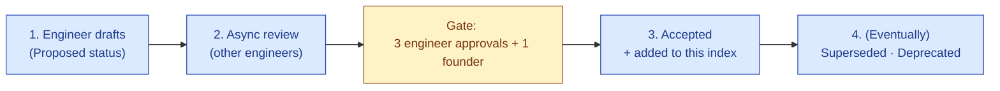

# Architecture Decision Records — Index

| Field | Value |
|---|---|
| Owner | Engineering · CTO · Founders |
| Status | v1.0 — 2026-06-05 |
| Purpose | Index of Architecture Decision Records (ADRs) — significant engineering choices |
| Pairs with | [ARCHITECTURE.md](../01-architecture/ARCHITECTURE.md) · [PLATFORM-OVERVIEW.md](../00-overview/PLATFORM-OVERVIEW.md) · [DECISIONS-INDEX.md (PDRs)](../../03-product/05-decisions/DECISIONS-INDEX.md) |

---

## What is an ADR?

An **Architecture Decision Record** captures a significant engineering decision: the context, what was decided, alternatives considered, and consequences. Inspired by Michael Nygard's ADR pattern (2011) and adapted to Hawkeye's compliance posture.

| | ADR (this folder) | PDR (`03-product/05-decisions/`) |
|---|---|---|
| Scope | Engineering / architecture | Product / business |
| Owner | Engineering + Founders | Product + Founders |
| Examples | "use Multi-LLM Gateway", "MongoDB over Postgres", "cite-or-fallback" | "no production freemium", "GAMP Cat 4 commitment", "three-tier packaging" |

A decision warrants an ADR when:

- It commits to a technology/framework for >12 months
- It's expensive (>$10K) or risky (>1 week) to reverse
- It rules out a meaningful alternative architecture
- It would surprise a new engineer

---

## ADR Index

| # | Title | Status | Owner | Date |
|---|---|---|---|---|
| 001 | [ADR-001 — Five-Layer Architecture with Trust as Layer 1](./ADR-001-five-layer-architecture.md) | Accepted | Engineering · Founders | 2026-06-04 |
| 002 | [ADR-002 — Multi-LLM Gateway Pattern](./ADR-002-multi-llm-gateway.md) | Accepted | Engineering | 2026-03-15 |
| 003 | [ADR-003 — Cite-or-Fallback as a Non-Configurable Guarantee](./ADR-003-cite-or-fallback.md) | Accepted | Engineering · Compliance · Founders | 2026-02-20 |
| 004 | *Audit-Trail as Compliance Spine (not blockchain)* | 📝 To draft | Engineering · Compliance | (2026-01) |
| 005 | *Next.js 15 App Router (not Pages Router or alternative framework)* | 📝 To draft | Engineering · Frontend Lead | (2025-12) |
| 006 | *MongoDB Atlas (not Postgres or Aurora)* | 📝 To draft | Engineering | (2025-10) |
| 007 | *Express + Vercel serverless (not Fastify, not Lambda directly)* | 📝 To draft | Engineering · Platform Lead | (2025-11) |
| 008 | *Multi-tenant logical isolation (not per-tenant DB)* | 📝 To draft | Engineering | (2025-11) |
| 009 | *Per-record SHA-256 hashing (not blockchain)* | 📝 To draft | Engineering · Compliance | (2026-01) |
| 010 | *S3-compatible object store via env-driven adapter (Cloudflare R2 default)* | 📝 To draft | Engineering · Platform | (2026-04) |
| 011 | *Custom JWT auth (not NextAuth)* | 📝 To draft | Engineering · Frontend | (2025-12) |
| 012 | *React Context + Server Components (not Redux/Zustand)* | 📝 To draft | Engineering · Frontend | (2025-12) |
| 013 | *Material-UI as design-system substrate (not custom from scratch)* | 📝 To draft | Engineering · Design | (2025-10) |
| 014 | *Joi for validation (not Zod on backend; Zod is frontend-only)* | 📝 To draft | Engineering | (2025-11) |
| 015 | *Active learning loop captures user disposition for prompt refinement* | 📝 To draft | Engineering · AI | (2026-03) |

> ℹ️ **Status legend.** ✅ Accepted · 🚧 Proposed · 📝 To draft (decision made, doc pending) · ❌ Superseded

---

## ADR template

Every ADR uses this structure:

```
# ADR-NNN — <Short title>

| Field | Value |
|---|---|
| Status | Proposed · Accepted · Superseded · Deprecated |
| Date | YYYY-MM-DD |
| Author | <name> |
| Reviewers | <names> |
| Supersedes | ADR-NNN or n/a |
| Superseded by | ADR-NNN or n/a |

## 1. Context
Why are we deciding this? What is the situation?

## 2. Decision
What did we decide? (One paragraph max)

## 3. Alternatives considered
Each alternative with pros and cons.

## 4. Rationale
Why this option over the others.

## 5. Consequences
Positive + negative. Operational + customer-facing.

## 6. Implementation notes
File paths · code patterns · migration steps.

## 7. When to revisit
What signal would cause us to reopen this decision?

## 8. References
Documents · benchmarks · external references that informed the decision.
```

---

## How ADRs flow



**SLA:** ADR review is 5 business days. Significant cross-cutting ADRs may need a 30-minute review meeting.

---

## How ADRs interact with PDRs

| Scenario | Which doc |
|---|---|
| "Should we charge for the Sandbox tier?" | PDR (product/business) |
| "Should we host Sandbox tenants in the same Mongo cluster as paid?" | ADR (engineering) |
| "Should we offer per-customer AI fine-tuning?" | PDR (product) AND ADR (engineering) — one of each |
| "Which LLM provider is default for new tenants?" | ADR (engineering) |
| "Should we publish a 'no AI training' contractual commitment?" | PDR (product) — with ADR for technical implementation |

Decisions often have both flavors. Write both when both apply.

---

## See also

- [ARCHITECTURE.md](../01-architecture/ARCHITECTURE.md) — system architecture (references many ADRs)
- [PLATFORM-OVERVIEW.md](../00-overview/PLATFORM-OVERVIEW.md) — full 5-layer canonical reference
- [DECISIONS-INDEX.md](../../03-product/05-decisions/DECISIONS-INDEX.md) — Product Decision Records (PDRs)

---

*Doc_V2 · Engineering · ADR Index v1.0*
