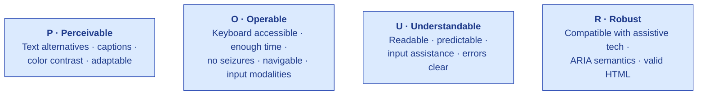

# Accessibility

| Field | Value |
|---|---|
| Owner | Design · Frontend Engineering · Compliance |
| Status | v1.0 — 2026-06-05 (target: WCAG 2.2 AA full conformance by Q4 2026) |
| Standard | WCAG 2.2 AA (W3C, Oct 2023) · EN 301 549 v3.2.1 (EU public-sector ref) · Section 508 (US federal ref) |
| Pairs with | [DESIGN-PRINCIPLES.md](../design-system/DESIGN-PRINCIPLES.md) · [FRONTEND.md](../../04-engineering/04-frontend/FRONTEND.md) · [PART-11.md](../../08-compliance-regulatory/frameworks/PART-11.md) |

---

## 1. Commitment statement

> 📜 **S.M.A.R.T. Hawk targets WCAG 2.2 AA conformance across all customer-facing surfaces.** Accessibility is treated as a non-negotiable design constraint, not a remediation backlog. Every new component, flow, and feature ships with keyboard navigation, ARIA semantics, and screen-reader support from day one.

This commitment exists for three reasons:

1. **Users.** A QA Analyst with a motor impairment must be able to e-sign a CAPA. A visually impaired auditor must be able to review evidence. Accessibility is the right thing to do.
2. **Regulators.** 21 CFR Part 11 + EU GMP Annex 11 require that the system supports the user; an inaccessible system fails this implicitly.
3. **Procurement.** Public-sector and many enterprise customers in EU + US require WCAG 2.2 AA or equivalent as a procurement gate.

---

## 2. The four WCAG 2.2 principles applied to S.M.A.R.T. Hawk

| Principle | How S.M.A.R.T. Hawk delivers |
|---|---|
| **Perceivable** | All meaningful images have alt text; videos have captions (when used); color contrast min 4.5:1 for text + 3:1 for UI; never color-only signaling (status chips have icons + labels); responsive design for screen-magnification users |
| **Operable** | Every interactive element reachable via Tab; focus always visible (no `outline: none`); skip links to main content; no time limits on workflows (audit data never expires mid-edit); no flashing > 3Hz; keyboard shortcut catalog (⌘K palette, ⇧/ help, etc.); supports mouse, keyboard, touch, voice |
| **Understandable** | Page language declared (`<html lang="en">`); navigation predictable across modules; form errors describe the issue + how to fix; consistent vocabulary (per [DESIGN-PRINCIPLES.md §2](../design-system/DESIGN-PRINCIPLES.md) — "Precision in language") |
| **Robust** | Semantic HTML first; ARIA only where semantic HTML is insufficient; tested against NVDA + VoiceOver + JAWS quarterly; ARIA live regions for real-time updates (Socket.IO notifications) |

---

## 3. WCAG 2.2 AA — S.M.A.R.T. Hawk conformance status (Jun 2026)

WCAG 2.2 AA has 50 Success Criteria. Current status per group:

| Group | Success Criteria | Conformance status |
|---|---|---|
| 1.1 — Text Alternatives | 1 | ✅ All conformant |
| 1.2 — Time-based Media | 5 | n/a (no audio/video in product yet) |
| 1.3 — Adaptable | 6 | ✅ All conformant (semantic HTML + responsive) |
| 1.4 — Distinguishable | 13 | 🟡 Partial (3 SC need work — see §10 debt) |
| 2.1 — Keyboard Accessible | 4 | ✅ All conformant |
| 2.2 — Enough Time | 6 | ✅ All conformant (no session-expiry-without-warning) |
| 2.3 — Seizures | 2 | ✅ Conformant (no flashing content) |
| 2.4 — Navigable | 10 | 🟡 Partial (skip-links + landmark labels need pass) |
| 2.5 — Input Modalities | 6 | ✅ All conformant |
| 3.1 — Readable | 2 | ✅ Conformant |
| 3.2 — Predictable | 4 | ✅ Conformant |
| 3.3 — Input Assistance | 9 | 🟡 Partial (error messages need more specificity in 4 forms) |
| 4.1 — Compatible | 3 | ✅ All conformant |
| **Total** | **50** | **42 ✅ + 8 🟡 partial** |

Audit cadence: quarterly internal accessibility audit; annual external audit. Next external audit: Q4 2026.

---

## 4. Keyboard navigation — the canonical patterns

Every interactive element on S.M.A.R.T. Hawk is reachable via keyboard. Standard patterns:

| Action | Keys |
|---|---|
| Move focus forward | `Tab` |
| Move focus backward | `Shift + Tab` |
| Activate button / link | `Enter` or `Space` |
| Open dropdown / menu | `Enter` or `Space` or `↓` |
| Navigate within menu | `↑` / `↓` (and `Home` / `End`) |
| Close modal / popover | `Esc` |
| Submit form | `Enter` from any field |
| Open AskHawk drawer | `⌘ + K` (Mac) · `Ctrl + K` (Win) |
| Open help / shortcut list | `?` |
| Skip to main content | First focusable link on every page |
| Skip to navigation | Second focusable link |

The complete shortcut catalog is documented in-app via `?` and as a printable cheat sheet.

---

## 5. Screen-reader support

| Assistive tech | Status | Notes |
|---|---|---|
| NVDA (Windows · free) | ✅ Tested quarterly | Primary test target |
| VoiceOver (macOS · iOS) | ✅ Tested quarterly | Secondary test target |
| JAWS (Windows · commercial) | ✅ Tested quarterly | Enterprise customers often standardize on JAWS |
| TalkBack (Android) | 🟡 Partial — mobile companion app pending | Audit-day mobile flow |
| Dragon NaturallySpeaking (voice) | 🟡 Limited testing | Improvement planned 2027 |

**Key patterns:**
- All form fields labelled via `<label>` or `aria-label`
- Table headers properly associated via `<th>` + `scope`
- Dynamic content uses `aria-live="polite"` (notifications) or `aria-live="assertive"` (validation errors)
- Modals use `role="dialog"` + `aria-modal="true"` + focus trap
- Complex widgets (combobox, tabs, tree) follow WAI-ARIA Authoring Practices

---

## 6. Color and contrast

| Element | Min contrast | S.M.A.R.T. Hawk delivers |
|---|---|---|
| Body text on background | 4.5 : 1 | ≥ 4.5 : 1 (most are 7 : 1+ for readability) |
| Large text (≥ 18pt or 14pt bold) | 3 : 1 | ≥ 4.5 : 1 |
| UI components (buttons, form borders) | 3 : 1 | ≥ 3 : 1 |
| Focus indicator | 3 : 1 against background | ≥ 3 : 1 |
| Disabled state | Exempt (but still readable) | Distinguishable + labelled "disabled" |

**Color is never the only signal.** Status chips combine color + icon + text label. Example:
- ✅ Done (green badge + checkmark + "Done")
- 🟡 In progress (amber + clock + "In progress")
- ❌ Failed (red + X + "Failed")

A user with red-green color-blindness can read every state.

Color tokens documented in [DESIGN-TOKENS.md](../design-system/DESIGN-TOKENS.md).

---

## 7. The e-signature ceremony — accessibility-critical

The Part 11 e-signature ceremony is **the single most accessibility-critical flow** in S.M.A.R.T. Hawk. A user who cannot complete the e-sig cannot do their job. Special accommodations:

| Concern | Accommodation |
|---|---|
| User with motor impairment cannot type a password rapidly | No password-timeout in signature dialog; user takes any time needed |
| User using screen reader | Each field labelled; dropdown for "Meaning" is keyboard-reachable; confirmation announced via `aria-live="assertive"` |
| User with cognitive load (under time pressure) | "Meaning" dropdown has plain-language options (Review / Approval / Authorship / Responsibility) with tooltips explaining each |
| User who needs to verify before committing | Pre-confirmation step shows summary of what is being signed; explicit Confirm button |
| User on small screen | Signature dialog is fully responsive; no fixed-width layout |
| User who cannot use mouse | Tab order: Meaning → Password → Reason → Confirm (all keyboard-reachable) |
| User who needs an alternative auth method | Per-tenant config: WebAuthn (security key) as second factor instead of typed reason for certain meanings (Future feature, planned M12) |

Detail in [USER-FLOWS.md Flow 4](../flows/USER-FLOWS.md).

---

## 8. Forms — input assistance

Per WCAG 2.2 SC 3.3 (Input Assistance):

| Pattern | Implementation |
|---|---|
| Field label always visible | Above or beside; never placeholder-only |
| Required fields marked | Visual asterisk + `aria-required="true"` + announced |
| Error messages specific | "Email must contain @" not "Invalid" |
| Errors near the field | `aria-describedby` link + visual proximity |
| Field hints / format | Provided where format matters (e.g., date format) |
| Auto-save / unsaved-changes warning | Workflow drafts auto-saved; user warned before navigation away |
| Submit confirmation | Critical actions (e-sig, deletion) require confirmation |
| Mistake recovery | "Undo" available for 30 seconds on destructive actions where reversible |

---

## 9. Mobile + small screen

S.M.A.R.T. Hawk web is responsive down to 360px width. The mobile companion app (planned M9) will follow:

| Standard | Detail |
|---|---|
| Touch target size | Min 44 × 44 CSS pixels (WCAG 2.2 SC 2.5.5 Target Size, AAA) |
| Pinch-zoom enabled | Yes (no `user-scalable=no`) |
| Orientation-agnostic | Portrait + landscape both supported |
| Reachability | Important controls within thumb reach on common phones |
| Mobile screen reader (TalkBack / VoiceOver) | Tested |

---

## 10. Known accessibility debt (June 2026)

> ⚠️ **Honest list of gaps tracked in the accessibility backlog.** Each has an owner and target close date.
>
> 1. **SC 1.4.3 Contrast (AA)** — 3 disabled-state colors fall to 2.8 : 1. Owner: Design Lead. Target: Q3 2026.
> 2. **SC 1.4.10 Reflow (AA)** — wide audit-trail tables don't reflow gracefully at 320px width; require horizontal scroll. Owner: Frontend. Target: Q4 2026.
> 3. **SC 1.4.13 Content on Hover/Focus (AA)** — 4 tooltips dismiss too aggressively. Owner: Frontend. Target: Q3 2026.
> 4. **SC 2.4.6 Headings and Labels (AA)** — 7 page headings repeat the module name; should be more specific. Owner: Content. Target: Q3 2026.
> 5. **SC 2.4.11 Focus Not Obscured (AA, 2.2 new)** — focused element occasionally hidden behind sticky header in long forms. Owner: Frontend. Target: Q3 2026.
> 6. **SC 3.3.7 Redundant Entry (AA, 2.2 new)** — re-entering data in multi-step wizard not yet auto-filled. Owner: Frontend. Target: Q4 2026.
> 7. **SC 3.3.8 Accessible Authentication (AA, 2.2 new)** — password entry has no cognitive-function-test exemption. Owner: Auth team. Target: Q4 2026 (likely via WebAuthn).
> 8. **Mobile companion app accessibility** — entirely pending (app M9). Owner: Mobile team. Target: Q1 2027.

---

## 11. Testing process

| Test type | Frequency | Tool / method |
|---|---|---|
| Automated WCAG scan | Every PR | `axe-core` integrated in Playwright tests + CI |
| Lighthouse accessibility score | Every release | Target ≥ 95 |
| Manual keyboard-only walkthrough | Per feature | Engineer + designer pair |
| Manual screen-reader walkthrough | Per feature | NVDA + VoiceOver |
| Quarterly internal accessibility audit | Quarterly | Design + engineering + compliance |
| Annual external accessibility audit | Annual | Third-party (target: certified accessibility auditor) |
| User testing with assistive-tech users | Twice yearly | Recruited via accessibility partner |

---

## 12. Engineering rules (frontend)

> ✅ **Frontend accessibility rules.** Enforced via lint + code review.
>
> 1. Every interactive element must be reachable via keyboard (Tab order verified).
> 2. Every form field must have a `<label>` or `aria-label`.
> 3. No `outline: none` without an equally visible `:focus-visible` alternative.
> 4. No color-only signaling (icon + label always accompany color).
> 5. Semantic HTML first; ARIA only when semantic HTML cannot express the role.
> 6. Modals trap focus + restore focus on close.
> 7. Dynamic content uses appropriate `aria-live`.
> 8. Every new component has at least one a11y test in CI (`axe-core` assertion).
> 9. PRs touching the e-signature ceremony require explicit accessibility review (this is the critical path).
> 10. Images decorative? `alt=""`. Images informational? `alt="<description>"`.

---

## 13. Procurement responses (for customer's accessibility VPAT inquiries)

A **Voluntary Product Accessibility Template (VPAT) 2.5 + WCAG 2.2 / EN 301 549 mapping** is available on request to `compliance@hawkeye.io`. It maps each WCAG 2.2 Success Criterion to:

- Supports / Partially supports / Does not support / Not applicable
- Remarks and explanations
- Owner and target close date for partial-support items

Updated quarterly.

---

## 14. Accessibility statement

The customer-facing **S.M.A.R.T. Hawk Accessibility Statement** is published at `app.hawkeye.io/accessibility` (will be added at first public launch). It contains:

- Conformance commitment (WCAG 2.2 AA)
- Last audit date
- Known limitations
- Feedback contact (`accessibility@hawkeye.io`)
- Compatibility table (browsers + assistive-tech versions tested)

---

## 15. See also

- [DESIGN-PRINCIPLES.md](../design-system/DESIGN-PRINCIPLES.md) — UI philosophy (status visibility · density)
- [DESIGN-TOKENS.md](../design-system/DESIGN-TOKENS.md) — color tokens with contrast ratios
- [COMPONENT-INVENTORY.md](../wireframes/COMPONENT-INVENTORY.md) — components and their a11y notes
- [USER-FLOWS.md Flow 4](../flows/USER-FLOWS.md) — e-signature ceremony accessibility
- [FRONTEND.md §13](../../04-engineering/04-frontend/FRONTEND.md) — frontend accessibility commitments
- [PART-11.md](../../08-compliance-regulatory/frameworks/PART-11.md) — Part 11 e-sig requirements that interact with a11y
- [GAMP-CAT-4-COMPLIANCE.md](../../08-compliance-regulatory/GAMP-CAT-4-COMPLIANCE.md) — full compliance reference
- WCAG 2.2 (W3C Recommendation, Oct 2023) · EN 301 549 v3.2.1 · Section 508 ICT

---

*Doc_V2 · Design · Accessibility v1.0 · 2026-06-05*
