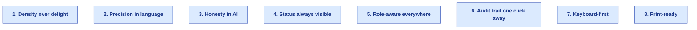
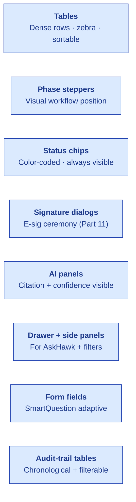

# Design Principles

| Field | Value |
|---|---|
| Owner | Founding Designer (advisory) + Product |
| Status | DRAFT v1.0 |
| Last updated | 2026-05-31 |

---

## 1. Design philosophy in one paragraph

> 💡 **S.M.A.R.T. Hawk is professional software for serious people doing serious work.** Quality teams running pharma audits don't need delight; they need clarity, speed, and confidence. The UI is dense (lots of data, fast scanning), the language is precise (regulatory vocabulary used correctly), and the AI is honest (citations + confidence visible, not hidden). We're closer to Bloomberg Terminal than Notion in spirit — but on a 21st-century stack.

## 2. The 8 principles

### 1. Density over delight
Quality teams scan 50 audits/day. UI prioritizes information density over whitespace. Tables not cards (mostly). Compact rows. Filter chips, not full dropdowns.

### 2. Precision in language
Use the exact regulatory term: "deviation" not "issue", "observation" not "comment", "CAPA" not "task". Never invent new jargon when industry has a settled term.

### 3. Honesty in AI
- AI confidence visible (badge or number, never hidden)
- Citations always shown alongside AI output
- Skeleton fallback labeled clearly ("Confidence too low; review manually")
- User can always edit, reject, or supersede AI output

### 4. Status always visible
Every record carries a status chip. Phase steppers show where the workflow is. Color encodes meaning consistently (blue=in-progress, green=done, amber=blocked, red=failed).

### 5. Role-aware everywhere
A Buyer sees a different audit detail page than a Supplier. Don't show what the user can't act on. Hide-not-disable to reduce confusion (unless gating is the message).

### 6. Audit trail one click away
On every record detail page, "Audit Trail" is a primary tab/button. Inspector mode mindset: anyone might need to answer "what changed, by whom, when, why" any moment.

### 7. Keyboard-first
Power users live in the keyboard. Every action has a shortcut. Tab order respects workflow. ⌘K opens command palette (planned).

### 8. Print-ready
Closure certificates, batch records, audit reports → all must render as clean PDFs. Print CSS is first-class, not an afterthought.

## 3. Color palette (semantic)

| Color | Hex | Used for |
|---|---|---|
| **Brand primary** | `#1E3A6E` (deep navy) | Logo, primary buttons, header bar |
| **Brand accent** | `#2563eb` (blue) | Links, focus rings, secondary buttons |
| **Success** | `#059669` (green) | Done, approved, success badges |
| **Warning** | `#f59e0b` (amber) | Pending, in-review, attention-needed |
| **Danger** | `#dc2626` (red) | Failed, rejected, critical alerts |
| **Info** | `#0369a1` (sky) | Informational callouts |
| **Neutral text** | `#0f172a` (ink), `#475569` (dim), `#94a3b8` (faint) | Text hierarchy |
| **Borders** | `#e2e8f0` (border), `#f1f5f9` (border-soft) | UI dividers |
| **AI accent** | `#7c3aed` (purple) | AI-generated content, sparkle icon |

## 4. Typography

| Use | Font | Size |
|---|---|---|
| Body | System (`-apple-system, Segoe UI, Roboto`) | 13-14px |
| Headings | Same family, weight 700 | h1: 24px / h2: 18px / h3: 15px |
| Code / monospace | `SF Mono, Menlo, Consolas` | 11-12px |
| Numeric / data | Same as body, tabular-nums for tables | 13px |

## 5. Component patterns

## 6. AI design patterns

| Pattern | Where used | Spec |
|---|---|---|
| **AI-draft tag** | Above any AI-generated text | Purple "AI DRAFT" badge + confidence % |
| **Citation chips** | Below AI output | Small chips per citation, click to view source |
| **Confidence indicator** | Beside AI output | Numeric (0.0-1.0) + color (green ≥0.8, amber 0.6-0.8, red <0.6) |
| **Skeleton fallback** | When confidence below floor | Banner: "Confidence too low; review manually" + citations preserved |
| **User-disposition prompt** | After AI draft viewed | "Accept / Edit / Reject" with optional reason |
| **AI decision audit-trail entry** | Behind-the-scenes | recorded automatically; visible in audit-trail tab |
| **App Wizard plan view** | WizardStepper | Plan with side-effect tags (Read-only / Write—needs e-sig) |

## 7. Don't do this

> 🚫 **Anti-patterns we avoid.**

- **Hidden AI confidence** — if AI is uncertain, the user must see it
- **Cute illustrations on regulated screens** — they look unserious to a QA team
- **Vague status text** ("Updated recently") — show the actual timestamp + actor
- **Modal-stacking** — one modal at a time
- **Spinners with no progress info** — show what's happening + estimated time
- **Confirmation dialogs for harmless actions** — "Are you sure?" only for destructive
- **Inconsistent terminology** ("deviation" in one screen, "issue" in another)
- **Status colors that don't follow the palette** — every status uses semantic color

## 8. Accessibility (WCAG AA target)

| Area | Target |
|---|---|
| Color contrast | AA minimum (4.5:1 text, 3:1 large text) |
| Keyboard nav | All interactive elements reachable + actionable |
| Screen reader | ARIA labels on icons, status chips, action buttons |
| Focus management | Visible focus ring; trap focus in modals; restore on close |
| Form labels | Every input has a visible label (no placeholder-only) |
| Error messages | Field-level + descriptive (not "Invalid") |
| Touch targets | ≥44px for mobile (when mobile launches) |

## 9. Design system maturity

| Component | Status |
|---|---|
| Color palette | ✅ Defined; consistent across modules |
| Typography | ✅ Defined |
| Buttons + chips + badges | ✅ MUI-based; consistent variants |
| Tables (dense) | ⚠️ Per-module variants; consolidation needed |
| Forms + SmartQuestion | ✅ Reusable |
| Phase steppers | ⚠️ Audit-specific today; generalize for other modules |
| SignatureDialog | ✅ Reusable across modules |
| AI panels (drafter, coach) | ⚠️ Per-feature today; pattern not consolidated |
| Empty / loading / error states | ⚠️ Per-screen ad-hoc; consolidation planned |
| Print CSS | ⚠️ Audit-trail + certs only; needs platform-wide |

---

## See also

- [COMPONENT-INVENTORY.md](../wireframes/COMPONENT-INVENTORY.md)
- [PRODUCT-OVERVIEW.md](../../03-product/00-overview/PRODUCT-OVERVIEW.md)
- [PLATFORM-OVERVIEW.md §4](../../04-engineering/00-overview/PLATFORM-OVERVIEW.md) — tech stack (MUI 6 + Next.js)
