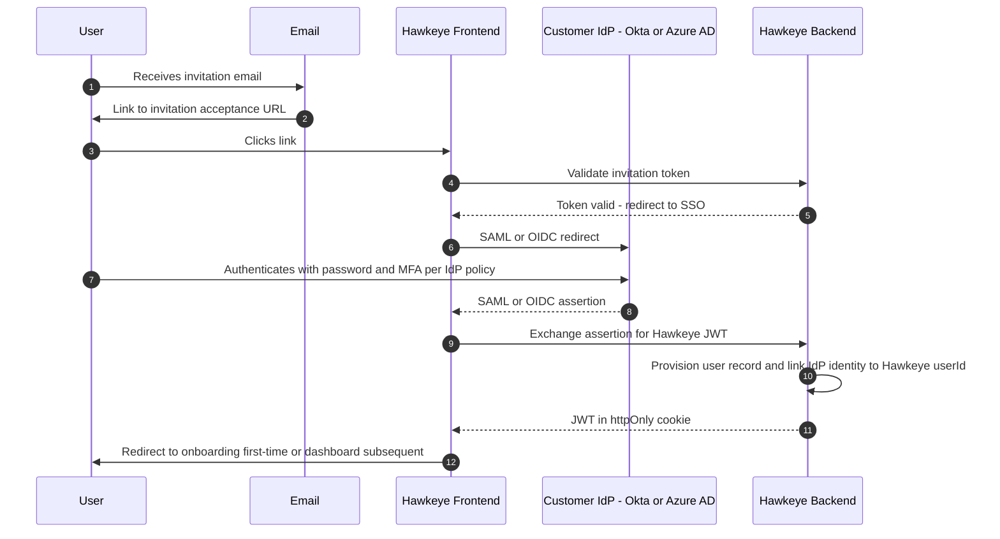
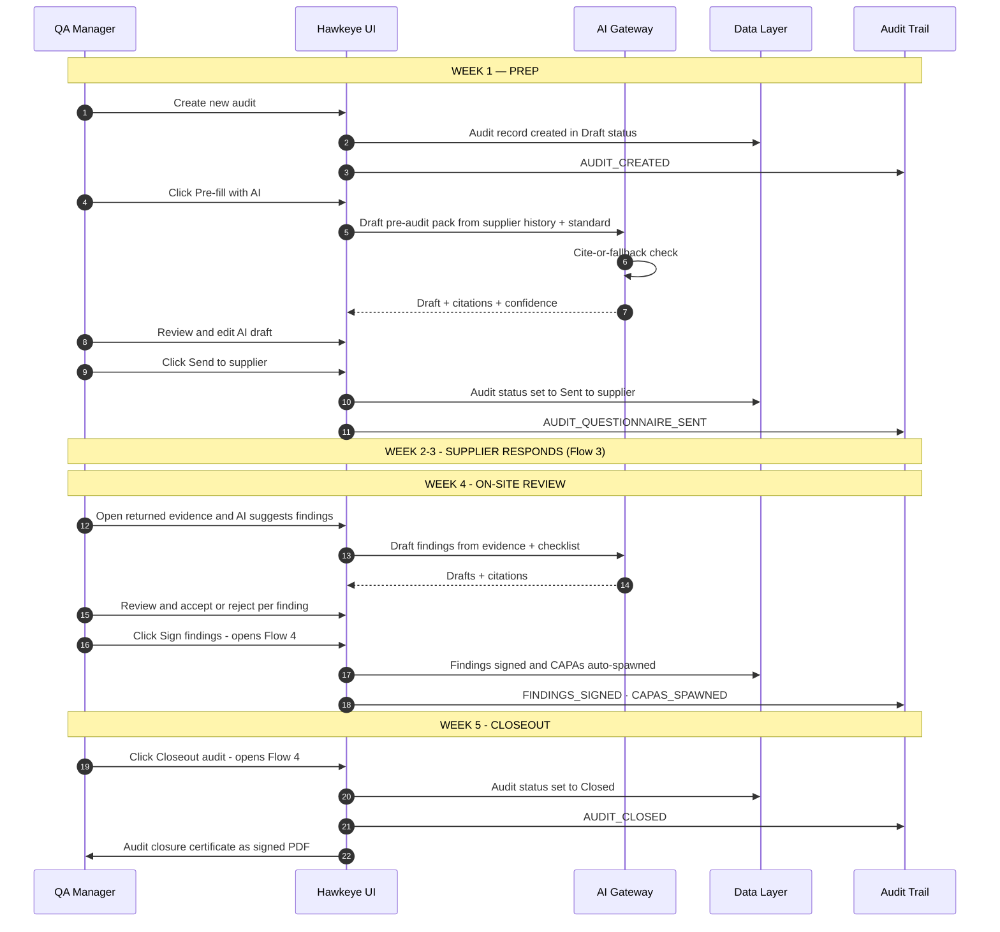
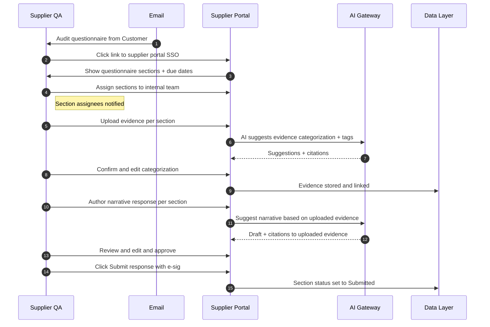
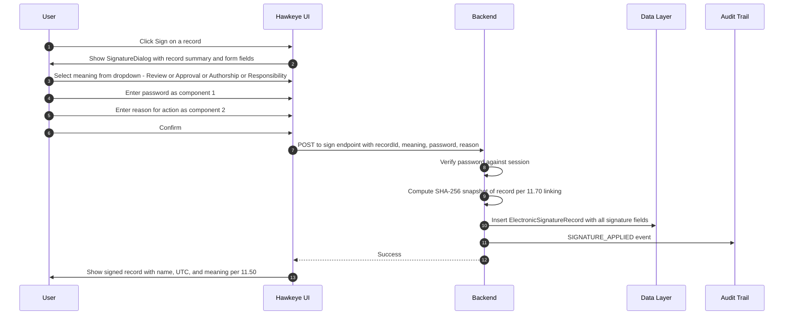
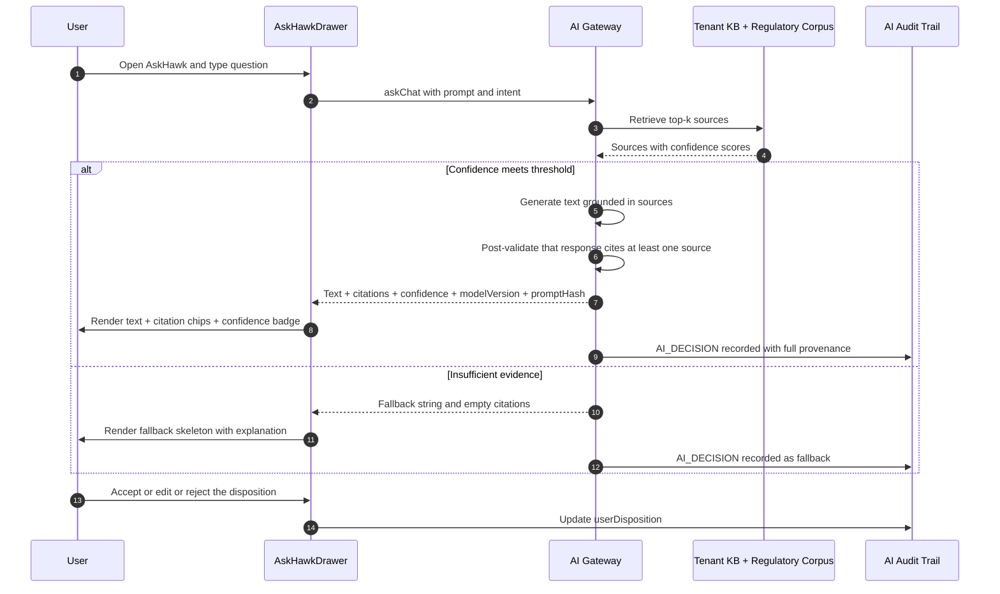
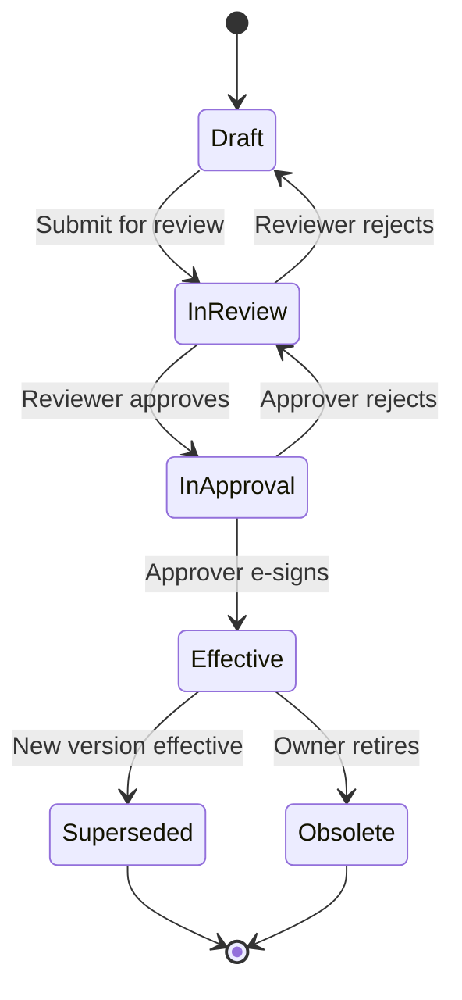
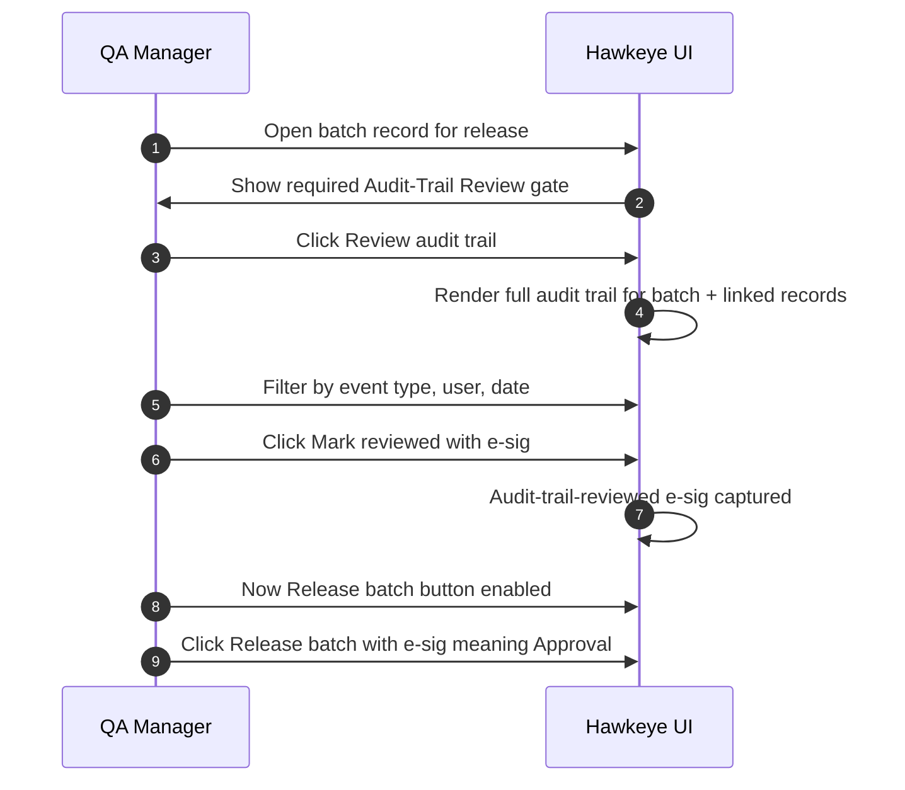
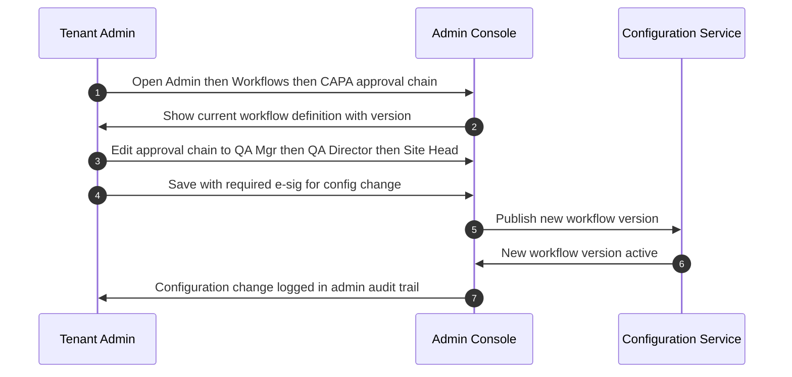

# User Flows

| Field | Value |
|---|---|
| Owner | Design · Product |
| Status | v1.0 — 2026-06-05 |
| Scope | Key user journeys across personas and modules — the flows that drive PoC success criteria + product demos |
| Pairs with | [DESIGN-PRINCIPLES.md](../design-system/DESIGN-PRINCIPLES.md) · [COMPONENT-INVENTORY.md](../wireframes/COMPONENT-INVENTORY.md) · [PERSONAS.md](../../03-product/01-personas-and-research/PERSONAS.md) · [FRONTEND.md](../../04-engineering/04-frontend/FRONTEND.md) |

---

## How to read this document

Each flow describes a complete end-to-end user journey, with:
- **Persona** — who is doing it
- **Trigger** — what starts the flow
- **Sequence diagram** — what happens
- **Touched layers** — which of the 5-layer architecture is involved
- **Critical UI components** — referenced from [COMPONENT-INVENTORY.md](../wireframes/COMPONENT-INVENTORY.md)
- **Compliance touchpoints** — Part 11 / Annex 11 / ALCOA+ implications
- **Success criteria** — what "done" looks like

---

## Flow Index

| # | Flow | Persona | Frequency | PoC criterion |
|---|---|---|---|---|
| 1 | First-time sign-in via SSO | All | Once per user | — |
| 2 | Host a supplier audit (Buyer side) | QA Manager | 30+/year | #1 (audit prep time) |
| 3 | Respond to an audit (Supplier/Auditee side) | Supplier QA | Variable | #1 |
| 4 | E-signature ceremony (Part 11 §11.50 + §11.200) | Anyone signing | Multiple/day | #3 (e-sig compliance) |
| 5 | AskHawk Q&A with cite-or-fallback | All | Daily | #5 (user preference) |
| 6 | CAPA from finding → closure | QA Analyst | Per finding | #4 (tools replaced) |
| 7 | Document Control — author → review → approve → effective | Doc Author / QA Mgr | Daily | #4 |
| 8 | Inspection-Readiness pack generation | QA Head | Per inspection window | — |
| 9 | Audit-trail review at batch release | QA Manager | Per batch | #3 |
| 10 | Customer-side admin: configure a new workflow | Tenant Admin | Per change request | — |

---

## Flow 1 — First-time sign-in via SSO

| Detail | Value |
|---|---|
| Persona | Any user (Buyer · Supplier · Auditor · Auditee · Admin) |
| Trigger | New user provisioned by tenant admin; receives invitation email |
| Layers touched | Layer 1 (auth) · Layer 5 (UI) |
| Compliance | 21 CFR §11.100 (unique to one individual · identity verified at provisioning) |

**Critical UI components:** `AcceptInvitationPage` · `SSORedirectScreen` · `OnboardingWelcome`

**Success criteria:**
- User reaches /dashboard within 30 seconds of clicking invitation
- No password ever entered on Hawkeye (all auth via IdP)
- Audit-trail row: `USER_PROVISIONED` with IdP identity, IP, UTC

---

## Flow 2 — Host a supplier audit (Buyer side)

This is the headline flow — the one PoC measurement compares against the customer's spreadsheet baseline.

| Detail | Value |
|---|---|
| Persona | QA Manager (Buyer side) |
| Trigger | Audit calendar entry approaches OR customer auditor announces |
| Layers touched | All 5 layers |
| Compliance | 21 CFR §11.10(e) audit trail · §11.50 e-sig at closeout · Annex 11 §9 reason-for-change |
| PoC measurement | Time from "create audit" to "audit closed" vs spreadsheet baseline (Criterion #1: ≥40% reduction) |

**Critical UI components:** `AuditCreateWizard` · `PhaseStepper` · `EvidenceLedger` · `AIDraftPanel` (with citation chips + confidence) · `FindingsTable` · `SignatureDialog` · `ClosureCertificatePDF`

**Success criteria:**
- Time from "create" to "closed" ≤60% of customer's spreadsheet baseline
- 100% of AI-drafted findings cite a source
- All signed findings + closeout pass `validation summary` review
- Every state change captured in audit trail with user · UTC · reason

---

## Flow 3 — Respond to an audit (Supplier / Auditee side)

| Detail | Value |
|---|---|
| Persona | Supplier QA / Auditee |
| Trigger | Audit questionnaire received via supplier portal |
| Layers touched | All 5 layers |
| Compliance | 21 CFR §11.50 (e-sig on responses) · ALCOA+ Attributable |

**Critical UI components:** `SupplierPortal` · `SectionAssignmentTable` · `EvidenceUploader` · `AINarrativeDrafter` · `SignatureDialog`

**Success criteria:**
- Single inbox for the supplier (one URL, one login, all customer audits)
- Time per section reduced ≥30% vs email response
- All evidence properly linked to sections (no orphan files)

---

## Flow 4 — E-signature ceremony (Part 11 §11.50 + §11.200)

This flow is invoked from every signed action: finding signoff, CAPA approval, document approval, audit closeout, etc. It is the regulatory core of the platform.

| Detail | Value |
|---|---|
| Persona | Any user authorized to sign |
| Trigger | User clicks "Sign", "Approve", "Closeout", etc. |
| Layers touched | Layer 1 (auth + compliance) · Layer 2 (e-sig record) · Layer 5 (UI) |
| Compliance | 21 CFR §11.50 (name + UTC + meaning) · §11.200 (two distinct components) · §11.70 (link to record) · Annex 11 §14 |

**Critical UI components:** `SignatureDialog` · `MeaningDropdown` · `PasswordInput` · `ReasonInput` · `SignatureManifest` (rendered on the signed record)

**Compliance evidence captured:**

| Element | Source | Part 11 / Annex 11 clause |
|---|---|---|
| Printed name of signer | User profile | §11.50(a)(1) |
| UTC date/time of execution | Server clock | §11.50(a)(2) |
| Meaning of signature | User selection | §11.50(a)(3) |
| Two distinct components | Password + Reason | §11.200 |
| Linked to record | SHA-256 snapshot hash | §11.70 |
| Unique to individual | One signature record per user, never shared | §11.100 |

**Success criteria:**
- Cannot sign without selecting a meaning
- Cannot sign without entering both password and reason
- Once signed, the e-sig manifest is visible on the record forever
- Re-rendering the signed record on screen shows name + UTC + meaning per §11.50
- Audit trail row written atomically with signature

**Accessibility:** see [ACCESSIBILITY.md](../accessibility/ACCESSIBILITY.md) — keyboard-navigable; screen-reader announces each field; meaning dropdown is keyboard-reachable; alternative confirmation path documented for users with motor impairments.

---

## Flow 5 — AskHawk Q&A with cite-or-fallback

| Detail | Value |
|---|---|
| Persona | Any user |
| Trigger | User opens AskHawk drawer (⌘K or sparkle icon) and asks a question |
| Layers touched | Layer 5 (UI) · Layer 3 (AI Gateway) · Layer 2 (retrieval) |
| Compliance | ADR-003 cite-or-fallback guarantee |

**Critical UI components:** `AskHawkDrawer` · `CitationChip` · `ConfidenceBadge` · `FallbackSkeleton` · `SuggestedActions`

**Per [DESIGN-PRINCIPLES.md §3 — Honesty in AI](../design-system/DESIGN-PRINCIPLES.md):**
- Confidence visible (not hidden)
- Citations always shown alongside AI output
- Fallback labeled clearly
- User can always edit, reject, or supersede

---

## Flow 6 — CAPA from finding → closure

| Detail | Value |
|---|---|
| Persona | QA Analyst (R), QA Manager (A), Operations (C) |
| Trigger | Finding signed (from Flow 2) auto-spawns CAPA |
| Layers touched | All 5 layers |
| Compliance | ICH Q10 process · ALCOA+ across lifecycle · §11.10(e) for every transition |

```mermaid
flowchart LR
    classDef state fill:#DBEAFE,stroke:#1E40AF,color:#1E3A8A
    classDef gate fill:#FEF3C7,stroke:#92400E,color:#78350F
    classDef closed fill:#DCFCE7,stroke:#15803D,color:#14532D

    F["FINDING<br/>signed"]:::state
    R["CAPA: OPEN<br/>RCA pending"]:::state
    RC["AI-assisted<br/>5-Why RCA drafter"]:::gate
    ROOT["Root cause<br/>identified"]:::state
    PLAN["CAPA: PLANNED<br/>actions defined"]:::state
    EXEC["CAPA: IN PROGRESS<br/>actions executing"]:::state
    EFF["Effectiveness<br/>check gate"]:::gate
    EFFC["Effectiveness<br/>verified"]:::state
    CLOSED["CAPA: CLOSED<br/>e-signed"]:::closed

    F --> R --> RC --> ROOT --> PLAN --> EXEC --> EFF --> EFFC --> CLOSED
```

**Critical UI components:** `CAPACard` · `FiveWhyDrafter` · `ActionItemTable` · `EffectivenessChecklist` · `SignatureDialog`

**Success criteria:**
- Every CAPA traces back to its origin finding
- AI-drafted RCA cites sources (Flow 5 guarantee)
- Effectiveness check is a hard gate (cannot close without it)
- Closure e-sig captures Reason
- Same root-cause recurrence triggers alert (per [RESEARCH-FINDINGS.md Insight](../../03-product/01-personas-and-research/RESEARCH-FINDINGS.md) — "findings recur every renewal")

---

## Flow 7 — Document Control lifecycle

| Detail | Value |
|---|---|
| Persona | Author · Reviewer · Approver · Owner |
| Trigger | New SOP / WI / form authored OR existing doc revised |
| Layers touched | All 5 layers |
| Compliance | Annex 11 §10 (change & config management) · ALCOA+ Original + Enduring |

Each transition writes an audit-trail row + (where applicable) an e-sig record. Old versions are preserved (ALCOA+ Original + Enduring).

---

## Flow 8 — Inspection-Readiness pack generation (roadmap M12)

| Detail | Value |
|---|---|
| Persona | QA Head |
| Trigger | FDA / EMA / WHO PQ inspection scheduled |
| Layers touched | All 5 layers |
| Compliance | Combined Part 11 + Annex 11 + ALCOA+ + ICH evidence in one signed pack |

The QA Head opens the Inspection-Readiness module, selects the inspection scope (modules, dates, products), and the platform assembles a one-pack PDF: audit trail summary, e-signature manifest, CAPA closures, doc-control versions, training records, and a signed validation summary. The pack is e-signed by the QA Head and timestamped.

---

## Flow 9 — Audit-trail review at batch release

| Detail | Value |
|---|---|
| Persona | QA Manager (responsible person for batch release) |
| Trigger | Batch ready for release; pre-release review required |
| Layers touched | Layer 5 (UI) · Layer 2 (audit-trail query) |
| Compliance | Annex 11 §9 (audit trails reviewed regularly) · §15 (batch release) |

Per [GAMP-CAT-4-COMPLIANCE.md §22](../../08-compliance-regulatory/GAMP-CAT-4-COMPLIANCE.md), one of the top FDA-483 themes is "audit trails not reviewed as part of batch release." Hawkeye addresses this with a dedicated gate:

---

## Flow 10 — Customer admin: configure a new workflow

| Detail | Value |
|---|---|
| Persona | Tenant Admin |
| Trigger | Customer wants to change their CAPA approval chain (or any workflow) |
| Layers touched | Layer 4 (Configuration) · Layer 5 (UI) |
| Compliance | Annex 11 §10 (change & config management); records as configuration change |

Per [GAMP-CAT-4-COMPLIANCE.md §3](../../08-compliance-regulatory/GAMP-CAT-4-COMPLIANCE.md) — Configuration vs Customization — this is a Cat 4 configuration change (no code modification):

The change is captured in the **governance audit trail** (separate from the domain audit trail) per [ARCHITECTURE.md §3.5](../../04-engineering/01-architecture/ARCHITECTURE.md).

---

## Cross-flow design principles applied

| Principle (from [DESIGN-PRINCIPLES.md](../design-system/DESIGN-PRINCIPLES.md)) | How it shows up in these flows |
|---|---|
| 1. Density over delight | All tables (findings · CAPAs · evidence · audit trail) prioritize info density |
| 2. Precision in language | "Finding" "CAPA" "Deviation" "Meaning" — regulatory vocabulary used correctly |
| 3. Honesty in AI | Citations + confidence visible (Flow 5); fallback clearly labeled |
| 4. Status always visible | Phase steppers (Flow 2); state machines (Flows 6, 7); status chips everywhere |
| 5. Role-aware everywhere | Buyer vs Supplier audit views differ (Flows 2 vs 3) |
| 6. Audit trail one click away | Every record detail page exposes the audit trail tab; Flow 9 makes it a release gate |
| 7. Keyboard-first | ⌘K opens AskHawk (Flow 5); Tab order respects workflow |
| 8. Print-ready | Closure certificates (Flow 2), Inspection pack (Flow 8), every signed record renders as a clean PDF |

---

## See also

- [DESIGN-PRINCIPLES.md](../design-system/DESIGN-PRINCIPLES.md) — UI philosophy
- [COMPONENT-INVENTORY.md](../wireframes/COMPONENT-INVENTORY.md) — components referenced in these flows
- [DESIGN-TOKENS.md](../design-system/DESIGN-TOKENS.md) — color/type/spacing
- [ACCESSIBILITY.md](../accessibility/ACCESSIBILITY.md) — WCAG 2.2 AA + Part 11 e-sig accessibility
- [PERSONAS.md](../../03-product/01-personas-and-research/PERSONAS.md) — persona detail
- [FRONTEND.md](../../04-engineering/04-frontend/FRONTEND.md) — frontend architecture
- [Per-module STORYBOOK.md files](../../06-modules/) — module-specific scenarios

---

*Doc_V2 · Design · User Flows v1.0 · 2026-06-05*
