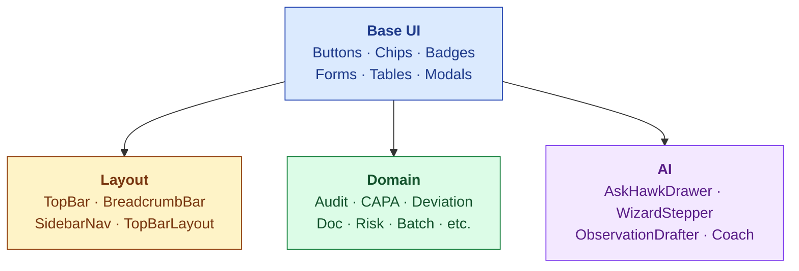

# Component Inventory

| Field | Value |
|---|---|
| Owner | Founding Designer + Frontend Engineer |
| Status | DRAFT v1.0 |
| Last updated | 2026-05-31 |
| Source | `frontend/components/` (live code) |

---

## 1. Component families



## 2. Base UI components (MUI 6 + custom)

| Component | Source | Variants |
|---|---|---|
| `Button` | MUI | primary / secondary / outlined / text + sm/md/lg |
| `Chip` | MUI | filled / outlined + status colors |
| `StatusBadge` | custom (`components/ui/StatusBadge`) | critical / high / medium / low / info |
| `Card` | MUI | Generic container |
| `Dialog` | MUI | Modal base |
| `TextField` | MUI | + custom validation states |
| `Select` / `Autocomplete` | MUI | for picklists |
| `Tabs` | MUI | + custom phase-gated variant |
| `DataGrid` (MUI X) | MUI | for sortable tables |
| `Stepper` | MUI | + custom `AuditPhaseStepper` extension |

## 3. Layout components

| Component | Purpose | File |
|---|---|---|
| `TopBar` | Persistent top navigation (Marketplace / Supplier Collab / EQMS dropdowns) | `components/layout/TopBar.tsx` |
| `BreadcrumbBar` | Per-page breadcrumb | `components/layout/BreadcrumbBar.tsx` |
| `SidebarNav` | (Legacy) sidebar nav for old layout | `components/layout/Drawer/SidebarNav.tsx` |
| `TopBarLayout` | New full-width console layout (FF_NAV_V2) | `components/layout/TopBarLayout.tsx` |

## 4. Domain components (per module)

### Audit
| Component | Purpose |
|---|---|
| `AuditList` | Role-aware list with row actions |
| `AuditDetail` | Single audit detail hub |
| `AuditPhaseStepper` | 8-phase visual progress |
| `AuditRequestTabs` | Tab bar with gate-based enablement |
| `AuditQuestionnaireHub` | PAQ + artifacts + notes |
| `SmartQuestion` | Adaptive form field (radio/checkbox/text/attachment/date) |
| `AuditArtifactDetail` | Single artifact editor + PDF overlay |
| `AuditReportGenerator` | Final report assembler |
| `AuditMilestonesView` | Milestone tracking |
| `AuditTrackProgress` | Phase timeline |
| `AuditLogTable` | Audit-trail per audit |
| `AuditorSelector` | Auditor dropdown (qualified + available + COI-clean) |

### CAPA + Deviation + Change Control + Document Control
| Component (per module) | Pattern |
|---|---|
| `<Module>List` | Role-aware list |
| `<Module>Detail` | Single record hub |
| `<Module>Workflow` | State-machine driven UI |
| `<Module>AuditTrail` | Per-record trail |

### Cross-module
| Component | Purpose |
|---|---|
| `SignatureDialog` | Part 11 e-sig ceremony (reused across modules) |
| `NotificationBell` | Top-bar notification icon |
| `AccountPopover` | Top-bar user menu |

## 5. AI components

| Component | Purpose | Where |
|---|---|---|
| `AskHawkDrawer` | Right-side AI assistant drawer | Floating sparkle bubble (bottom-left) |
| `WizardStepper` | Plan-then-execute UI | Embedded in AskHawkDrawer + ComplianceCopilot |
| `ObservationDrafterButton` | AI-draft observations | Audit artifacts page |
| `AuditorCoachPanel` | Private auditor growth feedback | Auditor dashboard + report page |
| `ComplianceCopilot` | Right-edge floating panel | Persistent across pages |
| `PredictiveCapaBadge` | CAPA effectiveness prediction | CAPA list/detail |
| `SupplierRiskDossierViewer` | Supplier intel dossier | Supplier detail page |
| `CapaRcaDrafter` | RCA scaffolder | CAPA investigation |
| `DeviationFiveWhyScaffolder` | 5-Why guide | Deviation investigation |
| `DeviationTrendsBanner` | Cross-deviation trend alert | Deviation list page |

## 6. UI pattern catalog

### Phase stepper pattern

Used for any multi-phase workflow (audit, CAPA, change-control).

```
[●─────●─────○─────○]
 done  current  upcoming
```

Status colors: green (done), blue (current/in-progress), gray (upcoming), amber (blocked), red (failed).

### Tab gate pattern

Tabs in a record detail are dynamically enabled/disabled based on state:

```
[Summary] [Questionnaire] [Artifacts] [Report ✗ blocked] [Closure ✗ blocked]
```

Disabled tabs have tooltip explaining why ("Awaiting supplier signature on intimation").

### Signature dialog pattern

Single reusable component across modules:

```
┌─ Sign Audit Closure Certificate ───────────┐
│ You are signing this record as APPROVED.   │
│                                             │
│ Your password: [_____________]              │
│ Reason for change: [Required ≥10 chars]    │
│                                             │
│ [Cancel] [Sign and confirm]                 │
└─────────────────────────────────────────────┘
```

### Empty state pattern

Every list view has a consistent empty state:

```
        [icon]
   No <items> yet
   <Contextual help text>
   [Primary action button]
```

## 7. Mermaid-rendered diagrams in product

Used in:
- Phase steppers (programmatic, not Mermaid)
- Architecture diagrams (Doc_V2 only, not in product UI)
- ERDs (Doc_V2 only)

## 8. Responsive + mobile (today: desktop-first)

Current breakpoint policy:
- < 600px: degraded experience; primary use is read-only audit lookup
- 600-960px: tablet; most flows work
- ≥ 960px: full desktop experience (primary target)

Mobile-first redesign deferred to post-Series-A.

## 9. Known UI gaps

| Gap | Module | Plan |
|---|---|---|
| Inconsistent table density across modules | All | Q3 2026 — consolidate to DataGrid |
| AI panel styling not consolidated (drafter vs coach vs wizard) | AI | Q4 2026 — design system AI components |
| Some empty states are bare | Various | Q3 2026 — sweep |
| Print CSS only for audit-trail + closure cert | Cross-module | Q1 2027 — platform-wide print |
| Color palette deviations in legacy components | Various | Ongoing cleanup |
| Mobile usability | All | Post-Series A redesign |

---

## See also

- [DESIGN-PRINCIPLES.md](../design-system/DESIGN-PRINCIPLES.md)
- [PLATFORM-OVERVIEW.md §4](../../04-engineering/00-overview/PLATFORM-OVERVIEW.md) — frontend stack
- `frontend/components/` (live code) — authoritative inventory
