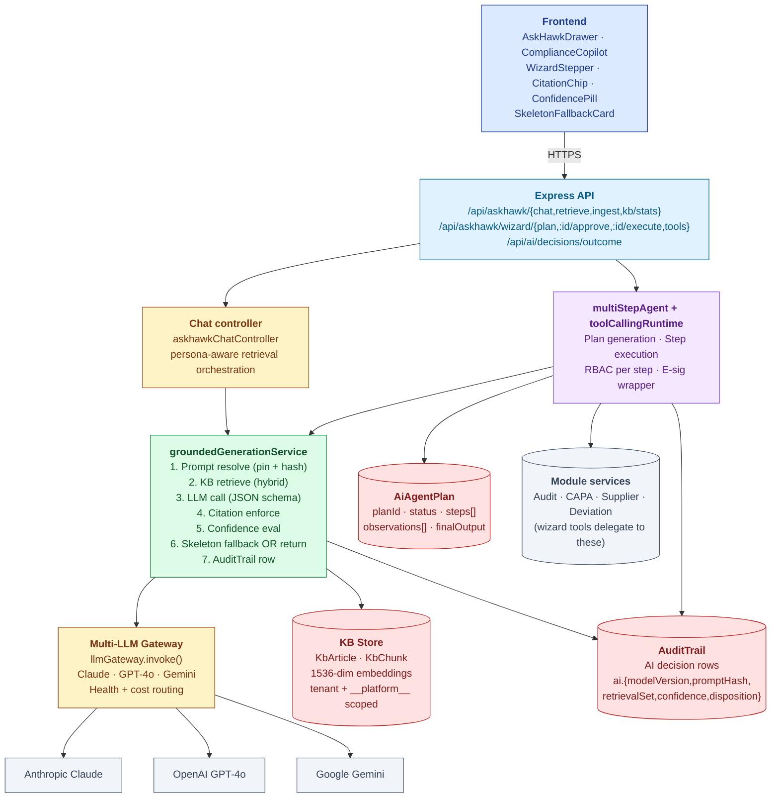
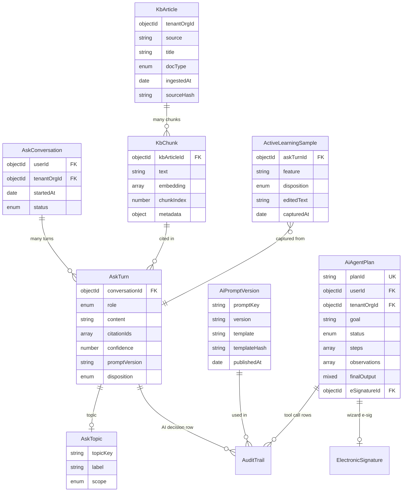
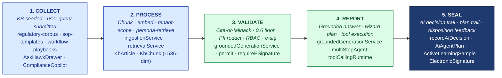

# ARCHITECTURE — AskHawk

| Field | Value |
|---|---|
| Module | AskHawk (cross-cutting AI co-worker) |
| Status | **LIVE — Phases 1, 2A, 2B, 3 shipped May 2026** |
| Depth | Executive overview |
| Pairs with | [URS.md](URS.md), [DESIGN.md](DESIGN.md), [AI-ARCHITECTURE.md](../../04-engineering/07-ai/AI-ARCHITECTURE.md) |
| Last updated | 2026-06-01 |

> 💡 **AskHawk is the AI pipeline for the entire platform.** Every other module's AI feature (observation drafter, supplier intel, CAPA RCA, etc.) consumes AskHawk's `groundedGenerationService`. This document is the canonical reference for that pipeline.

---

## 1. System Context

**Tier ownership:**
- **Frontend** — drawer, copilot, wizard UI, citation rendering, e-sig modal
- **API + middleware** — auth, RBAC, e-sig enforcement (for wizard WRITE)
- **Chat controller** — persona-aware retrieval orchestration for Q&A turns
- **Agent runtime** — `multiStepAgent` (plan generation) + `toolCallingRuntime` (sequential execution with per-step RBAC + audit)
- **groundedGenerationService** — the core pipeline (see [AI-ARCHITECTURE §3](../../04-engineering/07-ai/AI-ARCHITECTURE.md#3-the-grounded-generation-pattern-the-core-moat))
- **LLM gateway** — provider routing (Claude primary, GPT-4o fallback, Gemini for speed)
- **KB store** — MongoDB Atlas vector (cosine)
- **AuditTrail** — every AI decision + every tool call
- **Module services** — wizard tools call into Audit/CAPA/Supplier service layers (not direct DB writes)

---

## 2. Data Model

### Primary entities

| Model | Purpose | Key fields |
|---|---|---|
| **AskConversation** | Persistent multi-turn chat session | `userId`, `tenantOrgId`, `startedAt`, `status` (active/closed) |
| **AskTurn** | Single user or assistant message | `conversationId`, `role` (user/assistant), `content`, `citationIds[]`, `confidence`, `promptVersion`, `disposition` |
| **AskTopic** | Topical categorization for analytics | `topicKey`, `label`, `scope` (regulation / sop / playbook / wizard) |
| **KbArticle** | Source document | `tenantOrgId` (or `__platform__`), `source`, `title`, `docType` (regulation/sop/playbook/other), `ingestedAt`, `sourceHash` |
| **KbChunk** | Embeddable chunk of an article | `kbArticleId`, `text`, `embedding` (1536-dim), `chunkIndex`, `metadata` (clause #, persona-applicable, etc.) |
| **AiPromptVersion** | Pinned prompt template + hash | `promptKey`, `version`, `template`, `templateHash`, `publishedAt` |
| **AiAgentPlan** | Wizard plan + execution record | `planId`, `userId`, `goal`, `status` (pending_approval/approved/executing/completed/failed/rejected), `steps[]`, `observations[]`, `finalOutput`, `eSignatureId` |
| **ActiveLearningSample** | Disposition feedback for tuning | `askTurnId`, `feature`, `disposition`, `editedText`, `capturedAt` |
| **AuditTrail** (shared) | Cross-module AI + tool decision log | Plus AI-specific fields: `ai.feature`, `ai.modelVersion`, `ai.promptHash`, `ai.retrievalSet[]`, `ai.confidence`, `ai.tokensInput`, `ai.tokensOutput`, `ai.latencyMs`, `ai.userDisposition` |
| **ElectronicSignature** (shared) | Wizard plan e-sig | Standard fields |

### Indexes

- `AskConversation`: `(userId, status)`, `tenantOrgId`
- `AskTurn`: `conversationId`, `(disposition, promptVersion)` for active-learning analytics
- `KbChunk`: vector index on `embedding` (cosine); `kbArticleId`
- `KbArticle`: `(tenantOrgId, docType)`, `sourceHash` (unique per tenant)
- `AiAgentPlan`: `(userId, status)`, `planId` (unique)
- `AuditTrail`: `(tenantId, ai.feature, ai.modelVersion)` — supports URS-B-001 query
- `ActiveLearningSample`: `(feature, disposition, capturedAt)`

---

## 3. API Contract Catalog

All paths require `authenticate`; RBAC via `permit(...roles)`.

### Chat (Phase 1 + 2)
| Endpoint | Roles | Purpose |
|---|---|---|
| `POST /api/askhawk/chat` | all | Submit turn → grounded response |
| `GET /api/askhawk/conversations` | all (self) | List own conversations |
| `GET /api/askhawk/conversations/:id` | all (self) | Conversation history |
| `POST /api/askhawk/retrieve` | all | KB retrieval without LLM (debug / power-user) |
| `POST /api/ai/decisions/outcome` | all | Submit USER_ACCEPTED / EDITED / REJECTED / SUPERSEDED |

### KB ingestion (Admin)
| Endpoint | Roles | Purpose |
|---|---|---|
| `POST /api/askhawk/ingest` | tenant_admin, superadmin | Ingest doc → chunk + embed |
| `GET /api/askhawk/kb/stats` | tenant_admin | Tenant KB stats (article count, last ingest) |
| `DELETE /api/askhawk/kb/articles/:id` | tenant_admin | Remove article + chunks (with audit trail) |

### App Wizard (Phase 3)
| Endpoint | Roles | Purpose |
|---|---|---|
| `GET /api/askhawk/wizard/tools` | all (returns per-role visible tools) | Tool registry introspection |
| `POST /api/askhawk/wizard/plan` | all | Submit goal → plan |
| `POST /api/askhawk/wizard/:planId/approve` | initiator (self) | Approve plan |
| `POST /api/askhawk/wizard/:planId/execute` | initiator (self) + e-sig if any WRITE | Execute plan |
| `GET /api/askhawk/wizard/:planId` | initiator (self) | Plan status + final output |

### AI decisions browser (URS-B-001)
| Endpoint | Roles | Purpose |
|---|---|---|
| `GET /api/audit-trail/by-entity?ai.feature=X&ai.modelVersion=Y` | tenant_admin, inspector | Cross-module AI decision browser (Part-11 traceability) |

### Wizard tools (8 registered as of May 2026)

| Tool | R/W | Required roles | E-sig |
|---|---|---|---|
| `wizard.list_suppliers` | Read | all | No |
| `wizard.list_products` | Read | all | No |
| `wizard.find_auditor` | Read | buyer, tenant_admin | No |
| `wizard.list_open_capas` | Read | all | No |
| `wizard.classify_deviation` | Read (AI-only) | all | No |
| `wizard.draft_observation` | Read | auditor | No |
| `wizard.create_audit` | **WRITE** | buyer, tenant_admin | **YES** |
| `wizard.create_capa` | **WRITE** | buyer, auditor | **YES** |

---

## 4. RBAC Matrix

| Capability | Buyer | Auditor | Supplier | Reg Affairs | Tenant Admin | Superadmin | Inspector (planned) |
|---|---|---|---|---|---|---|---|
| Chat (Q&A) | ✅ | ✅ | ✅ | ✅ | ✅ | ✅ | ✅ (read-only) |
| Wizard plan generation | ✅ | ✅ | ✅ | ✅ | ✅ | ✅ | — |
| Wizard plan approve + execute (READ-only plans) | ✅ | ✅ | ✅ | ✅ | ✅ | ✅ | — |
| Wizard plan execute (WRITE — e-sig required) | (per tool roles) | (per tool roles) | — | — | ✅ | ✅ | — |
| Submit disposition | ✅ | ✅ | ✅ | ✅ | ✅ | ✅ | — |
| KB ingest | — | — | — | — | ✅ | ✅ | — |
| KB stats / browse | — | — | — | — | ✅ | ✅ | — |
| AI decision audit-trail browse | — | — | — | — | ✅ | ✅ | ✅ |
| Active-learning admin dashboard | — | — | — | — | ✅ | ✅ | — |

**Tenant boundary:**
- All retrieval scoped to `tenantOrgId` + `__platform__` (regulatory canon)
- A tenant **never** sees another tenant's KB content (hard enforcement at retrieval layer)
- `__platform__` content is read-only for tenants; managed by platform team
- Wizard tools that touch other modules (e.g., `wizard.create_audit`) inherit those modules' tenant guards

---

## 5. AI Capabilities (the core moat)

AskHawk **is** the AI capability — but other modules consume its pipeline. Here's what AskHawk provides directly:

### Grounding contract (per [AI-ARCHITECTURE.md §3](../../04-engineering/07-ai/AI-ARCHITECTURE.md#3-the-grounded-generation-pattern-the-core-moat))

| Property | Value |
|---|---|
| Output format | JSON (schema-validated; re-ask on parse failure) |
| Citations | Mandatory ≥1 (caller-configurable per feature) |
| Confidence floor | 0.6 default (per-feature override) |
| Retrieval | Hybrid: 30% lexical + 70% semantic; tenant + `__platform__` scope |
| PII | Redact before LLM call; restore on receipt |
| Streaming | Disabled for grounded calls (full-response validation) |
| Fallback | Deterministic skeleton with citations preserved (the "honesty path") |
| Audit | Every call → `recordAiDecision()` AuditTrail row |

### The 7-step pipeline (live)

1. **Prompt resolve** — pin `AiPromptVersion` row by key+version; hash for reproducibility
2. **KB retrieve** — hybrid lexical+semantic; tenant + `__platform__` + persona-filter
3. **LLM call** — multi-LLM gateway routes by task; JSON schema validation
4. **Citation check** — every claim must cite retrieved chunks
5. **Confidence eval** — below floor → skeleton fallback
6. **Return** — draft with citations + confidence OR skeleton with citations only
7. **AuditTrail row** — `recordAiDecision()` with all reproducibility metadata

### Multi-LLM gateway routing (live)

| Task | Primary | Fallback |
|---|---|---|
| Q&A | Claude Sonnet 4.6 | GPT-4o |
| Wizard plan generation | Claude Sonnet 4.6 | GPT-4o |
| KB summarization | Gemini 2.0 Flash | Claude |
| Embeddings | OpenAI text-embedding-3-small | (single provider) |
| Auditor coach (private) | Claude Sonnet 4.6 | — |

### Active learning loop (scaffolded, human-gated)

- Disposition captured per turn (USER_ACCEPTED / EDITED / REJECTED / SUPERSEDED)
- Aggregated per `(feature, promptVersion)` → acceptance rate trend
- Variants proposed by tooling; **human approval required before A/B rollout** (auto-tuning is Q1 2027 roadmap per URS-B-005)

---

## 6. State Machine Implementation

Cross-reference [DESIGN §4](DESIGN.md#4-state-machines).

### Conversation
- **Definition:** `backend/src/constants/askConversationStates.js`
- **Validation:** simple — no complex transitions
- **Application:** `services/askhawkChatService.js` writes turns + updates status

### Wizard plan
- **Definition:** `backend/src/constants/aiAgentPlanStates.js` (pending_approval / approved / executing / completed / failed / rejected)
- **Validation:** `services/ai/wave2/multiStepAgent.js → canTransition()` — RBAC + e-sig prerequisites
- **Application:** `services/ai/wave2/toolCallingRuntime.js → executePlan()` — sequential step execution with per-step RBAC + AuditTrail
- **Gates:**
  - **G-APP** approval: `aiAgentController.approvePlan()`
  - **G-ESIG**: `requireESignature` middleware applied at `/execute` if plan contains any WRITE step
  - **G-RBAC**: per-step `wizardTools.js` `required_roles` check inside runtime
  - **G-CONF**: `groundedGenerationService` skeleton fallback below 0.6

### Failure semantics
- A WRITE step failure halts downstream WRITE steps; previous WRITE steps remain committed
- All step results (success or failure) write AuditTrail rows
- Plan transitions to FAILED; user sees partial state

---

## 7. Compliance Traceability

| Feature | 21 CFR Part 11 | ICH Q10 | EU GMP Annex 11 | GDPR / DPDPA |
|---|---|---|---|---|
| Grounded output (citations) | **§11.10(b) authenticity** | §2.2 knowledge mgmt | — | — |
| AI decision audit trail | **§11.10(e), §11.10(k)** | — | §9 audit trail | — |
| Reproducibility (modelVersion + promptHash) | **§11.10(b)** | — | §6 risk-based validation | — |
| Wizard e-signature (single sig for multi-WRITE plan) | **§11.50 + §11.200 + §11.300** | — | §14 e-sig | — |
| RBAC + tenant isolation | **§11.10(d)** | — | §12 personnel | data minimization |
| Human-in-loop (wizard approval gate) | §11.10(b) controls | — | — | **§22 automated decisions** |
| PII redaction before LLM | — | — | §17 records | data minimization |
| Disposition feedback (active learning) | §11.10(b) | §3.2.4 continual improvement | — | — |

---

## 8. Operational Concerns

### Performance targets
- Q&A turn (retrieval + LLM): **< 4 sec p95**
- Wizard plan generation: **< 6 sec p95**
- Wizard step execution (per tool): **< 3 sec p95** (varies by tool)
- KB retrieval (hybrid): **< 800 ms p95**
- AI decision audit-trail query (100k entries): **< 2 sec** (URS-B-001)
- KB ingestion (10-page PDF): **< 30 sec** (chunk + embed + index)

### Failure modes
- **All LLM providers down** → skeleton fallback (deterministic, with citations); UI honest message
- **Embedding provider down** → KB retrieval falls back to lexical-only; degraded result quality flagged
- **Vector store query timeout** → return top-K from lexical; AuditTrail row DEGRADED
- **Wizard step failure** → halt downstream WRITE steps; AuditTrail; user notified with partial state
- **E-sig password verification failure** → no execution; plan stays at APPROVED awaiting retry
- **Cross-tenant retrieval attempt** → hard-block; AuditTrail SECURITY_VIOLATION; alert
- **PII redaction failure** → call aborted; user notified

### Observability
- Per-feature: turn count, p95 latency, acceptance rate, confidence distribution
- Per-tenant: KB chunk count, retrieval hit rate, wizard plan executions
- Per-model: cost per 1M tokens, error rate by category, fallback frequency
- AI decision audit trail = the regulatory observability layer
- Active learning dashboard: per-(feature × promptVersion) acceptance trend

### Cost (per AI-ARCHITECTURE §11)
- M0-M6: $2-5K/month (pure API gateway)
- M12-M18: $4-7K/month (hybrid self-host + API)
- M24+: $10-15K/month (scaled volume)

---

## 9. Known Gaps + Engineering Debt

1. **Active-learning auto-tuning** (URS-B-005) — scaffolded; auto-variant proposal + A/B not wired; humans propose today. Roadmap Q1 2027.
2. **Inspector surface** (URS-B-009) — read-only AskHawk persona for regulator visits not built. Roadmap Q2 2027.
3. **Fine-tuned S.M.A.R.T. Hawk model** (URS-B-010) — roadmap M12+; PoC data collection ongoing.
4. **DOCS-DRIFT banners on 3 legacy docs** in `backend/docs/askhawk/` predate Phase 3; cleanup pending.
5. **pgvector migration** — Mongo cosine works to ~100K chunks; pgvector scaffolded but not in prod.
6. **Cohere rerank-3** — not yet wired; planned for re-ranking top-K (M12).
7. **Multi-region (EU GDPR sovereignty)** — single-region today; data residency story pending.
8. **TSA timestamp on AI decision rows** — cryptographic anchor for tamper-evidence not wired.
9. **Per-tenant prompt customization** — tenants cannot pin custom prompt versions today (platform-managed only).
10. **Voice surface** — text-only today; voice is Q3 2027 candidate (e-sig story TBD).
11. **Cross-tenant supplier intel surfacing inside AskHawk** — `supplierIntelAgent` fuses public sources; cross-tenant findings deferred pending consent UI.

---

## 10. Open Engineering Questions

1. **When does Mongo cosine cross the threshold to pgvector / specialized vector DB?** — at ~100K chunks per tenant?
2. **Active-learning auto-tuning gate** — what acceptance-rate delta + sample size justifies auto-promotion?
3. **Fine-tune dataset curation** — what's the minimum sample size per feature for first useful fine-tune?
4. **Model versioning + rollback** — when new model regresses, fastest rollback path?
5. **Wizard tool versioning** — backward-compat when tool args schema evolves?
6. **Plan re-runnability** — can a completed plan be re-executed deterministically (replay)? Today: no.
7. **WebSocket for streaming** — currently HTTP chunked; investment to switch?
8. **Inspector auth model** — short-lived JWT issued by tenant_admin? OAuth?
9. **Multi-region embeddings** — re-embed per region or share?
10. **TSA provider selection** — DigiStamp / FreeTSA / in-house?

---

## 11. Code Path Index

| Concern | Path |
|---|---|
| Routes | `backend/src/routes/{askhawkChatRoutes,askhawkIngestRoutes,aiAgentRoutes}.js` |
| Controllers | `backend/src/controllers/{askhawkChatController,kbIngestController,aiAgentController}.js` |
| Core pipeline | `backend/src/services/groundedGenerationService.js` |
| Multi-LLM gateway | `backend/src/services/ai/llmGateway.js` |
| Retrieval | `backend/src/services/ai/retrievalService.js` |
| AI decision audit | `backend/src/services/ai/audit-trail/recordAiDecision.js` |
| Active learning | `backend/src/services/ai/activeLearningLoop.js` |
| App Wizard runtime | `backend/src/services/ai/wave2/{multiStepAgent,toolCallingRuntime,wizardTools}.js` |
| Models | `backend/src/models/{AskConversation,AskTurn,AskTopic,KbArticle,KbChunk,AiPromptVersion,AiAgentPlan,ActiveLearningSample}.js` |
| Shared models | `backend/src/models/{AuditTrail,ElectronicSignature}.js` |
| Data corpus | `backend/src/data/{regulatory-corpus,sop-templates,workflow-playbooks}.json` |
| Constants | `backend/src/constants/{askConversationStates,aiAgentPlanStates}.js` |
| Middlewares | shared `authenticate`, `permit`, `requireESignature`, `tenantMiddleware` |
| Frontend components | `frontend/components/ai/{AskHawkDrawer,ComplianceCopilot,WizardStepper,CitationChip,ConfidencePill,SkeletonFallbackCard,AskHawkIntentChips,AskHawkDispositionBar}.tsx` |
| Frontend admin pages | `frontend/app/(console)/admin/askhawk/{ingest,conversations,decisions}/**` |
| Frontend hooks | `frontend/hooks/{useAskHawk,useWizardPlan}.ts` |
| Eval suite | `backend/src/services/ai/evals/**` |

---

## 12. The Five-Pillar Walkthrough

AskHawk is **the cross-cutting expression** of S.M.A.R.T. Hawk's universal 5-pillar pipeline (**SOURCE → MODEL → ASSESS → REPORT → TRACE**). Unlike a regulated workflow module (Audit, CAPA, Deviation) whose pillars walk a single business object end-to-end, AskHawk's pillars describe the **AI request-response cycle** that every other module borrows. This section narrates how an AskHawk turn (Q&A or wizard) walks the pillars, maps each pillar to the actual code, and notes the cross-module fan-out — because AskHawk both consumes content from every module's KB and spawns writes into every module's service layer. The same pillar shape is the canonical pattern; see MASTER-REFERENCE.

### 12.1 Narrative

An AskHawk interaction is **collected** when (a) tenant admins ingest KB content via the regulatory-corpus seeder, sop-templates seeder, and workflow-playbooks seeder, and (b) a user submits a query through `AskHawkDrawer` or `ComplianceCopilot` — either as a Q&A turn or a Wizard goal. It is **processed** by chunking source documents into 800-token chunks with 100-token overlap, embedding each chunk to 1536-dim vectors via OpenAI `text-embedding-3-small`, storing them in tenant-scoped `KbArticle` + `KbChunk` collections (plus `__platform__` for the regulatory canon), and running persona-aware hybrid retrieval (30% lexical + 70% semantic) at query time. It is **validated** by citation enforcement (every claim must cite a retrieved chunk), the 0.6 confidence floor (skeleton fallback below), PII redaction before LLM call, structured JSON output schema validation, and — for wizard plans — per-tool RBAC + e-signature checks. It is **reported** as grounded generation output (LLM response with mandatory citations + confidence chip), as a wizard plan (`multiStepAgent` produces an inspectable JSON plan with side-effect tags), and as tool-call execution results (`toolCallingRuntime` runs each step and surfaces the outputs to the user via `WizardStepper`). Finally every interaction is **sealed** — `recordAiDecision()` writes one `AuditTrail` row per AI call with `modelVersion`, `promptHash`, `retrievalSet`, `citations`, `confidence`, `tokensInput`, `tokensOutput`, `latencyMs`, `userDisposition`; the wizard's `AiAgentPlan` aggregate records plan status transitions and the single `ElectronicSignature` covering all WRITE steps; and disposition feedback feeds the active-learning loop for the next prompt-variant proposal.

### 12.2 Pillar diagram

### 12.3 Cross-module spawn and consume

AskHawk is **cross-cutting** — it sits in both directions of every module's AI surface:

- **AskHawk consumes from every module's KB** — `groundedGenerationService` retrieves over `tenant + __platform__` scope; tenant-side KB articles can include SOP exports, doc-control deposits, prior CAPA write-ups, deviation reports, audit findings (anything the tenant chooses to index). The `__platform__` scope holds the regulatory canon (11 standards × 32 clauses).
- **AskHawk spawns writes into every module's service layer** — wizard tools never write to the DB directly; they delegate to module service layers. `wizard.create_audit` → `auditRequestController.create()`; `wizard.create_capa` → `capaController.create()`; `wizard.draft_observation` → `observationDrafter` (which is itself an AskHawk-pipeline consumer). One AI surface, all the existing module guards intact.
- **Every module's AI feature is an AskHawk consumer** — Audit's `observationDrafter` + `auditorCoach`, CAPA's `capaRcaDrafter`, Deviation's `deviationIntakeClassifier`, Supplier's `supplierIntelAgent` all delegate their LLM call to `groundedGenerationService`. They get citations, confidence, skeleton fallback, and audit-trail rows for free.
- **Cross-module audit-trail query** — `GET /api/audit-trail/by-entity?ai.feature=X&ai.modelVersion=Y` (URS-B-001) returns every AI decision across every module — Audit observation drafts, CAPA RCA drafts, deviation classifications, wizard tool calls — in one < 2 sec query, keeping the regulatory thread continuous.

### 12.4 Code path table

| Pillar | Code path | What it does in AskHawk |
|---|---|---|
| 1. COLLECT | `data/{regulatory-corpus,sop-templates,workflow-playbooks}.json`, `controllers/kbIngestController.js`, `services/ai/ingestionService.js`, `models/{AskConversation,AskTurn}.js`, frontend `components/ai/{AskHawkDrawer,ComplianceCopilot,AskHawkIntentChips}.tsx` | Seeds the 3-phase corpus into `__platform__` + tenant scopes; captures user queries via drawer/copilot; persists conversation history |
| 2. PROCESS | `services/ai/ingestionService.js` (chunk 800/100 + embed 1536-dim), `services/ai/retrievalService.js` (hybrid 30/70 + persona filter), `models/{KbArticle,KbChunk}.js` | Chunks + embeds source documents; stores tenant-scoped indexes; runs persona-aware retrieval at query time |
| 3. VALIDATE | `services/groundedGenerationService.js` (citation check + confidence floor + PII redact + schema validate + skeleton fallback), `middlewares/{permit,requireESignature}.js`, `services/ai/wave2/wizardTools.js` (per-tool `required_roles`) | Enforces cite-or-fallback, 0.6 floor, PII redaction, JSON schema validation, RBAC per tool, e-sig before any WRITE step |
| 4. REPORT | `services/groundedGenerationService.js` (final response assembly), `services/ai/wave2/multiStepAgent.js` (plan generation), `services/ai/wave2/toolCallingRuntime.js` (step execution), frontend `components/ai/{WizardStepper,CitationChip,ConfidencePill,SkeletonFallbackCard}.tsx` | Returns grounded answers with citations + confidence; produces inspectable wizard plans; executes plan steps sequentially with live progress |
| 5. SEAL | `services/ai/audit-trail/recordAiDecision.js`, `models/{AiAgentPlan,ActiveLearningSample,AuditTrail,ElectronicSignature}.js`, `services/ai/activeLearningLoop.js` | Writes one AuditTrail row per AI call with full reproducibility metadata; persists `AiAgentPlan` lifecycle transitions; captures the single e-signature covering all WRITE steps; feeds disposition signals into active-learning samples |

See also:
- [Doc_V2/02-platform/MASTER-REFERENCE.md](../../02-platform/MASTER-REFERENCE.md) — the canonical 5-pillar pattern
- [Doc_V2/04-engineering/07-ai/AI-ARCHITECTURE.md §3](../../04-engineering/07-ai/AI-ARCHITECTURE.md#3-the-grounded-generation-pattern-the-core-moat) — the grounded-generation pattern AskHawk implements
- [Doc_V2/06-modules/audit-management/ARCHITECTURE.md §12](../audit-management/ARCHITECTURE.md#12-the-five-pillar-walkthrough) — sibling walkthrough showing how a module consumes AskHawk's AI pipeline at Pillar 4 (REPORT)
