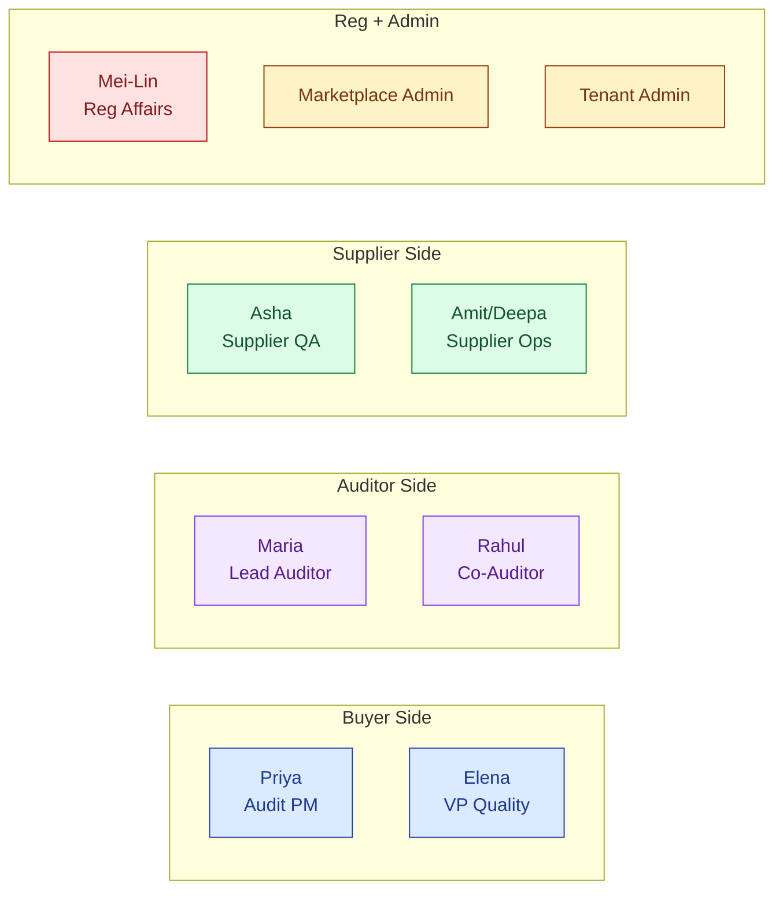
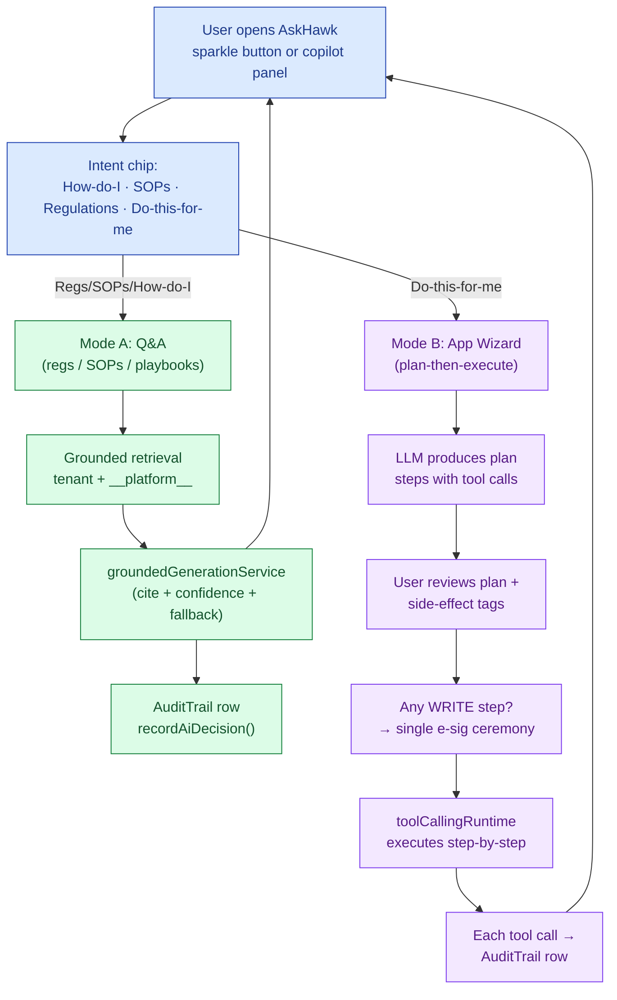
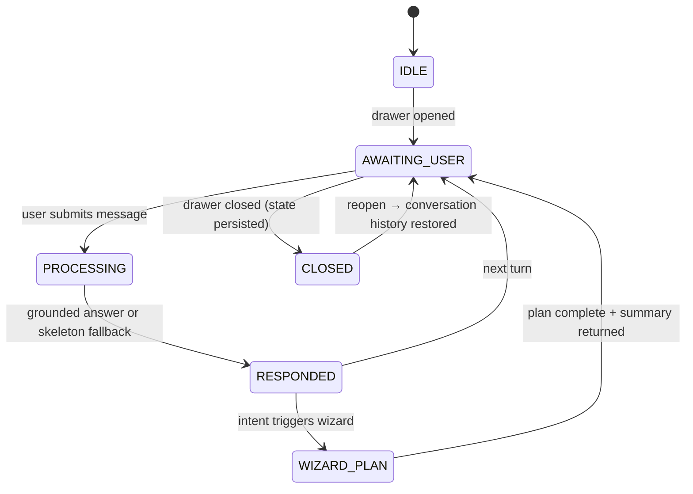
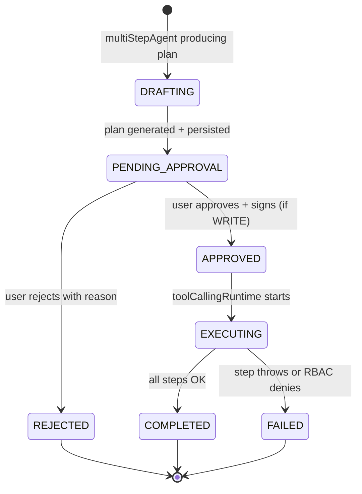

# DESIGN — AskHawk

| Field | Value |
|---|---|
| Module | AskHawk (cross-cutting AI co-worker) |
| Status | **LIVE — Phases 1, 2A, 2B, 3 shipped May 2026** |
| Depth | Executive overview |
| Pairs with | [URS.md](URS.md), [ARCHITECTURE.md](ARCHITECTURE.md) |
| Last updated | 2026-06-01 |

---

## 1. Personas — All Platform Users (9)

AskHawk is **for everyone** on the platform. Persona is a first-class input to every retrieval and response.



Each persona has tailored:
- **Retrieval scope** (playbooks indexed by persona × module)
- **Tone + phrasing** (buyer-side "approve" vs supplier-side "respond" vs auditor-side "draft")
- **Wizard tool eligibility** (e.g., only `buyer` invokes `wizard.create_audit`)
- **Reference depth** (Reg Affairs gets cited clauses; Supplier Ops gets step-by-step)

---

## 2. End-to-End Journey

AskHawk has **three interaction modes** that share a single pipeline.



### Journey snapshots per mode

#### Mode A: Q&A (Phases 1 + 2A + 2B)
```
1. Open drawer            → sparkle button → AskHawkDrawer
2. Pick intent            → "Regulations"
3. Type question          → "What does 21 CFR 211.192 require for batch records?"
4. (System: retrieves clause + related; LLM generates cited answer with confidence)
5. Read response          → inline citations [§211.192] clickable → modal
6. Confidence chip        → "92% — high"
7. Disposition            → 👍 or 👎 (feeds active learning)
8. Optional: export       → markdown + JSON for submission packet
```

#### Mode B: App Wizard (Phase 3)
```
1. Open drawer            → sparkle button
2. Pick intent            → "Do this for me"
3. Type goal              → "Create an audit for Sanpras with Maria Santos as lead auditor on Aug 15"
4. (System: multiStepAgent produces plan)
5. Review plan            → WizardStepper UI shows 3 steps with side-effect tags
                            • Step 1 [READ]  wizard.find_auditor → "Maria Santos"
                            • Step 2 [WRITE] wizard.create_audit → AuditRequest(...)
                            • Step 3 [READ]  return summary
6. Plan approval          → "Approve & Sign"
7. E-sig modal            → password + reason ≥10 chars
                            (single sig covers all WRITE steps in this plan)
8. Execute                → toolCallingRuntime runs step-by-step
                            Live progress: ✓ Step 1 → ✓ Step 2 → ✓ Step 3
9. Final output           → "Audit HAWK0000000234 created. View → /audits/[id]"
10. (Background: each step + plan recorded in AuditTrail)
```

#### Persona-aware example — same question, different answers

> User asks: **"How do I respond to a Major observation about cleaning validation?"**

- **As Asha (Supplier QA Head):** returns supplier-side playbook — "1. Acknowledge in supplier portal. 2. Open CAPA template. 3. Conduct RCA per ICH Q9. 4. Submit response within 30 days. 5. ..." — with supplier-portal deep-links
- **As Maria (Auditor):** returns auditor-side playbook — "1. Verify observation evidence is complete. 2. Confirm severity rating per GMP_OBSERVATION_CLASSIFICATIONS. 3. Reference 21 CFR 211.67. 4. Track supplier CAPA response. ..."
- **As Priya (Buyer):** returns buyer-side playbook — "1. Review observation in audit detail. 2. Confirm CAPA assignment. 3. Set follow-up cadence. ..."

Same retrieval pipeline, persona-filtered content + persona-tailored phrasing.

---

## 3. Screen + Component Inventory

### Primary surfaces
| Component | Surface | Purpose |
|---|---|---|
| **`AskHawkDrawer`** | Floating sparkle button (bottom-left, all pages) | Primary chat UI; full-height drawer |
| **`ComplianceCopilot`** | Right-edge panel (audit pages, CAPA pages) | Module-aware co-pilot; suggests next actions |
| **`AskHawkIntentChips`** | Top of drawer | "How do I…", "SOPs", "Regulations", "Do this for me" |
| **`WizardStepper`** | Inside drawer when Wizard active | Plan visualizer + approve + e-sig |
| **`CitationChip`** | Inline in response text | Clickable → clause modal |
| **`ConfidencePill`** | Top of each response | "92% — high" / "55% — low — verify" |
| **`SkeletonFallbackCard`** | When confidence < floor | Honest "no confident answer" with cited sources |
| **`WizardStepCard`** | Per step in WizardStepper | Tool name, args, side-effect tag, status |
| **`PlanApprovalBar`** | Below WizardStepper | "Approve & Sign" / "Modify" / "Cancel" |
| **`AskHawkDispositionBar`** | Below each response | 👍 / 👎 / Edit / Export |
| **`AskHawkSlashCommand`** | In-module text inputs (audit notes, CAPA RCA) | `/ask`, `/sop`, `/playbook`, `/wizard` triggers |

### Routes
| Route | Purpose |
|---|---|
| `/admin/askhawk/ingest` | Tenant admin: ingest new KB content |
| `/admin/askhawk/conversations` | Tenant admin: view conversations (audit-trail) |
| `/admin/askhawk/decisions` | Admin: AI decision audit trail browser |
| `/askhawk/inspector` (planned) | Read-only inspector surface (URS-B-009) |

### Cross-cutting / shared
- `SignatureDialog` — used by wizard for the single multi-WRITE e-sig
- `AuditLogTable` — for the cross-module AI decision view

---

## 4. State Machines

AskHawk has **two state machines**: conversation + wizard plan.

### Conversation lifecycle



### Wizard plan lifecycle



**Plan ownership:**

| State | Owner | Notes |
|---|---|---|
| DRAFTING | System (multiStepAgent) | LLM call producing plan JSON |
| PENDING_APPROVAL | User | WizardStepper visible; can approve / reject / modify (regenerate) |
| APPROVED | (transition state) | E-sig captured if any WRITE step present |
| EXECUTING | System (toolCallingRuntime) | Sequential step execution |
| COMPLETED | (terminal) | Final output returned + summary in conversation |
| FAILED | (terminal) | Partial state visible in audit trail |
| REJECTED | (terminal) | Reason logged |

### Decision gates

| Gate | State | Trigger | Enforcer |
|---|---|---|---|
| **G-APP** | PENDING → APPROVED | User clicks Approve | `aiAgentController.approvePlan()` |
| **G-ESIG** | APPROVED entry (if WRITE) | User completes e-sig ceremony | `requireESignature` middleware + `toolCallingRuntime` |
| **G-RBAC** | Per-step (EXECUTING) | Tool RBAC check vs user roles | `wizardTools.js` per-tool `required_roles` |
| **G-CONF** | RESPONDED (Q&A) | Confidence ≥ 0.6 | `groundedGenerationService` skeleton fallback if below |

---

## 5. Notifications

| Event | Recipients | Channel |
|---|---|---|
| Wizard plan completed | User (initiator) | In-app + email |
| Wizard plan failed | User + tenant_admin (if cross-impact) | In-app + email |
| AI decision needs review (low confidence pattern) | Tenant admin | Dashboard banner |
| KB ingestion complete | Tenant admin who initiated | Email + admin dashboard |
| KB ingestion failed | Tenant admin | Email |
| Active learning variant proposed (admin) | Platform AI admin | Admin dashboard |
| Disposition trend low (< 50% acceptance for a feature/week) | Platform AI admin | Slack/dashboard |

---

## 6. Error and Edge Cases

| Scenario | Handling |
|---|---|
| **LLM provider all down** | `llmGateway` returns skeleton; UI shows "AI temporarily unavailable, here are sources you may find relevant" with cited chunks |
| **Confidence < 0.6** | `groundedGenerationService` returns skeleton with citations preserved; UI shows `SkeletonFallbackCard` ("I don't have a confident answer; closest sources below") |
| **No KB chunks retrieved** | Skeleton fallback ("I don't have content on this topic in your tenant + platform KB; consider uploading reference docs") |
| **Plan with WRITE step + user lacks role** | RBAC check at G-RBAC; plan generation prevented OR plan generated with disabled WRITE steps + warning |
| **E-sig password wrong** | Plan stays at PENDING_APPROVAL; user retries; AuditTrail row SIGNATURE_FAILED |
| **Tool execution error mid-plan** | Step marked FAILED; downstream WRITE steps halted; plan → FAILED; partial state in AuditTrail; user notified |
| **Plan ambiguous (LLM produces invalid tool call)** | `multiStepAgent` re-asks once; if still invalid, returns "I couldn't construct a valid plan — could you rephrase?" |
| **Conversation context overflow** | System summarizes older turns and continues; summary visible to user |
| **PII in user query** | `groundedGenerationService` redacts before LLM call; restores on receipt |
| **Stale citations (KB chunk re-indexed)** | Old conversation citations may go stale; system flags "citation reference may have updated" + offers refresh |
| **Cross-tenant retrieval attempt** | Hard-block at retrieval-service tenant filter; AuditTrail row SECURITY_VIOLATION |

---

## 7. Accessibility

- **Keyboard nav:** drawer fully keyboard-accessible (Esc to close, Tab to navigate citations, Enter to expand)
- **Screen reader:** ARIA labels on intent chips, citation chips, confidence pills; live-region for streamed responses
- **Color contrast:** confidence pills (green/amber/red) meet WCAG AA + redundant text label ("high"/"medium"/"low") for color-blind
- **Focus management:** drawer focus-trapped while open; close returns focus to invoking button; WizardStepper sequential focus per step
- **Streaming:** typing indicator + interrupt button; screen reader announces completion
- **Open gaps:** citation chip cluster (5+ citations) needs ARIA collapse/expand pattern; Skeleton fallback card needs distinct ARIA role

---

## 8. Open Design Questions

1. **Persona auto-detect vs explicit picker** — today persona = user's role. Should we offer a "ask as if I'm <X>" picker for cross-functional learning?
2. **Wizard plan modify-without-regenerate UX** — today user can reject + retry; should they be able to edit individual steps inline?
3. **Multi-turn wizard** — current wizard is single-turn (one user goal → one plan). Should plans be revisable across turns ("change Aug 15 to Aug 20")?
4. **Persistent vs per-conversation copilot** — `ComplianceCopilot` is module-context-aware; should it follow the user across modules or reset?
5. **Citation cluster density** — when an answer cites 8+ sources, current UI gets crowded; collapse/expand pattern?
6. **Confidence chip prominence** — too prominent (alarming users on legit medium-confidence answers) or too subtle (users miss low-confidence warnings)?
7. **Wizard for non-buyer write tools** — most WRITE tools are buyer-initiated; will auditor/supplier wizards (e.g., `wizard.submit_capa_response` for supplier) follow same single-esig model?
8. **Voice input** — when (Q3 2027?) and how does the e-sig ceremony work for voice?
9. **Inspector surface (URS-B-009)** — read-only persona's UI: separate route or persona-toggle in existing UI?
10. **DOCS-DRIFT banners** — old `backend/docs/askhawk/*` docs predate Phase 3; needs cleanup with banner removal
