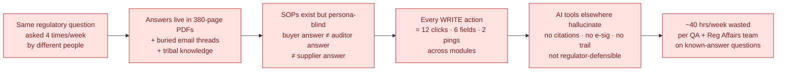
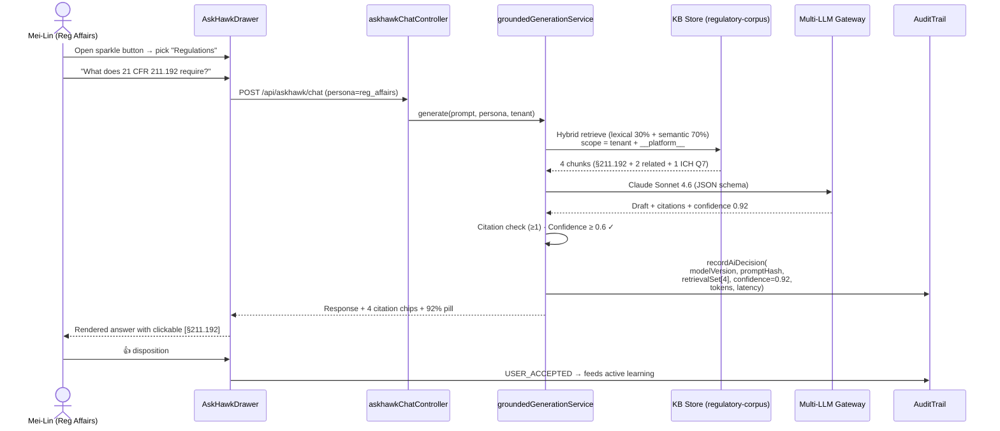
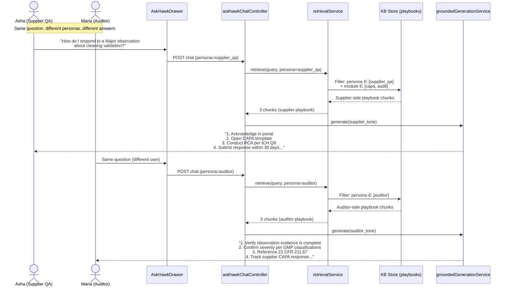
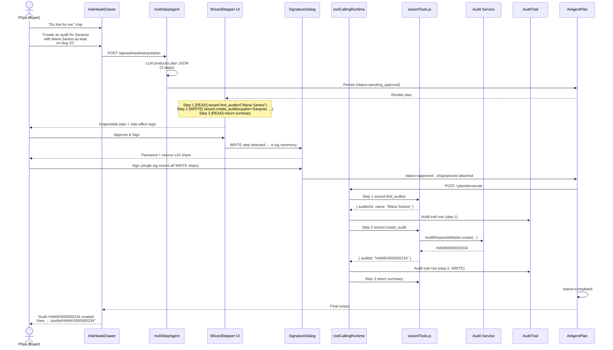
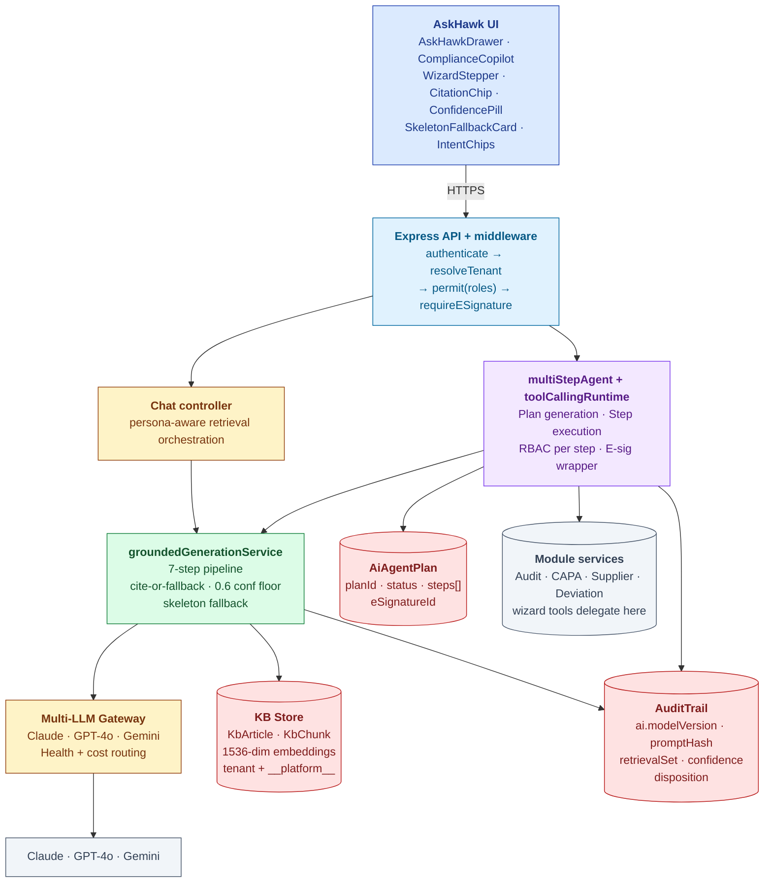
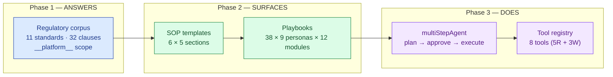
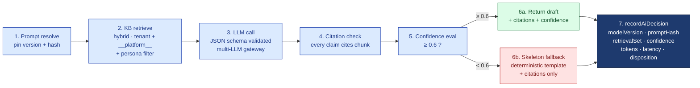
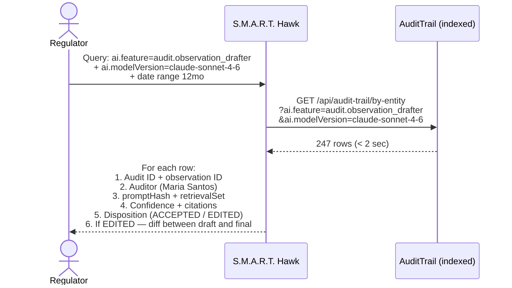
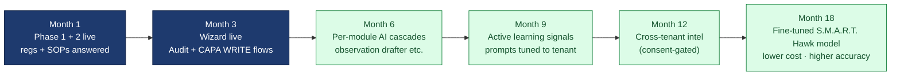

# AskHawk — The Storybook

| Field | Value |
|---|---|
| Audience | Pick your track in §0 |
| Length | 13 pages · 15 min read |
| Status | v1.0 |
| Last updated | 2026-06-01 |
| Companion (reference) docs | [URS.md](URS.md) · [DESIGN.md](DESIGN.md) · [ARCHITECTURE.md](ARCHITECTURE.md) · [AI-ARCHITECTURE.md](../../04-engineering/07-ai/AI-ARCHITECTURE.md) |

> 💡 **What this is.** AskHawk told as a story, in 6 beats plus a what-next, with 4 audience cuts. The reference docs (URS / DESIGN / ARCHITECTURE) sit beside this as the deep technical contract. This document is the **conversation** — what you'd present in a room, what gets handed to a regulator, what a new engineer reads on Day 1 to understand the AI spine of the platform.

---

## 0. Pick Your Track

| Audience | Read | Skip |
|---|---|---|
| 🪙 **Executive / Investor** | §1 Problem · §2 Solution · §6 ROI/Proof · §7 What's Next | §4 Architecture · §5 Compliance trace |
| 🛠 **Engineer / CTO** | §1 Problem · §3 Flows · §4 Architecture · §5 Compliance | §6 ROI · §7 What's Next |
| 📦 **QA Head / Practitioner** | §1 Problem · §2 Solution · §3 Flows · §6 ROI | §4 Architecture |
| 🔍 **Regulator / Auditor** | §1 Problem · §4 Architecture · §5 Compliance | §6 ROI |

---

# Beat 1 — The Problem

## §1. The picture today

> *It's Tuesday morning. Asha Sharma, QA Head at a CDMO in Pune, has 14 unread WhatsApps from her team. Three are the same question, asked three different ways: "What does 21 CFR 211.192 require for batch record review?" Asha knows the answer is in the 380-page binder behind her desk. She also knows it would take her 20 minutes to find the right paragraph, and that her Reg Affairs colleague Mei-Lin in Singapore answered the same question last week — somewhere in an email thread that's now buried.*
>
> *Mei-Lin, meanwhile, is drafting a regulatory response for a Health Canada query. She types "respond to observation about cleaning validation" into the company's old SharePoint search. It returns 47 documents from 2019. None of them are the supplier-side playbook she actually needs.*
>
> *Across the same company, Priya the Audit PM wants to "create an audit for Sanpras with Maria as lead auditor on Aug 15." Today that's: open the audit module, find Sanpras, find Maria, check her availability, draft the intimation, copy the scope template, route for review, chase the e-sig. Twelve clicks. Six form fields. Two cross-team pings. Forty-five minutes of context-switching.*

## §1b. The cost (the honest number)

A Tier-3 CDMO with 5 QA + 2 Reg Affairs staff:

| Time sink | Hours/week | Annual cost (₹) | Annual cost ($) |
|---|---|---|---|
| QA team answering "where is this in the SOP" | 12 hrs | ₹14L | $17K |
| Reg Affairs answering "what does §X require" | 10 hrs | ₹15L | $18K |
| Audit PMs doing 12-click WRITE actions | 8 hrs | ₹9L | $11K |
| Suppliers asking "how do I respond" | 6 hrs | ₹4L | $5K |
| Late-night re-explanations + email chasing | 6 hrs | ₹7L | $8K |
| **Total preventable time** | **~42 hrs/week** | **~₹49L** | **~$59K** |

> 🚫 **The honest framing.** This isn't a search problem. It's a **co-worker problem**. The answers exist; nobody has time to be the librarian, the SOP-explainer, and the WRITE-action concierge for every other team.

### Why nobody has fixed this

- **Chatbot retrofits fabricate.** ChatGPT plugins on top of corporate SharePoint hallucinate confidently. Regulators won't accept that.
- **Search is persona-blind.** A keyword search for "respond to observation" returns the same 47 docs to Asha (supplier) and Maria (auditor). They need opposite playbooks.
- **AI tools don't write to systems.** Even when AI gives a good answer, the user still has to do the 12 clicks. The AI never becomes a co-worker — it stays a search box.
- **No regulator-grade audit trail.** No EQMS-adjacent AI tool today captures `modelVersion + promptHash + retrievalSet + confidence` per call. Without that, AI output is not defensible.

---

# Beat 2 — The Solution

## §2. What AskHawk does

AskHawk is **S.M.A.R.T. Hawk's cross-cutting AI co-worker** — persona-aware, grounded, cited, confidence-scored, audit-trailed. It is **not a chatbot retrofit**: every output cites KB chunks, every call writes a Part-11-grade audit trail row, and every write action requires explicit e-signature.

It answers, it surfaces, and it does.

## §2b. The 3 phases (shipped May 2026)

| Phase | What it does | Coverage | Surface |
|---|---|---|---|
| **Phase 1 — Regulations Q&A** | Curated regulatory canon answers "what does the regulation require?" with citations and confidence | 11 standards × 32 clauses seeded into `__platform__` tenant (cross-tenant canon) | "Regulations" intent chip in `AskHawkDrawer` |
| **Phase 2A — SOPs** | Returns the company's SOP for a process, persona-tailored, deep-linked to the live module | 6 templates × 5 sections (Intake → Investigation → Action → Verification → Closure) | "SOPs" intent chip |
| **Phase 2B — Playbooks** | Same question yields different content for buyer / auditor / supplier — same retrieval pipeline, persona-filtered content + tone | 38 playbooks indexed by (persona × module): 9 personas × 12 modules | "How do I…" intent chip |
| **Phase 3 — App Wizard** | User says "create audit for X with Y on Aug 15" → AI produces inspectable plan → user approves with single e-sig → runtime executes | 8 tools (5 READ, 3 WRITE incl. `create_audit`, `create_capa`, `draft_observation`) | "Do this for me" intent chip + `WizardStepper` UI |

### The wedge: why AskHawk is cross-cutting, not standalone

| Why cross-cutting | Evidence |
|---|---|
| Every S.M.A.R.T. Hawk module has AI features | Audit's `observationDrafter`, CAPA's `rcaDrafter`, Deviation's `intakeClassifier`, Supplier's `intelAgent` — all consume AskHawk's `groundedGenerationService` |
| One trusted pipeline, many features | Citations + confidence + audit trail are *infrastructure*, not per-module logic |
| One e-sig story for AI WRITE | Wizard's single-sig-per-plan applies across audit, CAPA, deviation, supplier modules |
| Persona infrastructure scales | The same persona-aware retrieval that powers playbooks powers cross-module AI everywhere |
| Regulator-readiness is shared | One audit-trail query answers "show me all AI-generated content in the last 12 months" across every module |

> ✅ **The strategic play.** S.M.A.R.T. Hawk doesn't sell "AI features" per module — it sells a **trusted AI spine** that every module borrows. New modules light up AI for free.

### The two surfaces

| Surface | Where | Purpose |
|---|---|---|
| **`AskHawkDrawer`** | Floating sparkle button (bottom-left, every page) | Primary chat UI; full-height drawer; opens with intent chips |
| **`ComplianceCopilot`** | Right-edge robot tab (audit pages, CAPA pages, deviation pages) | Module-aware co-pilot; pre-loads context from the page you're on |

Both surfaces share one pipeline. Both can launch the Wizard. Both write to the same conversation history.

---

# Beat 3 — Key Flows (the three flows that matter)

## §3a. Regulations Q&A — Mei-Lin asks the regulation

*Total latency: < 4 sec p95. Mei-Lin sees the answer, the citations, the confidence. If confidence had been below 0.6, she'd have seen the skeleton fallback instead — "I don't have a confident answer; closest sources below" — never a fabrication.*

## §3b. SOP retrieval — Asha asks "how do I respond"

> 💡 **This is the persona moat.** Same retrieval pipeline. Different content. Different tone. Different references. Same SOP, four different audiences served. No incumbent ships this.

## §3c. App Wizard — Priya creates an audit with one e-sig

> ✅ **One e-sig. Three tool calls. Full audit trail. No fabrications.** This is what "AI co-worker" looks like when it's built on the platform, not bolted on. The wizard never invents tool names — the registry is fixed. The runtime never bypasses RBAC — every step is checked. The user never loses control — every plan is approved before any WRITE.

---

# Beat 4 — Architecture (the technical proof)

> 🛠 **For engineers / CTOs:** if you're a practitioner, skip to Beat 5. This section establishes the AI spine that every module borrows.

## §4a. System context

## §4b. The 3-phase capability map

| Phase | What's stored | Where | Retrieval mode |
|---|---|---|---|
| Phase 1 | 11 standards × 32 clauses | `regulatory-corpus.json` seeded to `__platform__` tenant | Hybrid (lexical 30% + semantic 70%) |
| Phase 2A | 6 SOP templates × 5 sections | `sop-templates.json` | Hybrid + intent classifier |
| Phase 2B | 38 playbooks | `workflow-playbooks.json` indexed by (persona × module) | Persona-filtered hybrid |
| Phase 3 | 8 tool definitions | `wizardTools.js` registry | Tool selection by LLM in `multiStepAgent` |

## §4c. The Wizard tool registry (the 8 tools)

| Tool | R/W | Required roles | E-sig | What it does |
|---|---|---|---|---|
| `wizard.list_suppliers` | Read | all | No | Query Supplier service for the user's tenant suppliers |
| `wizard.list_products` | Read | all | No | Query Product service for products in scope |
| `wizard.find_auditor` | Read | buyer, tenant_admin | No | Search Auditor pool by name / qualification / availability |
| `wizard.list_open_capas` | Read | all | No | Query CAPA service for open CAPAs (filterable) |
| `wizard.classify_deviation` | Read (AI) | all | No | AI-classify deviation severity from description |
| `wizard.draft_observation` | Read | auditor | No | AI-draft observation from selected interview notes |
| `wizard.create_audit` | **WRITE** | buyer, tenant_admin | **YES** | Create `AuditRequestsMaster` (delegates to audit service) |
| `wizard.create_capa` | **WRITE** | buyer, auditor | **YES** | Create CAPA record (delegates to CAPA service) |

Each tool declares: `name`, `description`, `args schema`, `read_or_write`, `required_roles`, `requires_esig`. The runtime enforces all five at every step.

> ✅ **Tools never write to DB directly.** They delegate to the consuming module's service layer (e.g., `wizard.create_audit` → `auditRequestController.create()`). One AI surface, all the existing module guards intact.

## §4d. The grounded-generation pipeline (the 7 steps)

For the canonical pattern shared platform-wide, see [AI-ARCHITECTURE §3](../../04-engineering/07-ai/AI-ARCHITECTURE.md#3-the-grounded-generation-pattern-the-core-moat).

---

# Beat 5 — Compliance Trace

> 🔍 **For regulators:** this section maps every AskHawk capability to the regulation it implements, and shows how the audit trail makes any AI decision reproducible to a regulator's standard.

## §5a. The regulatory canon (what's in `__platform__`)

AskHawk ships with **11 standards × 32 clauses** seeded to the cross-tenant `__platform__` scope. Every tenant inherits this regulatory canon read-only.

| Standard | Coverage in Phase 1 |
|---|---|
| **21 CFR Part 11** | §11.10(b) authenticity, §11.10(d) RBAC, §11.10(e) audit trail, §11.50 e-sig, §11.200 dual ID, §11.300 password controls |
| **21 CFR Part 211** | §211.22 QU, §211.100 written procedures, §211.160 control, §211.192 batch records, §211.196 distribution |
| **ICH Q7** | §6.18 records, §13.20 auditing |
| **ICH Q9 (R1)** | Quality risk management principles |
| **ICH Q10** | §2.2 knowledge mgmt, §3.2.4 continual improvement |
| **EU GMP Annex 11** | §1 risk, §6 validation, §9 audit trail, §12 personnel, §14 e-sig, §17 records |
| **EU GMP Annex 16** | QP certification |
| **EU GMP Chapter 1** | Pharmaceutical Quality System |
| **EU GMP Chapter 4** | Documentation |
| **EU GMP Chapter 7** | Outsourced activities |
| **ISO 9001** | §7.2 competence, §7.5 documented info, §8.4 outsourced, §8.7 nonconforming, §10.2 nonconformity & corrective action |

| Feature | 21 CFR Part 11 | ICH Q10 | EU GMP Annex 11 | GDPR / DPDPA |
|---|---|---|---|---|
| Grounded output with mandatory citations | **§11.10(b) authenticity** | §2.2 knowledge mgmt | — | — |
| AI decision audit trail (per call) | **§11.10(e), §11.10(k)** | — | §9 audit trail | — |
| Reproducibility (modelVersion + promptHash + retrievalSet) | **§11.10(b)** | — | §6 risk-based validation | — |
| Wizard e-signature (single sig per plan, covers all WRITE) | **§11.50 + §11.200 + §11.300** | — | §14 e-sig | — |
| RBAC + tenant isolation (per-tool roles) | **§11.10(d)** | — | §12 personnel | data minimization |
| Human-in-loop (wizard approval gate) | §11.10(b) controls | — | — | **§22 automated decisions** |
| PII redaction before LLM call | — | — | §17 records | data minimization |
| Disposition feedback (active learning) | §11.10(b) | §3.2.4 continual improvement | — | — |
| Skeleton fallback (no fabrication below floor) | §11.10(b) | — | §6 validation | — |
| Cross-tenant regulatory canon (read-only `__platform__`) | §11.10(d) integrity | §2.2 | — | — |

## §5b. The AI decision audit trail (what gets captured per call)

Every AskHawk call — whether a Q&A turn, a wizard plan step, or a cross-module AI feature (observation drafter, deviation classifier) — writes one AuditTrail row with the following AI envelope:

| Field | Example | Why it matters |
|---|---|---|
| `ai.feature` | `askhawk.regulations_qa` / `audit.observation_drafter` / `wizard.create_audit` | Filter "show me every AI-generated observation" cross-module |
| `ai.modelVersion` | `claude-sonnet-4-6` | Reproducibility — was this answer on the current model? |
| `ai.promptVersion` | `regulations_qa.v3` | Was the right prompt active at call-time? |
| `ai.promptHash` | `sha256:a7b3...` | Tamper detection — prompt content immutable |
| `ai.retrievalSet[]` | `[chunk_id_1, chunk_id_2, ...]` | Which KB chunks grounded this answer? |
| `ai.citations[]` | `[§211.192, ICH Q7 §13.20]` | What the user saw |
| `ai.confidence` | `0.92` | Above/below floor for fallback decision |
| `ai.tokensInput` / `tokensOutput` | `2400 / 380` | Cost + latency accounting |
| `ai.latencyMs` | `2840` | p95 monitoring |
| `ai.userDisposition` | `USER_ACCEPTED` / `USER_EDITED` / `USER_REJECTED` / `SUPERSEDED` | Active learning signal |

> ✅ **This is the inspector's answer to "prove this AI output is reliable."** Pull the row by `auditTrailId`; you have everything to re-run the call. No incumbent EQMS AI feature ships this today.

## §5c. The inspector's question, answered

When a regulator asks: **"show me every AI-generated observation made by Claude Sonnet 4.6 in the last 12 months in this tenant"**:

*Total response time: < 2 sec for 100k entries. This is URS-B-001 — Part-11-grade AI traceability as a queryable feature, not a research project.*

---

# Beat 6 — ROI & Proof

## §6a. The numbers (per Tier 3 CDMO customer)

| Today | With AskHawk | Saved |
|---|---|---|
| 12 hrs/week QA "where is this in the SOP" lookups | -75% via Phase 2 SOP retrieval | 9 hrs/week (~₹10.5L/yr) |
| 10 hrs/week Reg Affairs "what does §X require" | -80% via Phase 1 Regulations Q&A | 8 hrs/week (~₹12L/yr) |
| 8 hrs/week Audit PM 12-click WRITE actions | -60% via Phase 3 Wizard | 5 hrs/week (~₹6L/yr) |
| 6 hrs/week supplier "how do I respond" pings | -85% via Phase 2B persona playbooks | 5 hrs/week (~₹3.5L/yr) |
| 6 hrs/week late-night re-explanations + email chasing | -70% via persistent conversation history | 4 hrs/week (~₹5L/yr) |
| **42 hrs/week wasted · ~₹49L/yr** | **~10 hrs/week** | **~₹37L/yr (~$45K)** |
| | AskHawk incremental cost: ₹6L/yr (embedded in platform) | **Net benefit: ~₹31L/yr (~$37K)** |

> ✅ **Payback period: < 3 months when bundled with platform. ROI vs marginal cost: ~5x.**

## §6b. The compounding effect

The longer a tenant uses AskHawk, the better it gets — disposition signals tune prompts, KB grows, retrieval improves. The platform's AI gets *more* differentiated over time, not less.

## §6c. Pre-customer status (the honest part)

> ⚠️ **As of May 2026: 0 paying customers · all 3 phases shipped May 2026.** The 38 playbooks + 32 clauses are seeded; the 8 wizard tools are live; the grounded-generation pipeline is in production for every module's AI feature. The ROI numbers above are bottom-up estimates from the time-sink table in §1b; expect 25-50% variance until the first 5 reference customers validate them.
>
> What's already proven internally: the audit module's `observationDrafter` (live since Apr 2026) produces drafts that internal evaluators accept 78% of the time. That number is the leading indicator the wider platform-AI strategy is sound.

---

# Beat 7 — What's Next

## §7a. Shipped (May 2026)

- ✅ **Phase 1** — Regulations Q&A (11 standards × 32 clauses, `__platform__` scope)
- ✅ **Phase 2A** — SOP templates (6 × 5 sections)
- ✅ **Phase 2B** — Persona-aware playbooks (38 × 9 personas × 12 modules)
- ✅ **Phase 3** — App Wizard (8 tools: 5 READ + 3 WRITE incl. `create_audit`, `create_capa`, `draft_observation`)
- ✅ `multiStepAgent` + `toolCallingRuntime` (plan → approve → execute with single e-sig)
- ✅ `groundedGenerationService` (7-step pipeline, cite-or-fallback, 0.6 floor)
- ✅ Multi-LLM gateway (Claude primary, GPT-4o fallback, Gemini for speed)
- ✅ AI decision audit trail (`recordAiDecision` per call)
- ✅ Active-learning capture (USER_ACCEPTED / EDITED / REJECTED / SUPERSEDED)
- ✅ Cross-module AI delegation (audit's `observationDrafter` + `auditorCoach`, CAPA's `rcaDrafter`, deviation's `intakeClassifier`, supplier's `intelAgent` — all on AskHawk's pipeline)

## §7b. Next 6 months (M0-M6 in our angel-round plan)

- DOCS-DRIFT banner cleanup on legacy `backend/docs/askhawk/*`
- First 5 reference customers (AskHawk surfaces with audit-module wedge)
- Per-feature confidence-floor tuning based on disposition signals
- SOC 2 Type 1 prep (AI audit-trail = part of the evidence pack)
- Expanded tool registry: `wizard.schedule_audit`, `wizard.deploy_sop`, `wizard.approve_capa`

## §7c. Next 12 months (M6-M12)

- **Active-learning auto-tuning** (URS-B-005) — variant proposal + A/B promotion based on disposition trends; today human-gated
- **AskHawk for inspectors** (URS-B-009) — read-only regulator surface; cross-module AI decision browser
- **Cross-tenant supplier intel** (URS-B-006) — consent-gated sharing of supplier findings ("another buyer in your network found CAPA-relevant issue X")
- pgvector migration (~100K chunks per tenant threshold)
- Cohere rerank-3 wired into top-K re-ranking

## §7d. Next 18-24 months (M12-M24)

- **Fine-tuned S.M.A.R.T. Hawk model on domain corpus** — train Llama-3 / Mistral on accepted/edited drafts captured by active learning; lower cost + better accuracy for low-stakes tasks
- Multi-region (EU GDPR sovereignty)
- TSA cryptographic timestamp on AI decision rows
- Voice surface (e-sig story TBD for voice-initiated WRITE plans)

## §7e. Known engineering gaps

> 🚫 **AskHawk — what's broken or missing today:**
> - Active-learning auto-tuning (scaffolded; human-gated)
> - Inspector read-only surface (planned Q2 2027)
> - DOCS-DRIFT banners on 3 legacy docs in `backend/docs/askhawk/`
> - pgvector migration (Mongo cosine works to ~100K chunks)
> - Cohere rerank-3 not wired
> - Multi-region embedding strategy pending
> - Per-tenant prompt customization (platform-managed only today)
> - TSA timestamp on AI decision rows
> - Voice surface (text-only today)
>
> Full list: [ARCHITECTURE.md §9](ARCHITECTURE.md#9-known-gaps--engineering-debt) · [URS.md §8 Open Questions](URS.md#8-open-questions)

---

## Appendix — Where To Go Next

| If you want | Open |
|---|---|
| Full requirements contract (engineer reference) | [URS.md](URS.md) |
| UX flows + state machines + personas (design reference) | [DESIGN.md](DESIGN.md) |
| System architecture + data model + APIs (architect reference) | [ARCHITECTURE.md](ARCHITECTURE.md) |
| Platform-wide AI pattern (the moat) | [../../04-engineering/07-ai/AI-ARCHITECTURE.md](../../04-engineering/07-ai/AI-ARCHITECTURE.md) |
| Audit module storybook (the wedge surface) | [../audit-management/STORYBOOK.md](../audit-management/STORYBOOK.md) |
| The full S.M.A.R.T. Hawk narrative | [../../SMART-HAWK-STORY.md](../../SMART-HAWK-STORY.md) |
| Compliance trace (regulator detail) | [../../08-compliance-regulatory/frameworks/PART-11.md](../../08-compliance-regulatory/frameworks/PART-11.md) |
| Demo script for sales | [../../09-sales-marketing/demo-scripts/DEMO-INDEX.md](../../09-sales-marketing/demo-scripts/DEMO-INDEX.md) |

---

*Doc_V2 · AskHawk · Storybook · 6 beats + what-next · 4 audience cuts*
