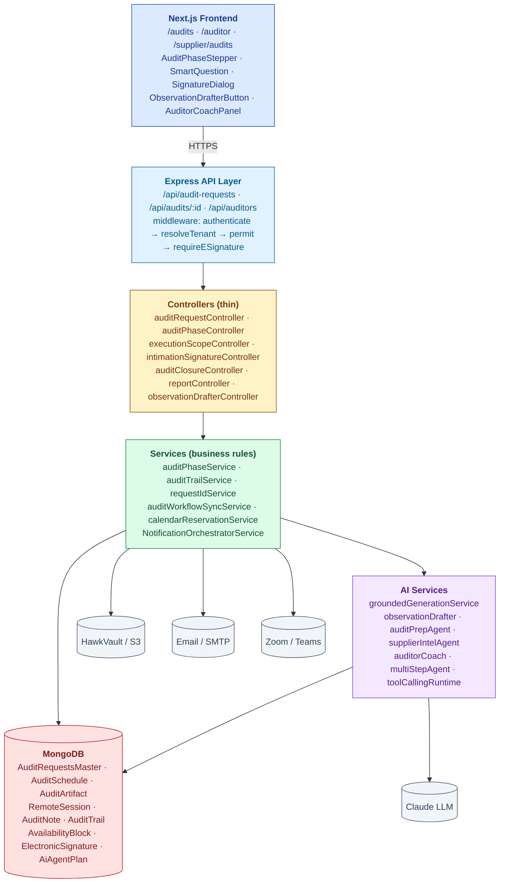
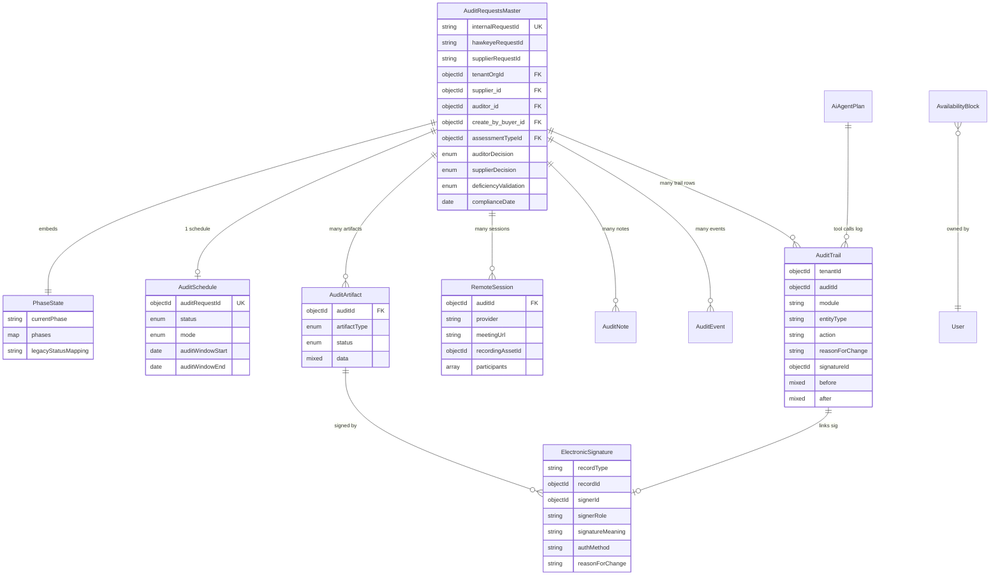
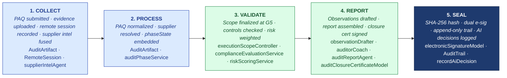

# ARCHITECTURE — Audit Management

| Field | Value |
|---|---|
| Module | Audit Management |
| Depth | Executive overview with code path links for detail |
| Pairs with | [URS.md](URS.md) (requirements), [DESIGN.md](DESIGN.md) (UX) |
| Last updated | 2026-05-31 |

---

## 1. System Context

**Tier ownership:**
- **Frontend** owns: rendering, role-aware UI gates, optimistic updates, e-sig modal capture
- **API + middleware** owns: auth/authn/authz, tenant scoping, e-sig enforcement, RBAC
- **Controllers** own: route dispatch (thin)
- **Services** own: business rules, state transitions, AI orchestration, notifications
- **Models** own: schema, indexes, embedded sub-doc structure
- **External systems** own: file storage (S3), email (SMTP), video (Zoom/Teams), inference (Claude)

---

## 2. Data Model

Full schema details below. ERD source lives at [Doc_V2/04-engineering/02-data-model/audit-erd.mmd](../../04-engineering/02-data-model/audit-erd.mmd) (TBD).

### Primary entities

| Model | Purpose | Key fields | References |
|---|---|---|---|
| **AuditRequestsMaster** | The audit aggregate root | `internalRequestId`, `hawkeyeRequestId`, `tenantOrgId`, `supplier_id`, `auditor_id`, `create_by_buyer_id`, `assessmentTypeId`, `auditorDecision`, `supplierDecision`, `deficiencyValidation`, `complianceDate`, `phaseState` (embedded) | `users`, `organizations`, `assessment-types`, `supplier-sites`, `supplier-master-products` |
| **PhaseState** (embedded) | 8-phase state machine instance | `currentPhase`, `phases[key].status`, `phases[key].ownerRole`, `phases[key].startedAt/completedAt`, `phases[key].blockers[]` | — |
| **AuditSchedule** | Calendar booking + mode | `auditRequestId` (unique), `status`, `mode` (REMOTE/ONSITE/HYBRID), `auditWindowStart/End`, `confirmedSlotId`, constraints[] | `AuditRequestsMaster`, `ScheduleSlot` |
| **AuditArtifact** | Per-phase artifacts (intimation, scope, PAQ, findings, CAPA plan, report, closure cert, COI) | `auditId`, `artifactType`, `status`, `data` (template instance + signatures), `createdBy`, `updatedBy` | `AuditRequestsMaster`, `users` |
| **RemoteSession** | Zoom/Teams meeting + recording | `auditId`, `provider`, `meetingUrl`, `status`, `recordingAssetId`, `participants[]` | `AuditRequestsMaster`, HawkVault asset |
| **AuditNote** | In-execution evidence (text/photo/audio) | `auditRequestId`, `authorId`, `type`, `text` / `transcript` / `attachmentPath` | `AuditRequestsMaster`, `users` |
| **AuditEvent** | LLM-integration event stream | `auditId`, `entityType`, `action`, `before`, `after`, `actorId`, `actorRole` | `AuditRequestsMaster` |
| **AuditTrail** (cross-module) | 21 CFR Part 11 audit log | `tenantId`, `auditId?`, `module`, `entityType`, `action`, `reasonForChange` (mandatory), `signatureId?`, `meta.changeBrief.fields[]`, `before`, `after`, `actorId`, `actorRole`, indexed `(tenantId, auditId)`, `(tenantId, module)`, `(tenantId, action)` | All modules |
| **AvailabilityBlock** | Auditor blackout periods | `ownerType` ('auditor'), `ownerId`, `blockType`, `start`, `end`, `timezone` | `users` |
| **ElectronicSignature** | Part 11 e-sig records | `recordType`, `recordId`, `signerId`, `signerRole`, `signatureMeaning`, `authMethod`, `reasonForChange`, `ipAddress`, `userAgent`, timestamp | `users`, any signable record |
| **AiAgentPlan** | Multi-step agent plan + execution | `planId`, `tenantId`, `goal`, `status` (pending_approval/approved/executing/completed/failed), `steps[]`, `observations[]`, `finalOutput` | `users` |

### Indexes (key)

- `AuditRequestsMaster`: `tenantOrgId`, `internalRequestId` (unique), `supplierRequestId`, `auditRequestId`, `assessmentTypeId`
- `AuditTrail`: `(tenantId, auditId)`, `(tenantId, module)`, `(tenantId, action)` — supports the cross-module trail browser in < 2 sec
- `AuditSchedule`: `auditRequestId` (unique) — one active schedule per audit
- `AvailabilityBlock`: `(ownerId, start, end)` — for the auditor-available query

---

## 3. API Contract Catalog (grouped)

Full endpoint enumeration in the reverse-engineering report; this is the executive grouping. All paths require `authenticate` middleware unless noted; RBAC enforced by `permit(...roles)`.

### Audit request lifecycle

| Group | Endpoints | Primary roles | Notes |
|---|---|---|---|
| List + read | `GET /api/audit-requests/buyer`, `/auditor`, `/supplier`, `/auditor/my`; `GET /api/audit-requests/requestSingleAudit` | role-specific | Filtered by `canUserAccessAudit()` |
| Create | (implicit via wizard.create_audit tool, or direct controller path) | buyer, tenant_admin, admin | Generates `internalRequestId` |
| Assign auditor | `POST /api/audit-requests/:id/assign-auditors` | buyer, tenant_admin, admin | Calls cross-tenant safety guard |
| Supplier decision | `POST /api/audit-requests/:id/supplier-decision` | supplier, supplierUser | Captures ACCEPTED/REJECTED/PROPOSED |
| Deficiency validation (Phase 0) | `POST /api/audit-requests/:id/deficiency-validation` | supplier, supplierUser | Pre-CAPA gate |
| Past audit upload | `POST /api/audit-requests/upload-pastaudit`, `GET /api/audit-requests/get-pastaudit` | all | History import |
| Archive | `POST /api/audit-requests/:id/archive` | all | Soft-delete |

### Phases + artifacts

| Group | Endpoints | Roles | Notes |
|---|---|---|---|
| Phase lifecycle | `GET /api/audits/:auditId/phases`, `POST /phases/transition` | role-specific per phase | Forward-only by default |
| Artifact CRUD | `GET /api/audits/:auditId/artifacts`, `POST`, `DELETE /:artifactId`, `POST /:artifactId/submit`, `POST /:artifactId/send` | role-specific | Type-driven (INTIMATION, SCOPE, PAQ, etc.) |
| Prep phase | `POST /prep/start`, `POST /prep/complete` | auditor, admin | Phase ownership |
| Execution scope (G5) | `GET /execution/scope`, `POST /execution/scope`, `POST /execution/finalize` | auditor, admin | Lock = no further mutation without revert |

### E-signature gates

| Endpoint | E-sig | Meaning | Phase |
|---|---|---|---|
| `POST /api/audits/:auditId/intimation/sign` | **YES** | APPROVED (supplier accepts) | G1 |
| `POST /api/audits/:auditId/closure-certificate` | indirect | AUTHORED (auditor signs cert) | G8a |
| `POST /api/audits/:auditId/closure-certificate/approve` | indirect | APPROVED (buyer counter-signs) | G8b |
| `POST /api/audits/:auditId/report/sign` | **YES** | AUTHORED / APPROVED / WITNESSED (per role) | report finalization |

### Observations + reports

| Endpoint | Role | Purpose |
|---|---|---|
| `POST /api/audits/:auditId/observations/draft` | auditor, admin | G12: LLM-backed observation generation |
| `POST /api/audits/:auditId/report/draft` | auditor, admin | Assemble findings report |
| `GET /api/audits/:auditId/report` | all roles | Read signed report |
| `POST /api/audits/:auditId/report/review` | buyer, tenant_admin, admin | Mark DRAFT → PENDING_REVIEW/APPROVED |
| `POST /api/audits/:auditId/report/observations/:obsId/capa` | auditor, admin | Create CAPA per observation |

### Remote audit + auditor admin

| Endpoint | Role | Purpose |
|---|---|---|
| `GET/POST/PATCH /api/audits/:auditId/remote-sessions` | varies | Zoom/Teams session lifecycle |
| `GET /api/auditors/available` | buyer, tenant_admin, admin | Filtered dropdown (qualif + COI + availability) |
| `GET/POST/DELETE /api/auditors/availability` | auditor | Self-service blackout |

### Audit trail

| Endpoint | Role | Purpose |
|---|---|---|
| `GET /api/audits/:auditId/audit-trail` | all | Single-audit trail |
| `GET /api/audit-trail/by-entity` | all (tenant-scoped) | Cross-module trail (URS-B-009) |
| `POST /api/audits/:auditId/audit-trail` | all | Log custom event |

### App Wizard (AI plan-then-execute — URS-B-008)

| Endpoint | Role | Purpose |
|---|---|---|
| `POST /api/agent/plan` | all (wizard-roles) | Create plan from goal |
| `POST /api/agent/plans/:id/approve` | initiator | Approve plan |
| `POST /api/agent/plans/:id/execute` | initiator + e-sig if any WRITE tool | Execute |
| Tools: `wizard.create_audit`, `wizard.find_auditor`, `wizard.draft_observation`, `wizard.list_open_capas`, `wizard.list_suppliers`, `wizard.create_capa`, `wizard.classify_deviation` | role-gated per tool | See URS-B-008 |

---

## 4. RBAC Matrix

| Capability | Buyer | Auditor | Co-Auditor | Supplier | Supplier User | Tenant Admin | Superadmin |
|---|---|---|---|---|---|---|---|
| Create audit request | ✅ | — | — | — | — | ✅ | ✅ |
| Assign auditor | ✅ | — | — | — | — | ✅ | ✅ |
| List own audits (role-scoped) | ✅ | ✅ | ✅ | ✅ | ✅ | ✅ | ✅ |
| Auditor accept/reject | — | ✅ | — | — | — | — | — |
| Supplier accept/reject + e-sig intimation | — | — | — | ✅ | ✅ | — | — |
| Build/finalize execution scope (G5) | — | ✅ | — | — | — | ✅ | ✅ |
| Submit/respond PAQ | — | — | — | ✅ | ✅ | — | — |
| Draft observation (AI) | — | ✅ | — | — | — | ✅ | ✅ |
| Sign report | — | ✅ (AUTHORED) | — | ✅ (WITNESSED, optional) | — | ✅ | ✅ |
| Review/approve report | ✅ (APPROVED) | — | — | — | — | ✅ | ✅ |
| Create closure cert | — | ✅ (AUTHORED) | — | — | — | ✅ | ✅ |
| Approve closure cert | ✅ (APPROVED) | — | — | — | — | ✅ | ✅ |
| Read audit trail | ✅ | ✅ | ✅ | ✅ | ✅ | ✅ | ✅ |
| Manage availability | — | ✅ | ✅ | — | — | — | — |

**Cross-tenant guards** beyond role check:
- `canUserAccessAudit()` — buyer/auditor/supplier affiliation check
- `canAuditorAccessAudit()` — auditor-specific COI + affiliation; supports third-party auditors serving multiple buyer tenants
- `buildAuditTenantScopeQuery()` — query-time filter on `tenantOrgId`

---

## 5. AI Capabilities

All AI is grounded (citations + confidence floor + skeleton fallback) and audit-trailed (`recordAiDecision`). Per URS §A6 + URS-B-003.

### AI tools wired into Audit Management

| Tool | Type | Read/Write | E-sig | Where used | Status |
|---|---|---|---|---|---|
| **wizard.create_audit** | App Wizard tool | WRITE | YES | App Wizard flow (URS-B-008) | ✅ live |
| **wizard.find_auditor** | App Wizard tool | READ | NO | App Wizard plan suggestion | ✅ live |
| **wizard.draft_observation** | App Wizard tool | READ (returns draft) | NO | App Wizard preview; persistence via separate signed endpoint | ✅ live |
| **observationDrafter (Wave 2)** | LLM draft service | READ | NO (sign separately) | `ObservationDrafterButton` → `POST /observations/draft` | ✅ live |
| **auditorCoach (Wave 3)** | Private review | READ | NO | `AuditorCoachPanel` on `/auditor/dashboard` + `/report` | ✅ live |
| **auditPrepAgent** | Risk-weighted PAQ drafting | READ | NO | Questionnaire prep flow | ✅ live (templateId hardcoded TODO) |
| **supplierIntelAgent** | FDA + EMA + WHO-PQ dossier | READ | NO | Supplier-detail page; auditor planning | ✅ live |
| **realTimeFollowupSuggester** | In-audit follow-up Qs | READ | NO | Live audit cockpit | ⚠️ route declared, handler scaffold |
| **auditAutofillAgent** | OCR + LLM field match | READ | NO | PAQ form auto-fill | ✅ partial (doc pipeline incomplete) |

### Grounding posture

Every LLM call routes through `groundedGenerationService.js`:
1. **Structured output** — JSON schema validation, re-ask on parse failure
2. **Citations required** — `requireCitations: true` (caller-set); minimum 1
3. **Confidence floor** — `minConfidence: 0.6` for observations; below threshold → skeleton fallback with citations preserved
4. **PII redaction** — before send to LLM, unredact on receipt
5. **AuditTrail row** — `recordAiDecision()` writes feature, modelVersion, promptHash, promptVersion, retrievalSet[], confidence, tokens, latency

### User-disposition feedback (active learning)

After every AI draft, the UI calls `POST /api/ai/decisions/outcome` with one of: `USER_ACCEPTED` / `USER_EDITED` / `USER_REJECTED` / `SUPERSEDED`. Feeds the active-learning loop (URS-B-004; auto-tuning not yet wired).

---

## 6. State Machine Implementation

Cross-reference [DESIGN §4](DESIGN.md#4-state-machine-phase-lifecycle).

**Enforcement layer:**
- **Definition:** `backend/src/constants/auditPhases.js` (enum) + `auditWorkflowTransitions.js` (milestone codes)
- **Validation:** `services/auditPhaseService.js → canTransition()` — checks owner role, gate prerequisites, forward-only rule
- **Application:** `services/auditPhaseService.js → applyPhaseTransition()` — mutates `phaseState`, writes AuditTrail row
- **Legacy bridge:** `services/auditWorkflowSyncService.js` — syncs legacy `trackStatus` (text) ↔ new structured `phaseState`. Drift risk acknowledged.

**Gate enforcement:**
- **E-sig gates (G1, G8)** — `middlewares/requireESignature.js` accepts `electronicSignatureId` (pre-signed) OR inline `signaturePassword`. Soft-mode default (warns); hard-mode via `ENFORCE_ESIG=hard`. URS-A-023 open question.
- **Scope lock (G5)** — `executionScopeController.finalize()` flips `data.locked=true` on EXECUTION_QUESTIONNAIRE artifact; subsequent edit attempts rejected
- **AI gate (G12)** — caller-driven; the AI tool returns drafts only, signed-publish is a separate endpoint

**Dual tracking debt:** the legacy text `trackStatus` is still written for backward compat (older UIs read it); planned deprecation when all callers migrated to `phaseState`.

---

## 7. Compliance Traceability

Maps platform features to the regulatory clauses they implement. Full URS-level mapping in [URS §3.A](URS.md#3-part-a--foundational-requirements); summary below.

| Feature | 21 CFR Part 11 | ICH Q7 | EU GMP Annex 11 | ISO 9001 |
|---|---|---|---|---|
| Audit request lifecycle | §11.10(a) controls | §13.20 audit programme | §1 principles | §8.4 / §9.2 |
| Phase state machine + forward-only transitions | §11.10(e) | §13.20 | §1, §9 | §8.7 |
| Intimation e-signature (G1) | **§11.50 + §11.200 + §11.300** | §13.20 | §14 e-sig | §8.4 |
| Pre-audit questionnaire | — | §13.20 | — | §9.2 |
| Execution scope lock (G5) | §11.10(e) integrity | §13.20 | §9 | §8.7 |
| Remote audit recording | §11.10(c) record protection | §13.21 evidence | §17 | §8.7 |
| Observation drafter w/ citations | §11.10(b) authenticity | §13.20 reporting | — | §8.7 / §10.2 |
| Report + closure dual e-sig (G8) | **§11.50 + §11.200** | §13.20 closure | §14 | §8.4 |
| Audit trail (cross-module) | **§11.10(e), §11.10(k)** | §6.18 records | **§9 audit trail** | §7.5 / §8.7 |
| RBAC + tenant isolation | §11.10(d) access controls | §13.20 independence | §12 personnel | §7.2 |
| AI decision audit trail (reproducibility) | §11.10(b), §11.10(e) | — | §6 risk-based validation | §8.7 |

---

## 8. Operational Concerns

### Performance / scale targets
- Audit list: < 500 ms for 1,000 audits per tenant
- AuditTrail cross-module query: < 2 sec for 100k entries (per URS-B-009)
- LLM observation draft: < 8 sec p95 (Claude Sonnet 4.6)
- Concurrent audits per tenant: target 10k active

### Failure modes + recovery
- **LLM provider down** → skeleton fallback (with citations); UI surfaces "AI unavailable, draft manually"
- **DB write failure mid-transition** → phase reverts to prior state; AuditTrail row marked FAILED; supervisor alerted
- **Email delivery failure** → retry queue (3x); falls through to in-app notification
- **S3 upload failure (recording)** → RemoteSession marked status=COMPLETED but recordingAssetId null; user reminded
- **Cross-tenant query leak** (theoretical) → defense-in-depth: route-level RBAC + service-level `buildAuditTenantScopeQuery()` + model-level discriminator
- **E-sig password verification failure** → no state change; AuditTrail row marked SIGNATURE_FAILED; user retries

### Observability
- Structured logs (correlation ID per request → traced through controllers → services → models)
- Per-tenant metrics: audits-in-flight, p95 latency, AI cost, AI acceptance rate
- Audit-trail itself is the regulatory observability layer

---

## 9. Known Gaps + Engineering Debt

(Carried forward from reverse-engineering reports; cross-reference URS open questions.)

1. **Dual status fields** (`trackStatus` text vs `phaseState` structured) — legacy bridge in `auditWorkflowSyncService` works but is drift-prone. **Migration path:** burn down callers reading `trackStatus`, then drop the field.
2. **E-sig soft/hard mode** — default soft (warn + allow); URS-A-023 open question on flipping default to hard.
3. **Remote-audit cockpit UI (G7)** — backend foundation present (RemoteSession + recordingAssetId); consolidated cockpit UX deferred (URS-B-001).
4. **Real-time follow-up suggester** — route declared, handler scaffold only.
5. **Audit-report cryptographic anchor (TSA)** — SHA-256 hash on PDF exists; integration with timestamp authority for tamper-evidence not wired (URS-B-012).
6. **Active learning auto-tuning** — feedback ingested, metrics computed, variants proposed; human approval required for A/B rollout. No automatic prompt retraining yet (URS-B-004).
7. **Cross-tenant supplier intel surfacing** — supplierIntelAgent fuses tenant + public sources; cross-tenant findings surfaced with explicit consent UI deferred (URS-B-006).
8. **Vector DB migration** — embeddings on Mongo-cosine; pgvector scaffolded, not in prod.
9. **AskHawk docs DRIFT** — `backend/docs/askhawk/*` carries DOCS-DRIFT banners; docs predate the May 1–30 wizard work.
10. **Stub pages** — `/audits/[id]/summary`, `/auditor/audits` are placeholders.

---

## 10. Open Engineering Questions

1. **State machine library?** Today: ad-hoc transitions in service layer. Should we adopt XState or similar for declarative state machines as we add more modules?
2. **Mongo vs pgvector for AI embeddings** at scale — when does the cost/latency cross the threshold?
3. **WebSocket for live audit cockpit** — polling today; investment to switch when?
4. **TSA provider for cryptographic anchor** — DigiStamp? FreeTSA? in-house?
5. **Multi-region deployment** — current single-region; how do we partition for EU GDPR / India DPDPA / US tenants?
6. **Read replica strategy** — audit trail grows fast; when to split reads vs writes?
7. **On-prem LLM** — health-check exists; what's the fallover priority order?

---

## 11. Code Path Index (Architecture ↔ Source)

| Architectural concern | Primary code path |
|---|---|
| Routes | `backend/src/routes/audit*.js`, `auditor*.js`, `aiAgent*.js` |
| Controllers | `backend/src/controllers/audit*.js` |
| Services | `backend/src/services/audit*.js`, `backend/src/services/ai/wave2/` |
| Models | `backend/src/models/Audit*.js`, `RemoteSession*.js`, `ElectronicSignature.js`, `AiAgentPlan.js` |
| Middlewares | `backend/src/middlewares/{authMiddleware,roleMiddleware,tenantMiddleware,requireESignature}.js` |
| RBAC utils | `backend/src/utils/{auditAccess,auditorAccess}.js` |
| Constants | `backend/src/constants/auditPhases.js`, `auditWorkflowTransitions.js` |
| Audit trail | `backend/src/services/auditTrailService.js`, `models/AuditTrail.js` |
| AI grounding | `backend/src/services/groundedGenerationService.js`, `services/ai/audit-trail/recordAiDecision.js` |
| Frontend pages | `frontend/app/(console)/{audits,auditor,supplier/audits}/**` |
| Frontend components | `frontend/components/{audits,ai,eqms}/` |
| Frontend hooks | `frontend/hooks/use{Audits,Auditor*}.ts` |

---

## 12. The Five-Pillar Walkthrough

Audit Management is one expression of S.M.A.R.T. Hawk's universal 5-pillar pipeline (**SENSE → MONITOR → ANALYZE → RECORD → TRACE**). This section narrates how an audit walks the pillars end-to-end, maps each pillar to the actual code, and notes the cross-module spawn at close. The same shape applies to every regulated workflow on the platform — see the MASTER-REFERENCE for the canonical pattern.

### 12.1 Narrative

An audit is **collected** when a buyer (or wizard) files an `AuditRequestsMaster`, the supplier responds to the Pre-Audit Questionnaire (`AuditArtifact` of type `PAQ`), evidence files land in HawkVault, remote-session recordings are captured (`RemoteSession`), and `supplierIntelAgent` fuses public FDA / EMA / WHO-PQ intelligence into a dossier. It is **processed** by normalizing PAQ responses into typed `AuditArtifact` records, resolving the supplier to the supplier-master, and embedding the 8-phase `phaseState` machine on the aggregate. It is **validated** when the auditor finalizes scope through `executionScopeController` (G5 lock), `complianceEvaluationService` checks selected standards' controls, and `riskScoringService` weights findings. Findings are **reported** by `observationDrafter` and `auditorCoach` (AI-drafted observations with citations), assembled into a full report by `auditReportAgent`, and capped with the dual-signed `auditClosureCertificateModel`. Finally the audit is **sealed** — the report PDF gets a SHA-256 hash, `electronicSignatureModel` captures Part-11 / Annex-11 signatures, every state change writes to `AuditTrail` (append-only), and `recordAiDecision` logs every AI step with promptHash + retrievalSet + confidence — and at close each observation can spawn a CAPA in the next module via `POST /api/audits/:auditId/report/observations/:obsId/capa`.

### 12.2 Pillar diagram

### 12.3 Cross-module spawn

At closure (Phase 8) Audit Management can fan out into other modules:

- **Observation to CAPA** — every observation may seed a CAPA via `POST /api/audits/:auditId/report/observations/:obsId/capa`. The new CAPA arrives in the CAPA module with `CAPATrigger.triggerType='AUDIT'` and `triggerRecordId` linking back to the audit, so the source observation is one click away.
- **Findings to Change Control** — major findings can be raised as change requests (consumer module reads `AuditTrail` and the report artifact).
- **Cross-module trail** — `AuditTrail` rows for the audit are queryable from any other module via `GET /api/audit-trail/by-entity` (URS-B-009), keeping the regulatory thread continuous.

### 12.4 Code path table

| Pillar | Code path | What it does in Audit Management |
|---|---|---|
| 1. COLLECT | `models/AuditArtifact.js`, `models/RemoteSession.js`, `services/ai/wave2/supplierIntelAgent.js`, `controllers/auditRequestController.js` | Captures PAQ responses, evidence uploads, Zoom/Teams recordings, and fused FDA/EMA/WHO-PQ supplier dossier |
| 2. PROCESS | `services/auditPhaseService.js`, `models/AuditArtifact.js` (`artifactType` enum), `controllers/auditPhaseController.js` | Normalizes raw responses into typed artifacts; resolves supplier; embeds `phaseState` 8-phase machine on the aggregate |
| 3. VALIDATE | `controllers/executionScopeController.js`, `services/complianceEvaluationService.js`, `services/riskScoringService.js`, `constants/auditPhases.js` (G5 gate) | Finalizes execution scope (G5 lock); checks standards' controls; weights findings against risk model |
| 4. REPORT | `services/ai/wave2/observationDrafter.js`, `services/ai/wave3/auditorCoach.js`, `services/ai/wave2/auditReportAgent.js`, `models/auditClosureCertificateModel.js` | AI-drafts observations with citations + confidence; coaches the auditor; assembles report; produces dual-signed closure certificate |
| 5. SEAL | `models/ElectronicSignature.js`, `models/AuditTrail.js`, `services/auditTrailService.js`, `services/ai/audit-trail/recordAiDecision.js`, `middlewares/requireESignature.js` | SHA-256 hash of report PDF; Part-11 / Annex-11 e-signatures at G1 (intimation) and G8 (closure); append-only audit trail with `reasonForChange`; per-AI-step decision row |

See also:
- [Doc_V2/02-platform/MASTER-REFERENCE.md](../../02-platform/MASTER-REFERENCE.md) — the canonical 5-pillar pattern
- [Doc_V2/06-modules/capa/ARCHITECTURE.md §12](../capa/ARCHITECTURE.md#12-the-five-pillar-walkthrough) — downstream CAPA walkthrough
- [Doc_V2/06-modules/deviation/ARCHITECTURE.md §12](../deviation/ARCHITECTURE.md#12-the-five-pillar-walkthrough) — sibling deviation walkthrough
