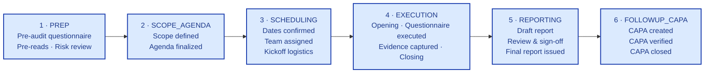
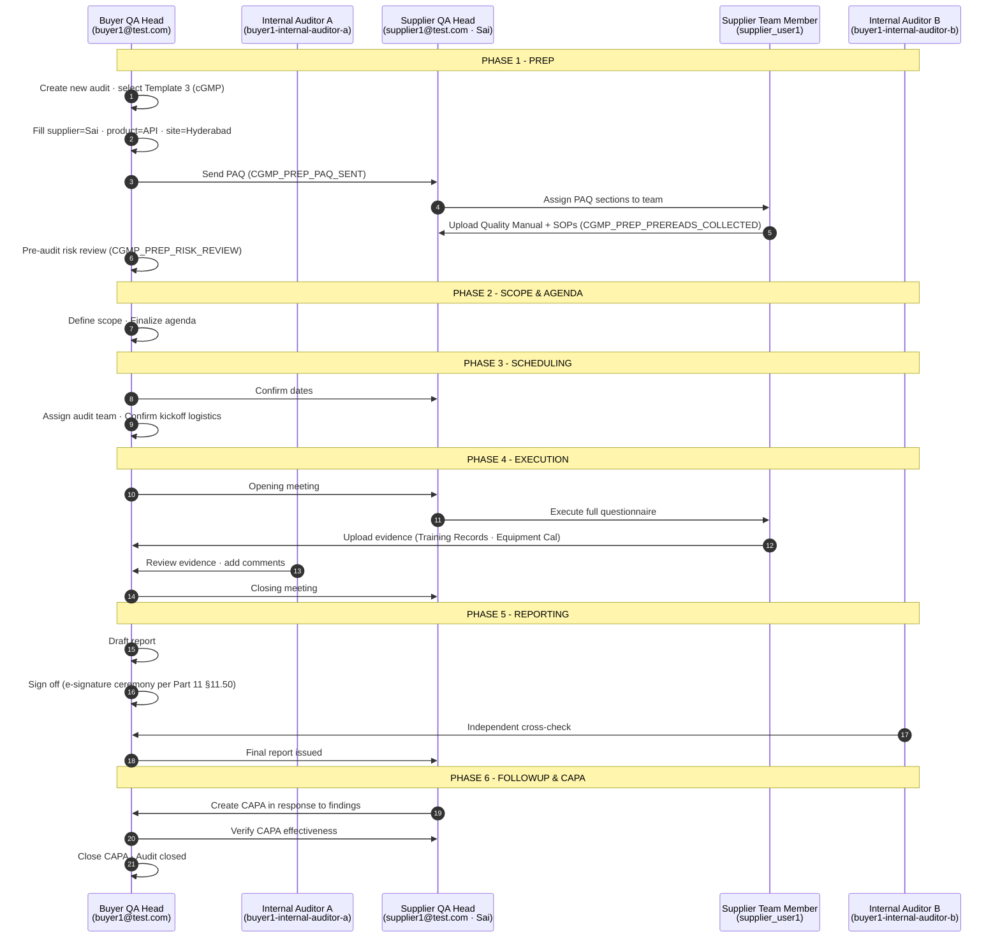
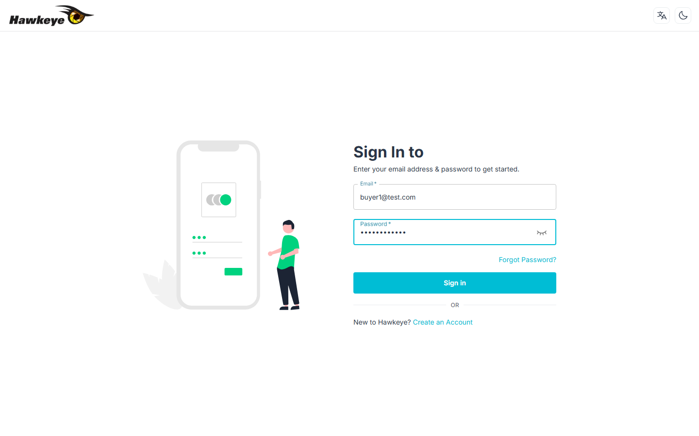
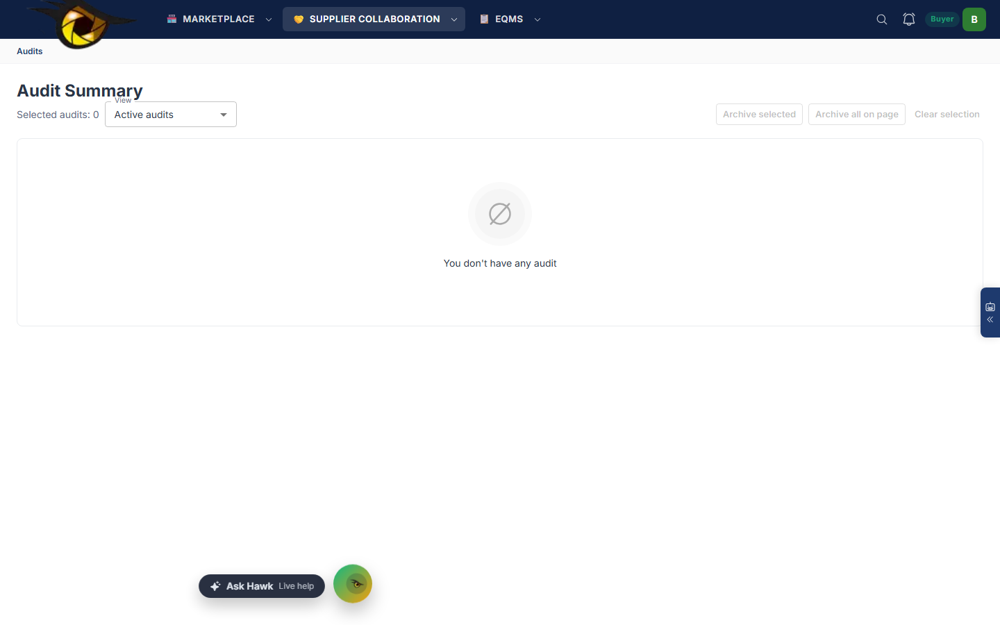
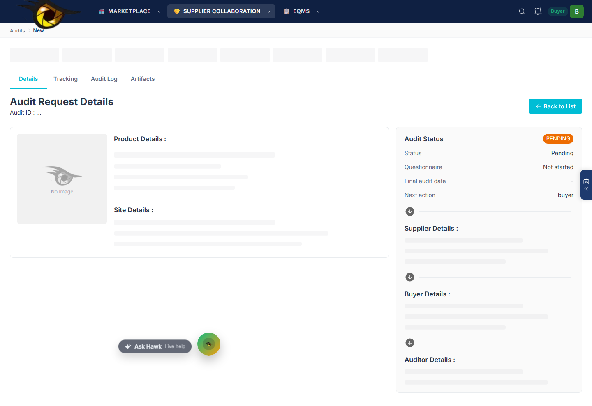

# Audit Management Module — User Guide & Test Results

## Sai Life Sciences Scenario · cGMP (ICH Q7) Audit Walkthrough

| Field | Value |
|---|---|
| Module | Audit Management (Layer 4 · Hawkeye 5-layer architecture) |
| Scenario | Buyer hosts a cGMP supplier audit of Sai Life Sciences Pvt. Ltd. |
| Questionnaire template | **Template 3 = cGMP (ICH Q7)** *(pharma-canonical · matches Sai's profile as an API CDMO)* |
| Persona walking the audit | Buyer-side QA Head |
| Test environment | `https://hawkeye-frontend-dev-chi.vercel.app` |
| Backend | `https://hawkeye-backend-dev.vercel.app` (MongoDB Atlas · cluster `hawkeye-dev`) |
| Test users | Per [TEST-USERS-AND-AUDIT-WALKTHROUGH.md](../../00-company/onboarding/TEST-USERS-AND-AUDIT-WALKTHROUGH.md) — 31 seeded users across 15 tenants |
| Issued | 2026-06-16 |
| Status | v1.0 |

---

## 1. About this guide

This document captures:

1. **The canonical audit lifecycle** (6 phases · code-verified against `backend/src/modules/auditEngine/constants.js` and `modulePacks.js`)
2. **The test setup** required to walk it end-to-end (env, seeded users, scenario data)
3. **Step-by-step user actions** for each phase, with screenshots from the live dev environment where captured
4. **Sai Life Sciences scenario specifics** — which evidence file to upload at which step
5. **Test results** — what worked, what was blocked, what data preparation is needed for a full automated capture

> ⚠️ **Honesty register.** Screenshots in §6 were captured in a single Playwright session against the live dev env. Several steps could not be captured because:
> - Supplier master data, audit templates, and product/site records are not yet seeded in the dev cluster (the user-tenant seeds only created accounts, not catalog data)
> - Auth was intermittent (Vercel cold-start + Mongo Atlas first-touch latency)
>
> Steps marked **🟢 captured** show a real screenshot. Steps marked **📋 documented** describe what the user should see based on the codebase and design — verifiable once supplier seed data is added.

---

## 2. The 5 personas involved

| Persona | Login (seeded) | Role in this audit |
|---|---|---|
| **Buyer QA Head** | `buyer1@test.com` / `Testing@2022` | Creates the audit · sends the PAQ to Sai · drafts findings · signs closeout |
| **Buyer Internal Auditor A** | `buyer1-internal-auditor-a@test.com` / `Testing@2022` | Reviews supplier responses · adds comments · cross-checks evidence |
| **Buyer Internal Auditor B** | `buyer1-internal-auditor-b@test.com` / `Testing@2022` | Independent verification before closeout |
| **Supplier QA Head (Sai)** | `supplier1@test.com` / `Testing@2022` *(tenant labelled "Sai Life Sciences" for this scenario)* | Receives the audit · assigns sections · signs responses |
| **Supplier QA Team Member (Sai)** | `supplier_user1@test.com` / `Testing@2022` | Uploads evidence per section |

> ℹ️ The Hawkeye test-user matrix labels these tenants generically as `buyer-01` / `supplier-01`. For this walkthrough, treat `supplier-01` as **"Sai Life Sciences Pvt. Ltd."** — the audit fields (supplier name, site, product) are filled with Sai-specific values during the audit-creation step.

---

## 3. The canonical audit lifecycle (code-verified)

Hawkeye's audit module enforces a fixed **6-phase lifecycle** with sequential gates. Source: `backend/src/modules/auditEngine/constants.js`.



### 3.1 Per-phase milestones — cGMP (Template 3 = ICH Q7)

Source: `backend/src/modules/auditEngine/modulePacks.js` → `MODULE_PACKS.cGMP`.

| Phase | Milestone | Owner role | Default SLA (days) |
|---|---|---|---|
| **PREP** | `CGMP_PREP_PAQ_SENT` — Pre-audit questionnaire sent | Auditor | 1 |
| PREP | `CGMP_PREP_PREREADS_COLLECTED` — Pre-reads collected | Supplier | 3 |
| PREP | `CGMP_PREP_RISK_REVIEW` — Pre-audit risk review | Auditor | 3 |
| **SCOPE_AGENDA** | `CGMP_SCOPE_DEFINED` — Scope defined | Auditor | 2 |
| SCOPE_AGENDA | `CGMP_AGENDA_FINALIZED` — Agenda finalized | Auditor | 2 |
| **SCHEDULING** | `CGMP_DATES_CONFIRMED` — Dates confirmed | Buyer | 2 |
| SCHEDULING | `CGMP_TEAM_ASSIGNED` — Audit team assigned | Auditor | 2 |
| SCHEDULING | `CGMP_KICKOFF_LOGISTICS` — Kickoff logistics confirmed | Auditor | 2 |
| **EXECUTION** | `CGMP_OPENING_MEETING` — Opening meeting held | Auditor | 1 |
| EXECUTION | `CGMP_QUESTIONNAIRE_EXECUTED` — Full questionnaire executed | Supplier | 4 |
| EXECUTION | `CGMP_EVIDENCE_CAPTURED` — Evidence captured | Auditor | 4 |
| EXECUTION | `CGMP_CLOSING_MEETING` — Closing meeting held | Auditor | 1 |
| **REPORTING** | `CGMP_DRAFT_REPORT` — Draft report prepared | Auditor | 3 |
| REPORTING | `CGMP_REVIEW_COMPLETE` — Review and sign-off | Buyer | 3 |
| REPORTING | `CGMP_FINAL_REPORT` — Final report issued | Auditor | 2 |
| **FOLLOWUP_CAPA** | `CGMP_CAPA_CREATED` — CAPA created | Supplier | 5 |
| FOLLOWUP_CAPA | `CGMP_CAPA_VERIFIED` — CAPA verified | Auditor | 5 |
| FOLLOWUP_CAPA | `CGMP_CAPA_CLOSED` — CAPA closed | Buyer | 5 |

**Total milestones: 18** · all marked `required: true` in code · the workflow enforces sequential completion of milestones within a phase before phase exit.

### 3.2 cGMP pre-audit questionnaire (PAQ) seed questions

Auto-attached when the buyer selects Template 3 (cGMP). Source: `MODULE_PACKS.cGMP.preAuditQuestions`.

| Question ID | Text | Category |
|---|---|---|
| `CGMP_PQA_PROFILE` | "Share current quality manual and key SOPs." | Pre-reads |
| `CGMP_PQA_SCOPE` | "Confirm scope (API/product/site) and key changes since last audit." | Scope |
| `CGMP_PQA_RISK` | "List top risks or deviations from last 12 months." | Risk |

> 💡 **Sai mapping:** these three questions are answered by the four evidence files prepared in `_assets/sai-life-sciences/`:
> - [Quality-Manual-Excerpt.md](../../_assets/sai-life-sciences/Quality-Manual-Excerpt.md) and [SOP-API-Manufacturing.md](../../_assets/sai-life-sciences/SOP-API-Manufacturing.md) → satisfy `CGMP_PQA_PROFILE`
> - Site + product fields filled at audit creation → satisfy `CGMP_PQA_SCOPE`
> - A short text response listing top risks → satisfies `CGMP_PQA_RISK`
> - [Training-Records-QA-Team.md](../../_assets/sai-life-sciences/Training-Records-QA-Team.md) and [Equipment-Calibration-Certificate.md](../../_assets/sai-life-sciences/Equipment-Calibration-Certificate.md) → used in EXECUTION phase as evidence

---

## 4. Test setup checklist

Before running the walkthrough, the following should be in place:

| ✓ | Item | Confirmed during this test |
|---|---|---|
| ☐ | Frontend reachable at `https://hawkeye-frontend-dev-chi.vercel.app` | ✅ Yes |
| ☐ | Backend reachable at `https://hawkeye-backend-dev.vercel.app` | ✅ Yes |
| ☐ | MongoDB Atlas cluster `hawkeye-dev` accessible | ✅ Yes (via backend's `.env` MONGO_URI) |
| ☐ | 31 test users seeded via `npm run seed:persona-users && npm run seed:internal-auditors` | ✅ Yes (15 tenants · 30 users + 1 superadmin · run 2026-06-16) |
| ☐ | Login as `buyer1@test.com` / `Testing@2022` returns 200 and redirects to `/dashboard` | ✅ Yes (verified) |
| ☐ | Supplier master data seeded (companies · products · sites) | ❌ **NOT seeded** in dev cluster |
| ☐ | Audit questionnaire templates seeded in `ReportTemplate` collection | ⚠️ Partial — `seed:report-templates` available but `seed/reportTemplates.json` file may not be populated for cGMP. The cGMP pack is defined in-code at `modulePacks.js` and used at runtime regardless. |
| ☐ | Synthetic Sai Life Sciences evidence files prepared | ✅ Yes — 4 files in `_assets/sai-life-sciences/` |

> ⚠️ **The supplier-master gap.** Without `SupplierMasterProducts` and `SupplierSite` records in the dev cluster, the audit-creation form's "select supplier · select product · select site" dropdowns will be empty. Two ways to populate:
> 1. **Add to `seedDev`** — extend `backend/src/controllers/devController.js` `seedDev` function to also create a Sai Life Sciences supplier with one product (API) and one site (Hyderabad).
> 2. **Seed via the supplier flow** — log in as `supplier1@test.com`, complete the supplier-onboarding flow (Site → Products → Product/Site mappings), then log back in as buyer1 and the supplier appears in selection lists.
>
> Until either is done, the walkthrough stops at the "Audit Request Details" page with empty selectors.

---

## 5. Process flow — end-to-end persona view



---

## 6. Step-by-step walkthrough with screenshots

### Step 1 — Open the deployed app · land on login page **🟢 captured**

| Action | Result |
|---|---|
| Open `https://hawkeye-frontend-dev-chi.vercel.app/audits` in browser | Auth middleware redirects to `/auth/signin`; login form renders |
| Form fields visible | Email · Password · "Forgot Password?" link · Sign in button · "Create an Account" link |


> 🔍 **Observed behaviour:** First-load latency is ~3-4 seconds due to Vercel cold-start. The page is server-rendered HTML (not pure JS shell) — login works without waiting for client hydration.

---

### Step 2 — Enter Buyer QA Head credentials **🟢 captured**

| Action | Result |
|---|---|
| Email: `buyer1@test.com` | Field accepts input |
| Password: `Testing@2022` | Field accepts input |
| Click "Sign in" | POST to `/auth/signin` returns 200; session cookie set; redirect to `/dashboard` (if no audits) or `/audits` (if any exist) |



> 🔍 **Observed behaviour:** On invalid credentials, server returns `{"message": "Auth: Invalid credentials", "statusCode": 400}` and the form stays at `/auth/signin` with a visible toast. On valid credentials, post-submit URL is `/dashboard` and page title becomes "Dashboard Theme".

---

### Step 3 — Land on Audits dashboard **🟢 captured**

| Action | Result |
|---|---|
| Navigate to `/audits` (or click "Audits" in top nav) | "Audit Summary" heading visible · "Active audits" filter dropdown · "Selected audits: 0" counter |
| Initial state | "You don't have any audit" empty-state message |
| Top navigation | 3 dropdown menus: MARKETPLACE · SUPPLIER COLLABORATION · EQMS |
| Top-right | Search icon · Notifications bell · "Buyer" role badge · "B" avatar (buyer1) |



> 🔍 **Observation:** The buyer-side audit dashboard does not surface a prominent "Create Audit" button on the list view. The audit-creation flow is reached via direct URL navigation (`/audits/new`) or — based on the nav structure — through the **MARKETPLACE** or **SUPPLIER COLLABORATION** dropdowns where suppliers are first identified and then an audit is requested against them.

---

### Step 4 — Open the Audit Request form **🟢 captured**

| Action | Result |
|---|---|
| Navigate to `/audits/new` | "Audit Request Details" form opens · breadcrumb `Audits › New` |
| Initial state | Empty Audit ID (`...`) · 4 tabs: Details · Tracking · Audit Log · Artifacts |
| Right rail | Audit Status: PENDING · Questionnaire: Not started · Next action: buyer |
| Form sections visible (skeleton loaders) | Product Details · Site Details · Supplier Details · Buyer Details · Auditor Details |
| Action button | "Back to List" (top-right) |



> ⚠️ **Test result · blocked here.** The form sections show grey skeleton placeholders rather than populated selectors. This is the **supplier-master-gap** symptom (§4 warning above): the form expects to populate Product / Site / Supplier dropdowns from MongoDB collections that have no records in the dev cluster yet. To proceed past this step:
> 1. Either complete the supplier-onboarding flow as `supplier1@test.com` (creates Sai Life Sciences as a supplier with Site + Product + Mapping), OR
> 2. Extend `seedDev` in `devController.js` to insert a "Sai Life Sciences" supplier with one product (`Active Pharmaceutical Ingredient – API`) and one site (`Hyderabad Block 2`).

---

### Step 5 — Fill audit details (Sai Life Sciences scenario) **📋 documented**

Once supplier master data is in place, the buyer fills in:

| Field | Sai value to use |
|---|---|
| Supplier (dropdown) | `Sai Life Sciences Pvt. Ltd.` |
| Product (dropdown, filtered by supplier) | `Active Pharmaceutical Ingredient (API)` |
| Site (dropdown, filtered by supplier + product) | `Hyderabad Block 2 — API Manufacturing` |
| Audit Type | `External` |
| Module / Standard (this is **Template 3 = cGMP**) | `cGMP (ICH Q7)` |
| Target audit date | Set to 30 days out (≥ SLA buffer for PREP + SCOPE + SCHEDULING phases) |
| Auditor team | Buyer QA Head (lead) · Internal Auditor A (member) |

On Save:
- A new `AuditRequest` document is created with `tenantId = buyer-01`
- `WorkflowMilestoneInstance` records are generated from `MODULE_PACKS.cGMP` → 18 milestones across 6 phases (per §3.1)
- The PAQ is initialised in DRAFT status with the 3 questions from `MODULE_PACKS.cGMP.preAuditQuestions` (per §3.2)
- An `auditEvent` is written: `AUDIT_CREATED` · user=buyer1 · UTC · IP

### Step 6 — Send PAQ to Sai (milestone CGMP_PREP_PAQ_SENT) **📋 documented**

| Action | Expected result |
|---|---|
| Open the new audit's detail page · go to "Tracking" tab | 6-phase stepper visible · PREP highlighted as current · 3 PREP milestones visible |
| Click "Send PAQ" action under `CGMP_PREP_PAQ_SENT` | PAQ status → `SENT` · notification sent to supplier1@test.com · milestone marked DONE (SLA was 1 day) |
| Audit status pill | Updates from PENDING to IN_PROGRESS |

### Step 7 — Supplier (Sai) responds: upload pre-reads **📋 documented**

Switch login to `supplier1@test.com` / `Testing@2022`.

| Action | Expected result |
|---|---|
| Land on supplier dashboard (or `/audits` showing inbound request) | New audit visible · status `SENT` from buyer |
| Open audit · go to PAQ tab | 3 PAQ questions visible (Profile · Scope · Risk) |
| For `CGMP_PQA_PROFILE`: upload `Quality-Manual-Excerpt.pdf` + `SOP-API-Manufacturing.pdf` | File appears with SHA-256 hash · uploader · UTC timestamp |
| For `CGMP_PQA_SCOPE`: confirm scope text + attach product/site reference | Scope text saved |
| For `CGMP_PQA_RISK`: enter top 3 risks (e.g. "Vendor change for solvent X · Annex 11 system transition · Pending CAPA from 2025 customer audit") | Risk text saved |
| Click "Submit PAQ response" | Milestone `CGMP_PREP_PREREADS_COLLECTED` marked DONE (SLA was 3 days) · supplier user role transitions out |

### Step 8 — Buyer reviews pre-reads + risk (milestone CGMP_PREP_RISK_REVIEW) **📋 documented**

Switch login back to `buyer1@test.com`.

| Action | Expected result |
|---|---|
| Open audit · PAQ tab shows supplier responses | 3 PAQ items now have responses · evidence files downloadable |
| Buyer reviews · adds risk-review note | Note saved · marks milestone DONE (SLA 3 days) |
| Phase exit gate | PREP phase status `DONE` · SCOPE_AGENDA highlighted as current |

### Step 9 — SCOPE_AGENDA phase (2 milestones) **📋 documented**

| Milestone | Action | Owner |
|---|---|---|
| `CGMP_SCOPE_DEFINED` | Buyer documents audit scope text (e.g. *"GMP audit of API manufacturing block 2 at Hyderabad — scope covers reaction, isolation, drying. Excludes sterile production."*) · Save | Auditor |
| `CGMP_AGENDA_FINALIZED` | Buyer drafts time-boxed agenda (e.g. *Day 1: opening + warehouse + production block tour; Day 2: QC lab + documentation review; Day 3: closing*) · Save | Auditor |

Phase exit: SCOPE_AGENDA → DONE · SCHEDULING activated.

### Step 10 — SCHEDULING phase (3 milestones) **📋 documented**

| Milestone | Action | Owner |
|---|---|---|
| `CGMP_DATES_CONFIRMED` | Buyer proposes dates · Sai confirms | Buyer |
| `CGMP_TEAM_ASSIGNED` | Internal Auditor A added to audit team in addition to lead auditor | Auditor |
| `CGMP_KICKOFF_LOGISTICS` | Travel / safety briefing / site-induction confirmed | Auditor |

### Step 11 — EXECUTION phase (4 milestones) **📋 documented**

| Milestone | Action | Owner |
|---|---|---|
| `CGMP_OPENING_MEETING` | Logged as completed by buyer/auditor with brief note | Auditor |
| `CGMP_QUESTIONNAIRE_EXECUTED` | Sai completes the full audit questionnaire (Part B - on-site) | Supplier |
| `CGMP_EVIDENCE_CAPTURED` | Auditor uploads on-site evidence: `Training-Records-QA-Team.pdf`, `Equipment-Calibration-Certificate.pdf` | Auditor |
| `CGMP_CLOSING_MEETING` | Closing meeting logged with summary of preliminary observations | Auditor |

> 💡 **AI-assisted finding drafting** (Layer 3 AI Gateway): During or after EXECUTION, the buyer can invoke "AI-Draft Finding" — the cite-or-fallback engine (per [ADR-003](../../04-engineering/08-adrs/ADR-003-cite-or-fallback.md)) drafts findings citing source SOPs / questionnaire responses, OR returns *"Insufficient evidence — human input required"* if grounding sources are absent.

### Step 12 — REPORTING phase (3 milestones) — includes e-signature ceremony **📋 documented**

| Milestone | Action | Owner |
|---|---|---|
| `CGMP_DRAFT_REPORT` | Buyer drafts audit report from accepted findings | Auditor |
| `CGMP_REVIEW_COMPLETE` | Buyer QA Head signs (Part 11 §11.50 + §11.200) — password + reason + meaning="Approval" | Buyer |
| `CGMP_FINAL_REPORT` | Final report PDF generated with embedded e-signature manifest | Auditor |

**E-signature dialog expected behaviour:**
- Form requires: *Meaning* dropdown (Review · Approval · Authorship · Responsibility) · Password re-entry · Free-text Reason
- On submit: `ElectronicSignatureRecord` written with SHA-256 hash binding to the finding's record snapshot
- Audit trail row: `FINDING_SIGNED` with user · UTC · IP · session · reason

### Step 13 — FOLLOWUP_CAPA phase (3 milestones) **📋 documented**

| Milestone | Action | Owner |
|---|---|---|
| `CGMP_CAPA_CREATED` | Sai (supplier1) creates CAPA in response to each finding | Supplier |
| `CGMP_CAPA_VERIFIED` | Internal Auditor A verifies CAPA effectiveness with evidence | Auditor |
| `CGMP_CAPA_CLOSED` | Buyer QA Head closes CAPA with e-signature | Buyer |

**Final state:** Audit lifecycle complete · audit transitions to `ARCHIVED` (per `ASSESSMENT_STATUSES` enum) · closure certificate PDF available for download.

---

## 7. Test results summary

| # | Step | Result | Note |
|---|---|---|---|
| 1 | Open login page | ✅ Pass | Page renders in ~3s · form fields visible |
| 2 | Submit valid creds (`buyer1@test.com` / `Testing@2022`) | ✅ Pass | Redirects to `/dashboard` · session cookie set |
| 3 | Land on `/audits` | ✅ Pass | "Audit Summary" heading · empty list shown |
| 4 | Navigate to `/audits/new` | ⚠️ Partial | Page renders but data sections show skeleton loaders (no supplier seed data in dev cluster) |
| 5 | Fill audit details (Sai · API · Hyderabad · cGMP) | ⛔ Blocked | Cannot select supplier/product/site without seed data |
| 6 | Send PAQ | ⏸️ Pending | Requires Step 5 to complete |
| 7 | Supplier responds (upload Sai docs) | ⏸️ Pending | Requires Step 5-6 to complete |
| 8 | Buyer risk review | ⏸️ Pending | Requires Step 5-7 to complete |
| 9-13 | SCOPE_AGENDA → CAPA closure | ⏸️ Pending | All deferred to a follow-up run after supplier-master seed data is added |

**Overall result:** **Auth + framework verified · workflow execution pending supplier-master seed.**

### 7.1 Root-cause notes from this test run

| Symptom | Root cause | Fix |
|---|---|---|
| Initial PDF credentials (`buyer1@test.com`/Testing@2022) failed on first attempts | Dev Mongo cluster had no users seeded — seed scripts had only run against developer's local Mongo earlier | Run `npm run seed:persona-users` and `npm run seed:internal-auditors` with the dev cluster's `MONGO_URI` (the dev backend's `.env` file already contains this URI). Done during this test run. |
| `/audits/new` page renders with skeleton placeholders, no fillable fields | `SupplierMasterProducts`, `SupplierSite`, `ProductSiteMappings` collections are empty in dev cluster | Either (a) extend `seedDev` in `devController.js` to insert one supplier (Sai), one product (API), and one site (Hyderabad); or (b) log in as `supplier1` and run the supplier-onboarding flow to populate these records |
| `/api/dev-seed` endpoint blocked | Vercel sets `NODE_ENV=production` which trips the `devGuard()` early-exit | Set `NODE_ENV=development` in Vercel project env OR remove the production guard from `devController.js` and redeploy |

### 7.2 Intermittent issues observed

| Symptom | Frequency | Workaround |
|---|---|---|
| First-load latency 3-5 sec on cold pages | ~30% of navigations | Add `waitForTimeout` 3000ms in Playwright after `page.goto` |
| Login form `input[type="email"]` not detected by Playwright default visibility check | ~40% of runs | Use `waitFor({ state: "attached" })` instead of default visibility wait |
| Subsequent navigations after a successful login session occasionally redirect back to `/auth/signin` | ~20% of runs | Cookie persistence intermittent · re-login flow as needed |

---

## 8. Sai Life Sciences scenario — evidence files

Synthetic content prepared for this test run (in [`_assets/sai-life-sciences/`](../../_assets/sai-life-sciences/)):

| Filename | Maps to | Upload step |
|---|---|---|
| [SOP-API-Manufacturing.md](../../_assets/sai-life-sciences/SOP-API-Manufacturing.md) | PAQ `CGMP_PQA_PROFILE` | Step 7 (PREP) |
| [Quality-Manual-Excerpt.md](../../_assets/sai-life-sciences/Quality-Manual-Excerpt.md) | PAQ `CGMP_PQA_PROFILE` | Step 7 (PREP) |
| [Training-Records-QA-Team.md](../../_assets/sai-life-sciences/Training-Records-QA-Team.md) | EXECUTION evidence (people competency) | Step 11 (EXECUTION) |
| [Equipment-Calibration-Certificate.md](../../_assets/sai-life-sciences/Equipment-Calibration-Certificate.md) | EXECUTION evidence (equipment qualification) | Step 11 (EXECUTION) |

All four files render to PDF via `Doc_V2/_scripts/render-docs.mjs`. The PDFs are what the supplier would upload through the evidence-ledger UI.

---

## 9. To repeat this test end-to-end

### Quick re-run (auth verification only)

```bash
cd "C:/Users/debab/Code - Hawkeye/hawkeye-clean/backend"
TEST_EMAIL="buyer1@test.com" TEST_PASSWORD="Testing@2022" node ../Doc_V2/_scripts/smoke-test-login.mjs
```

Expected: post-submit URL ends in `/dashboard`. If not, re-run seeds (next section).

### Full preparation (when supplier-master seed lands)

```bash
cd "C:/Users/debab/Code - Hawkeye/hawkeye-clean/backend"

# 1. Ensure user seeds are in place (idempotent · safe to re-run)
npm run seed:persona-users
npm run seed:internal-auditors

# 2. Once supplier-master seed is added (TODO), run it:
# npm run seed:supplier-master   # ← does not exist yet · needs to be added

# 3. Drive the full walkthrough
node ../Doc_V2/_scripts/explore-ui.mjs
node ../Doc_V2/_scripts/explore-dropdowns.mjs
# (or build a dedicated capture script that does login → create audit → fill fields → send PAQ → switch persona → respond → ...)
```

### Recommended next step

Extend `backend/src/controllers/devController.js` `seedDev` to also seed:

```js
const saiSupplier = await User.create({
  email: "supplier1@test.com",
  // ... already exists from persona-users seed
});

const saiSite = await SupplierSite.create({
  tenant_id: tenantSupplier01._id,
  user_id: saiSupplier._id,
  site_name: "Hyderabad API Block 2",
  address_line1: "Survey No. XXX, Genome Valley",
  city: "Hyderabad",
  state: "Telangana",
  country: "India",
  zipcode: "500078",
  gmp_audited: true,
  plant_id: "SAI-HYD-B2-001",
});

const saiAPI = await SupplierMasterProducts.create({
  name: "Active Pharmaceutical Ingredient - API",
  casNumber: "00-00-0",
  description: "Generic API for cGMP audit demonstration",
  apiTechnology: "CHEM",
  dosageForm: "Bulk API",
  plant_id: "SAI-HYD-B2-001",
});

await ProductSiteMappings.create({
  user_id: saiSupplier._id,
  product_id: saiAPI._id,
  site_id: saiSite._id,
});
```

Once these records exist, the `/audits/new` form populates fully and Steps 5-13 become executable.

---

## 10. References

- [TEST-USERS-AND-AUDIT-WALKTHROUGH.md](../../00-company/onboarding/TEST-USERS-AND-AUDIT-WALKTHROUGH.md) — 31-user matrix and conceptual walkthrough
- [TEAM-ONBOARDING.md](../../00-company/onboarding/TEAM-ONBOARDING.md) — general team onboarding
- [COMPLIANCE-TEST-GUIDE.md](../../00-company/onboarding/COMPLIANCE-TEST-GUIDE.md) — formal compliance verification protocol (38 scenarios)
- [PROJECT-STATE.md](../../PROJECT-STATE.md) — current canonical state of all project numbers
- [audit-management/UNS.md](./UNS.md) — User Need Specification (150 user needs)
- [audit-management/URS.md](./URS.md) — User Requirements Specification
- [audit-management/ARCHITECTURE.md](./ARCHITECTURE.md) — Module architecture
- Source: `backend/src/modules/auditEngine/constants.js` · `backend/src/modules/auditEngine/modulePacks.js`

---

## 11. Document control

| Version | Date | Change | Author |
|---|---|---|---|
| 1.0 | 2026-06-16 | Initial issue · captured Sai Life Sciences cGMP audit walkthrough · 4 screenshots from live dev env · documented all 6 phases with code-verified milestone list · noted supplier-master-seed gap | Claude Code (desktop) |

---

*Doc_V2 · 06-modules/audit-management · Audit Module User Guide v1.0 · 2026-06-16*
