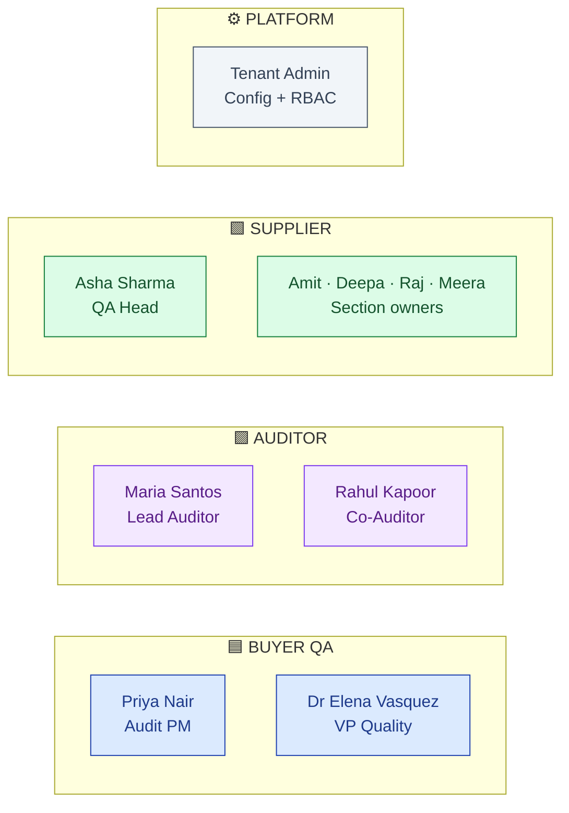
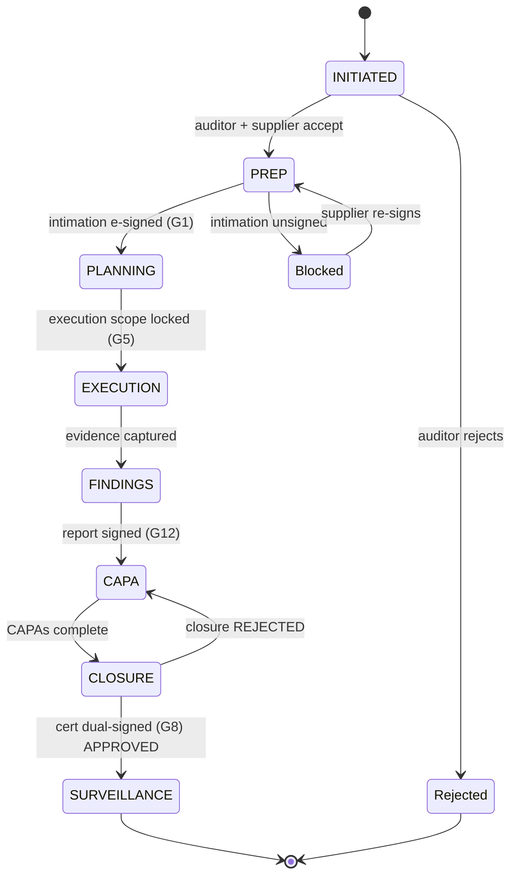

# DESIGN — Audit Management

| Field | Value |
|---|---|
| Module | Audit Management |
| Depth | Executive overview (with pointers to code for detail) |
| Pairs with | [URS.md](URS.md) (requirements), [ARCHITECTURE.md](ARCHITECTURE.md) (technical) |
| Last updated | 2026-05-31 |

---

## 1. Personas (5 primary, 2 secondary)

Cross-reference [URS §2](URS.md#2-stakeholders-and-personas). The lifecycle is **5-lane** in the canonical swim-lane (see `00-strategy-and-pitch/operational-specs/10-audit-flow-swim-lane.md` for the visual).



| # | Persona | Lane color | Primary actions | Decisions |
|---|---|---|---|---|
| 1 | **Buyer / Audit Program Manager** (Priya, Karan) | 🟦 BUYER QA | Create audit, assign auditor, track progress, approve closure | Auditor choice, schedule approval, closure outcome |
| 2 | **VP Quality / Audit Chair** (Elena) | 🟦 BUYER QA | Final closure signature, programme oversight | Closure approval, programme escalations |
| 3 | **Lead Auditor** (Maria) | 🟪 AUDITOR | Plan, execute, draft findings/observations, sign report + closure cert | Scope curation, severity, CAPA recommendation |
| 4 | **Co-Auditor** (Rahul) | 🟪 AUDITOR | Add notes, witness (view + comment only) | None (advisory) |
| 5 | **Supplier QA Head** (Asha) | 🟩 SUPPLIER | Accept intimation (e-sig), assign sections, submit PAQ, respond to CAPA | Acceptance, section ownership |
| 6 | **Supplier Operations** (Amit, Deepa, Raj, Meera) | 🟩 SUPPLIER | Fill assigned sections, upload evidence | Per-section domain answers |
| 7 | **Tenant Admin** | (platform) | Configure audit types, templates, e-sig policy, RBAC | Per-tenant config |

---

## 2. End-to-End Journey (8 phases, 5 personas)

```mermaid
flowchart LR
    classDef buyer fill:#dbeafe,stroke:#1e40af,color:#1e3a8a
    classDef supplier fill:#dcfce7,stroke:#15803d,color:#14532d
    classDef auditor fill:#f3e8ff,stroke:#7c3aed,color:#581c87

    INITIATED["1. INITIATED<br/><i>Buyer</i>"]:::buyer
    PREP["2. PREP<br/><i>Supplier</i>"]:::supplier
    PLANNING["3. PLANNING<br/><i>Auditor</i>"]:::auditor
    EXECUTION["4. EXECUTION<br/><i>Auditor</i>"]:::auditor
    FINDINGS["5. FINDINGS<br/><i>Auditor</i>"]:::auditor
    CAPA["6. CAPA<br/><i>Supplier</i>"]:::supplier
    CLOSURE["7. CLOSURE<br/><i>Buyer</i>"]:::buyer
    SURVEILLANCE["8. SURVEILLANCE<br/><i>Auditor</i>"]:::auditor

    INITIATED -->|auditor + supplier accept| PREP
    PREP -->|intimation e-signed G1| PLANNING
    PLANNING -->|scope locked G5| EXECUTION
    EXECUTION -->|evidence captured| FINDINGS
    FINDINGS -->|report signed G12| CAPA
    CAPA -->|CAPAs approved| CLOSURE
    CLOSURE -->|cert dual-signed G8| SURVEILLANCE
```



Each phase has a single **owner role** + handoff trigger. The 26-step expanded view lives in `00-strategy-and-pitch/operational-specs/10-audit-flow-swim-lane.md`.

### Journey snapshots per persona

#### 🟦 Buyer / Audit Program Manager (Priya)

```
1. List audits           → /audits                       AuditList
2. Create new audit      → /audits (action)              wizard.create_audit OR manual form
3. Assign auditor        → /audits/[id]                  AuditorSelector (qualified + available + COI-clean)
4. Track progress        → /audits/[id]/progress         AuditTrackProgress
5. Review draft report   → /audits/[id]/report           AuditReportGenerator (read-only for buyer)
6. Approve closure       → /audits/[id]/closure          SignatureDialog (password + reason)  [G8 e-sig gate]
```

#### 🟪 Lead Auditor (Maria)

```
1. Dashboard            → /auditor/dashboard            KPIs + work queue + AuditorCoachPanel
2. Open audit           → /audits/[id]                  AuditDetail hub
3. Curate execution scope → /audits/[id]/execution-builder    [G5 gate: lock scope before execution]
4. Conduct execution    → /audits/[id]/artifacts        SmartQuestion + evidence upload + AuditNote (text/photo/audio)
5. Draft observations   → /audits/[id]/artifacts        ObservationDrafterButton (AI draft → review → e-sign)  [G12 AI gate]
6. Assemble report      → /audits/[id]/report           AuditReportGenerator (HTML + integrity hash)
7. Sign report          → /audits/[id]/report           SignatureDialog (AUTHORED)
8. Author closure cert  → /audits/[id]/closure          SignatureDialog (AUTHORED)  [G8]
```

#### 🟩 Supplier QA Head (Asha)

```
1. Inbox                → /supplier/audits              SupplierWorkspaceList
2. Open intimation      → /supplier/audits/[id]         Accept/Reject + SignatureDialog  [G1 e-sig gate]
3. Assign sections      → /supplier/audits/[id]/assign-sections  Per-section owner picker
4. Track responses      → /supplier/audits/[id]         Section status board
5. Final review + send  → /audits/[id]/questionnaire    Submit PAQ → state: supplier_submitted
6. (Later) Respond CAPA → /supplier/capas               (handed to CAPA module)
```

#### 🟩 Supplier Operations (Amit, Deepa, etc.)

```
1. Notification         → email link
2. Open assigned section → /audits/[id]/questionnaire   SmartQuestion (filtered to assigned sections)
3. Fill + upload evidence → same                        Attachment + risk-category chips
4. Mark section complete → same                         Status: section_submitted
```

---

## 3. Screen + Component Inventory

Pages live under `frontend/app/(console)/` with route-based RBAC. Top-level groupings:

### Buyer/Auditor pages (`/audits/...`)
| Route | Purpose | Key components |
|---|---|---|
| `/audits` | List, filter, archive | `AuditList` (role-aware), `AuditRequestIdLabel` |
| `/audits/[id]` | Detail hub (default tab) | `AuditDetail`, `AuditPhaseStepper`, `AuditRequestTabs` |
| `/audits/[id]/questionnaire` | PAQ + responses | `AuditQuestionnaire`, `SmartQuestion`, evidence upload |
| `/audits/[id]/artifacts` | Phase artifacts (intimation, scope, findings) | `AuditQuestionnaireHub`, `AuditArtifactDetail`, `ArtifactPdfOverlayForm`, `ObservationDrafterButton` |
| `/audits/[id]/evidence-checklist` | Evidence readiness | `EvidenceChecklistTable` |
| `/audits/[id]/execution-builder` | G5: curate in-scope questions | scope tree, question toggling |
| `/audits/[id]/closure` | G8: closure certificate | Cert form + `SignatureDialog` |
| `/audits/[id]/progress` | Phase progress dashboard | `AuditTrackProgress` |
| `/audits/[id]/report` | Report draft + sign | `AuditReportGenerator`, CAPA draft components |
| `/audits/[id]/milestones` | Milestone board | `AuditMilestonesView` |
| `/audits/[id]/scheduling` | Calendar/scheduling | Phase calendar widget |
| `/audits/[id]/audit-log` | 21 CFR Part 11 audit trail | `AuditLogTable` |
| `/audits/[id]/template/[templateID]` | Template builder | Template edit UI |

### Auditor-only pages (`/auditor/...`)
| Route | Purpose | Key components |
|---|---|---|
| `/auditor/dashboard` | Personal queue, KPIs, coach | KPI cards, work queue, `AuditorCoachPanel` |
| `/auditor/audits` | (stub) | placeholder |
| `/auditor/reports` | Generated reports | report list/download |
| `/auditor/capas` | CAPA inbox | CAPA list |

### Supplier-only pages (`/supplier/audits/...`)
| Route | Purpose | Key components |
|---|---|---|
| `/supplier/audits` | Incoming audit inbox | `SupplierWorkspaceList`, decision UI |
| `/supplier/audits/[id]` | Audit detail (supplier view) | response forms, upload section |
| `/supplier/audits/[id]/assign-sections` | Section ownership | section-owner picker |

### Cross-cutting (used across audit pages)
- `AuditPhaseStepper` — visual 8-phase progress
- `AuditRequestTabs` — tab bar with phase-gated enablement
- `SignatureDialog` — Part 11 e-sig ceremony (reused across modules)
- `AuditorSelector` — dropdown with availability + COI filter
- `AuditorCoachPanel` — private auditor growth feedback
- `ObservationDrafterButton` — AI observation draft
- `AuditReportGenerator` — assemble final report
- `AuditClickTracker` — analytics

---

## 4. State Machine (Phase Lifecycle)



**Phase ownership** (who drives each state):

| State | Owner | What happens |
|---|---|---|
| INITIATED | Buyer | Buyer creates request, assigns auditor + supplier |
| PREP | Supplier | Signs intimation, submits docs |
| PLANNING | Auditor | Reviews PAQ, builds + locks execution scope |
| EXECUTION | Auditor | Onsite/remote audit + evidence capture |
| FINDINGS | Auditor | AI-assisted observation drafting + sign |
| CAPA | Supplier | Authors corrective actions |
| CLOSURE | Buyer | Approves closure certificate (dual e-sig) |
| SURVEILLANCE | Auditor | Periodic follow-up monitoring |

**Transition rules** (enforced in `auditPhaseService.canTransition()`):
- Forward-only by default
- Block triggers: auditorDecision=REJECTED (blocks PREP), supplierDecision=REJECTED (blocks PREP), intimation unsigned (blocks PREP), execution scope unlocked (blocks EXECUTION→FINDINGS)
- Revert allowed only by tenant_admin/superadmin with reasonForChange logged
- Every transition writes an AuditTrail row

### Decision gates within phases

| Gate | Phase | Trigger | Enforcer | Audit-trail entry |
|---|---|---|---|---|
| **G1** Intimation e-sig | PREP entry | Supplier signs intimation letter | `requireESignature` middleware + `intimationSignatureController` | `SIGNED` action, signatureMeaning=APPROVED |
| **G2** Auditor accept | INITIATED → PREP | Auditor accepts assignment | `auditRequestController` | `AUDITOR_ACCEPTED` |
| **G5** Scope lock | EXECUTION entry | Auditor calls `/execution/finalize` | `executionScopeController` | `SCOPE_LOCKED` |
| **G7** Remote cockpit | EXECUTION (during) | RemoteSession created | `remoteAuditController` | `REMOTE_SESSION_STARTED` (gap: full cockpit UI deferred) |
| **G8** Closure dual e-sig | CLOSURE | Auditor signs cert, then buyer signs | `auditClosureController` | `CERTIFIED` + `APPROVED` |
| **G12** Observation drafted | FINDINGS | Auditor accepts AI draft (or manual) and signs report | `observationDrafterController` + `reportController` | `OBSERVATION_DRAFTED` + `REPORT_SIGNED` |

---

## 5. Notifications and Reminders

Notifications are dispatched via `NotificationOrchestratorService`. Default events:

| Event | Recipients | Channel |
|---|---|---|
| Audit request created | Assigned auditor, supplier QA head | Email |
| Auditor accepts/rejects | Buyer (and co-auditor if assigned) | Email |
| Supplier accepts intimation (signed) | Buyer + assigned auditor | Email |
| PAQ released to supplier | Supplier QA head | Email |
| Supplier submits PAQ | Auditor | Email |
| Findings drafted | Buyer (for visibility) | Email |
| Closure approved | Supplier + auditor + buyer (cc) | Email |
| Overdue task | Owner persona | Email + dashboard banner (partial) |

SMS/push channels are wired in `NotificationOrchestratorService` but not enabled by default.

---

## 6. Error and Edge Cases

| Scenario | Handling |
|---|---|
| **No audit requests in list** | `AuditList` renders empty-state row: "No audit requests found" |
| **Supplier hasn't accepted intimation** | PREP phase blocked; UI shows "Awaiting supplier signature" pill |
| **Auditor rejects assignment** | Buyer notified; audit reverts to needs-auditor-reassignment; UI badge "Auditor rejected" |
| **Permission denied** | Backend returns 403 with diagnostic envelope (per cross-tenant guard); UI shows "Access denied — reason X" |
| **AI draft low confidence** | groundedGenerationService returns skeleton fallback with citations preserved; UI shows "Confidence too low — review manually" |
| **E-sig password wrong** | SignatureDialog stays open; field-level error "Password verification failed" |
| **Concurrent edit on questionnaire** | Optimistic-locking via `updatedAt` token; conflict surfaces as "Stale data — refresh and retry" |
| **Remote session disconnect mid-audit** | RemoteSession status → CANCELLED; auditor can re-create; recordings auto-saved to HawkVault if reached |
| **Closure cert REJECTED** | CAPA flow triggered; supplier qualification status held; surveillance phase still entered for follow-up |

---

## 7. Accessibility

- **Keyboard nav:** all forms tab-traversable; SmartQuestion supports keyboard-only entry incl. attachments via file-picker shortcut
- **Screen reader:** ARIA labels on phase stepper, status chips, action buttons; pending pass for SignatureDialog
- **Color contrast:** phase status colors (BLOCKED red / IN_PROGRESS amber / COMPLETED green) meet WCAG AA; verify on red/green for color-blind users
- **Focus management:** SignatureDialog traps focus; closes return focus to trigger button
- **Open gaps:** dynamic content updates (e.g., scope-builder live filter) need ARIA live-region polish

---

## 8. Open Design Questions

1. **Remote-audit cockpit UI (URS-B-001)** — what's the consolidated UX for video + screen-share + annotation + evidence-tagging in one pane? Currently RemoteSession stores a URL only.
2. **Co-auditor signature** — do regulators expect a WITNESSED signature from co-auditors? Today they only add notes.
3. **Mobile audit execution** — should auditors be able to capture evidence (photo/audio) from a mobile-optimized view during onsite walks? Currently desktop-first.
4. **Cross-tenant supplier intel (URS-B-006)** — what's the consent UI for "another buyer found X at this supplier — review?" Privacy boundary needs design.
5. **Auditor coach surfacing** — when does the coach panel appear (always present? on-demand?) and how aggressive is its feedback (gentle nudge vs hard block)?
6. **Dashboard density** — buyer dashboard currently shows audit list; should it show roll-up KPIs (open audits, overdue CAPAs, closure rate, mean-time-to-close)?
7. **Notification preferences** — per-user notification settings UI not yet shipped; today everything is email.
8. **Schedule conflict UI** — when assigning an auditor, how do we surface schedule conflicts (e.g., overlapping audits same week)? Today shows availability windows but not load.
