# Performance Audit — Audit Details Page

## `/audits/[id]` slowness investigation

| Field | Value |
|---|---|
| Reported by | Founder · 2026-06-17 |
| Symptom | Test mode extremely slow · audit details page takes very long to load |
| Reproduced | Yes — confirmed via live Playwright profile against `hawkeye-frontend-dev-chi.vercel.app` |
| Severity | **High** — page feels broken-slow on every navigation, not just cold start |
| Root cause | **Multiple compounding bugs** — see §2 |
| Estimated fix effort | ~3 hours total · 2 P0 changes + 3 P1 changes |
| Status | v1.0 (diagnosis complete, fixes proposed but NOT applied) |

---

## 1. Live profile results — what the network shows

Captured by `Doc_V2/_scripts/perf-audit-detail.mjs` against `https://hawkeye-frontend-dev-chi.vercel.app/audits/new` while logged in as `buyer1@test.com`. Run on 2026-06-17.

### 1.1 `/audits` (the list page) — comparison baseline

| Metric | Value |
|---|---|
| Wall-clock | **3.7 s** |
| TTFB | 250 ms |
| DOMContentLoaded | 1.3 s |
| API calls fired | 2 (notifications · table-variants) |
| Total payload | 48 KB |
| **Verdict** | Acceptable for a cold-warm transition · the only complaint is the 1.5 s `table-variants` call, fine for now |

### 1.2 `/audits/new` (the audit details page) — the broken one

| Metric | Value |
|---|---|
| Wall-clock | **4.2 s** (warm cache 4.3 s · NO improvement from caching) |
| API calls fired | 7 (5 unique endpoints) |
| **Failing calls** | **5 of 7** (~71%) |
| Time wasted on failing calls | **~9 seconds of HTTP work** running concurrently · longest single call 3.0 s |
| Total payload | 52 KB |
| **Verdict** | **Broken** — the page is performing failing fetches every time it loads |

### 1.3 Per-endpoint breakdown (from `/audits/new` warm run)

| # | Endpoint | Status | Calls | Worst time | Diagnosis |
|---|---|---|---|---|---|
| 1 | `GET /api/next/audit-requests/requestSingleAudit?request_id=new` | **404** | **3×** | **3024 ms** | Treats literal `"new"` as audit ID; 3 components mount the same fetcher independently (no shared state) |
| 2 | `GET /api/next/audits/new/tracking` | **500** | 1× | 1949 ms | Backend `findById("new")` throws Mongoose CastError → catch defaults to 500 instead of 400 |
| 3 | `GET /api/auditor/audits/new/report` | **404** | 1× | 1052 ms | Buyer is calling an **auditor-only** endpoint (wrong role · no role check in caller) |
| 4 | `GET /api/universal/module-config/active` | 200 | 1× | 1512 ms | Slow but works · changes very rarely → cacheable |
| 5 | `GET /api/next/notifications/unread-count` | 200 | 1× | 585 ms | OK |

---

## 2. Root causes — what the code shows

### 2.1 Bug #1 (CRITICAL) — there is no `/audits/new` page

The Next.js App-Router file tree has `/app/(console)/audits/[id]/page.tsx` but **no** `/app/(console)/audits/new/page.tsx`. So when the user navigates to `/audits/new` (the natural URL for "create a new audit"), Next.js matches it against the `[id]` dynamic route with `id = "new"`. The page renders the audit-detail UI for an audit whose ID is the string `"new"` — which obviously doesn't exist in Mongo.

```
frontend/app/(console)/audits/
├── [id]/
│   ├── layout.tsx          ← mounts AuditPhaseStepper, AuditRequestTabs, AuditClickTracker
│   ├── page.tsx            ← mounts <AuditDetail auditId={id} />
│   ├── artifacts/
│   ├── questionnaire/
│   ├── ...
├── milestones-management/
├── page.tsx                ← /audits list page
└── report/
                            ← ❌ NO new/ folder · NO request/ folder · NO create/ folder
```

The route shape works for any 24-char ObjectId, but the literal string `"new"` falls through into the detail page.

### 2.2 Bug #2 (HIGH) — three independent fetchers, same endpoint

When you load `/audits/[id]`, **the layout AND the page each mount components that fetch the SAME endpoint independently**:

```
/audits/[id]
├── [layout.tsx]
│   ├── <AuditPhaseStepper auditId={id} />     → GET /api/next/audits/:id/tracking
│   ├── <AuditRequestTabs auditId={id} />      → GET /api/next/audit-requests/requestSingleAudit (1st)
│   │                                            → GET /api/auditor/audits/:id/report
│   └── <AuditClickTracker auditId={id} />
└── [page.tsx]
    └── <AuditDetail auditId={id} />            → GET /api/next/audit-requests/requestSingleAudit (2nd · duplicate)
```

- `frontend/components/audits/AuditRequestTabs.tsx` line 71 calls `requestSingleAudit`
- `frontend/components/audits/detail.tsx` line 159 calls `requestSingleAudit` — **same endpoint, same params**

No shared state · no React Query · no SWR. **Result: at least 2 identical network requests** for the same data per page load. (The 3rd retry seen in the profile likely comes from a sibling like `AuditPhaseStepper` indirectly triggering another path, or RSC double-flight under streaming — but the **duplicate fetch is a confirmed code smell** regardless.)

### 2.3 Bug #3 (HIGH) — backend returns 500 on invalid ObjectId

`backend/src/controllers/trackingController.js` line 28-49:

```js
const loadAudit = async (req) => {
  const rawId = req.params.auditId;                  // = "new"
  const resolvedId = await resolveAuditRequestId({ requestId: rawId, ... });
  const audit = await AuditRequestMaster.findById(resolvedId || rawId);   // ← Mongoose throws CastError
  ...
};
```

When `rawId` is `"new"` (or any other non-ObjectId string), Mongoose's `findById` throws a `CastError` because `"new"` isn't a 24-char hex. The outer catch handler in `getAuditTracking` (line 364-367):

```js
} catch (error) {
  const status = error.status || 500;              // CastError has no .status → 500
  return res.status(status).json({ error: error.message || "Failed to load tracking" });
}
```

defaults to **500 Internal Server Error**. The correct response for "this is not a valid audit identifier" is **400 Bad Request** or **404 Not Found** — never 500.

### 2.4 Bug #4 (MEDIUM) — buyer hits auditor-only endpoint

`AuditRequestTabs.tsx` line 88 calls `getAuditReportApi(auditId)` for ALL roles, but the API path is `/api/auditor/audits/:id/report` — under the `/auditor/` namespace. When `buyer1@test.com` hits this, the backend returns 404 (route auth match fails or no audit). The 1-second round trip is wasted on every page load.

### 2.5 Bug #5 (MINOR) — module-config not cached

`GET /api/universal/module-config/active` returns 200 with 646 bytes and takes 1.5 seconds. This is the per-tenant module configuration that **changes once a month at most**. Fetching it on every page load is wasteful — should be:
- Cached in client memory after first fetch
- Refreshed via stale-while-revalidate (SWR · React Query)
- OR served with strong HTTP cache headers (`Cache-Control: max-age=300`)

---

## 3. Why the page "feels" so slow — wall-clock math

```mermaid
gantt
    title /audits/new load timeline (warm cache · 2026-06-17 profile)
    dateFormat X
    axisFormat %S s

    section UI render
    HTML received                :0, 100
    React hydration              :100, 600

    section Network fetches
    /universal/module-config     :100, 1500
    /notifications/unread-count  :100, 585
    /requestSingleAudit (1)      :100, 1019
    /requestSingleAudit (2)      :150, 1991
    /requestSingleAudit (3)      :200, 3024
    /audits/new/tracking         :150, 1949
    /auditor/audits/new/report   :150, 1052

    section User perception
    Skeleton loaders visible     :0, 3024
    "Still loading..." feeling   :600, 3024
```



- **What the user sees:** skeleton placeholders for 3+ seconds while the page hammers 5 broken endpoints
- **What the page is doing:** running 7 concurrent fetches, 5 of which will fail · no shared cache · waterfall of 404s
- **Why it never gets faster on revisit:** every page mount triggers fresh fetches (no SWR/Query · no module-config cache)

---

## 4. Recommended fixes — ranked by impact

### P0 · Fix the `/audits/new` route (eliminates ~9 seconds of bad fetches)

**Two options · pick one:**

**Option A — Create a dedicated `/audits/new/page.tsx`** *(recommended · cleanest)*

Create `frontend/app/(console)/audits/new/page.tsx` with the actual "Create Audit" form. This page does NOT use the `[id]` route, so none of the layout's auto-fetchers fire.

```tsx
// frontend/app/(console)/audits/new/page.tsx
import CreateAuditForm from '@/components/audits/CreateAuditForm';
import PageTitle from '@/components/shared/PageTitle';

export default function NewAuditPage() {
  return (
    <>
      <PageTitle heading="New Audit Request" />
      <CreateAuditForm />
    </>
  );
}
```

This route now matches BEFORE the `[id]` dynamic route, so `/audits/new` no longer falls through into the detail page. The `[id]` route is left for legitimate ObjectId-shaped paths only.

**Option B — Guard inside the detail components**

In `detail.tsx`, `AuditRequestTabs.tsx`, `AuditPhaseStepper.tsx`, etc., add at the top of every `load()` function:

```ts
const looksLikeObjectId = (s: string) => /^[a-f0-9]{24}$/i.test(s);

const load = useCallback(async () => {
  if (!auditId || !looksLikeObjectId(auditId)) {
    setRequest(null);
    setLoading(false);
    return;
  }
  // ... existing fetch
}, [auditId]);
```

This is faster to apply but defensive — Option A is structurally cleaner.

> **Impact:** Eliminates 5 broken HTTP calls totalling ~9 seconds of work. Page load drops from ~4 s with broken skeletons to ~1.5 s rendering an actual create form.

---

### P0 · Fix backend `loadAudit` — return 400/404, not 500

In `backend/src/controllers/trackingController.js`:

```diff
+import mongoose from 'mongoose';

 const loadAudit = async (req) => {
   const rawId = req.params.auditId;
+  if (!mongoose.isValidObjectId(rawId)) {
+    const err = new Error("Invalid audit identifier");
+    err.status = 400;
+    throw err;
+  }
   const resolvedId = await resolveAuditRequestId({
     requestId: rawId,
     AuditRequestModel: AuditRequestMaster,
   });
   const audit = await AuditRequestMaster.findById(resolvedId || rawId);
   ...
```

**Apply the same guard to every controller that calls `findById` on a route param.** Quick scan command:

```bash
cd backend && grep -rln "findById(req.params" src/controllers | head -20
```

> **Impact:** Stops generating 500s for any malformed audit ID (whether from buggy clients, prefetches, or directly-pasted URLs). Improves observability — 500s in logs always mean a real bug; 400s are noise.

---

### P1 · Deduplicate the `requestSingleAudit` calls

Two independent components fetch the same audit. Fix by hoisting the fetch into a context provider OR introducing React Query / SWR.

**Lightweight approach — Context:**

```tsx
// frontend/components/audits/AuditDataContext.tsx
'use client';
import { createContext, useContext, useEffect, useState } from 'react';
import { nextApi } from '@/lib/nextApi';

const AuditDataContext = createContext<{ data: any; loading: boolean }>({ data: null, loading: true });

export const AuditDataProvider = ({ auditId, children }) => {
  const [state, setState] = useState({ data: null, loading: true });
  useEffect(() => {
    if (!/^[a-f0-9]{24}$/i.test(auditId)) { setState({ data: null, loading: false }); return; }
    let active = true;
    nextApi.get('/api/next/audit-requests/requestSingleAudit', { request_id: auditId, page: 1, limit: 1 })
      .then(p => active && setState({ data: extractRequest(p), loading: false }))
      .catch(() => active && setState({ data: null, loading: false }));
    return () => { active = false; };
  }, [auditId]);
  return <AuditDataContext.Provider value={state}>{children}</AuditDataContext.Provider>;
};

export const useAuditData = () => useContext(AuditDataContext);
```

Then in `/audits/[id]/layout.tsx`, wrap children in `<AuditDataProvider auditId={id}>...</AuditDataProvider>`. Refactor `AuditRequestTabs.tsx` and `detail.tsx` to read from `useAuditData()` instead of fetching themselves.

**Heavier but better long-term — React Query / SWR:** install `@tanstack/react-query`, wrap `useAuditDetail(auditId)` as a query key, and every component calling `useAuditDetail(auditId)` shares the cache automatically. Pays off across the whole app, not just audits.

> **Impact:** Cuts 2-3 duplicate calls to 1 per page load. Saves ~2-6 seconds of redundant network time.

---

### P1 · Buyer should not hit auditor-only endpoints

In `AuditRequestTabs.tsx` line 88:

```tsx
useEffect(() => {
  let active = true;
  const load = async () => {
    if (role !== ROLE.AUDITOR && role !== ROLE.BUYER) return;   // ← add role guard
    // ... or restructure so the buyer hits a buyer-side report endpoint
    try {
      const report = await getAuditReportApi(auditId);
      if (active) setReportAvailable(!!report);
    } catch { ... }
  };
  load();
  ...
}, [auditId, role]);
```

Better: move the report endpoint to a shared path like `/api/audits/:id/report` with role-based access control, eliminating the auditor/buyer URL split.

> **Impact:** Removes one wasted 404 per page load (~1 second).

---

### P1 · Cache `module-config/active`

`GET /api/universal/module-config/active` returns the tenant's module configuration. It changes when an admin toggles modules — daily at most, usually never after setup.

**Client side:** add to your nextApi wrapper:

```ts
// frontend/lib/nextApi.ts — add a tiny in-memory cache
const cacheStore = new Map<string, { ts: number; data: any }>();
const CACHE_TTL_MS = 5 * 60 * 1000; // 5 minutes

export const cachedGet = async <T>(path: string, params?: any, ttl = CACHE_TTL_MS): Promise<T> => {
  const key = path + JSON.stringify(params || {});
  const hit = cacheStore.get(key);
  if (hit && Date.now() - hit.ts < ttl) return hit.data;
  const data = await nextApi.get<T>(path, params);
  cacheStore.set(key, { ts: Date.now(), data });
  return data;
};
```

Then `useModuleConfig` calls `cachedGet('/api/universal/module-config/active')` and only the FIRST page load pays the 1.5 s cost.

**Server side:** add cache headers:

```js
// backend/src/controllers/moduleConfigController.js (or wherever this lives)
res.set('Cache-Control', 'private, max-age=300');
res.json({ ... });
```

> **Impact:** Saves 1.5 s on every subsequent page load (browser HTTP cache OR client store hit).

---

### P2 · Add ObjectId validation middleware (defense in depth)

```js
// backend/src/middleware/validateObjectId.js
import mongoose from 'mongoose';

export const validateObjectId = (paramName) => (req, res, next) => {
  const val = req.params[paramName];
  if (!mongoose.isValidObjectId(val)) {
    return res.status(400).json({ error: `Invalid ${paramName}` });
  }
  next();
};
```

Then in routes:

```js
router.get('/audits/:auditId/tracking', validateObjectId('auditId'), authenticate, getAuditTracking);
router.get('/audits/:auditId/report', validateObjectId('auditId'), authenticate, getAuditReport);
// ... etc
```

> **Impact:** One-line per route prevents the 500-on-bad-ID class of bugs entirely. Lower-priority because the P0 fix at `loadAudit` already covers the symptom; this is defense in depth.

---

## 5. Quick wins summary

| Fix | Effort | Time saved per page load |
|---|---|---|
| **P0** Create `/audits/new/page.tsx` (no `[id]` match) | 30 min | ~9 sec eliminated · skeletons disappear |
| **P0** Backend `loadAudit` ObjectId guard | 15 min | Returns 400 instantly instead of 1.9 sec to 500 |
| **P1** Dedupe `requestSingleAudit` via context | 90 min | ~2-3 sec |
| **P1** Skip `getAuditReportApi` for buyer | 10 min | ~1 sec |
| **P1** Cache `module-config/active` | 30 min | ~1.5 sec (after first load) |
| **P2** Route-level ObjectId validation middleware | 30 min | Defense — no measurable load-time saving but fixes any future bug class |

**If only the two P0 fixes are applied**, `/audits/new` goes from feeling-broken-at-4-seconds → loading correctly in ~1.5 seconds.

**If all P0 + P1 fixes are applied**, normal audit detail pages should load in ~600-900 ms warm.

---

## 6. How to verify after fixes

Re-run the profiler:

```bash
cd "C:/Users/debab/Code - Hawkeye/hawkeye-clean/backend"
node ../Doc_V2/_scripts/perf-audit-detail.mjs
```

Acceptance criteria:

| Metric | Today | After P0 | After all fixes |
|---|---|---|---|
| `/audits/new` wall-clock | 4.2 s | ~1.5 s | ~0.8 s |
| Failing API calls on `/audits/new` | 5 of 7 (71%) | 0 | 0 |
| Duplicate `requestSingleAudit` calls on `/audits/[id]` | 2-3 | 2-3 (P0 doesn't fix this) | 1 |
| 500s on invalid audit ID | Yes | No (400) | No (400) |

---

## 7. Auxiliary observations during this test run

- **Login flow** took 14.4 seconds on cold start (Vercel + Mongo Atlas cold start). This is a separate issue — Vercel "Pro" auto-warming or a heartbeat ping every 5 minutes would fix it. Not directly the audit-details slowness.
- The browser console may show CSP / mixed-content errors during the failing fetches; check DevTools if any third-party blocker is involved.
- The `Authorization: Bearer <token>` flow uses a client-readable cookie (`authTokenClient`). This is fine for SPA but means tokens are exposed to any browser extension — separate security review item, unrelated to perf.

---

## 8. Document control

| Version | Date | Change | Author |
|---|---|---|---|
| 1.0 | 2026-06-17 | Initial perf audit · 5 bugs identified · 6 fixes ranked · diff-ready code samples included | Claude Code (desktop) |

---

*Doc_V2 · 06-modules/audit-management · Audit Details Performance Audit v1.0 · 2026-06-17*

*Source artifacts: `Doc_V2/_scripts/perf-audit-detail.mjs` · `Doc_V2/06-modules/audit-management/screenshots/perf_*_calls.json` (raw API call dumps)*
