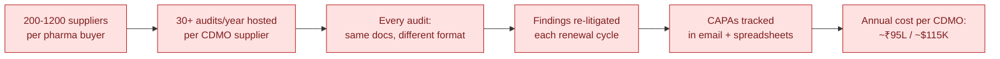
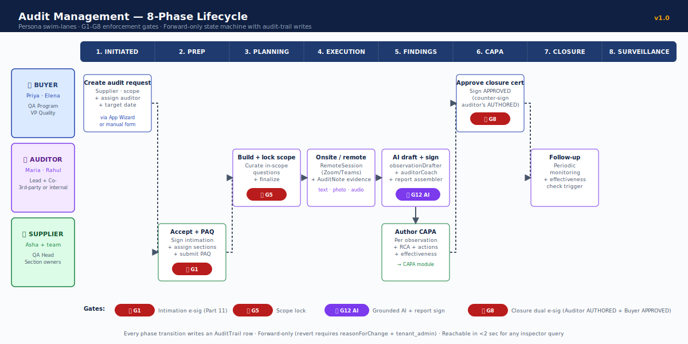
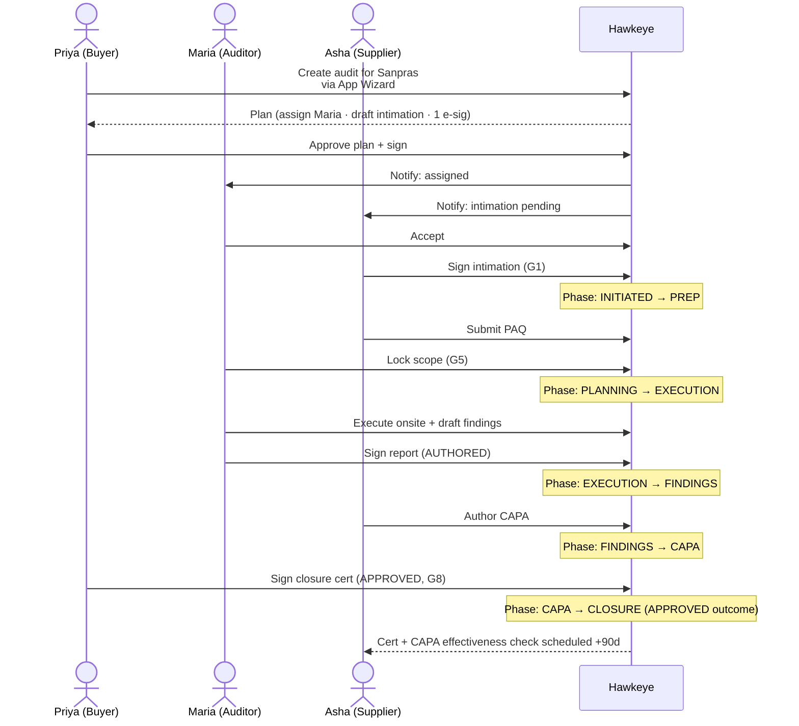
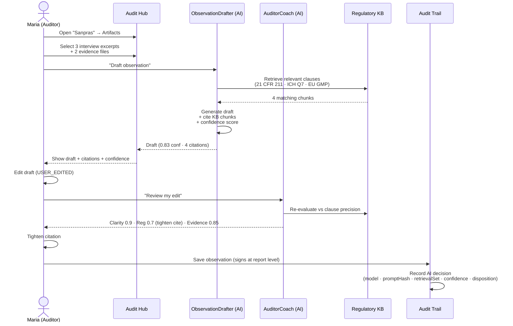
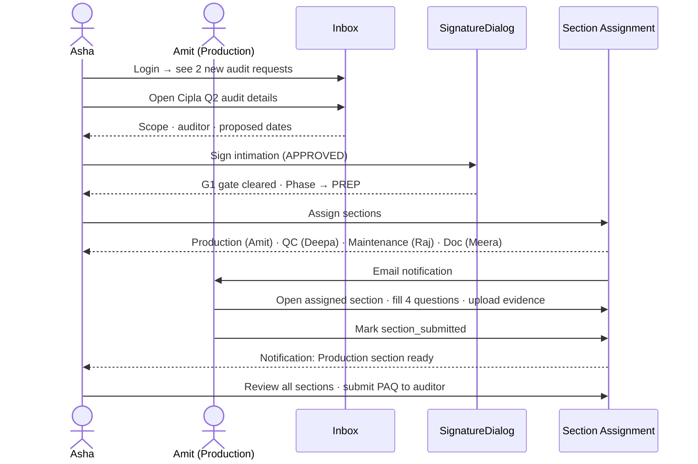
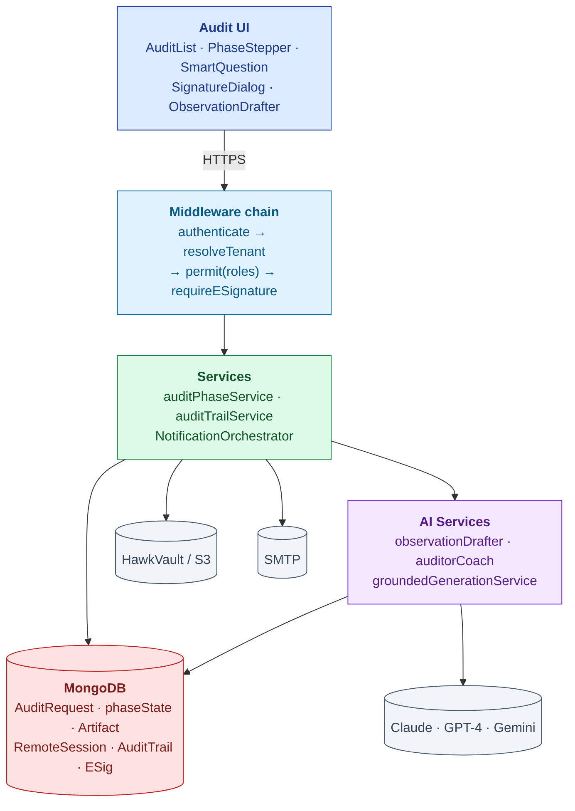
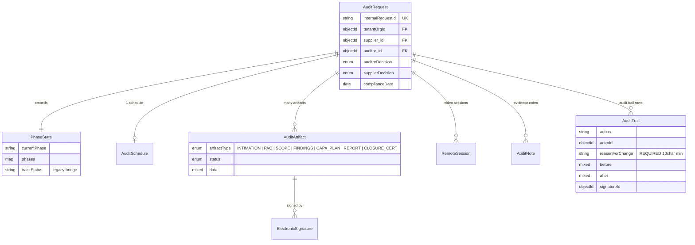
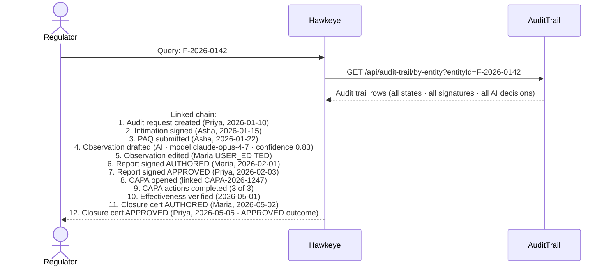
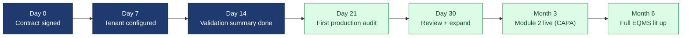

# Audit Management — The Storybook

| Field | Value |
|---|---|
| Audience | Pick your track in §0 |
| Length | 12 pages · 15 min read |
| Status | v1.0 |
| Last updated | 2026-05-31 |
| Companion (reference) docs | [URS.md](URS.md) · [DESIGN.md](DESIGN.md) · [ARCHITECTURE.md](ARCHITECTURE.md) |

> 💡 **What this is.** The Audit Management module told as a story, in 6 beats, with 4 audience cuts. The reference docs (URS / DESIGN / ARCHITECTURE) sit beside this as the deep technical contract. This document is the **conversation** — what you'd present in a room, what gets handed to a regulator, what a new engineer reads on Day 1.

---

## 0. Pick Your Track

| Audience | Read | Skip |
|---|---|---|
| 🪙 **Executive / Investor** | §1 Problem · §2 Solution · §6 ROI/Proof · §7 What's Next | §4 Architecture · §5 Compliance trace |
| 🛠 **Engineer / CTO** | §1 Problem · §3 Flows · §4 Architecture · §5 Compliance | §6 ROI · §7 What's Next |
| 📦 **QA Head / Practitioner** | §1 Problem · §2 Solution · §3 Flows · §6 ROI | §4 Architecture |
| 🔍 **Regulator / Auditor** | §1 Problem · §4 Architecture · §5 Compliance | §6 ROI |

---

# Beat 1 — The Problem

## §1. The picture today

> *Asha Sharma is QA Head at a CDMO in Pune. Tomorrow, an FDA inspector arrives. Today, Asha is rebuilding the same supplier-audit binder she rebuilt for last week's Cipla audit, in a slightly different format, with mostly the same documents, mostly hand-collated, late at night.*
>
> *This binder is her 23rd this year. She has 7 more in her calendar. Her team of 5 spends 60 working days a year on this. Not improving products. Not investigating actual quality issues. Re-binding the same evidence in 23 different ways.*

### Why this is broken everywhere

- **Bandwidth gap:** Pharma quality teams can run 30-60 onsite audits/year. They have 200-1,200 suppliers. The rest get paper-screened, late.
- **Format chaos:** Each buyer sends their own PAQ format. Supplier responds in 23 different ways for the same underlying evidence.
- **CAPA black hole:** Findings spawn CAPAs. CAPAs run in email. Effectiveness checks happen "eventually." Recurring deviations recur.
- **Veeva is too expensive:** ~$30K floor; ~$50K+ in real practice. Excludes SMB pharma + emerging-market CDMOs entirely.
- **Qualifyze is network-only:** Solves marketplace audits; doesn't solve the buyer's internal workflow.

> 🚫 **The honest framing.** The market has built better paper. Hawkeye builds the workflow that makes the paper unnecessary.

---

# Beat 2 — The Solution

## §2. What Hawkeye does for audit

The audit module gives every persona a **single source of truth** that:

1. Carries the audit from intimation → execution → findings → CAPA → closure in **one workflow**
2. Captures every state change with **Part-11-grade audit trail** + e-signature
3. AI-drafts observations with **citations + confidence**, never magic
4. Reuses **evidence across audits** for the same supplier (no re-binding)
5. Surfaces **the chain of evidence** to any regulator question in <2 sec

### The 8-phase lifecycle (in one picture)

### The wedge: why this is the entry product

| Why audit first | Evidence |
|---|---|
| Acute pain | 30+ audits/year per CDMO; ~₹95L annual quality cost |
| Single decision-maker | QA Head buys without IT or board approval |
| Highest incumbent gap | Veeva too expensive; Qualifyze is network-only |
| Travels everywhere | Same workflow serves pharma, food, auto, aero, electronics |
| Fast time-to-value | 60-day PoC on real audits; ROI < 4 months |

> ✅ **The land-and-expand model.** Audit lands. Within 6 months, the customer adopts CAPA + Deviation + Doc Control. The platform doesn't sell "EQMS" — it sells the audit relief and grows from there.

---

# Beat 3 — Key Flows (the three flows that matter)

## §3a. Buyer flow — Priya creates and tracks an audit

## §3b. Auditor flow — Maria drafts an observation with AI

> 💡 **The AI doesn't decide. It assists. Maria is in control.** Every disposition (USER_ACCEPTED / EDITED / REJECTED / SUPERSEDED) gets captured. The active-learning loop uses these signals to improve the next prompt.

## §3c. Supplier flow — Asha accepts + assigns + submits

---

# Beat 4 — Architecture (the technical proof)

> 🛠 **For engineers / CTOs:** if you're a practitioner, you can skip to Beat 5. This section establishes the platform spine that makes the workflow trustworthy.

## §4a. System context

## §4b. The 6 critical gates (where the platform enforces Part 11)

| Gate | Phase | Trigger | What it enforces |
|---|---|---|---|
| **G1** | PREP entry | Supplier signs intimation | Audit can't proceed without supplier consent (Part 11 §11.50, Annex 11 §14) |
| **G2** | INITIATED → PREP | Auditor accepts assignment | Auditor must accept before phase advances |
| **G5** | EXECUTION entry | Auditor finalizes scope | Scope is locked; further changes require revert with reason |
| **G7** | EXECUTION (during) | RemoteSession created | Remote-audit recording captured to HawkVault (foundation; full cockpit UI deferred) |
| **G8** | CLOSURE | Auditor signs cert + Buyer signs cert | Dual e-sig (Part 11 §11.200 — two distinct identifications + reason) |
| **G12** | FINDINGS | Auditor accepts AI draft + signs report | AI decision captured in audit trail with full reproducibility metadata |

> ✅ **Every gate writes an AuditTrail row.** The trail is immutable. The reason for the action is mandatory. The signature is bcrypt-verified.

## §4c. Data model (the audit aggregate)

For the full schema → [ARCHITECTURE.md §2](ARCHITECTURE.md#2-data-model).

---

# Beat 5 — Compliance Trace

> 🔍 **For regulators:** this is the section that maps every audit-module feature to the regulation it implements. One implementation, many regulators satisfied.

## §5a. The compliance map

| Feature | 21 CFR Part 11 | ICH Q7 | EU GMP Annex 11 | ISO 9001 |
|---|---|---|---|---|
| Phase state machine + forward-only transitions | §11.10(e), §11.10(f) | §13.20 | §1, §9 | §8.7 |
| Intimation e-signature (G1) | **§11.50 + §11.200 + §11.300** | §13.20 | §14 e-sig | §8.4 |
| Pre-audit questionnaire | — | §13.20 | — | §9.2 |
| Execution scope lock (G5) | §11.10(e) integrity | §13.20 | §9 | §8.7 |
| Remote audit recording | §11.10(c) record protection | §13.21 evidence | §17 | §8.7 |
| Observation drafter w/ citations | §11.10(b) authenticity | §13.20 reporting | — | §8.7, §10.2 |
| Report + closure dual e-sig (G8) | **§11.50 + §11.200** | §13.20 closure | §14 | §8.4 |
| Cross-module audit trail | **§11.10(e), §11.10(k)** | §6.18 records | **§9 audit trail** | §7.5, §8.7 |
| RBAC + tenant isolation | §11.10(d) access controls | §13.20 auditor independence | §12 personnel | §7.2 |
| AI decision audit trail | §11.10(b), §11.10(e) | — | §6 risk-based validation | §8.7 |

## §5b. The inspector's question, answered

When a regulator asks **"show me the full evidence chain for finding F-2026-0142"**:

*Total response time: < 2 seconds. This is what "inspector-readiness as a product feature" means.*

---

# Beat 6 — ROI & Proof

## §6a. The numbers (per Tier 3 CDMO customer)

| Today | With Hawkeye | Saved |
|---|---|---|
| ₹60L audit prep time | -50% via AI prep + evidence reuse | ₹30L |
| ₹18L audit response | -35% via cross-module wiring | ₹6L |
| ₹6-15L consultants | Reduced reliance | ₹3L |
| ₹5-25L cost of findings + remediation | Earlier detection + better CAPA | ₹5-10L |
| **₹95L total cost** | **₹50-55L** | **~₹45L (~$54K)** |
| | Hawkeye cost: ₹9L | Net benefit: ~₹36L |

> ✅ **Payback period: < 4 months. Year-1 net benefit: ~₹36L (~$43K). ROI: ~5x.**

## §6b. Time-to-value

## §6c. Pre-customer status (the honest part)

> ⚠️ **As of May 2026: 0 paying customers.** 2 design partners in discovery (Sanpras + Novex). The ROI numbers above are bottom-up estimates based on the cost model in [BUSINESS-PLAN.md §6](../../02-fundraising/business-plan/BUSINESS-PLAN.md). They will be validated by the first 5 reference customers; expect 25-50% variance until then.

---

# Beat 7 — What's Next

## §7a. Shipped (May 2026)

- ✅ 8-phase audit lifecycle with G1-G8 gates
- ✅ E-sig on intimation, report, closure cert
- ✅ AI observation drafter + auditor coach
- ✅ Audit report assembler with integrity hash
- ✅ Cross-module audit trail
- ✅ Multi-tenant + cross-tenant affiliation
- ✅ Audit module integration with AskHawk App Wizard (8 tools incl. wizard.create_audit, wizard.find_auditor, wizard.draft_observation)

## §7b. Next 6 months (M0-M6 in our angel-round plan)

- Hard-mode e-sig default for production tenants
- Status-field unification (drop legacy `trackStatus`)
- First 5 reference customers (audit module = the wedge)
- SOC 2 Type 1 prep

## §7c. Next 12 months (M6-M12)

- **Remote-audit cockpit UI** — the consolidated video + screen-share + annotation experience (URS-B-001) — currently the biggest gap
- Hawkeye-tuned Llama-3 for low-stakes audit tasks (severity classification, similar-finding search)
- Active-learning loop UI for auditor disposition feedback
- Cross-tenant supplier intel surfacing (with consent — URS-B-006)

## §7d. Known engineering gaps

> 🚫 **Audit module — what's broken or missing today:**
> - Dual status fields (drift risk; planned cleanup M12)
> - Remote-audit cockpit UI (foundation present; consolidated UX deferred)
> - Real-time follow-up suggester (scaffolded, handler stub)
> - TSA cryptographic timestamp for audit-trail (planned Q2 2027)
> - Co-auditor witness signature (today: notes only; regulator expectation TBD)
> - Mobile audit execution (desktop-first; mobile evidence capture deferred)
>
> Full list: [URS.md §8 Open Questions](URS.md#8-open-questions)

---

## Appendix — Where To Go Next

| If you want | Open |
|---|---|
| Full requirements contract (engineer reference) | [URS.md](URS.md) |
| UX flows + state machine + personas (design reference) | [DESIGN.md](DESIGN.md) |
| System architecture + data model + APIs (architect reference) | [ARCHITECTURE.md](ARCHITECTURE.md) |
| The platform-wide architecture in 1 page (exec) | [../../04-engineering/00-overview/PLATFORM-EXECUTIVE.md](../../04-engineering/00-overview/PLATFORM-EXECUTIVE.md) |
| The platform-wide architecture in 1 page (CTO) | [../../04-engineering/00-overview/PLATFORM-ENGINEERING.md](../../04-engineering/00-overview/PLATFORM-ENGINEERING.md) |
| The full Hawkeye narrative | [../../HAWKEYE-STORY.md](../../HAWKEYE-STORY.md) |
| Compliance trace (regulator detail) | [../../08-compliance-regulatory/frameworks/PART-11.md](../../08-compliance-regulatory/frameworks/PART-11.md) |
| Demo script for sales | [../../09-sales-marketing/demo-scripts/DEMO-INDEX.md](../../09-sales-marketing/demo-scripts/DEMO-INDEX.md) |

---

*Doc_V2 · Audit Management · Storybook · 6 beats · 4 audience cuts*
