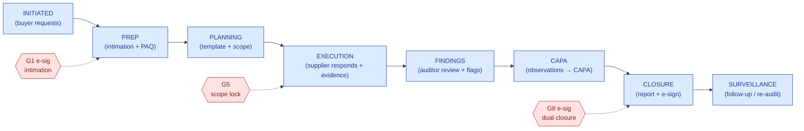
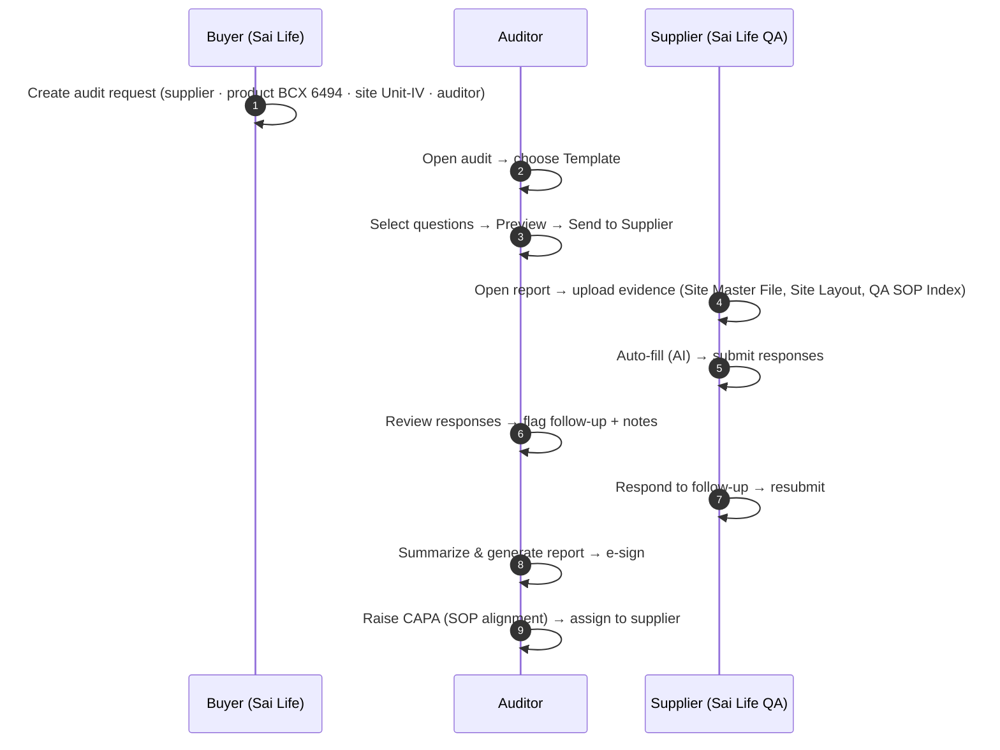

# Audit Management — User Guide & Test Protocol (Sai Life Sciences, Template #3)

> A step-by-step **user guide** and **executable test protocol** for the Audit Management module, walked end-to-end with **Sai Life Sciences** seed data and **Questionnaire Template #3**. Each step is mapped to the screenshot produced by the automated capture script (`e2e/sai-screenshot-walkthrough.spec.ts`).

| Field | Value |
|---|---|
| Document | `HK-AUDIT-UG-TEST-v1.0` |
| Module | Audit Management |
| Test data | Sai Life Sciences (tenant), site **Unit-IV**, products **BCX 6494 / BCX 7611**, Template **#3** |
| Roles | Buyer (`buyer4@test.com`) · Auditor (`auditor4@test.com`) · Supplier (`sai-supplier-admin@test.com`) — pwd `Testing@2022` |
| Date | 2026-06-16 |

> ⚠️ **Screenshot status — read this.** This run was prepared in a sandbox whose egress network **blocks MongoDB** (the in-memory Mongo binary CDN returns 403 and the Atlas cluster IP is not whitelisted). With no database, the backend cannot serve data, so **live screenshots could not be captured here.** Rather than fabricate images, this guide ships **(a)** the complete, accurate step-by-step flow drawn from the real screens/routes, and **(b)** a **turnkey capture script** that auto-produces every screenshot the moment it runs where Mongo is reachable (your devcontainer / a host with `mongod`). See §6 to run it; screenshots drop into the `[ Screenshot: NN_… ]` slots below.

---

## 1. Process flow

### 1.1 The audit lifecycle (module state machine)


### 1.2 The test scenario flow (who does what, with Template #3)


---

## 2. Test scenario & data

| Item | Value |
|---|---|
| Supplier (auditee) | **Sai LifeSciences** — site **"Sai Life Sciences Limited, Unit-IV"** |
| Products | **BCX 6494** (primary), BCX 7611 |
| Questionnaire | **Template #3** |
| Evidence files | `DSMF-01 Site master file.pdf`, `DDRG01-37 Master Site layout.pdf`, `QA SOP Index.pdf` |
| Buyer user | `buyer4@test.com` (tenant: Sai Life Buyer) |
| Auditor user | `auditor4@test.com` |
| Supplier user | `sai-supplier-admin@test.com` |
| Password (all) | `Testing@2022` |

---

## 3. Step-by-step user guide & test protocol

Each row is both a **user-guide step** and a **test case**. *Expected result* is the pass criterion. *Screenshot* is the file the capture script writes to `test-results/sai-walkthrough/`. Fill *Actual / Result* on execution.

| TC | Role | Screen / Route | Action (user guide) | Expected result | Screenshot | Actual / Result |
|---|---|---|---|---|---|---|
| **01** | Buyer | `/audits` | Open the **Audit** list from the console nav. | Audit dashboard loads; existing Sai Life audits listed; "Request New Audit" CTA visible. | `01_buyer-audit-list.png` | ☐ |
| **02** | Buyer | `/request-audit` | Click **Request New Audit**. | "Request New Audit" form renders with Supplier / Product / Site / Auditor selectors + dates + Intimation Letter & Pre-Audit Questionnaire template pickers. | `02_buyer-request-audit-blank.png` | ☐ |
| **03** | Buyer | `/request-audit` | Select **Supplier** = Sai Life supplier, **Product** = BCX 6494, **Site** = Unit-IV, **Auditor** = auditor4; set Estimated Time of Completion. | All four autocompletes resolve to the Sai Life seed values; form valid; **Request** enabled. | `03_buyer-request-audit-filled.png` | ☐ |
| **04** | Buyer | `/request-audit` | Click **Request**. | "Operation Successful" modal; audit request created in `INITIATED`; appears in buyer list. *(Part-11 audit-trail row written.)* | `04_buyer-request-success.png` | ☐ |
| **05** | Auditor | `/audits/{id}/template` | As auditor, open the audit → **Questionnaire Templates**. | "Questionnaries templates" page lists available templates incl. **Template #3**. | `05_auditor-template-list.png` | ☐ |
| **06** | Auditor | `/audits/{id}/template` | Click **Template #3**. | Template #3 highlighted/selected; **Start Auditing** enabled. | `06_auditor-template-3-selected.png` | ☐ |
| **07** | Auditor | `/audits/{id}/template/3` | Click **Start Auditing**. | Navigates to Template-3 **Audit Questionnaire**; question set for Template #3 renders. | `07_auditor-questionnaire-template-3.png` | ☐ |
| **08** | Auditor | `/audits/{id}/template/3` | Select the questions to include (tick checkboxes). | Selected questions checked; selection count updates; **Preview** enabled. | `08_auditor-questions-selected.png` | ☐ |
| **09** | Auditor | `…/audit-preview-questions` | Click **Preview**. | Read-only preview of the chosen Template-3 questions; **Send to Supplier** visible. | `09_auditor-preview-questions.png` | ☐ |
| **10** | Auditor | `/audits` | Click **Send to Supplier**. | Questionnaire dispatched; audit advances to **EXECUTION**; supplier notified; returns to audit list. | `10_auditor-sent-to-supplier.png` | ☐ |
| **11** | Supplier | `/audits/{id}/report` | As supplier, open the audit response workspace; review the **Facility** / questionnaire tabs. | Template-3 questionnaire rendered for response; per-section tabs (Facility …) visible; evidence-upload affordances present. | `11_supplier-report-questionnaire.png` | ☐ |
| **12** | Supplier | `/audits/{id}/report` | Upload evidence (Site Master File, Site Layout, QA SOP Index) against a question; run **Auto-fill**. | Evidence attached to the question; AI **Auto-fill** populates draft responses from the uploaded documents (cited). *Requires LLM connectivity.* | `12_supplier-autofill-applied.png` | ☐ |
| **13** | Supplier | `/audits/{id}/report` | Review auto-filled answers, edit as needed, **Submit** responses. | Responses set to `supplier_submitted`; audit `trackStatus` = "Response Complete"; returns to auditor. | *(captured in 11/12)* | ☐ |
| **14** | Auditor | `/audits/{id}/report` | Review supplier responses; **flag** a follow-up and add internal notes. | Question flagged `auditor_flagged`; internal note saved; supplier notified for follow-up. | `13_auditor-review-responses.png` | ☐ |
| **15** | Supplier | `/audits/{id}/report` | Respond to the follow-up; resubmit. | Updated response saved + resubmitted; flag cleared/closed. | *(captured in 11)* | ☐ |
| **16** | Auditor | `/audits/{id}/report` → `/report-view` | Click **Summarize and Generate Audit Report**; review; **e-sign**. | AI report draft generated (summary references **Unit-IV** + **BCX 6494/7611**); auditor applies **Part-11 e-signature**; report finalized; audit → **CLOSURE**. *Requires LLM connectivity.* | `14_auditor-report-signed.png` | ☐ |
| **17** | Auditor | `/capa` | Raise **CAPA – SOP alignment** (severity major) from an observation; assign to supplier. | CAPA created (`NEEDS_SUPPLIER`), linked to the audit; appears in CAPA module; bidirectional audit↔CAPA trace. | `15_capa-created.png` | ☐ |

> Steps marked *Requires LLM connectivity* (12, 16) exercise the AI auto-fill and report-generation services; if the LLM endpoint is unreachable, the capture script records them as **WARN** (with the screenshot of the pre-AI UI state) rather than failing the run.

---

## 4. Test results summary (complete on execution)

| Metric | Target | Actual |
|---|---|---|
| Steps executed | 17 | ☐ |
| Steps PASS | 17 | ☐ |
| Steps WARN (LLM-dependent) | ≤2 | ☐ |
| Steps FAIL | 0 | ☐ |
| Audit reached CLOSURE | Yes | ☐ |
| CAPA created & linked | Yes | ☐ |
| Part-11 e-signature on report | Yes | ☐ |
| Audit-trail rows written across steps | Yes | ☐ |
| Report references Unit-IV + BCX product | Yes | ☐ |

**Overall result:** ☐ PASS ☐ PASS-WITH-OBSERVATIONS ☐ FAIL · **Executed by:** ______ · **Date:** ______ · **Reviewed by (QA):** ______

---

## 5. URS traceability

| TC | Audit URS requirement (UNS.md) | Control evidenced |
|---|---|---|
| 01–04 | Req 35 — supports hosted/conducted/internal audit types; request creation | State machine; audit-trail (C1) |
| 05–10 | PAQ + Template selection + send (URS-A-030…034) | Template config; workflow gate |
| 11–13 | Supplier portal response + evidence + AI auto-fill (URS-A-033/050) | Supplier portal; AI grounding (C15) |
| 14–15 | Auditor review + follow-up flags | State machine; audit-trail |
| 16 | Observation finalization + report e-sign (URS-A-050…055; G8) | E-signature (C2); AI report |
| 17 | Per-observation CAPA spawn | Cross-module trace (C6) |

---

## 6. How to capture the screenshots (turnkey)

The numbered screenshots are produced automatically by the committed Playwright walkthrough. Run it **where MongoDB is reachable** (your devcontainer, or any host with a working `mongod` / Atlas-whitelisted IP):

```bash
# 1) Backend (codex_backend_01) — with a reachable Mongo:
#    Option A (recommended): a local mongod
#      mongod --dbpath /tmp/hk-mongo --port 27017 &
#      MONGO_URI=mongodb://localhost:27017/hawkeye PORT=8102 npm start
#    Option B: Atlas, with this machine's IP whitelisted in the cluster
#      PORT=8102 npm start

# 2) Frontend (codex_frontend_01):
cp .env.e2e.sample .env.e2e          # seeded creds + URLs (already correct)
NEXT_PUBLIC_APP_API_BASE_URL=http://localhost:8102 npm run dev   # serves :3000
npx playwright install chromium       # one-time

# 3) Run the walkthrough (globalSetup seeds Sai Life + logs in the 3 roles):
npx playwright test e2e/sai-screenshot-walkthrough.spec.ts

# Output:
#   test-results/sai-walkthrough/NN_<step>.png   <- the screenshots (slot into §3)
#   test-results/sai-walkthrough/steps.md        <- capture log (pass/warn per step)
#   e2e-report/                                  <- full Playwright HTML report
```

The script seeds with `POST /api/e2e/seed-sai` (secret `devseed`), drives the exact flow in §3, and writes a numbered screenshot + a pass/warn note per step. Drop the PNGs into the `Screenshot` column above (or attach the `e2e-report/`) to complete the evidence pack.

> **Why it couldn't run in this sandbox:** the egress network allow-list blocks `fastdl.mongodb.org` (in-memory Mongo binary → HTTP 403) and the Atlas cluster (IP not whitelisted), so no database was available. Everything else (deps, Playwright, the app code, the seed, the script) is in place — only the DB endpoint is unreachable here.

---

## 7. Revision history
| Version | Date | Author | Reason |
|---|---|---|---|
| 1.0 | 2026-06-16 | QA / Product | Initial user guide + test protocol; turnkey capture script |
