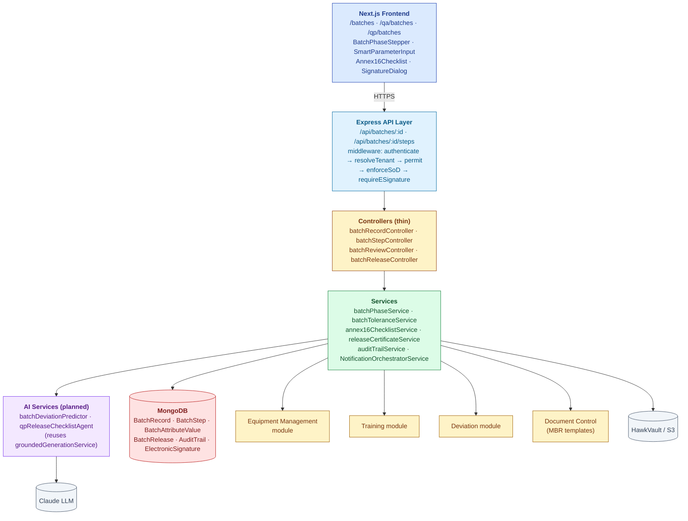
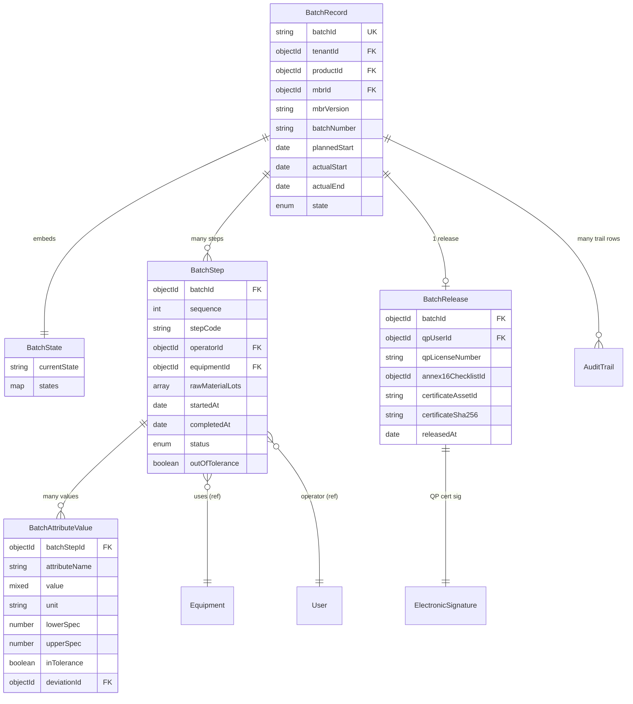

# ARCHITECTURE — Batch Records

| Field | Value |
|---|---|
| Module | Batch Records (Pharma Manufacturing) |
| Depth | Executive overview with planned code paths |
| Pairs with | [URS.md](URS.md), [DESIGN.md](DESIGN.md) |
| Last updated | 2026-06-01 |

---

## 1. System Context

**Tier ownership:**
- **Frontend** — rendering, parameter entry, tolerance UI hints, e-sig modal
- **API + middleware** — auth, tenant scoping, SoD enforcement, e-sig
- **Controllers** — thin route dispatch
- **Services** — state transitions, tolerance checks, cross-module reads (equipment, training)
- **External modules** — Equipment (cal status), Training (eligibility), Deviation (sink), Document Control (MBR)

---

## 2. The Five-Pillar Walkthrough

Batch Records walks S.M.A.R.T. Hawk's universal pipeline once per manufactured lot. Data is **collected** at the shop floor — operators enter structured per-step parameter values via `SmartParameterInput`; `batchRecordIntakeService` validates the schema and `batchStepController.preCheck` pulls equipment status from the Equipment module (must be in-calibration) and training eligibility from the Training module before the step can open. It is **processed** into the durable model (`BatchRecord` aggregate plus `BatchStep` and `BatchAttributeValue` rows; entity resolution pins the batch to product master, MBR version, equipment IDs, raw material lots, and operator identities). It is **validated** per attribute (`batchToleranceService` compares each value to its spec range; any out-of-spec capture invokes `createDeviationFromBatchStep` to auto-spawn a Deviation; the QA review gate via `qaReviewService` then certifies the run with a Part 11 e-signature). It is **reported** as Annex 16 QP release — `annex16ChecklistService` aggregates green/red across linked modules, and `BatchRelease` records the QP signature plus license number; rejection routes to the disposition workflow. Finally everything is **sealed** to AuditTrail per attribute value plus per signature; the complete batch record is SHA-256 hashed; the release record is immutable post-certification.

```mermaid
flowchart LR
    classDef collect fill:#DBEAFE,stroke:#1E40AF,color:#1E3A8A
    classDef process fill:#DBEAFE,stroke:#1E40AF,color:#1E3A8A
    classDef validate fill:#DCFCE7,stroke:#15803D,color:#14532D
    classDef report fill:#DCFCE7,stroke:#15803D,color:#14532D
    classDef seal fill:#1E3A6E,stroke:#0F2042,color:#FFFFFF,stroke-width:3px

    P1["<b>1 · COLLECT</b><br/><i>operator entry · equipment + training preCheck</i><br/>SmartParameterInput · batchStepController"]:::collect
    P2["<b>2 · PROCESS</b><br/><i>normalize · entity-resolve product · MBR · lots</i><br/>BatchRecord · BatchStep · BatchAttributeValue"]:::process
    P3["<b>3 · VALIDATE</b><br/><i>spec check · auto-deviation · QA review</i><br/>batchToleranceService · qaReviewService"]:::validate
    P4["<b>4 · REPORT</b><br/><i>Annex 16 checklist · QP release certificate</i><br/>annex16ChecklistService · BatchRelease"]:::report
    P5["<b>5 · SEAL</b><br/><i>SHA-256 of full record · immutable post-release</i><br/>auditTrailService · releaseCertificateService"]:::seal

    P1 --> P2 --> P3 --> P4 --> P5
```

**Cross-module spawn:**
- **Deviation** — `batchToleranceService.checkAndMaybeCreateDeviation` auto-creates a Deviation row when an attribute lands outside spec; the `BatchAttributeValue.deviationId` back-link makes the chain inspector-readable
- **CAPA** — recurring deviation patterns across batches feed the CAPA module's trend-detection input
- **Equipment** — calibration-status dependency is a hard gate at step open; equipment-out-of-cal events emit a notice to any in-flight batch using that asset
- **Document Control** — the MBR template (and its pinned `mbrVersion`) comes from Doc Control; an MBR revision in Doc Control does not silently mutate an in-flight batch

**Code-path table**

| Pillar | Code path | What it does |
|---|---|---|
| 1 · Sense | `backend/src/controllers/batchStepController.js`, `services/batchRecordIntakeService.js` (planned), `frontend/components/batch/SmartParameterInput.tsx` | Operator entry · equipment + training preCheck |
| 2 · Monitor | `backend/src/models/{BatchRecord,BatchStep,BatchAttributeValue}.js`, `services/batchPhaseService.js` | Normalize to durable model · pin MBR version + lots |
| 3 · Analyze | `backend/src/services/batchToleranceService.js`, `services/batchPhaseService.js`, `controllers/batchReviewController.js` | Spec check · auto-deviation · QA e-sig review |
| 4 · Record | `backend/src/services/annex16ChecklistService.js`, `services/releaseCertificateService.js`, `controllers/batchReleaseController.js` | Annex 16 aggregation · QP release certificate |
| 5 · Trace | `backend/src/services/auditTrailService.js`, `models/{AuditTrail,BatchRelease}.js` | Per-value trail · SHA-256 of record · immutable certificate |

---

## 3. Data Model

### Primary entities

| Model | Purpose | Key fields | References |
|---|---|---|---|
| **BatchRecord** | Batch aggregate root | `batchId`, `tenantId`, `productId`, `mbrId`, `mbrVersion` (pinned), `batchNumber`, `state`, `plannedStart/actualStart/actualEnd` | products, MBR (Doc Control), users |
| **BatchStep** | Per-step execution row | `batchId`, `sequence`, `stepCode`, `operatorId`, `equipmentId`, `rawMaterialLots[]`, `status`, `outOfTolerance` | BatchRecord, Equipment, users |
| **BatchAttributeValue** | One parameter capture | `batchStepId`, `attributeName`, `value`, `unit`, `lowerSpec`, `upperSpec`, `inTolerance`, `deviationId?` | BatchStep, Deviation |
| **BatchRelease** | QP release certificate | `batchId`, `qpUserId`, `qpLicenseNumber`, `annex16ChecklistId`, `certificateAssetId`, `certificateSha256` | BatchRecord, users, ElectronicSignature |
| **AuditTrail** (cross-module) | Part 11 log | `tenantId`, `module='batch-records'`, `entityType`, `action`, `reasonForChange`, `signatureId?`, `before`, `after` | All modules |

### Indexes (key)

- `BatchRecord`: `(tenantId, state)`, `batchId` (unique), `(tenantId, productId, batchNumber)` unique
- `BatchStep`: `(batchId, sequence)` unique
- `BatchAttributeValue`: `(batchStepId, attributeName)`, `outOfTolerance` (for ops dashboards)
- `AuditTrail`: `(tenantId, module, entityId)` for the inspector-readable view

---

## 4. API Catalog (planned)

All paths require `authenticate`; RBAC via `permit(...)`.

### Lifecycle

| Endpoint | Roles | Purpose |
|---|---|---|
| `POST /api/batches` | production_manager, tenant_admin | Initiate batch (pin MBR, verify BOM) |
| `GET /api/batches` | role-scoped | List/filter (state, product, date) |
| `GET /api/batches/:id` | role-scoped | Detail (with linked records snapshot) |
| `POST /api/batches/:id/start` | production_manager | BATCH_INITIATED → IN_PRODUCTION |
| `POST /api/batches/:id/complete-step` | operator | Per-step e-sig + status |
| `POST /api/batches/:id/production-complete` | production_manager | IN_PRODUCTION → PRODUCTION_COMPLETE |
| `POST /api/batches/:id/qa-review` | qa | Sign APPROVED/REJECTED |
| `POST /api/batches/:id/qp-release` | qp | Sign CERTIFIED (requires Annex 16 green) |
| `POST /api/batches/:id/reject` | qa, qp | Move to DISPOSITION |

### Audit trail

| Endpoint | Roles | Purpose |
|---|---|---|
| `GET /api/batches/:id/audit-trail` | all | Per-batch trail |
| `GET /api/audit-trail/by-entity?type=BatchRecord&id=...` | all | Cross-module trail (inspector-readable per URS-B-003) |

### Helper / read

| Endpoint | Roles | Purpose |
|---|---|---|
| `GET /api/batches/:id/annex16-checklist` | qp, qa, tenant_admin | Computed checklist status |
| `GET /api/batches/:id/release-certificate` | all | Download signed cert PDF |

---

## 5. RBAC Matrix

| Capability | Operator | Prod Manager | QA | QP | Tenant Admin | Superadmin |
|---|---|---|---|---|---|---|
| Initiate batch | — | ✅ | — | — | ✅ | ✅ |
| Execute step (per-step e-sig) | ✅ | — | — | — | ✅ | — |
| Mark PRODUCTION_COMPLETE | — | ✅ | — | — | ✅ | ✅ |
| QA review + sign | — | — | ✅ | — | ✅ | — |
| QP release + sign | — | — | — | ✅ | — | — |
| Reject batch | — | — | ✅ | ✅ | ✅ | ✅ |
| Read audit trail | ✅ | ✅ | ✅ | ✅ | ✅ | ✅ |

**Segregation-of-Duties guards** beyond role check:
- `enforceSoD(operator, qa)` — same user cannot be operator and QA reviewer on same batch
- `enforceSoD(qa, qp)` — QA reviewer cannot be the QP for same batch (Annex 16 §1.5)

---

## 6. AI Capabilities

All AI routes through platform `groundedGenerationService` (citations + confidence floor + audit-trailed via `recordAiDecision`).

| Tool | Type | R/W | E-sig | Where | Status |
|---|---|---|---|---|---|
| **batchDeviationPredictor** | Risk-prediction at step time | READ | NO | Inline hint in `SmartParameterInput` | ⏳ planned Q3 2027 |
| **qpReleaseChecklistAgent** | Auto-populate Annex 16 status from linked records | READ | NO | `Annex16Checklist` panel | ⏳ planned |

### Grounding posture

Same posture as Audit Management (see `06-modules/audit-management/ARCHITECTURE.md §5`): JSON schema validation, citations required (link to source records, not LLM hallucination), `minConfidence: 0.7` (higher than audit because release decisions are higher-stakes), audit trail row per call.

### User-disposition feedback

After QP review of auto-populated Annex 16, system captures `USER_ACCEPTED / USER_EDITED / USER_REJECTED` per item; feeds active-learning loop.

---

## 7. State Machine Implementation

Cross-reference [DESIGN §4](DESIGN.md#4-state-machine).

- **Definition:** `backend/src/constants/batchStates.js` (planned)
- **Validation:** `services/batchPhaseService.js → canTransition()` — checks owner role, gate prerequisites (e.g., all deviations closed for QA→QP)
- **Application:** `services/batchPhaseService.js → applyTransition()` — mutates state, writes AuditTrail row
- **Gate enforcement:**
  - **G-QA** — `middlewares/requireESignature.js` with `signatureMeaning='APPROVED'`
  - **G-QP** — `middlewares/requireESignature.js` with re-auth, `signatureMeaning='CERTIFIED'`, prerequisite: `annex16ChecklistService.isAllGreen(batchId)` returns true (hard mode)
  - **G-EQ / G-TR** — `batchStepController.preCheck()` calls Equipment + Training APIs at step-entry time
  - **G-TOL** — `services/batchToleranceService.checkAndMaybeCreateDeviation(value, spec)` — auto-creates Deviation via inter-module call

---

## 8. Compliance Traceability

| Feature | 21 CFR 211 | EU GMP Annex 16 | EU GMP Annex 15 | ICH Q7 | 21 CFR Part 11 |
|---|---|---|---|---|---|
| Batch initiation + MBR version pinning | §211.188(a) | — | — | §6.5 | §11.10(e) |
| Per-step data capture | §211.188(b) | — | — | §6.5 | §11.10(b) |
| Equipment calibration check at step time | §211.68 | — | §15 (qualification) | §5 | — |
| Personnel training check at step time | §211.25 | — | — | §3 | — |
| Auto-deviation on out-of-tolerance | §211.192 | — | — | §6.7 | §11.10(e) |
| QA review + e-sig (APPROVED) | §211.194 | — | — | §6.6 | **§11.50, §11.200** |
| QP release + e-sig (CERTIFIED) | — | **§1.7, §1.10** | — | §6.6 | **§11.50, §11.200, §11.300** |
| Annex 16 readiness checklist | — | **all of §1** | — | — | — |
| Release certificate with hash | §211.198 | §1.10 | — | §6.5 | §11.10(c) |
| Cross-module audit trail | §211.194(a) | — | — | §6.10 | **§11.10(e), §11.10(k)** |
| SoD enforcement | §211.22 | §1.5 | — | §2 | §11.10(d) |

---

## 9. Operational Concerns

### Performance targets
- Batch list: < 500 ms for 5,000 batches per tenant
- Per-step data save: < 200 ms p95 (shop floor responsiveness critical)
- Annex 16 checklist compute: < 1 sec (aggregates from 4 modules)
- Release certificate PDF: < 3 sec
- Cross-module trail: < 2 sec for 100k entries

### Failure modes + recovery
- **Equipment module down** → step entry blocked (fail-safe); operator can stage data locally with explicit "pending verification" pill; resync on reconnect
- **Training module down** → same fail-safe pattern
- **Deviation auto-create fails** → batch step still saved with `outOfTolerance=true`; AuditTrail flagged DEVIATION_CREATE_FAILED; supervisor alerted; retry queue
- **LLM provider down** → predictor + Annex 16 agent both fall back to "compute from records only" (no LLM enrichment); QP can still release
- **E-sig password failure** → no state change; AuditTrail SIGNATURE_FAILED; user retries
- **PDF generation failure on release** → state stays QP_RELEASE; batch not RELEASED until cert generated; retry queue

### Observability
- Structured logs with batchId correlation
- Per-tenant metrics: batches-in-flight, p95 step-save latency, deviation rate, QA cycle time, QP cycle time
- Annex 16 checklist failure rate (which items most often red) — for product/process improvement

---

## 10. Known Gaps + Engineering Debt

1. **PAT sensor integration** — no commitment date; needed for continuous manufacturing and RTRT
2. **Real-time release testing (RTRT)** — Annex 16 §1.7.1 path not modeled
3. **Multi-site batch transfer** — design open question
4. **QP delegation (Annex 16 §3)** — not supported
5. **MBR amendment mid-batch** — blocked today (safe but rigid)
6. **AI predictor + QP agent** — planned, not built
7. **Mobile / tablet shop floor UI** — desktop-first today
8. **Serialization (DSCSA)** — out of scope v1

---

## 11. Open Engineering Questions

1. **State machine library** — same question as Audit (XState?)
2. **Storage of large evidence attachments** (photos of equipment readouts) — direct S3 upload vs proxy?
3. **Time-series for parameter values** — Mongo collection vs Influx vs Timestream when PAT lands?
4. **Multi-tenant performance** — should we shard by tenantId or by year (batches grow forever)?
5. **Cryptographic anchor for release certificate** — TSA integration (URS-B-005 analog from audit module)?
6. **Real-time inter-module pub/sub** — should equipment-out-of-cal events push to open batches?

---

## 12. Code Path Index (planned)

| Concern | Primary code path |
|---|---|
| Routes | `backend/src/routes/batch*.js` |
| Controllers | `backend/src/controllers/batch*.js` |
| Services | `backend/src/services/batch*.js`, `services/annex16ChecklistService.js`, `services/releaseCertificateService.js` |
| Models | `backend/src/models/Batch*.js`, `models/BatchRelease.js` |
| Middlewares | `backend/src/middlewares/{authMiddleware,roleMiddleware,requireESignature,enforceSoD}.js` |
| Constants | `backend/src/constants/batchStates.js` |
| AI | `backend/src/services/ai/batchDeviationPredictor.js`, `services/ai/qpReleaseChecklistAgent.js` |
| Frontend pages | `frontend/app/(console)/batches/**`, `qa/batches/**`, `qp/batches/**` |
| Frontend components | `frontend/components/batch/{BatchPhaseStepper,SmartParameterInput,Annex16Checklist,QABatchReviewPanel,QPReleasePanel}.tsx` |
| Inter-module clients | `frontend/lib/clients/{equipmentClient,trainingClient,deviationClient}.ts` |
