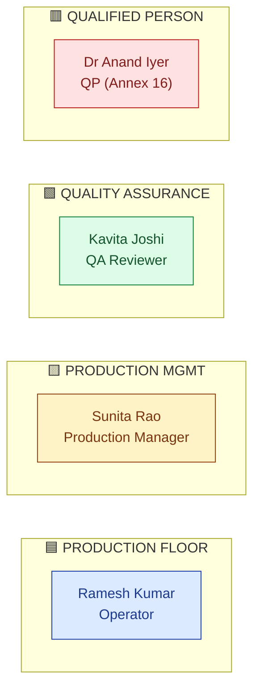
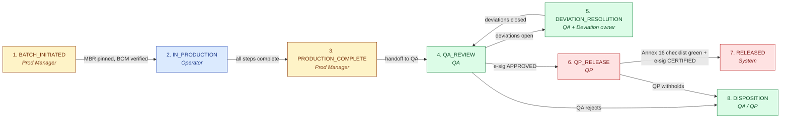
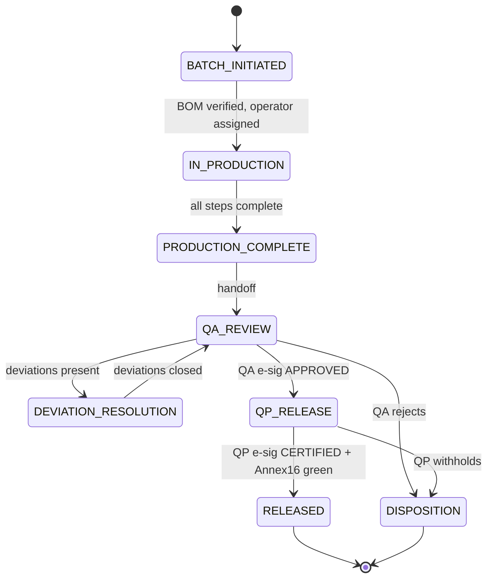

# DESIGN — Batch Records

| Field | Value |
|---|---|
| Module | Batch Records (Pharma Manufacturing) |
| Depth | Executive overview with pointers to planned code |
| Pairs with | [URS.md](URS.md), [ARCHITECTURE.md](ARCHITECTURE.md) |
| Last updated | 2026-06-01 |

---

## 1. Personas (4 primary)

Cross-reference [URS §2](URS.md#2-stakeholders-and-personas). 4-lane swim of pharma manufacturing.



| # | Persona | Lane | Primary actions | Decisions |
|---|---|---|---|---|
| 1 | **Operator** (Ramesh) | 🟦 Floor | Execute steps, record parameters, attach evidence | None (executes MBR) |
| 2 | **Production Manager** (Sunita) | 🟨 Mgmt | Review completeness, initiate batch, mark PRODUCTION_COMPLETE | Mark complete vs return to floor |
| 3 | **QA Reviewer** (Kavita) | 🟩 QA | Line-by-line review, sign APPROVED or reject | APPROVED / REJECTED / RETURN |
| 4 | **QP** (Dr Anand) | 🟥 QP | Annex-16 checklist review, sign RELEASE | RELEASED / WITHHELD / REJECTED |

---

## 2. End-to-End Journey



### Journey snapshots

#### 🟦 Operator (Ramesh)
```
1. Open assigned batch    → /batches/[id]/steps         BatchStepRunner
2. Click "Start Step N"   → BatchStepForm (parameters, equipment, lot picker)
3. Enter values + evidence → SmartParameterInput (live tolerance check)
4. Click "Complete Step"  → e-sig (operator attestation)
5. Out-of-tolerance      → auto-deviation modal: confirm + enter reason
```

#### 🟨 Production Manager (Sunita)
```
1. Initiate batch        → /batches/new                  BatchInitiationWizard
2. Pick product + MBR    → MBR version pinned
3. Verify BOM            → BOMVerifier (lot status check)
4. Assign operator team  → role/training check
5. Mark PRODUCTION_COMPLETE → /batches/[id] complete-action
```

#### 🟩 QA Reviewer (Kavita)
```
1. Inbox                 → /qa/batches/queue             QABatchQueue
2. Open batch            → /batches/[id]/qa-review       QABatchReviewPanel
3. Inline parameter sweep → ParameterMatrix (all steps, color-coded)
4. Linked records pane   → DeviationLinks, EquipmentCalStatus, TrainingMatrix
5. Sign APPROVED         → SignatureDialog (password + reason)  [QA gate]
6. Reject               → reason mandatory → state DISPOSITION
```

#### 🟥 QP (Dr Anand)
```
1. Inbox                 → /qp/batches/queue             QPReleaseQueue
2. Open batch            → /batches/[id]/qp-release      QPReleasePanel
3. Annex 16 checklist    → Annex16ChecklistAgent (auto-pop status from linked records)
4. Review gaps           → expand per item to underlying record
5. Sign CERTIFIED        → SignatureDialog (re-auth + reason)  [QP gate, highest assurance]
6. Release Certificate PDF → auto-generated, hashed, stored in HawkVault
```

---

## 3. Screen + Component Inventory

### Pages under `frontend/app/(console)/batches/...` (planned)

| Route | Purpose | Key components |
|---|---|---|
| `/batches` | List + filter | `BatchList` (role-aware), `BatchStateChip` |
| `/batches/new` | Initiate batch | `BatchInitiationWizard`, `MBRPicker`, `BOMVerifier` |
| `/batches/[id]` | Hub | `BatchDetail`, `BatchPhaseStepper`, `BatchTabs` |
| `/batches/[id]/steps` | Per-step execution | `BatchStepRunner`, `BatchStepForm`, `SmartParameterInput` |
| `/batches/[id]/qa-review` | QA review screen | `QABatchReviewPanel`, `ParameterMatrix`, `LinkedRecordsPane`, `SignatureDialog` |
| `/batches/[id]/qp-release` | QP release | `QPReleasePanel`, `Annex16Checklist`, `SignatureDialog` (re-auth) |
| `/batches/[id]/release-certificate` | View signed cert | `ReleaseCertificateViewer` (read-only) |
| `/batches/[id]/audit-log` | Part 11 audit trail | `AuditLogTable` |
| `/batches/[id]/deviations` | Linked deviations | `DeviationLinks` (handoff to Deviation module) |

### Cross-cutting components (planned)
- `BatchPhaseStepper` — 8-state progress
- `SmartParameterInput` — value entry with tolerance feedback (green/amber/red)
- `Annex16Checklist` — 21-item disqualifier checklist with one-click status reveal
- `SignatureDialog` — Part 11 e-sig (reused from platform; QP variant has re-auth)
- `LinkedRecordsPane` — shows deviations + equipment + training links

---

## 4. State Machine



**Phase ownership:**

| State | Owner | What happens |
|---|---|---|
| BATCH_INITIATED | Prod Manager | MBR pinned, BOM verified |
| IN_PRODUCTION | Operator | Per-step data entry |
| PRODUCTION_COMPLETE | Prod Manager | Sanity check + handoff |
| QA_REVIEW | QA | Line-by-line review |
| DEVIATION_RESOLUTION | QA + Deviation owner | Wait for linked deviation closure |
| QP_RELEASE | QP | Annex 16 + release decision |
| RELEASED | System | Certificate generated; batch eligible for shipment |
| DISPOSITION | QA / QP | Reject/quarantine/destroy path |

**Decision gates:**

| Gate | Phase | Trigger | Enforcer |
|---|---|---|---|
| **G-QA** | QA_REVIEW → QP_RELEASE | QA Reviewer e-signs APPROVED | `requireESignature` + `batchReviewController` |
| **G-QP** | QP_RELEASE → RELEASED | QP e-signs CERTIFIED + Annex 16 checklist 100% green | `batchReleaseController` + `Annex16Checklist` gate |
| **G-EQ** | per step | Equipment calibration valid? | `batchStepController.preCheck()` |
| **G-TR** | per step | Operator trained on SOP? | `batchStepController.preCheck()` |
| **G-TOL** | per parameter | Value within tolerance? | `SmartParameterInput` + auto-deviation |

---

## 5. Notifications

| Event | Recipients | Channel |
|---|---|---|
| Batch initiated | Operator team, Prod Manager | Email + dashboard |
| Out-of-tolerance parameter | QA, Prod Manager | Email + in-app banner |
| Production complete | QA queue | Dashboard |
| QA approved | QP queue | Dashboard + email |
| QA rejected | Prod Manager | Email |
| QP released | Prod Manager, Warehouse | Email |
| QP withheld | Prod Manager, QA | Email |
| Annex 16 checklist incomplete (QP view) | QP only | Inline gate panel |

---

## 6. Edge Cases

| Scenario | Handling |
|---|---|
| **Operator scans expired raw material lot** | Block scan; surface lot status + suggest alternate lot |
| **Equipment goes out-of-cal mid-batch** | Block next step; auto-deviation; notify QA + maintenance |
| **Operator not trained on referenced SOP** | Block step entry; surface training assignment in Training module |
| **Power-cut during step entry** | Auto-save every 30 sec; restore on reconnect |
| **SoD violation: operator attempts QA review** | Backend 403; UI explains "QA reviewer cannot be the same as operator" |
| **MBR version updated mid-batch** | Open batch stays on pinned version; new batches use new version |
| **QP attempts release with open deviation** | Annex 16 checklist red; e-sig button disabled in hard mode |
| **Concurrent QA review by two reviewers** | Optimistic locking; second reviewer sees "Stale — refresh" |

---

## 7. Accessibility

- Keyboard nav: all step forms tab-traversable; parameter entry supports number keypad navigation
- Screen reader: ARIA labels on parameter tolerance chips, state chips, Annex 16 items
- Color contrast: tolerance green/amber/red meets WCAG AA; also encoded as text label
- Focus management: SignatureDialog traps focus
- Bar-code scanner support: numeric input fields auto-focus after scan

---

## 8. Open Design Questions

1. **Mobile / tablet UX for shop floor** — operators want tablet form factor; design deferred until pilot feedback
2. **Annex 16 checklist customization** — should tenants tune the 21-item list per their MA? Default: locked.
3. **QP delegation UI** — if delegation supported (open URS Q4), how is the deputy QP selected and audit-trailed?
4. **PAT sensor inline display** — when integration ships, do values render in the BatchStepForm or a side panel?
5. **Batch comparison view** — to spot drift across recent batches, useful for AI predictor (URS-B-001) — what's the UX?
6. **Inspector mode** — read-only view with linked-records expansion (URS-B-003) — own URL? toggle?
